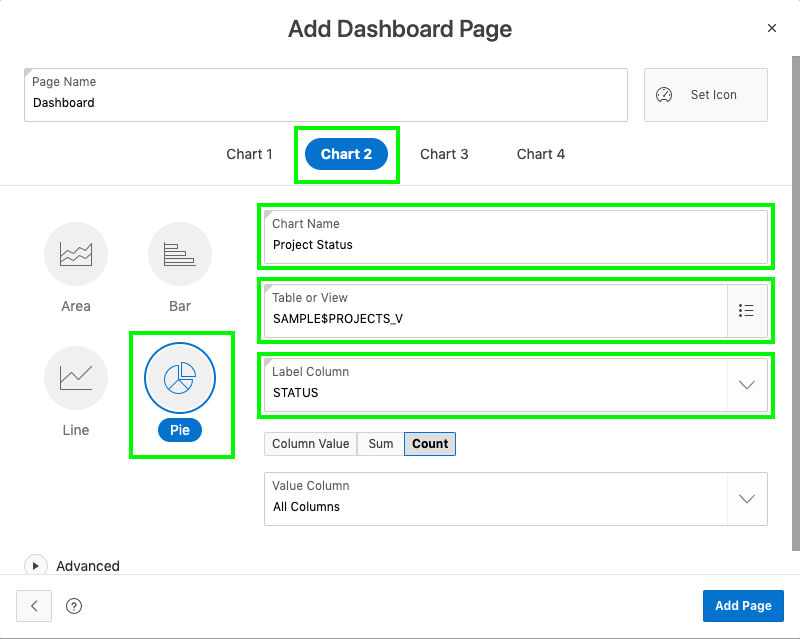
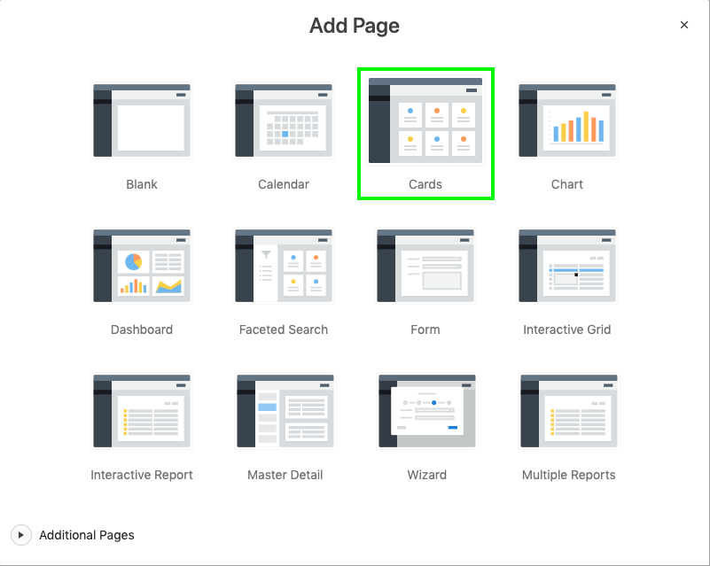
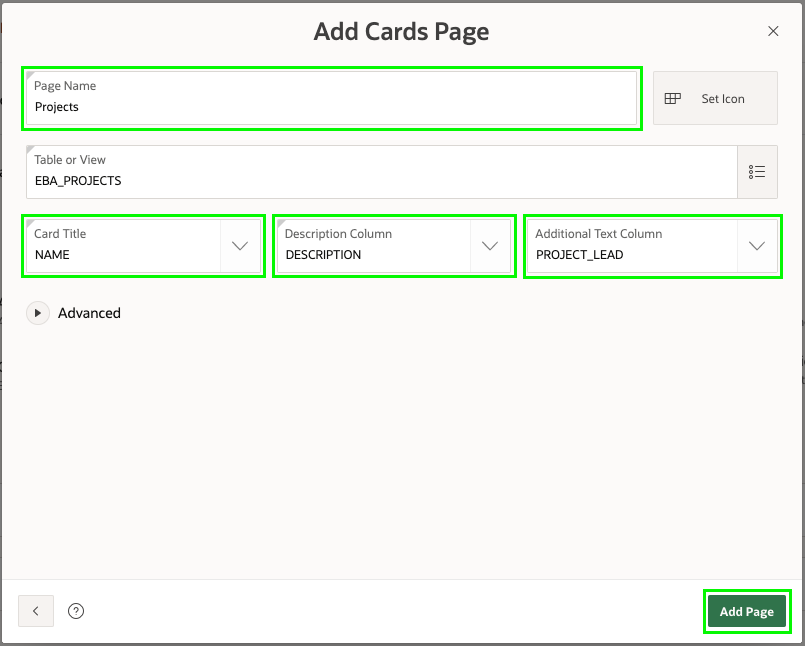
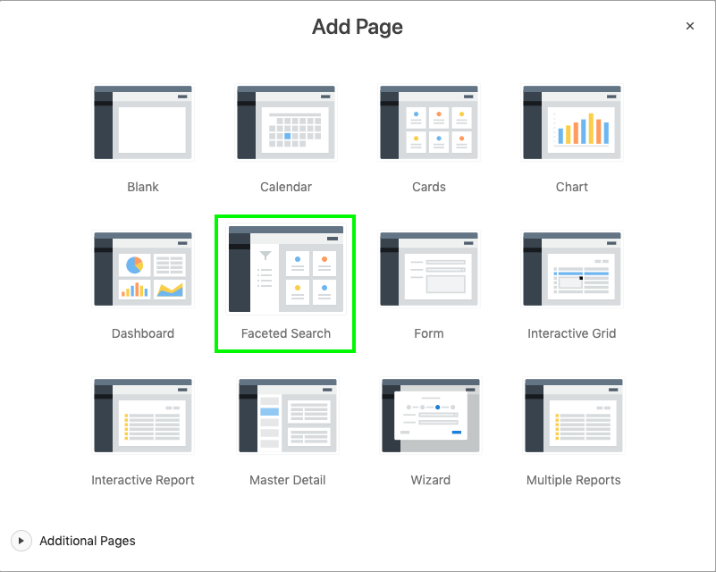
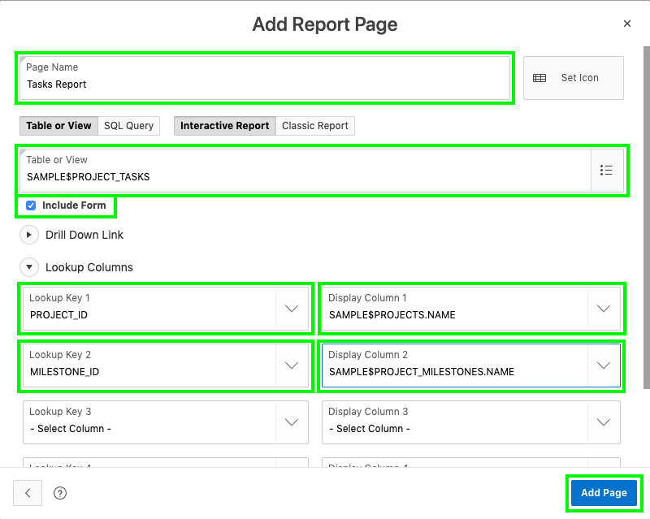
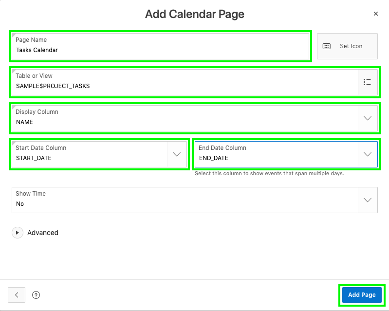
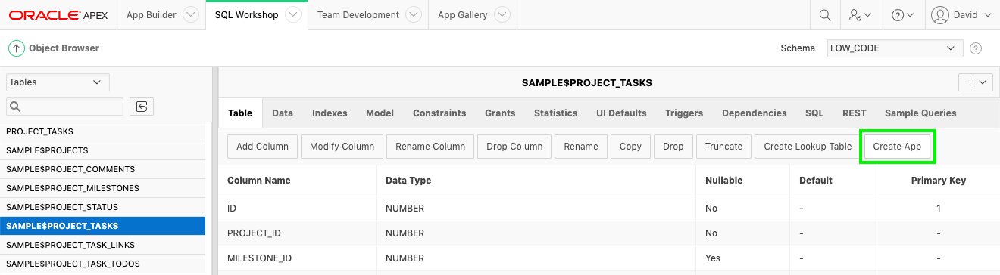

# Module 3: Building your app - Using the Create Application Wizard

In this module, you will learn how to create the initial app based on existing tables in your Oracle database. In practice, you will generally only start with one or two pages, and then use the Create Page Wizard to add additional pages to your app. 

### **Part 1** - Creating an App

1. In the App Builder menu, click **App Builder**.
2. Click **Create**.
  
    

3. Click **New Application**.

    

### **Part 2** - Naming the App
1. In the Create Application wizard, for Name enter **Projects**.
2. Click **Appearance**.  

    
    
3. On the Appearance dialog, for Theme Style select **Vita – Slate**.
4. Click **Choose New Icon**.

    

5. On the Choose Application icon dialog, select any icon color and an icon of your choosing.

    Click **Set Application Item**.

    

7. Click **Save Changes**. 

    

### **Part 3** – Add the Dashboard Page

A dashboard page is a great way to show important information using various charts. When you created the Sample Dataset it also created a view **EBA_PROJECTS_V**, which joins data from various tables. This view is ideal as the basis for the dashboard charts.

1. In the Create Application wizard, click **Add Page**.
2. Click **Dashboard**.

    

- For Chart 1, enter the following:
   - Chart Type – select **Bar**
   - Chart Name – enter **Budget versus Cost**
   - Table or View – select **EBA_PROJECTS_V**
   - Label Column – select **NAME**
   - Value Column – select **BUDGET\_V_COST**

     

- Click **Chart 2**, and enter the following:
   - Chart Type – select **Pie**
   - Chart Name – enter **Project Status**
   - Table or View – select **EBA_PROJECTS_V**
   - Label Column – select **Status**
   - Type – select **Count**  

      

- Click **Chart 3**, and enter the following:
   - Chart Type – select **Bar**
   - Chart Name – enter **Project Leads**
   - Table or View – select **EBA_PROJECTS_V**
   - Label Column – select **PROJECT_LEAD**
   - Type – select **Count**
- Click **Add Page**  

      
    
    *{Note: You have not set any values for _Chart 4_, therefore, it will be generated with a chart based on demo data. In a later module we will remove the additional chart.}*

### **Part 5** – Add the Project Page
Card pages are especially good when there is not a huge number of records, and you only want to display a few details. The **EBA_PROJECTS** table only has 12 records and would work well as a card page.
 
1. In the Create Application wizard, click **Add Page**.
2. Click **Cards**.

     

3. On the Add Cards Page, enter the following:
   - Page Name - enter **Projects**
   - Table - select **EBA_PROJECTS**
   - Card Title - select **NAME**
   - Description - select **Description**
   - Additional Text - select **PROJECT_LEAD**
   
   - Click **Add Page**

     

### **Part 6** - Add the Milestone Pages
There are 30 records within **EBA_MILESTONES**, therefore, you will add a report page and an associated form page.

1. In the Create Application wizard, click **Add Page**.
2. Click **Interactive Report**.

     

3. On the Add Report Page, enter the following:
  - Page Name - enter **Milestones**
  - Table - select **EBA_PROJECT_MILESTONES**
  - Check **Include Form** 
  - Expand Lookup Columns
        - Lookup Key 1 - select **PROJECT_ID**
        - Display Col 1 - select **EBA_PROJECTS.NAME**

  - Click **Add Page**  

    

### **Part 7** - Add the Task Pages
The **EBA_PROJECT_TASKS** table is the primary table, where records will be reviewed and updated the most. Therefore, you will add a Faceted Search page, Report and Form pages, and a Calendar page on this table.

1. In the Create Application wizard, click **Add Page**.
2. Click **Faceted Search**.

    
    
3. On the Add Faceted Search Page, enter the following:
    - Page Name - enter **Tasks Search** 
    - Table - select **EBA_PROJECT_TASKS**

    - Click **Add Page**  

    

4. It would be better to place the **Tasks Search** page up under the **Dashboard** page.

    For **Tasks Search**  click and hold the hamburger (four parallel bars), after the Edit button.     
    Drag the page up until it displays between the **Dashboard** page and the **Projects** page.    
    Release the mouse.

    
 
5. Now to add the Report and Form pages.    
    In the Create Application wizard, click **Add Page**.
6. Click **Interactive Report**.
7. On the Add Report Page, enter the following:
  - Page Name - enter **Tasks**
  - Table - select **EBA_PROJECT_TASKS**
  - Check **Include Form** 
  - Expand Lookup Columns
        - Lookup Key 1 - select **PROJECT_ID**
        - Display Col 1 - select **EBA_PROJECTS.NAME**
        - Lookup Key 2 - select **MILESTONE_ID** 
        - Display Col 2 - select **EBA_PROJECT_MILESTONES.NAME**
        
    - Click **Add Page**  

    

8. Last we will add a Calendar.  
    In the Create Application wizard, click **Add Page**
9. Click **Calendar**.
10. On the Add Calendar Page, enter the following:
  - Page Name - enter **Tasks Calendar**
  - Table - select **EBA_PROJECT_TASKS**
  - Display Column - select **NAME**
  - Start Date Column - select **START_DATE**
  - End Date Column - select **END_DATE**
  
    - Click **Add Page**  

    
    
*{Note: If you go to SQL Workshop > Object Browser, select the _EBA_PROJECT\_TASKS_ table and then click _Create App_ then it will create an app with a Dashboard page, Faceted Search page, Report and Form pages, and a Calendar page (if appropriate) all based on the selected table. This technique provides a great starting point for creating your apps, especially if you are not sure what pages you want up front.}*

    
### **Part 8** – Generate the App

Now that you have added all the pages, it is time to generate the app and review it. 

1. Scroll to the bottom of the page, and click **Create Application**.

    
    
2. Once the application has been generated, your new app will be displayed in the application home page.

    Click **Run Application**.

    

### **Part 9** – Runtime App

1. Enter your user credentials. Click **Sign In**.

    

2. Play around with your new application!

    

### **Summary**

This completes Module 3. You now know how to create an application, with numerous different page types, based on existing database objects. [Click here to navigate to Module 4](4-regenerate-app.md)
