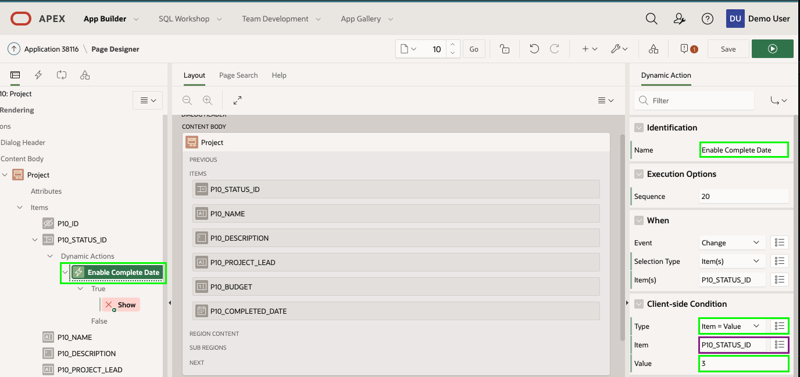

# Improving Projects

## Introduction
In this lab, you will learn how to use the Create Page Wizard to add additional pages to your app. Then you will then link the new page to the existing card page. You will then learn how to easily manipulate how items are displayed, and finally to create a Dynamic Action.

## **STEP 1** - Improving the Cards Display
Looking at the Projects card region you should notice it is only 3 cards wide and includes icons, which could be displayed better. To improve the page, you will utilize **Live Template Options** directly in the runtime environment. You could also make changes from the App Builder, however, it is much easier to see the results as you make them.

1. In the runtime environment, click **Projects**.
2. In the Developer Toolbar (at the bottom of the runtime page), click **Quick Edit**.

    Move the mouse until it is inside the Cards region, and a blue box surrounds the region, with a wrench in the top right corner.     
    Click the wrench.

    

3. In the Live Template Options dialog, click **Attributes**, and enter the following:
    - Icons - select **Display Icons**
    - Layout - select **4 columns**

4. Click **Save**

    

## **STEP 2** - Adding a Form Page
Currently there is no way to maintain project records. Therefore, you will use the **Create Page Wizard** to create a form page on the **EBA_PROJECTS** table.

1. Navigate back to the App Builder  by clicking **Application xxxxx** in the Developer Toolbar, or by navigating back to the App Builder browser tab manually.
2. On the application home page, click **Create Page**.

    

3. In the Create a Page dialog, click **Form**.

    

4. In the Create Page dialog, click **Form**.

    

5. In the Create Form dialog, enter the following:
   - Page Name – enter **Project**
   - Page Mode – click **Modal Dialog**

6. Click **Next**

    

6. For Navigation Preference, select **Identify an existing navigation menu entry for this page**.
    For Existing Navigation Menu Entry, select **Projects**.    
    Click **Next**.  

    

7. For Table/ View Name, select **EBA_PROJECTS (table)**.    
    Click **Next**.

      

8. For Primary Key Column, select **ID (Number)**.  
    Click **Create**.

    
    *{Note: This will create _Page 10: Project_ if you have followed the previous sections correctly. If not page 10, please repeat Section 4, and ensure the Interactive Grids for both Milestones and Statuses are created}*

## **STEP 3** - Link to Projects Page
Now to link this new page to the Project cards page.    
*{Note: Defining a link for a Card region requires modifying the SQL statement. However, elsewhere in Oracle APEX defining links is very easy and declarative as you will learn in Lab 7.}*

1. In the Application Toolbar, click the page selector in front of the page number (10).    
    Click **4**, for the Projects page

    

    *{Note: Alternatively, you can type in a page number or use the up / down arrows in the Application Toolbar to navigate to different pages within Page Designer}*

2. In the Rendering tree (left pane), select **Projects**.   
    In the Property Editor (right pane), right of Source > SQL Query, click the **Code Editor** icon.  

    For the CARD\_LINK selection, replace the existing code with the following:   
    ```
    <copy>apex_util.prepare_url('f?p='||:APP_ID||':10:'||:APP_SESSION||'::::P10_ID:'||id) CARD_LINK,</copy>
    ```

    *{Note: f?p= is the call to an APEX page; :APP\_ID is the Application Id; 10 is the target page (Project form page); :APP\_SESSION is the current user’s session; P10\_ID is the primary key item on the target page; _id_ is the primary key from the Projects table}*

    Click **OK**.

    

3. You also need to be able to add new projects, so will need to add a button and link it to the Project form page. The easiest way to add this is to drag and drop a component into the Layout (middle pane) from the Gallery.

      - In the Layout (middle pane), click **Breadcrumb** to highlight the region.  
      - In the Gallery (below Layout), click **Buttons**.   
      - Click and hold **Text [Hot]**.  
      - Drag the button up into the Breadcrumb region, and hover under the **Create** placeholder.

    Once the selection expands to a large yellow box release the mouse.

    

4. Now to update the button properties.     
    In the Property Editor (right pane), enter the following:

    - Identification > Name - enter **CREATE**  
    *{Note: The Identification > Type attribute is update to _Create_ once you enter the Title}*
    - Behavior > Action - select **Redirect to Page in this Application**
    - Behavior > Target - click _No Link Defined_, and enter:
        - Target > Page - enter **10**
        - Clear Session State > Clear Cache - enter **10**

5. Click **Ok**

    

6. Now to test the page links work!     
    Click **Save and Run**.
    Click on a project card or click **Create**.

    

## **STEP 4** - Update How Items are Displayed
The way the Status, Name, and Project Lead are displayed can be easily improved.
The **STATUS_ID** item is a foreign key to the **EBA\_PROJECT\_STATUS** table. Therefore, rather than requiring end users to enter a number, you will update the item to be a list of values based on the lookup table. The Name and Project Lead fields should be updated to Text Fields. Lastly, the audit columns should be hidden.

1. First you need to change the Status item from a number entry to a list of allowable values.   
    From the Runtime environment, from the Project form page, in the Developer Toolbar, click **Edit Page 10**.  
    Alternatively, navigate back to the App Builder browser tab, and then navigate to Page 10.
2. In Page Designer for Page 10, in the Rendering tree (left pane), click **P10\_STATUS_ID**.  
    In the Property Editor (right pane), enter the following:
    - Identification > Type - select **Select List**    
    *{Note: As soon as you choose Select List the item will change to red and a Message indicator will display in a center pane. This will be remedied once the List of Values attributes are entered}*

    - Label > Label - enter **Status**
    - List of Values > Type - select **SQL Query**
    - SQL Query enter:

        ```
        <copy>select code d, id r
        from eba_project_status
        order by display_order</copy
        ```

    *{Note: The _code_ column is the value displayed to users, while the _id_ column is the value returned to the table column. The table includes a _display\_order_ column to ensure the statuses are displayed in the correct order}*    

    - Display Extra Values - click **No**   
    - Null Display Value - enter **– Select Status -**   
    *{Note: This text must be typed}*

    
    

3. Now to update the Name and Project Lead items to text fields.    
    In the Rendering Tree (left pane), click **P10\_NAME**  
    Hold down the [Control] key and click **P10\_PROJECT\_LEAD**  

    In the Property Editor (right pane), for Identification > Type, select **Text Field**

    

4. Last step is to hide the audit columns.  
    In the Rendering Tree (left pane), click **P10\_CREATED**  
    Hold down the [Shift] key and click **P10\_UPDATED\_BY**  

    In the Property Editor (right pane), for Identification > Type, select **Hidden**

    

## **STEP 5** - Improve the Completed Date
Currently a Completed Date can be entered on any project. However, it would greatly improve data quality to only allow the date to be entered if the Status is _COMPLETED_. In order to implement such functionality requires JavaScript to dynamically enable / disable the Completed Date item based on the value of Status. Thankfully, as an APEX developer you don't need to write such JavaScript. You can simply define a Dynamic Action which allows you to declaratively define such client-side interactively, by specifying the trigger, action, and affected element(s).

1. You need to define the Dynamic Action on the triggering element, which is the Status.        
    In the Rendering Tree (left pane), _right-click_ **P10\_STATUS\_ID**.  
    Select **Create Dynamic Action**.

    

2. Update the Dynamic Action so only trigger when the Status is _COMPLETED_.   
    With the Dynamic Action selected, in the Property Editor (right pane), enter the following:
    - Identification > Name - enter **Enable Completed Date**
    - Client-Side Condition > Type - select **Item = Value**    
    *{Note: The Client-Side Condition > Item is automatically set to the current item _P10\_STATUS\_ID_}*
    - Client-Side Condition > Value - enter **3**   
    *{Note: The value _3_ corresponds to a status of COMPLETED}*

    

3. Next you need to specify what happens when the triggering event is true.     
    In the Rendering tree (left pane), click the action under True (currently Show).  
    In the Property Editor (right pane), enter the following:
    - Identification > Action - select **Enable**
    - Affected Elements > Item(s) - select **P10\_COMPLETED\_DATE**

    

4. Lastly, it is very important to _disable_ the Completed Date item when the triggering event is false.   
    In the Rendering tree (left pane), under Dynamic Actions, _right-click_ **Enable**.    
    Select **Create Opposite Action**.

    

5. Rather than displaying the Completed Date down the page, it would be far better to display the item directly after the Status item.   
    In the Rendering tree (left pane), click **P10\_COMPLETED\_DATE**.    
    In the Property Editor (right pane), enter the following:
    - Layout > Sequence - enter **25**  
    *{Note: This will position the item between P10\_STATUS\_ID (Sequence 20) and P10\_NAME (Sequence 30)}*
    - Layout > Start New Row - _Uncheck_    
    *{Note: This will position the item on the same line as the previous item, P10\_STATUS\_ID}*

    

6. Now to review the Project form page.     
    Click **Save**  
    *{Note: If you click Save and Run your changes will be saved but the page will not be run. Given this is a modal page it must be run from a calling page rather than directly from Page Designer}*

7. Navigate back to the Runtime environment, refresh the browser, and within the Navigation Menu (left side) click **Projects**.     
    Click a card record to display the corresponding record in the form page.    
    Change the Status and ensure the Completed Date is enabled / disabled correctly.    
    Make changes and click **Apply Changes**, or click **Cancel**.

    

## **Summary**

This completes Lab 5. You now know how to add additional pages to your application, link pages together, modify how items are displayed, and define client-side interactivity declaratively. [Click here to navigate to Lab 6](?lab=lab-6-improving-milestones)

## **Acknowledgements**

 - **Author** -  David Peake, Consulting Member of Technical Staff
 - **Contributors** - Arabella Yao, Product Manager Intern, Database Management
 - **Last Updated By/Date** - Tom McGinn, Database Innovations Architect, Product Management, July 2020

See an issue? Please open up a request [here](https://github.com/oracle/learning-library/issues). Please include the workshop name and lab in your request.
