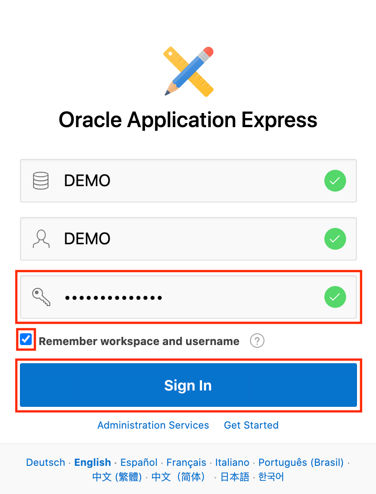

# Setup

## Lab Introduction

Oracle APEX on Autonomous Database provides a preconfigured, fully managed and secured environment to both build and deploy world-class data-centric applications. There are no limits on the number of developers or end users for your Oracle APEX applications; Autonomous Database can instantly scale compute and storage online as needed, based upon your workload. Additionally, Oracle APEX applications developed on-premise can be easily deployed to Oracle APEX on Autonomous Database, or vice-versa. 

You can create applications with Oracle Application Express on Autonomous Transaction Processing. In this lab you will create the ATP instance and then configure APEX.

Each Autonomous Transaction Processing instance includes a dedicated instance of Oracle Application Express; you can use this instance to create multiple workspaces.

### Lab Prerequisites
- Sign Up for Free Trial/Login to Oracle Cloud

## **Step 1:** Create an Autonomous Transaction Processing instance

In this step, you will create an instance of the Autonomous Transaction Processing database service.

1.  From the Cloud Dashboard, click the navigation menu icon in the upper left-hand corner and then select **Autonomous Transaction Processing**.

    

2.  Click **Create Autonomous Database**.

    

3.  Select the **Always Free** option, enter **`SecretPassw0rd`** for the ADMIN password, then click **Create Autonomous Database**. Note: you may choose a different password, just be sure to make note of it and substitute it any time there's a reference to **`SecretPassw0rd`**.

    
    
    

    After clicking **Create Autonomous Database**, you will be redirected to the Autonomous Database Details page for the new instance. Continue to the next step when the status changes from:

    

    to:

    

## **Step 2:** Create a new workspace in APEX

When you first access APEX you will need to log in as an APEX instance administrator to create a workspace. A workspace is a logical domain where you define APEX applications. Each workspace is associated with one or more database schemas (database users) which are used to store the database objects, such as tables, views, packages, and more. These database objects are generally what APEX applications are built on top of.

1.  Click the **Service Console** button.

    

2.  Click **Tools** option in the menu on the left, then click the **Oracle APEX** option.

    

3.  Enter the password for the Administration Services and click **Sign In to Administration**. The password is the same as the one entered for the ADMIN user when creating the ATP instance: **`SecretPassw0rd`**

    

4.  Click **Create Workspace**.

   

5.  Enter the following details and click **Create Workspace**.

    | Property | Value |
    | --- | --- |
    | Database User | **DEMO** |
    | Password | **`SecretPassw0rd`** |
    | Workspace Name | **DEMO** |

    

6.  Click the **DEMO** link in the success message. This will log you out of APEX administration so that you can log into your new workspace.

    

7.  Enter **`SecretPassw0rd`** for the password, check the **Remember workspace and username** checkbox, and then click **Sign In**.

    

You may now proceed to the next lab.

## **Acknowledgements**
 - **Author** -  Dan McGhan, Database Product Management
 - **Contributors** - Arabella Yao, Jeffrey Malcolm Jr, Robert Ruppel, LiveLabs QA
 - **Last Updated By/Date** - Jeffrey Malcolm Jr, LiveLabs QA, June 2020

## **See an issue?**
Please submit feedback using this [form](https://apexapps.oracle.com/pls/apex/f?p=133:1:::::P1_FEEDBACK:1). Please include the *workshop name*, *lab* and *step* in your request.  If you don't see the workshop name listed, please enter it manually. If you would like for us to follow up with you, enter your email in the *Feedback Comments* section.
