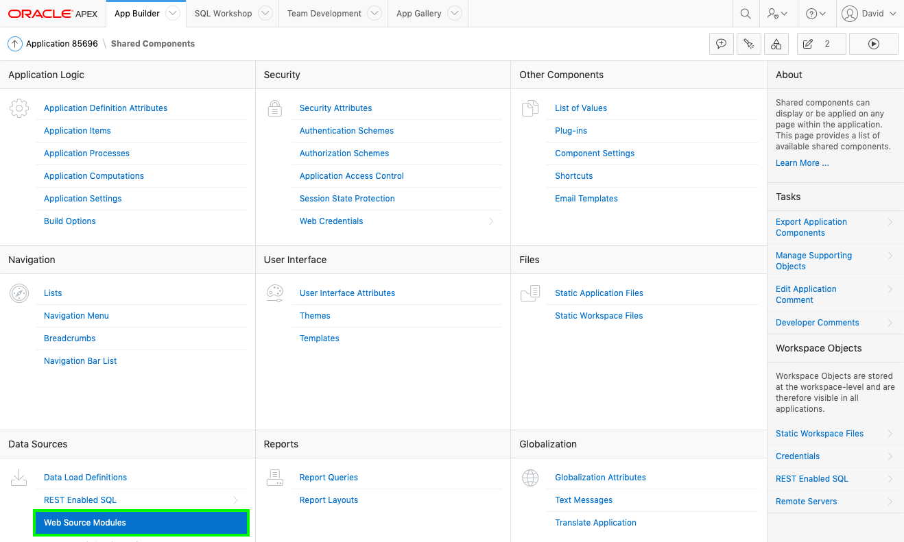
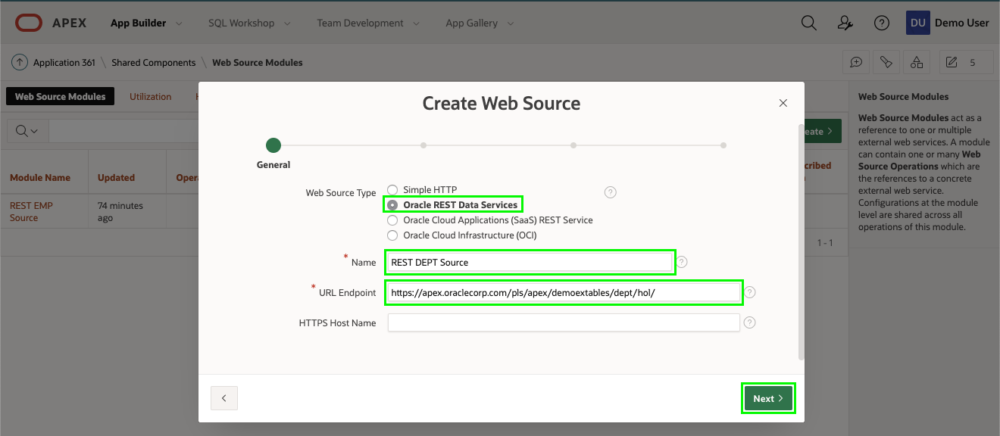
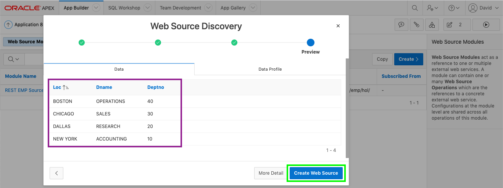
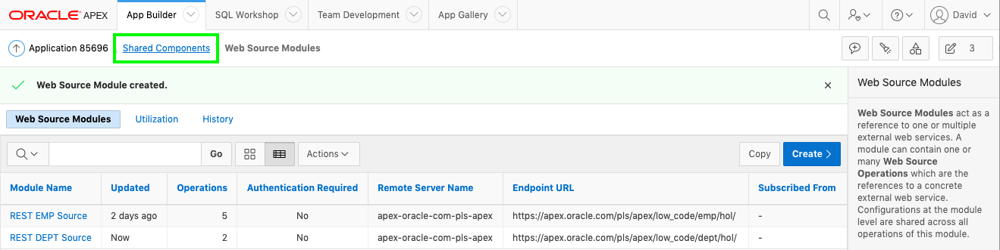
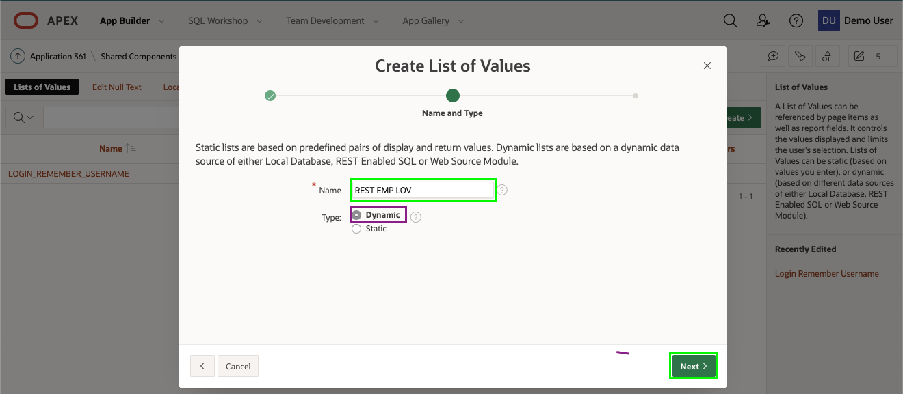
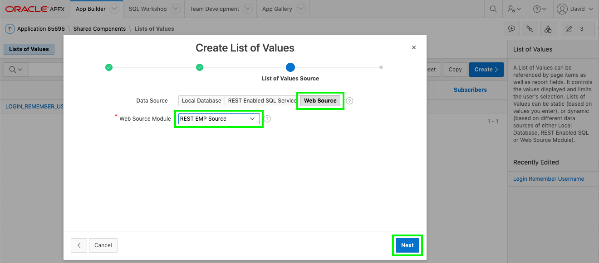
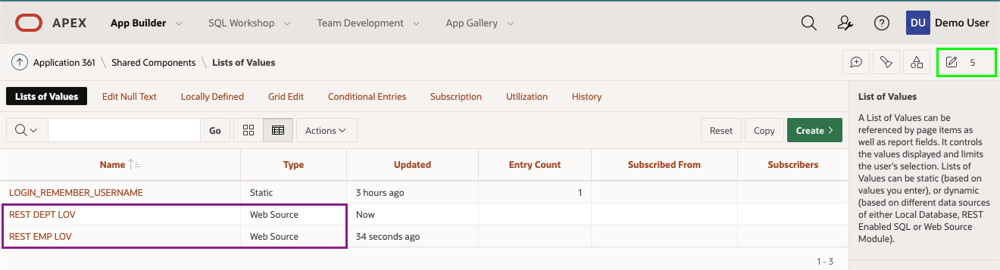
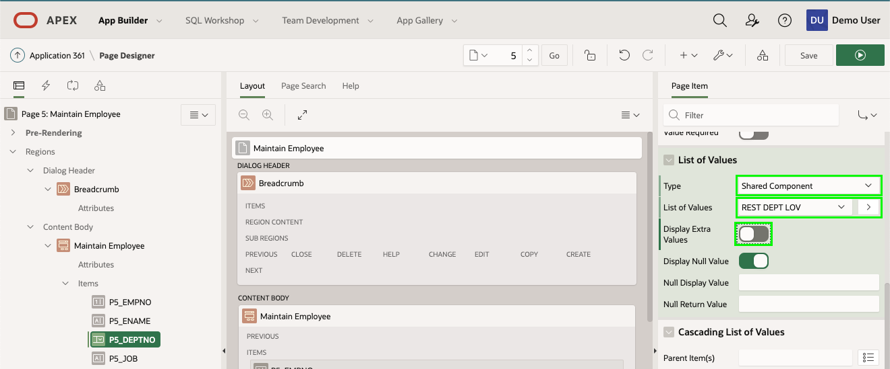

# Module 5 - Defining List of Values 

In this module, you will learn how to utilize Web Source modules as the basis for list of values for use within an application.

## Information

When you ran the script in your first workspace you created a REST
handler for both the EMP and DEPT tables. You have already created a Web Source module for the EMP table. If you also create a Web Source module for the DEPT table, you can readily define List of Values for each in Shared Components. These can then be utilized within your pages to improve the data displayed and significantly improve data entry and quality.

### **Part 1** – Add Web Source for DEPT

1. Return to the Application Builder.
2. Go to the App Builder Home Page.
3. Select your application.
4. On the application home page, click **Shared Components**.

    

5. On the Shared Components page, under Data Sources, click **Web Source Modules**.

    

6. On the Web Source Modules page, click **Create**.

    On the Create Web Source Module - Method dialog, click **Next**.    *{Default: From Scratch}*

    
    
7. On the Create Web Source - General dialog, enter the following:

    - Web Source Type - select **ORACLE REST Data Services**
    - Name - enter **REST DEPT Source**
    - URL Endpoint - enter the REST URI for the dept.rest handler
{Similar to https://{cloud\_url}/ords/{your_workspace}/**dept**/hol/ }
    
    Click **Next**.

    

8. On the Remote Server dialog, review the Base URL and Service URL Path.
    Click **Next**.

    

    *{Note: As you have already defined a Web Source with the same base path, for the REST EMP Source, then the Base URL is not updateable.}*
    
9. On the Authentication dialog, click **Discover**.
    {Authentication Required = No}
10. On the Preview dialog, click **Create Web Source**

    

### **Part 2** – Creating List of Values
You now have the Web Source modules which can be used as the basis for List of Values.

1. From the Web Source Modules page, in the breadcrumbs, click **Shared Components**.

    

2. On the Shared Components page, under Other Components, click **List of Values**.

    

3. On the List of Values page, click **Create**.

    On the Create List of Values - Source dialog, click **Next**.       
    *{Default: From Scratch}*

    

4. On the Name and Type dialog, for Name, enter **REST EMP LOV**.       
    Click **Next**.

    

5. On the List of Values Source dialog, enter the following:

    - Data Source - click **Web Source**
    - Web Source Module -  select **REST EMP Source**

    Click **Next**.

    
    
6. On the Column Mappings dialog, enter the following:

    - Return Column - select **EMPNO**
    - Display Column - select **ENAME**

    Click **Create**.

    

7. To create the List of Values for Departments is the same as above.

    On the List of Values page, click **Create**.   
    On the Create List of Values - Source dialog, click **Next**.       
    *{Default: From Scratch}*
    
8. On the Name and Type dialog, for Name, enter **REST DEPT LOV**.       
    Click **Next**.

9. On the List of Values Source dialog, enter the following:

    - Data Source - click **Web Source**
    - Web Source Module -  select **REST DEPT Source**

    Click **Next**.
    
10. On the Column Mappings dialog, enter the following:

    - Return Column - select **DEPTNO**
    - Display Column - select **DNAME**

    Click **Create**.

### **Part 3** – Update the Form
If you review the Maintain Employee form page more closely you will see that the Department Number (DEPTNO) and the Manager (MGR) item are both numeric items and expect the end user to know the relevant numbers, rather than select from a list of names.

1. From the Lists of Values page, in the Application Builder toolbar, click **Edit Page 5**.

    

2. From Page Designer, in the Rendering tree (left pane), click **P5_DEPTNO**.

    In the Property Editor (right pane), enter the following:
    
    - Identification > Type - select **Select List**
    - List of Values > Type - select **Shared Component**
    - List of Values > List of Values - select **REST DEPT LOV**
    - List of Values > Display Extra Values - Uncheck

    
    

3. From Page Designer, in the Rendering tree (left pane), click **P5_MGR**.

    In the Property Editor (right pane), enter the following:
    
    - Identification > Type - select **Select List**
    - List of Values > Type - select **Shared Component**
    - List of Values > List of Values - select **REST EMP LOV**
    - List of Values > Display Extra Values - Uncheck

4. In the Page Designer toolbar, click **Save**.

    

### **Part 4** – Update the Report
Similarly, the Employees report shows numerical values rather than names.

1. Navigate to Page 4 in Page Designer.     
    In the Page Designer toolbar, use the Page Selector or the down arrow next to the page number.

    

2. Given this is a report you will need to modify columns instead of items.

    In the Rendering tree (left pane), click Columns, click **MGR**  

    In the Property Editor (right pane), enter the following:
    
    - Type - select **Plain Text (based on List of Values)** 
    - List of Values - select **REST EMP LOV** 
    - Heading > Alignment - click **Start** 
    - Layout > Column Alignment - click **Start**

    

3. In the Rendering tree (left pane), under Columns, click **DEPTNO**  

    In the Property Editor (right pane), enter the following:
    
    - Type - select **Plain Text (based on List of Values)** 
    - List of Values - select **REST DEPT LOV** 
    - Heading > Alignment - click **Start** 
    - Layout > Column Alignment - click **Start**

    Click **Save**.

4. Navigate to the application Runtime Environment
5. Refresh your browser

    

6. Click on the edit icon for any record.       
    Select a department.        
    Select a manager.

    

### **Summary**
This completes Module 5 and the lab. You now know how to define List of Values against REST endpoints and then utilize those within an application.

### **Learn More** - *Useful Links*

- APEX on Autonomous  https://apex.oracle.com/autonomous
- APEX Collateral  http://apex.oracle.com
- Tutorials  https://apex.oracle.com/en/learn/tutorials
- Community  http://apex.oracle.com/community
- External Site + Slack  http://apex.world
