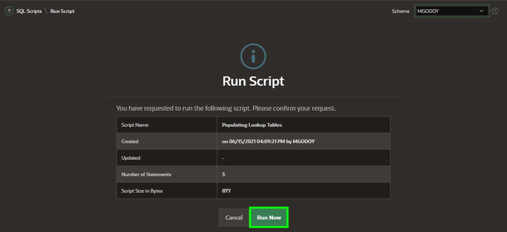
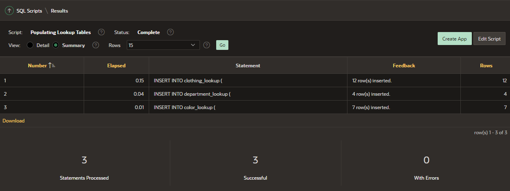

# Add Columns to Product Table

## Introduction

The **PRODUCTS** table includes some columns such as, image, price and details. But there are other characteristics that customers would appreciate to know about the product itself, like color, type of clothing and department. For that reason, you will add these  columns to the Products table. 
To avoid data redundancy, you will need to create three additional tables to normalize the data, but instead of creating these three tables for yourself, you'll use the **Create Lookup Table** feature.

In this lab, you will learn how to add these three new columns to the **PRODUCTS** table and then create lookup tables for those new columns.

Estimated Lab Time: 10 minutes

### Objectives
In this lab, you will:
- Add new columns to the existing Products table.
- Create lookup tables.
- Populate the new lookup tables.

## Task 1: Adding Columns to the Products Table

1. From the Oracle APEX Home, click **SQL Workshop**.

2. Click **Object Browser**.

3. Navigate to **PRODUCTS** Table.

    

4. Click on **Add Column** button.

5. For Color column, enter the following:

    * Add Column - enter **COLOR**
    * Type - select **VARCHAR2**
    * Length - enter **200**.

6. Click **Next**.

    

7. Click **Finish**.

8. Click on **Add Column** button.

9.  For Department column, enter the following:

    * Add Column - enter **DEPARTMENT**
    * Type - select **VARCHAR2**
    * Length - enter **200**.

10. Click **Next**.

    

11. Click **Finish**.

12. Click on **Add Column** button.

13. For Clothing column, enter the following:

    * Add Column - enter **CLOTHING**
    * Type - select **VARCHAR2**
    * Length - enter **200**.

14. Click **Next**.

    

15. Click **Finish**.

## Task 2: Creating Lookup Tables
You will create lookup tables based on the new three columns, after you will have created a lookup table, you will notice that a new table was created and the column in the PRODUCTS table has been renamed and the data type was changed to NUMBER.

1. Navigate to **PRODUCTS** Table.

2. Click on **Create Lookup Table** button.

    

3. For Column, select **COLOR - varchar2**.

4. Click **Next**.

    

5. Leave the table and sequence name by default:

    * New Table Name: **COLOR_LOOKUP**
    * New Sequence: **COLOR\_LOOKUP\_SEQ**

6. Click **Next**.

    

7. Click **Create Lookup Table**.

    

    *Note: Click on the **Create Lookup Table** button only once. Then you will find the new table listed in the Object Browser.*

8. To create **Department** lookup table, navigate to **Products** table and click on **Create Lookup Table** button.

    

9. For Column, select **DEPARTMENT - varchar2**.

10. Click **Next**.

    

11. Leave the table and sequence name by default:

    * New Table Name: **DEPARTMENT_LOOKUP**
    * New Sequence: **DEPARTMENT\_LOOKUP\_SEQ**

12. Click **Next**.

    
    
13. Click **Create Lookup Table**.

    
    *Note: Click on the **Create Lookup Table** button only once. Then you will find the new table listed in the Object Browser.*
    
14. To create **Clothing** lookup table, navigate to **Products** table and click on **Create Lookup Table** button.

    

15. For Column, select **CLOTHING - varchar2**.

16. Click **Next**.

    

17. Leave the table and sequence name by default:

    * New Table Name: **CLOTHING_LOOKUP**
    * New Sequence: **CLOTHING\_LOOKUP\_SEQ**

18. Click **Next**.

    

19. Click **Create Lookup Table**.

    
    *Note: Click on the **Create Lookup Table** button only once. Then you will find the new table listed in the Object Browser.*

20. The columns COLOR, DEPARTMENT, and CLOTHING in the **PRODUCTS** table were renamed and the data type changed to NUMBER. Also, three new tables were created:
    - COLOR_LOOKUP
    - DEPARTMENT_LOOKUP
    - CLOTHING_LOOKUP

    

## Task 3: Populating Lookup Tables

1. From the Oracle APEX Home, click **SQL Workshop**.

2. Click **SQL Scripts**.

3. Click **Create**.

4. For Script Name, enter **Populating Lookup Tables**.

5. Copy the following script.
    ```
    <copy>
    INSERT INTO clothing_lookup
                (
                            clothing
                )
    SELECT DISTINCT Substr(product_name, Instr(product_name, ' ',1,1)+1, Instr(product_name, ' ',1, 2)+1 - Instr(product_name, ' ',1,1)- 2) clothing
    FROM            products p;

    INSERT INTO department_lookup
                (
                            department
                )
    SELECT DISTINCT r.department
    FROM            products p ,
                    json_table (p.product_details, '$' COLUMNS ( department VARCHAR2(4000) path '$.gender') ) r;

    INSERT INTO color_lookup
                (
                            color
                )
    SELECT DISTINCT r.color
    FROM            products p ,
                    json_table (p.product_details, '$' COLUMNS ( color VARCHAR2(4000) path '$.colour' ) ) r;
    ```

5. Click **Run**.

6. Click **Run Now**.

    

7. The Script Results page will be displayed listing the statements processed, successful, and with errors.

    
    

You now know how to create new columns to your existing tables and how to create lookup tables.

## **Acknowledgments**

- **Author** - Mónica Godoy, Principal Product Manager
- **Last Updated By/Date** - Mónica Godoy, Principal Product Manager, September 2021
