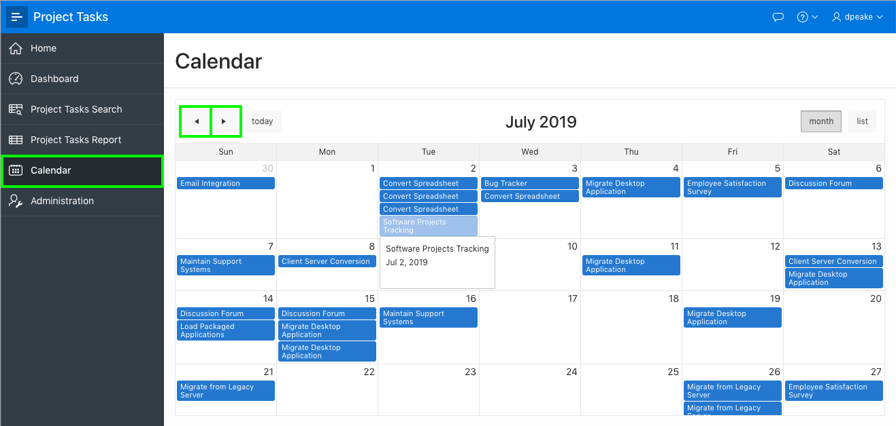
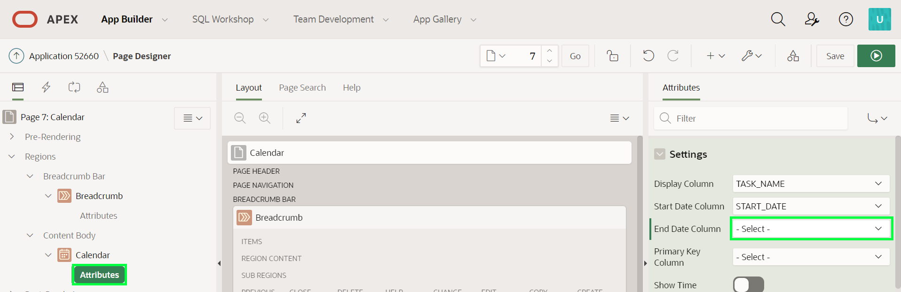
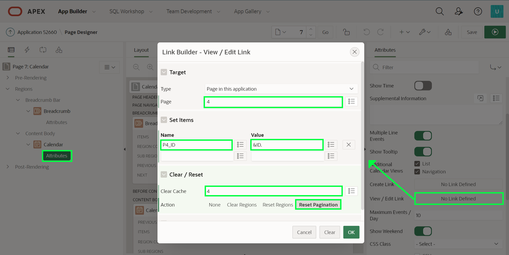
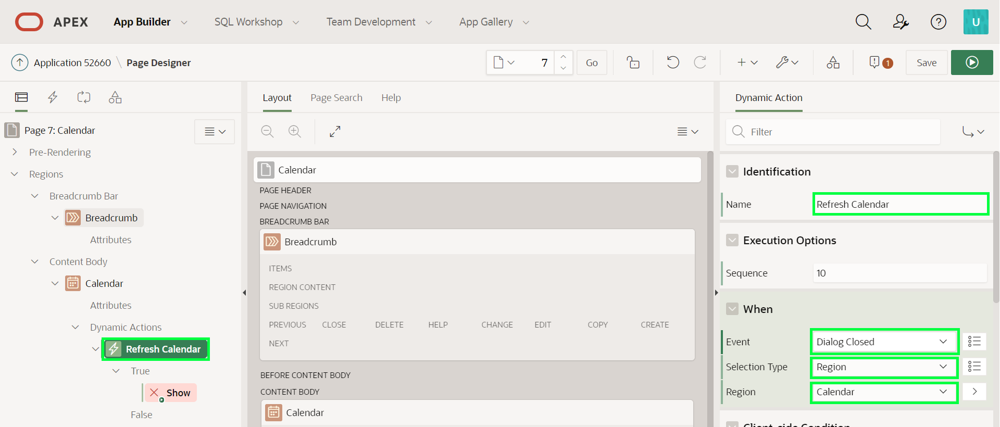
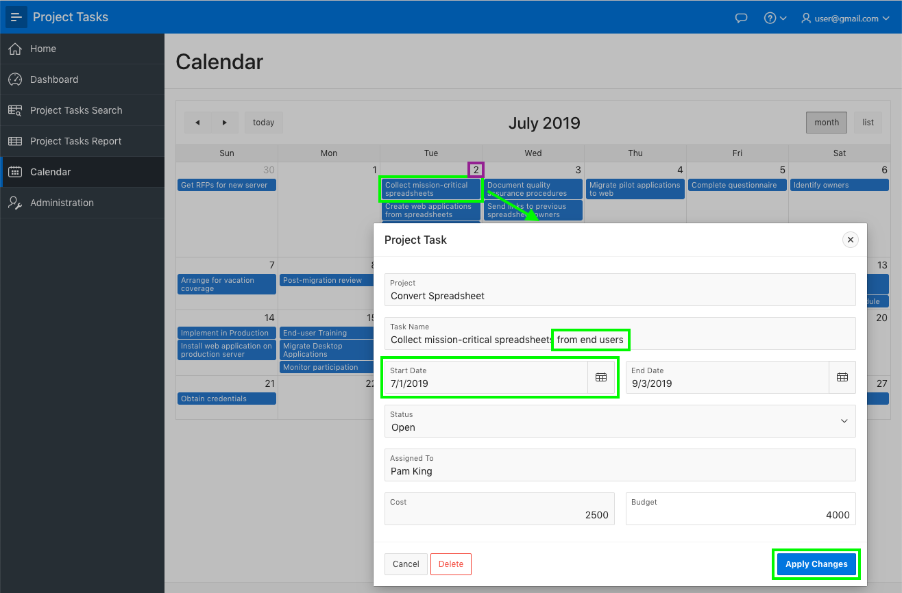
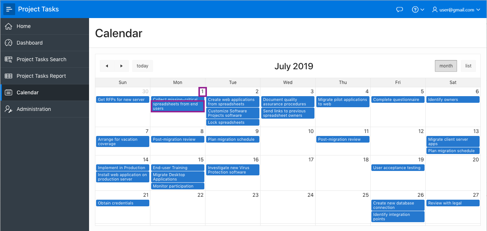

# Module 5: Improving the Calendar
In this module, you will learn how to improve a calendar and link an existing page to a modal form page.

### **Part 1** - Improving the Calendar
The **Calendar** page currently displays the project, rather than the task name, and only shows the start date, instead of displaying duration-based events.

1. In the runtime environment, click **Calendar**.

    

    *Note - You may have to use the arrows at the top of the calendar to navigate backward or forward months to see data displayed.*

2. In the Developer Toolbar, click **Edit Page 7**. Alternatively, navigate back to the APEX App Builder browser tab and manually navigate to Page 7.

3. You can change the displayed column and make the events duration based by updating the calendar attributes.

    In Page Designer, within the Rendering tree (left pane), find Calendar, and then click **Attributes** directly below that.
    Within the Property Editor (right pane), for Settings > Display Column select **TASK_NAME**, and for End Date Column select **END_DATE**.

    

4. In Page Designer, within the toolbar click **Save and Run** to review your changes.    

    

5. Reviewing the revised calendar changing to duration-based events is not optimal. Therefore, you should remove the End Date Column added above.

    Navigate back to the APEX App Builder, in Page Designer, with Page 7 selected, within the Rendering tree (left pane), find Calendar, and then click **Attributes** directly below that.
    Within the Property Editor (right pane), for Settings > End Date Column select **- Select -** to clear the **END_DATE** entry.

    

6. In Page Designer, click **Save and Run** to see the improved calendar.

    

### **Part 2** - Linking the Calendar
When you click on a calendar entry then it shows event details. It would be far better to link to the Project Task form page and allow end users to update the details.

1. Navigate to the APEX App Builder, and ensure Page Designer is displayed with Page 7 selected.

2. Define a view / edit link from the **Calendar** region to **Page 4**, the Project Tasks form page you modified in the previous module.

    In Page Designer, within the Rendering tree (left pane), find Calendar, and then click **Attributes** directly below that.
    Within the Property Editor (right pane), for Settings > View / Edit Link click **No Link Defined**.

    In the Link Builder page, enter the following and click **Ok**.

    | Property | Value |
    | --- | --- |
    | Page | **4** |
    | Set Items > Name | **P4_ID** |
    | Set Items > Value | **&ID.** |
    | Clear Cache | **4** |

    

3. It is important that the calendar is updated whenever the Task Name or Start Date is changed using the new link. To ensure the page is updated appropriately you need to define a Dynamic Action to refresh the calendar region when the dialog (modal page) is closed.

    A Dynamic Action is a declarative way to define client-side interactivity. Developers specify when an event fires, what actions are to be taken, and on what components the action is to be performed.

    In Page Designer, within the Rendering tree (left pane), _right-click_ on the Calendar region. Click **Create Dynamic Action**.

    

4. With the Dynamic Action selected, within the Property Editor (right pane), enter the following.

    | Group | Property | Value |
    | --- | --- | --- |
    | Identification | Name | **Refresh Calendar** |
    | When | Event | **Dialog Closed** |
    | | Selection Type | **Region** |
    | | Region | **Calendar** |

    

5. Within the Rendering tree (left pane), under the True action for the Dynamic Action, select **Show**. In the Property Editor (right pane), enter the following.

    | Group | Property | Value |
    | --- | --- | --- |
    | Identification | Action | **Refresh** |
    | Affected Elements | Selection Type | **Region** |
    | | Region | **Calendar** |

    

6. In Page Designer, within the toolbar, click **Save and Run** to review the completed application.

    In the runtime environment, from the Calendar, select an event. In the Project Task form page update the Task Name and Start Date. Click **Apply Changes**.

    

    Confirm that the calendar refreshes to show the updated details.

    

### **Summary**

This completes Module 5. You now know how to create an application by uploading a file, enhancing the page using runtime environment and page designer, and also linking pages to enhance the application.

### **Learn More** - *Useful Links*

- APEX on Autonomous  https://apex.oracle.com/autonomous
- APEX Collateral  http://apex.oracle.com
- Tutorials  https://apex.oracle.com/en/learn/tutorials
- Community  http://apex.oracle.com/community
- External Site + Slack  http://apex.world
