# Loading JSON into the Autonomous Database Part 1: Relational

## Introduction

In this lab you will use the SQL Developer Web browser-based tool, connect to your Database and load JSON data into relational tables. You will then work with this data to understand how it is accessed and stored.

Estimated Lab Time: 30-45 minutes

### Objectives

- Load JSON data into relational tables
- Understand how Oracle stores JSON data in relations tables
- Work with the JSON data with SQL

### Prerequisites

- The following lab requires an <a href="https://www.oracle.com/cloud/free/" target="\_blank">Oracle Cloud account</a>. You may use your own cloud account, a cloud account that you obtained through a trial, or a training account whose details were given to you by an Oracle instructor.
- This lab assumes you have successfully provisioned Oracle Autonomous database an connected to ADB with SQL Developer web.
- You have completed the user setups steps.

### **STEP 1**: Loading Data in a Relational Table

1. After logging into Database Actions in the previous section, we come to the Getting Started/Database Actions Overview page. Start by clicking the SQL tile.

    

**If this is your first time accessing the SQL Worksheet, you will be presented with a guided tour. Complete the tour or click the X in any tour popup window to quit the tour.**

2. We are now ready to load data into the database. For this task, we will use the Data Loading tab in the SQL Worksheet.

    

3. Start by clicking the Data Loading area; the center of the gray dotted-line box.

    

4. The Upload Data into New Table model will appear.

    

5. We are going to use some sample data to load data into the database and create a table at the same time. Start by downloading this file

    **(right-click and download the file with the following link)**

    [1980's Artifacts](https://some_url/artifacts1980.json)

6. Once on your desktop, drag the file into the Upload Data into New Table model. You can also click the Select Files button and find where you downloaded it via your operating system's file browser.

    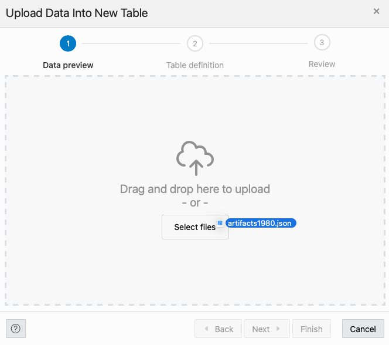

7. The modal will then give you a preview of what the data will look like in an Oracle table. Go ahead and click the Next button on the bottom right of the modal.

    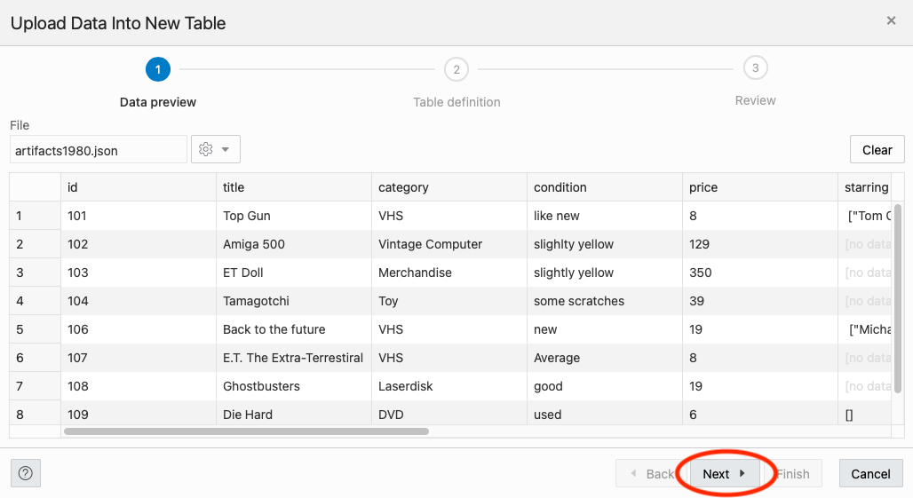

    On the following step of the data loading modal, we can see the name of the table we are going to create as well as the column and data types for the table.

    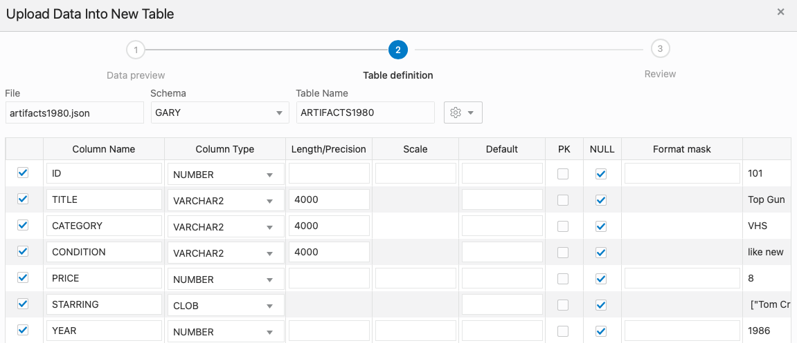

8. We need a Primary Key for our table. Here, we can use the ID column. Just click the PK checkbox for the ID row.

    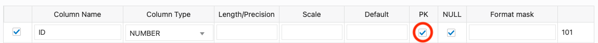

9. For embedded JSON arrays, we need to set the column type to CLOB (JSON). 

    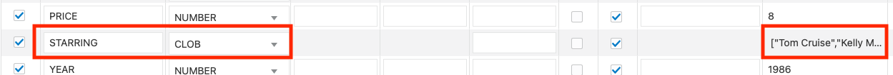

    Use the **Column Type** dropdown for the STARRING column and select **CLOB (JSON)**. 

    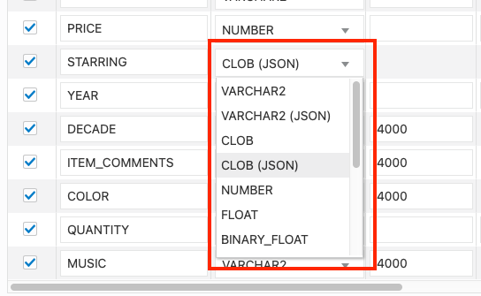

    We will work with these arrays later in this lab.

10. Click Next on the bottom right of the modal when done.

    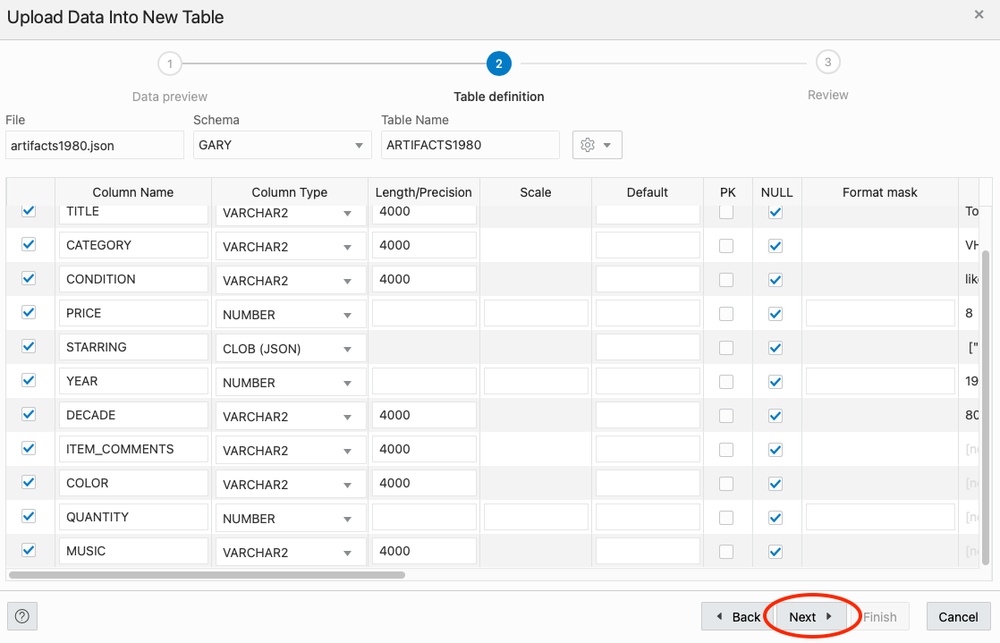

11. On the last step of the modal, we can see the DDL (Data Definition Language) for creating the table, table name and if you scroll down, the column mappings.

    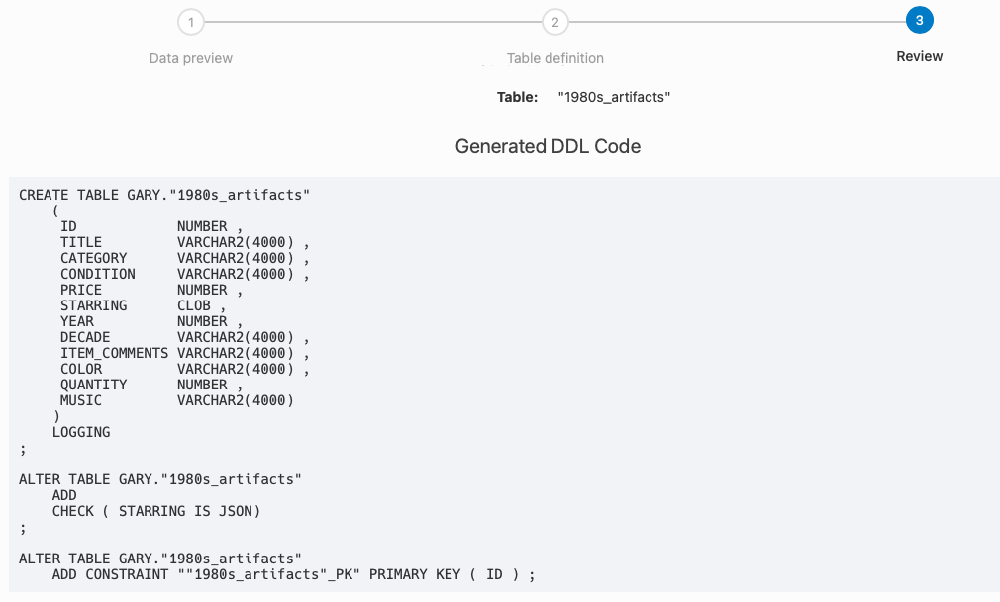

12. When you are done taking a look, click the Finish button in the lower right of the modal.

    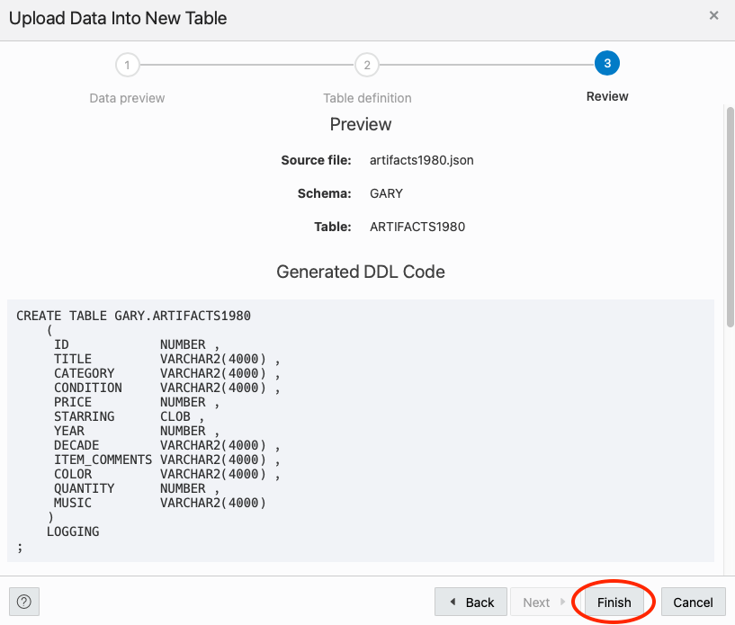

    The Data Loader will now process the file by creating a table and loading the JSON file data into that table. 

    

    Once its done, you will see a row in the Data Loading tab that indicates how many rows were uploaded, if any failed and the table name.

    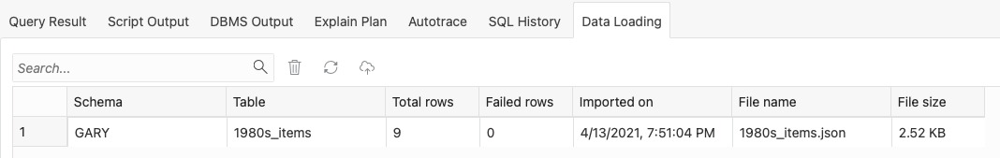

13. We can take a look at our newly created table and the data in it by using the navigator on the left of the SQL Worksheet. Just right click the table name and select Open from the pop up menu.

    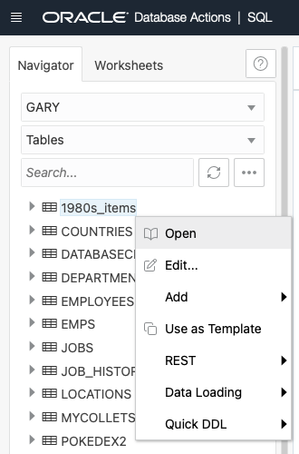

14. In the slider that has come out from the right of the page, we can look at the data definition, triggers, constraints and even the data itself.

    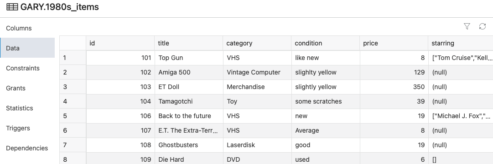

### **STEP 2**: Working with JSON Data in a Relational Table

#### **Part 1 - Simple Dot-Notation Access to JSON Data**

Dot notation is designed for easy, general use and common use cases of querying JSON data. For simple queries it is a handy alternative to using SQL/JSON query functions.

1. Let's start simple and query the table and return a count(*). We are going to bring back the statistics JSON column based on an airport code. 

```
select a.statistics 
  from airportdelays a
 where a.airportcode = 'SFO'
 fetch first 1 row only;
```

 and the result will be similar to the following (formatted for readability):

```
{
    "# of Delays": {
        "Carrier": 416,
        "Late Aircraft": 312,
        "National Aviation System": 1080,
        "Security": 14,
        "Weather": 59
    },
    "Carriers": {
        "Names": "American Airlines Inc.,Alaska Airlines Inc.,Continental Air Lines Inc.,Delta Air Lines Inc.,America West Airlines Inc.,American Eagle Airlines Inc.,Northwest Airlines Inc.,SkyWest Airlines Inc.,ATA Airlines d/b/a ATA,United Air Lines Inc.,US Airways Inc.",
        "Total": 11
    },
    "Flights": {
        "Cancelled": 83,
        "Delayed": 1880,
        "Diverted": 9,
        "On Time": 8211,
        "Total": 10183
    },
    "Minutes Delayed": {
        "Carrier": 22673,
        "Late Aircraft": 17879,
        "National Aviation System": 45407,
        "Security": 1138,
        "Total": 90487,
        "Weather": 3390
    }
}
```

2. Now what if we wanted to filter this based on the month and year which is in the **time** column which contains JSON. We want to find where the airport code is SFO, where the month is June and the year is 2010. The JSON we are looking for in the time column would look like this:

```
{"Label":"2010/06","Month":6,"Month Name":"June","Year":2010}
```

So we can use the following which has a where clause on "Month Name" and "Year":

```
select a.statistics 
  from airportdelays a
 where a.airportcode = 'SFO'
   and a.time."Month Name" = 'June'
   and a.time.Year = '2010';
```

Or we could just use the "Label" item:

```
select a.statistics 
  from airportdelays a
 where a.airportcode = 'SFO'
   and a.time.Label = '2010/06';
```

In either instance, we see we can traverse down the JSON with the Dot-Notation.

3. We can also use analytical functions such as sum using the Dot-Notation as well. Very helpful for creating charts and graphs on this data for reporting purposes. For this example, we are going to add up (sum) the number of minutes delayed for each airport across this entire dataset and group by airport:

```
select a.name, 
       sum(a.statistics."Minutes Delayed".Carrier) "Minutes Delayed" from airportdelays a
 group by a.name
 order by a.name;
```


#### **Part 2 - SQL/JSON Path Expressions**

Oracle also has many built in JSON functions for working with document data which elevates the functionality found with Dot-Notation. 

1. json_mergepatch

You can use the JSON_MERGEPATCH function to update specific portions of a JSON document. You can think of JSON Merge Patch as merging the contents of the source and the patch. 

```
update airportdelays
   set statistics = json_mergepatch ( 
         statistics,
         '{"Carriers" : {"Names" : "'||
         (select replace(a.statistics.Carriers.Names,'United Air Lines Inc.,','Oracle Air Lines Inc.,') from airportdelays a where  id = 10)
         ||'"}}'
       )
 where id = 10;
```

```
select a.statistics.Carriers.Names from airportdelays a where  a.id = 10;
```

2. json_transform (21c)

You can use the JSON_TRANSFORM function to change input JSON data (or pieces of JSON data), by specifying one or more modifying operations that perform changes to the JSON data. Unlike json_mergepatch, json_transform can target the specific attributes you want to change.

```
"Minutes Delayed": {
    "Carrier": 61606,
    "Late Aircraft": 68335,
    "National Aviation System": 118831,
    "Security": 518,
    "Total": 268764,
    "Weather": 19474
}
```

```
update airportdelays  
   set statistics = json_transform (
  statistics, 
  replace '$."Minutes Delayed".Total' = '0'
)
 where id = 10;
```

```
select a.statistics."Minutes Delayed" from airportdelays a where  id = 10;
```

```
select a.statistics."Minutes Delayed".Total from airportdelays a where  id = 10;
```

```
update airportdelays  
   set statistics = json_transform (
  statistics, 
  remove '$."Minutes Delayed".Carrier',
)
 where id = 10;
```

....etc

then for the rest of the fields or we can chain the statements with json_transform:

```
update airportdelays  
   set statistics = json_transform (
  statistics, 
  replace '$."Minutes Delayed".Total' = '0',
  remove '$."Minutes Delayed".Carrier',
  remove '$."Minutes Delayed"."Late Aircraft"'
)
 where id = 10;
```

3. json_value

The SQL/JSON function JSON_VALUE finds a specified scalar JSON value in JSON data and returns it as a defined SQL value (date, number, timestamp, sdo_geometry, etc). 

```
select json_value (
         time, 
         '$.Label'
       ) date_label
  from airportdelays a
 where a.id = 5;
```

```
select json_value (
         Statistics, 
         '$.Flights.Cancelled' returning number
       ) cancled_flights
  from airportdelays a
 where a.id = 5;
```
4. json_query

```
select JSON_QUERY(statistics, '$."# of Delays"')
  from airportdelays
 where id = 1032;
```

5. json_table

The SQL/JSON function JSON_TABLE creates a relational view of JSON data. It maps the result of a JSON data evaluation into relational rows and columns.

```
select a.name, v.*
  from airportdelays a, json_table (
         a.time, '$' 
    		columns (
                Label      
    ) )v
 where a.id = 100;
```

```
select a.name, v.*, q.*
  from airportdelays a, 
        json_table (
             a.time, '$' 
                columns (
                    Label,
                    "Month Name",
                    Year
        ) )v,
	    json_table (
             a.Statistics, '$."Minutes Delayed"' 
    	    	columns (
                    Carrier,
	                "National Aviation System",
                    "Late Aircraft",
                    Security,
                    Weather,
                    Total
        ) ) q
 where a.id = 100;
```

6. json_exists

SQL/JSON condition json_exists lets you use a SQL/JSON path expression as a row filter, to select rows based on the content of JSON documents.
```
SELECT a.id FROM airportdelays a
  WHERE json_exists(a.Statistics, '$."Minutes Delayed".Total');
```

```
SELECT a.id FROM airportdelays a
  WHERE json_exists(a.time, '$?(@.Year  == "2004" && @.Month == "6")');  
```

```
SELECT a.id, a.airportcode, a.Statistics."Minutes Delayed".Total FROM airportdelays a
  WHERE json_exists(a.time, '$?(@.Year  == "2004" && @.Month == "6")')
    and json_exists(a.Statistics, '$?(@."Minutes Delayed".Total > 500000)');  
```

```
 SELECT a.id, a.airportcode, a.Statistics."Minutes Delayed".Total FROM airportdelays a
  WHERE a.time.Year  = 2004
    and a.time.Month = 6
    and a.Statistics."Minutes Delayed".Total > 500000; 
```

Compare explain plans here and see that the SQL/JSON path expressions are much more efficient.

7. Reverse! I need to create JSON out of relational data.

```
select json_object ( * ) jdoc
from   airportdelays;
```

8. Putting it all together

SELECT a.id, a.Statistics."Minutes Delayed".Total, a.airportcode FROM airportdelays a
  WHERE json_exists(a.time, '$?(@.Year  == "2004" && @.Month == "6")')
    and json_exists(a.Statistics, '$?(@."Minutes Delayed".Total > 700000)');

select *
from   departments_json d
where  json_value ( department_data, '$.department' ) = 'Accounting';

## Acknowledgements

- **Authors** - Jeff Smith, Beda Hammerschmidt and Brian Spendolini
- **Last Updated By/Date** - April 2021
- **Workshop Expiry Date** - April 2022