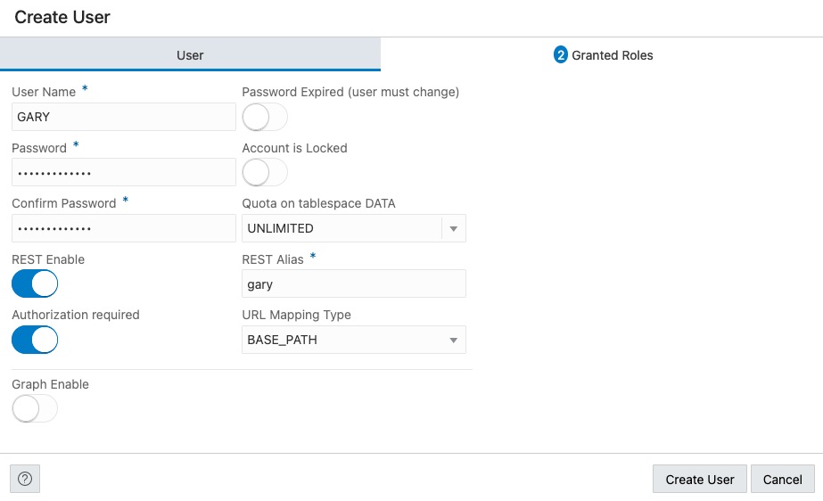
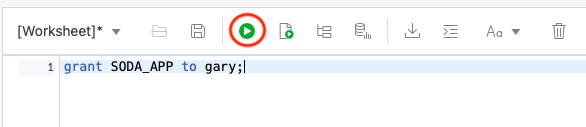
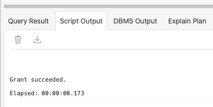

# Setups for the Choose your Own JSON Adventure: Relational or Document Store LiveLab

## Introduction

create user

Estimated Lab Time: 10 minutes

### Objectives

- Create a Database User
- Grant user needed roles, quota and REST enable
- Access Database Actions UI with new user

### Prerequisites

- The following lab requires an <a href="https://www.oracle.com/cloud/free/" target="\_blank">Oracle Cloud account</a>. You may use your own cloud account, a cloud account that you obtained through a trial, or a training account whose details were given to you by an Oracle instructor.
- This lab assumes you have successfully provisioned Oracle Autonomous database an connected to ADB with SQL Developer web.

## **STEP 1**: Create a user

1. First, we want to create a database schema for our tables. JSON and data. We do this by creating a database user. To create a database user, we start by clicking the Database Actions Menu in the upper left of the page, then clicking Database Users in the Administration List. It is not good practice to use a SYS or SYSTEM user to create an application's tables, and neither is it good practice to use the ADMIN account to create applications.

    

2. Now, click the Create User button on the left side of the page. This will slide out the Create User panel.

    

3. Start by entering a user name. Let's use GARY as the username. Next we need to enter a password. The password must be complex enough to pass the password profile set by the database. The rules are as follows:

    Password must be 12 to 30 characters and contain at least one uppercase letter, one lowercase letter, and one number. The password cannot contain the double quote (") character or the username "admin".


    Once we enter the password twice, ensure the REST Enable button is on. This will allow us to use REST services with this database schema from the start. Your panel should look similar to the following image:

    

4. Once you are ready, click the Create User button on the bottom of the panel to create the database user.

5. We next need to give this new user some space to create objects and data. For this, we need to go back to the SQL worksheet and run a simple statement. To get back to the SQL Worksheet, again click the Database Actions menu in the upper left and select SQL in the Development List.

    

6. On the SQL Canvas, copy and paste the following statement:
    ````
    <copy>alter user gary quota unlimited on data;</copy>
    ````
    Once copied on the canvas, click the run button on the worksheet toolbar.

    

7. On the bottom of the worksheet, in the Script Output, you should see that the user Gary has been altered and the quota granted.

    

8. We now need to grant this user the ability to use the SODA APIs for later in this LiveLab. On the SQL Canvas, copy and paste the following statement:
    ````
    <copy>grant SODA_APP to gary;</copy>
    ````
    Once copied on the canvas, click the run button on the worksheet toolbar.

    

7. On the bottom of the worksheet, in the Script Output, you should see that the user Gary has been altered and the role granted.

    


## Conclusion

In this section, we created a new database user and granted them the needed roles and quota to perform this LiveLab.

## Acknowledgements

- **Author** - Jeff Smith, Distinguished Product Manager and Brian Spendolini, Trainee Product Manager
- **Last Updated By/Date** - February 2021
- **Workshop Expiry Date** - February 2022
