# Development Machine from OCI marketplace.
If you want to create a development machine in your compartment you can choose a predefined development image from OCI marketplace. This development machine will have installed next development software:

**Languages and Oracle Database Connectors**
- Java Platform Standard Edition (Java SE) 8, 11, 12
- GraalVM Enterprise Edition 19
- Python 3.6 and cx_Oracle 7
- Node.js 10 and node-oracledb
- Go 1.12
- Oracle Instant Client 18.5
- Oracle SQLcl 19.1
- Oracle SQL Developer 19.1

**Oracle Cloud Infrastructure Command Line Client Tools**
- Oracle Cloud Infrastructure CLI
- Python, Java, Go and Ruby Oracle Cloud Infrastructure SDKs
- Terraform and Oracle Cloud Infrastructure Terraform Provider
- Oracle Cloud Infrastructure Utilities
- Ansible Modules for Oracle Cloud Infrastructure

**Other**
- Oracle Container Runtime for Docker
- Extra Packages for Enterprise Linux (EPEL) via Yum
- GUI Desktop with access via VNC Server
- Ansible
- .NET Core
- Visual Studio Code
- PowerShell Core
- Rclone
- Eclipse IDE

## Create a new Development VM from OCI marketplace
To create your new development machine from OCI marketplace follow next steps:

Go to OCI main menu Solutions & Platform. Then click Marketplace

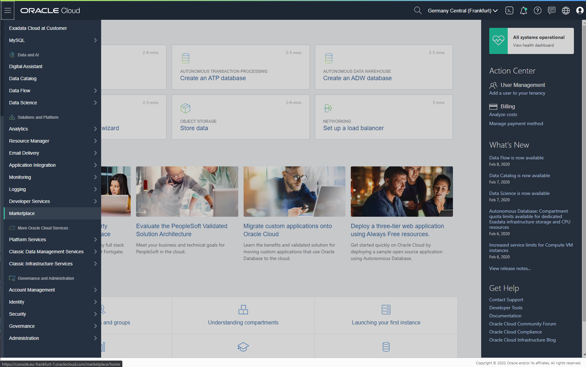

Select ORacle Cloud Developer image from the image list. You can use ```CRTL + F``` in your browser to search developer text.

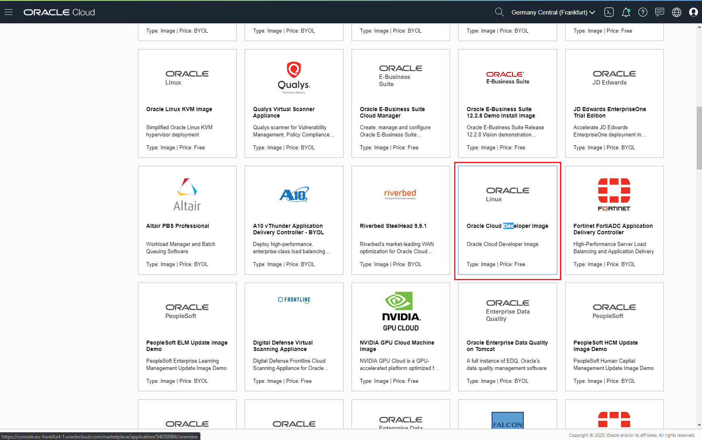

To create the new dev machine from developer image follow next steps:
* Select your Version (currently only one version is available).
* Compartment where the image will be created as compute virtual machine. 
* Check terms and conditions. 
* Click Launch Instance button.

-- Notice that the Software Price is **$0.00/hr** but the machine has an IaaS (hardware) cost depends on your shape selection in the next steps.

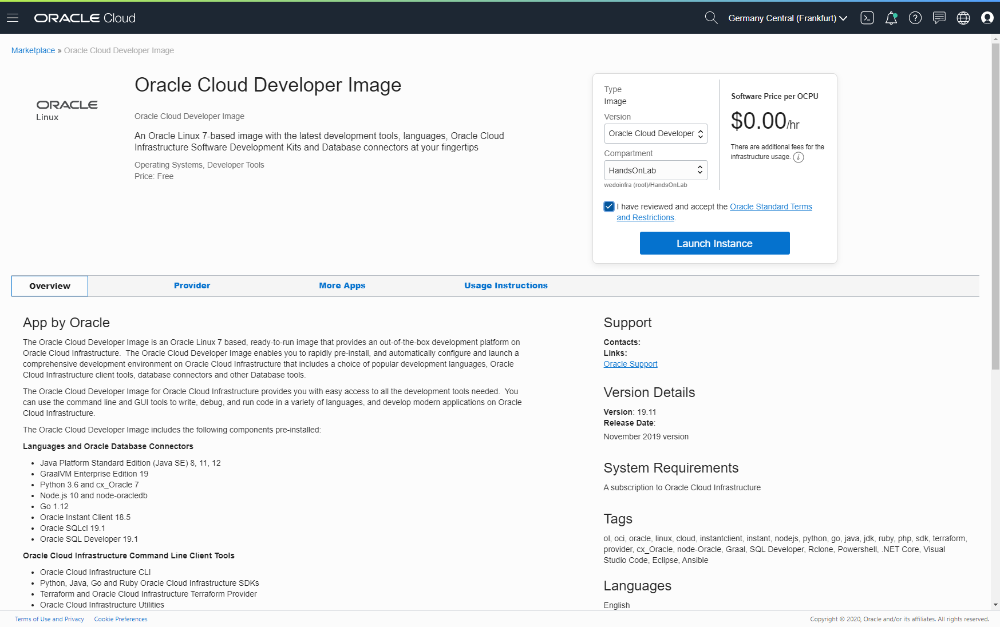

Configure your virtual machine as:
* Write a descriptive name [dev-machine].
* Select your Availability domain [AD-1 by default]
* Instance Type as [Virtual Machine]
* Configure your compute as your needs. We recomend to create the developer machine with **VM.StandardE2.1** shape (1 OCPU and 8GB vRAM) but the image create by default **2.1 (without E)** machine (1 OCPU and 15GB vRAM). You'll can change the VM shape after you create it, so you could start with StandardE2.1 and if you need more vRAM or OCPUs you'll can change to a higher specs shape in the future.

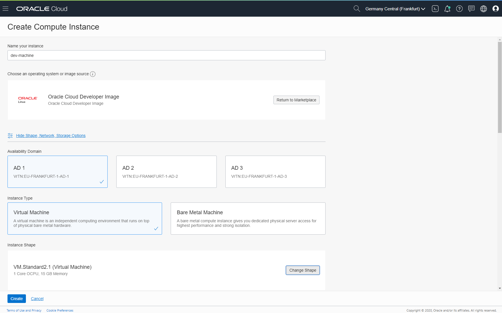

Next, check Assign a public IP address is selected to access this VM from your internet connection in your laptop or desktop.


For security reasons choose a SSH key file or paste a SSH key, to access the new VM (never use username and password to access a cloud machine as a best practice). If you don't have any private/pub keypair, then you must create them. You can use puttygen (recomended for windows) or openSSH to generate new keypair. Go to [Oracle Generating an SSH Key pair](https://www.oracle.com/webfolder/technetwork/tutorials/obe/cloud/compute-iaas/generating_ssh_key/generate_ssh_key.html) tutorial to create them in linux or Windows OS.

Review your configuration and then click Create button to create the new developer VM instance in your compartment.

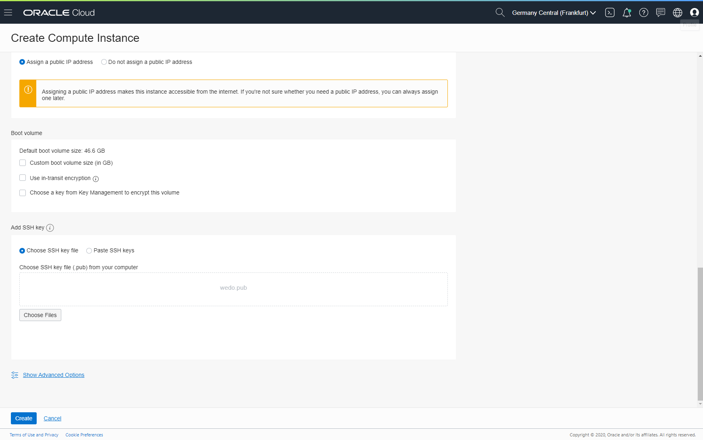

Your new VM will be created in a few minutes. Provisioning orange!

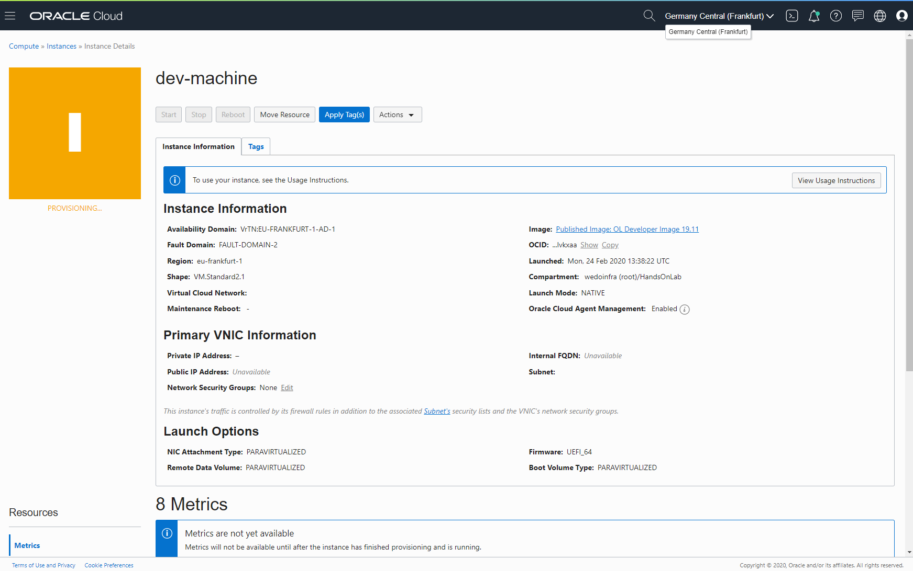

When you machine goes Green (Running) you can see a new **Public IP Address** to access it. please note it to future sections.

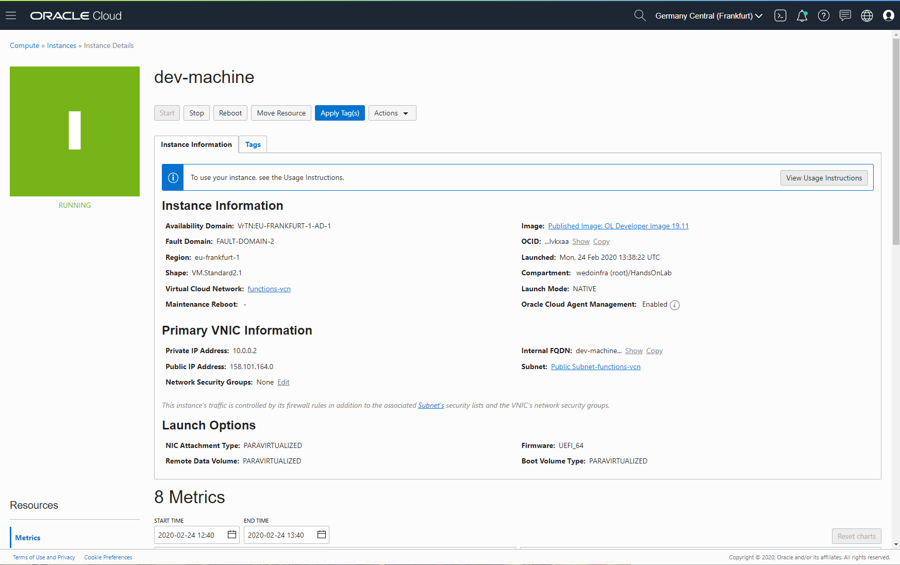

If you click in View Usage Instructions button, you will be redirected to the marketplace Image Usage Instructions. Read them to get SSH access to this VM. 

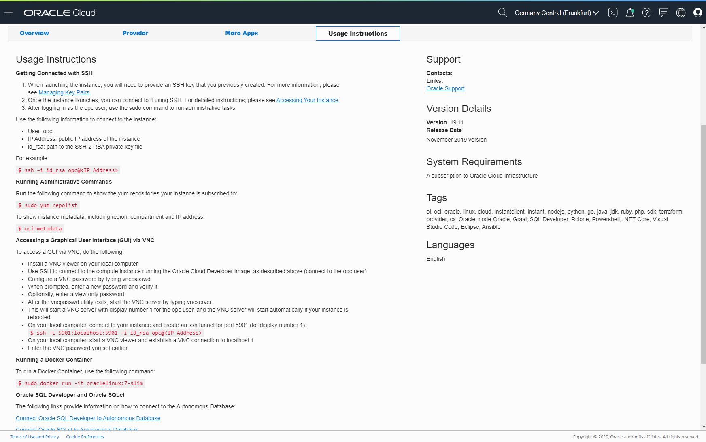

### Accessing a Graphical User Interface (GUI) via VNC
To access a GUI via VNC, do the following:

1. Install a VNC viewer on your local computer
2. Use SSH to connect to the compute instance running the Oracle Cloud Developer Image, as described above (connect to the opc user)
3. Configure a VNC password by typing vncpasswd
4. When prompted, enter a new password and verify it (note it for future uses)
5. Optionally, enter a view only password
6. After the vncpasswd utility exits, start the VNC server by typing vncserver
8. This will start a VNC server with display number 1 for the opc user, and the VNC server will start automatically if your instance is rebooted
9. On your local computer, connect to your instance and create an ssh tunnel for port 5901 (for display number 1): 
```ssh
sh -L 5901:localhost:5901 –i id_rsa opc@<IP Address>
```
10. On your local computer, start a VNC viewer and establish a VNC connection to localhost:1
11. Enter the VNC password you set earlier

### Accessing a Graphical User Interface (GUI) via VNC with mobaxterm
As in the previous section, you could create an access to GUI, but using mobaxterm VNC integrated client and SSH tunneling. Please follow next steps to create your VNC connection with mobaxterm.

Follow steps in the previous section (2 - 8) to connect via SSH (not GUI) and create a vncserver password (if you didin't create before).

Download [mobaxterm](https://mobaxterm.mobatek.net/) from its web page and install it. Then open mobaxterm in your computer (laptop or desktop). Next Select Tunneling.

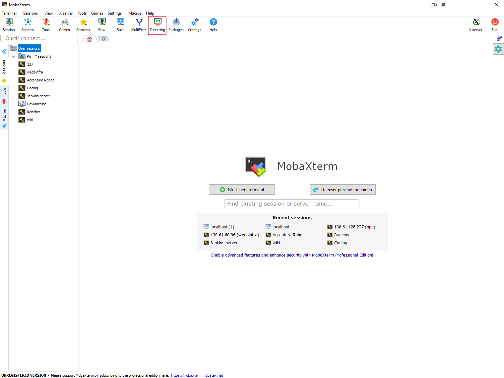

A new window setup will be opened to configure the SSH tunneling. Click New SSH tunnel button.

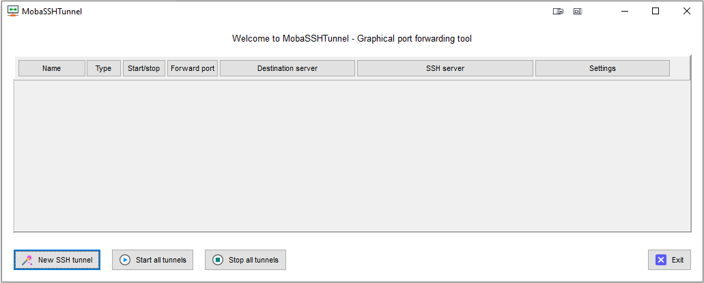

A new window setup will be opened with the SSH tunnel configuration. 
* Select Local port forwarding check.
* Write **[5901]** as port in your local side.
* Write **[localhost]** and **[5901]** port as Remote Server
* Write **[developer machine Public IP address]**, user **[opc]** and port **[22]** as SSH server.

Click Save button to create the SSH tunnel.

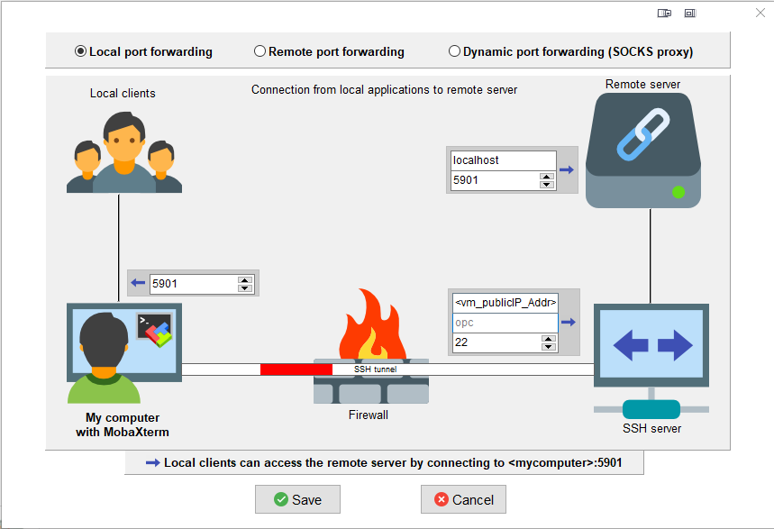

Click the Key icon in the new tunnel to attach the machine private key file that you create before (public/private key pair). Then click on play button to start the SSH tunnel.

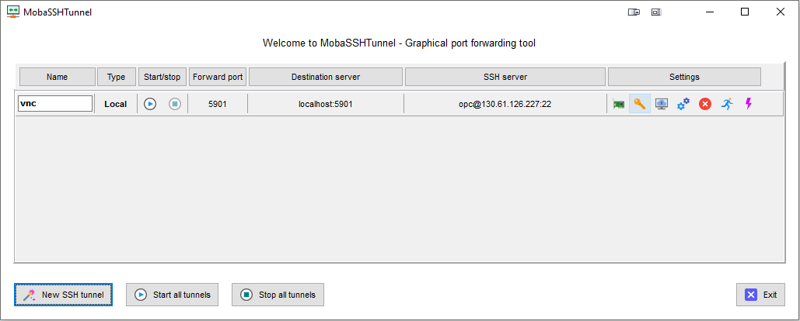

You receive a message to introduce the passphrase if you create a public/private key pair with passphrase. Write it and continue to start the tunnel.


Select new Session Button and then Select VNC to create a VNC conection with the SSH tunnel.


Write **[localhost]** as Remote hostname or IP Address and **[5901]** as port. Then Click OK button to create the VNC connection.

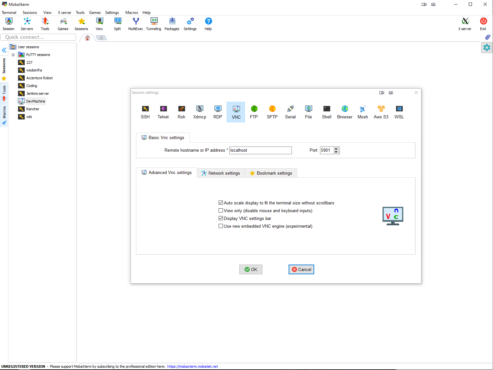

Double click in the VNC connection to start it. Write your password for the vncserver connection that you create previously.

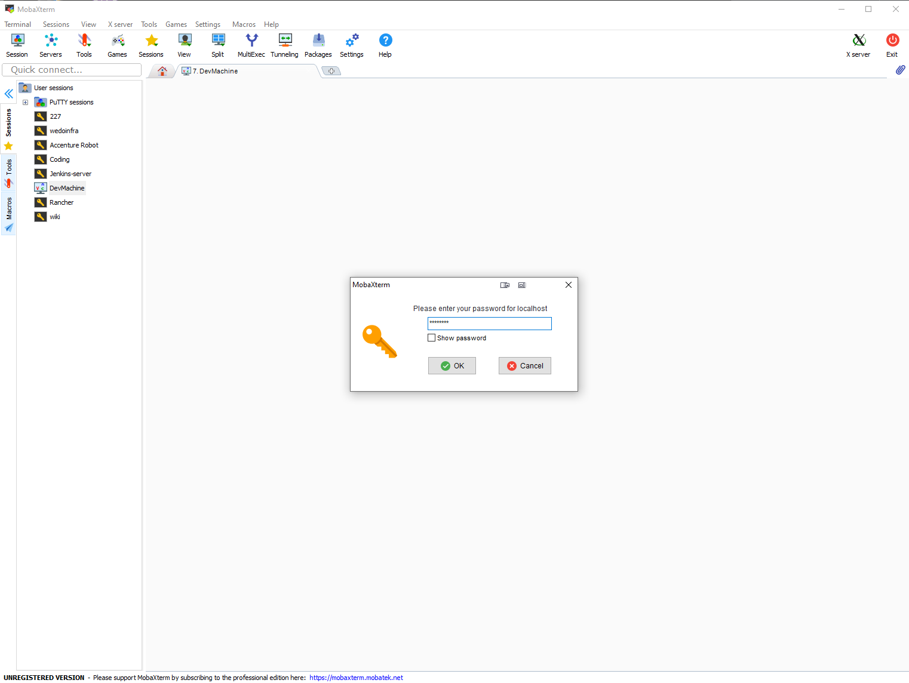

Mobaxterm question you about save this password internally. Click Yes or No according to your needs.

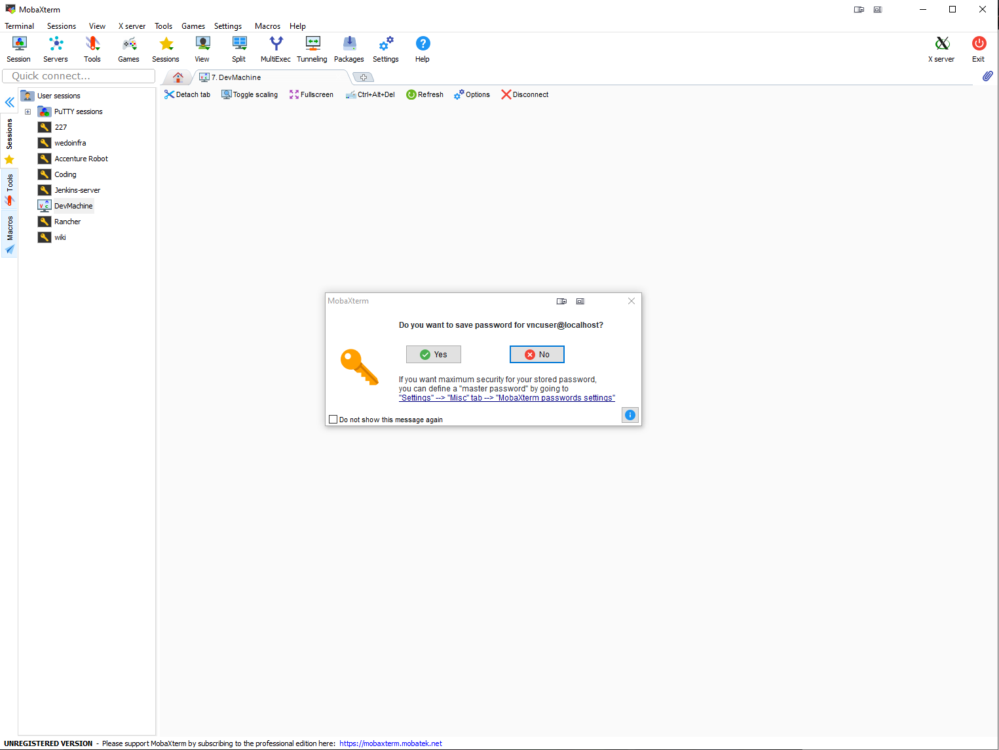

After that you can use the dev-machine GUI to create your programs, scripts or whatever you need.


## Development Machine Configuration
When you have created your developer market-place machine, you must configure it to use in your OCI tenant. Please follow next config tutorial

* [Developer Machine Config](https://github.com/oraclespainpresales/GigisPizzaHOL/blob/master/developer-machine/developer-machine.md)

## VNC Commands
To kill a VNC session vncserver --kill :<terminal_num>

```sh 
vncserver --kill :1
```
