# Gigi's Pizza Microservices HOL #

[](https://www.oracle.com/code-one/)

<span class="underline">**Introduction**</span> - 3 -

[**<span class="underline">HOL to be done in 2 hours.</span>** - 4
-](#hol-to-be-done-in-2-hours)

[**<span class="underline">Setting up an Oracle Cloud Account</span>** -
4 -](#setting-up-an-oracle-cloud-account)

[**<span class="underline">Getting key config data from Oracle Cloud
Tenancy</span>** - 12
-](#getting-key-config-data-from-oracle-cloud-tenancy)

[<span class="underline">How to get OCI tenancy config data to configure
DevCS</span> - 12
-](#how-to-get-oci-tenancy-config-data-to-configure-devcs)

[**<span class="underline">Configuring a Developer Cloud Service
Instance</span>** - 19
-](#configuring-a-developer-cloud-service-instance)

[<span class="underline">Virtual Machines Template configuration in
DevCS</span> - 21 -](#virtual-machines-template-configuration-in-devcs)

[<span class="underline">Build Virtual Machines configuration in
DevCS</span> - 27 -](#build-virtual-machines-configuration-in-devcs)

[**<span class="underline">Creating a Kubernetes Cluster</span>** - 31
-](#creating-a-kubernetes-cluster)

[<span class="underline">Using Virtualbox and a preconfigured VM
image</span> - 38 -](#using-virtualbox-and-a-preconfigured-vm-image)

[<span class="underline">Using Docker and a preconfigured image</span> -
50 -](#using-docker-and-a-preconfigured-image)

[**<span class="underline">Importing a Developer Cloud Service
Project</span>** - 54 -](#importing-a-developer-cloud-service-project)

[**<span class="underline">Configuring the Project to match our
Kubernetes Cluster</span>** - 59
-](#configuring-the-project-to-match-our-kubernetes-cluster)

[<span class="underline">Configuring Builds</span> - 62
-](#configuring-builds)

[<span class="underline">Fn Function Jobs modification</span> - 62
-](#fn-function-jobs-modification)

[<span class="underline">Docker Jobs modification</span> - 65
-](#docker-jobs-modification)

[<span class="underline">OKE Jobs modification</span> - 69
-](#oke-jobs-modification)

[<span class="underline">Configuring Git repositories</span> - 73
-](#configuring-git-repositories)

[**<span class="underline">Testing my implementation</span>** - 83
-](#testing-my-implementation)

[**<span class="underline">Modify the Project to match new
feature</span>** - 85 -](#modify-the-project-to-match-new-feature)

[**<span class="underline">The Cherry on the Cake: Digital Assistant
User Interface</span>** - 92
-](#the-cherry-on-the-cake-digital-assistant-user-interface)

[**<span class="underline">Before You Begin</span>** - 92
-](#before-you-begin)

[**<span class="underline">Background</span>** - 92 -](#background)

[**<span class="underline">What Do You Need?</span>** - 92
-](#what-do-you-need)

[<span class="underline">Clone a Skill</span> - 93 -](#clone-a-skill)

[<span class="underline">Create Intents</span> - 94 -](#create-intents)

[<span class="underline">Modify the Dialog Flow</span> - 94
-](#modify-the-dialog-flow)

[<span class="underline">Troubleshooting Errors in the Dialog
Flow</span> - 98 -](#troubleshooting-errors-in-the-dialog-flow)

## **Introduction**

This HOL is based in a Demo developed by WeDo Team as part of an innovation initiative to approach Oracle Cloud Solutions by providing
practical examples that could be “touched” and easily understood.

Demo is known as Gigi’s Pizza. The Use Case is focused in microservices/serverless (fn) and Multitenant DataBase. We
have three microservices coded in different languages like nodejs and of course Java (Helidon framework). This three microservices are part of a delivery pizza app, one microservice controls the orders, other one controls the pizza delivery and the last one controls the accounting. We coded a serverless function to calculate discounts, according to several bussiness rules like credit card type or pizza order total prize.

1.  Order data will be saved as JSON files in multitenant DB (nodejs microservice)
2.  Delivery data will be accessed as graph node DB (nodejs microservice and mobile app)
3.  Accounting data will be saved as regular SQL data (Java -Helidon- microservice)
    
We have coded the front-end part of Gigi's pizza app with Visual Builder Cloud Service, that is the Oracle WYSIWYG - What You See Is What You Get - Service. We have three front-end webapps:

1.  Orders front-end. It's a list of orders to the cookers (only PIZZA ORDER and PIZZA COOKED status are visualized)
2.  Payment front-end. It's the accounting part of the demo and a dashboard to the manager of the gigi's pizza store.
3.  Stream front-end. It visualize the pizza status messages (We use Oracle Cloud Streams).

Finally we have tied a chatbot(Skill) with the microservice-order as a front-end to order the pizzas. And a mobile application for the delivery employees. This mobile app gets the PIZZA OUT FOR DELIVERY status orders and calculates the best route from the Gigi's pizza store to the customer address using Oracle Spatial PDB as location gps points/nodes database.


## **HOL to be done in 2 hours**

This HOL is a subset of the above mentioned demo. Due to time restrictions, we will focus in three main tasks for you to complete
during the HOL delivery:

1.  Setup an Oracle Cloud Infrastructure Free Trial instance where you can:
    
    1.  Provision a Developer Cloud Service(DevCS) Instance    
    2.  Create a Kubernetes Clusters and setup access via ocicli and kubectl

2.  Import a DevCS Gigi’s pizza project and configure it to deploy demo Microservices apps into the Kubernetes Cluster

3.  Add a new feature to Microservices, deployment in Kubernetes Cluster and configure and modify the user interface (A Digital Assistant) to be able to provide new feature

# **Setting up an Oracle Cloud Account**

As an attendee to OOW/CodeOne 19 you have been provided with access to a free trial account part of Free Oracle Cloud Program with 500$ / 30 days trial. This trial is associated with the email address you used to register to event.

Go to [<span class="underline">http://cloud.oracle.com</span>](http://cloud.oracle.com) and click in the “Try for Free” button in the top right:


Then enter your email address and select your Country/Territory:


The system will detect that your email address has been whitelisted as Oracle attendee and you will be offered a free trial with no need to use a credit card or sms. Trial offered is for 500$ for 30 days.

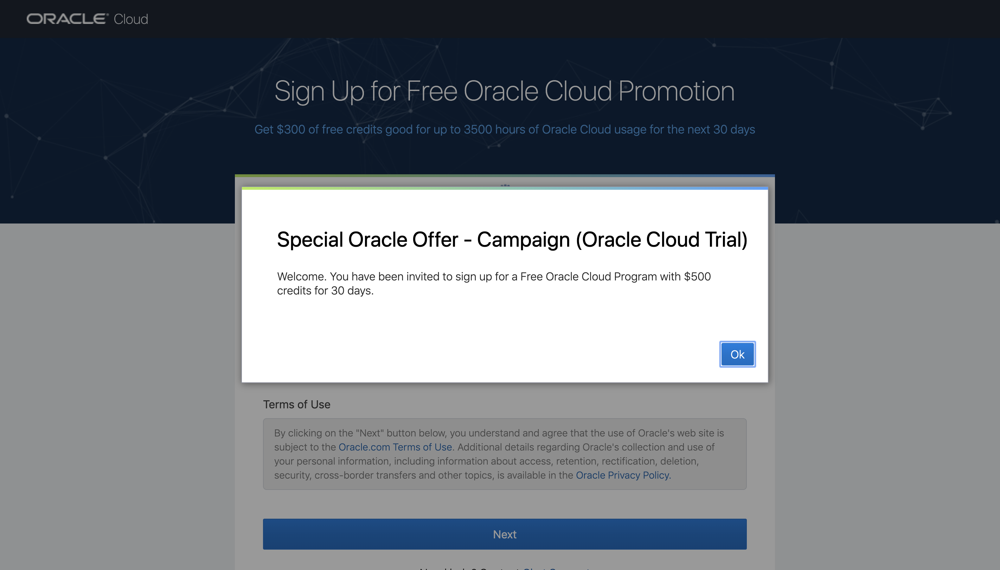

Fill in required fields. For account type, select “Personal Use”. Select a name for your trial tenancy, a region and the rest of details:

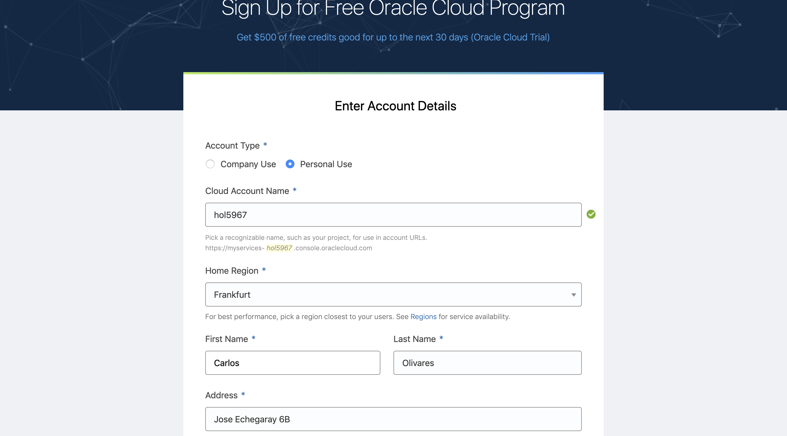

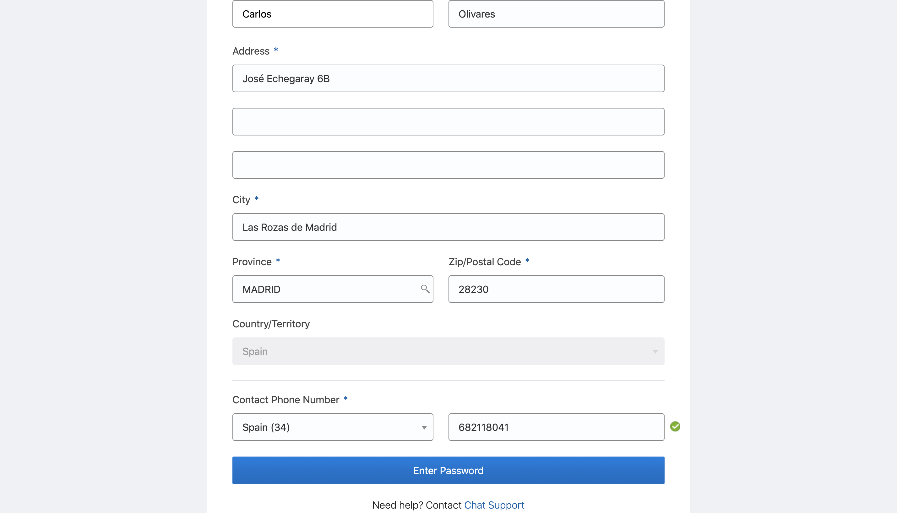

Then enter a password required to authenticate in your tenancy when provisioned. Remember password has to be longer than 12 character and including at least an upper character and a special character:


Accept the Terms and Conditions:

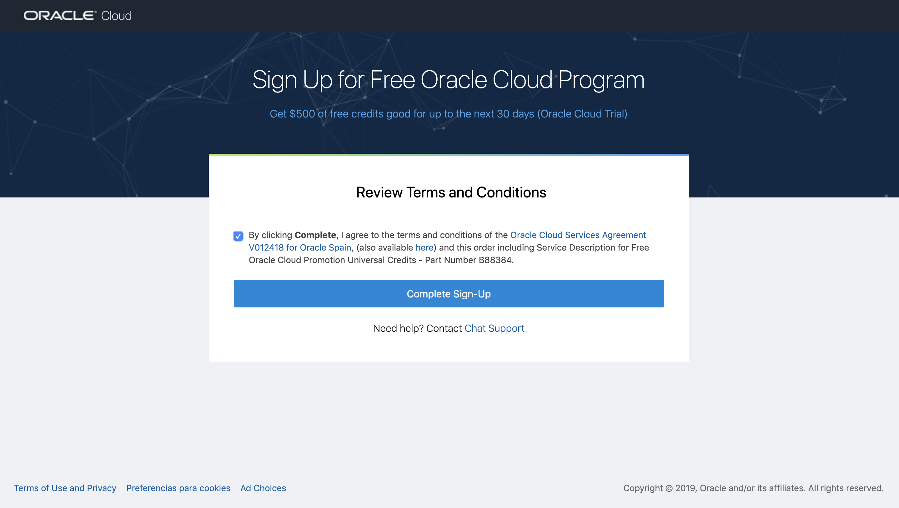

And you will be redirected to the initial page or Oracle Cloud Infrastructure to authenticate for the first time in your tenancy:


Enter your user and password just created:


And you will be directed to initial Oracle Cloud Infrastructure Dashboard (referred from now on as OCI Dashboard):

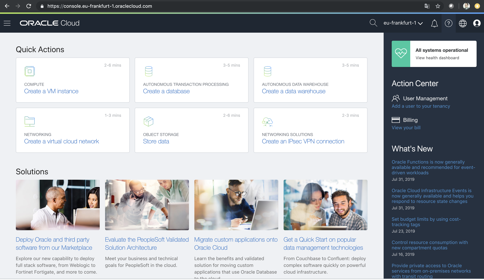

Click in the hamburger icon on the top left side and menu will be shown. There select Platform Services (under More Oracle Cloud Services” Area)-\> Developer menu option.


There you will be taken to Developer Cloud Service Welcome Page. Let’s start creating a DevCS instance. Click in Create Instance.

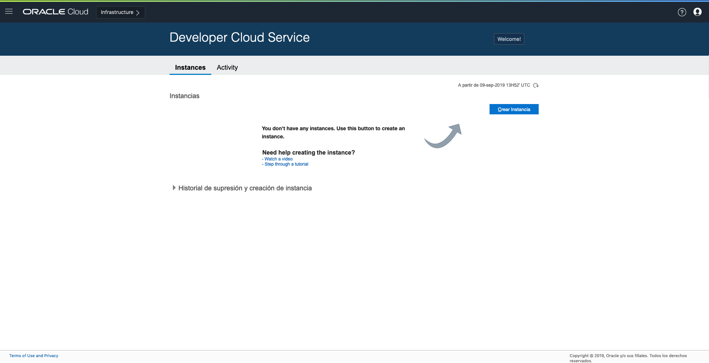

In next screen provide an Instance Name and fill in also Region you want to create your instance, then click in Next Button:

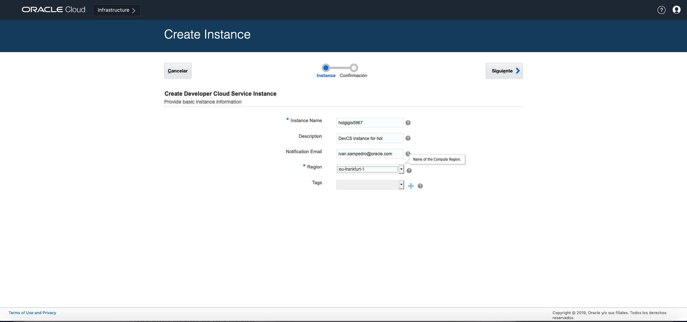

Check the selections in previous screen an click in Create button:


Instance creation starts creating service as you can see in Status screen:


This process will take some time so let’s take advantage of time while this process ends, and we can then configure the Developer Cloud Service Instance.

# **Getting key config data from Oracle Cloud Tenancy**

Now before we are able to configure a Developer Cloud Service Instance, let’s gather some key info about our OCI tenancy that will be required throughout the whole lab. So we recommend you to create a txt file where you store this basic info you will be required to use several times during this lab:

  - Tenancy OCID
  - User OCID
  - Private Key
  - Public Key
  - Fingerprint
  - Auth Token
  - Compartment OCID
  - Object Storage Namespace

## How to get OCI tenancy config data to configure DevCS

In Oracle Cloud Infrastructure interface menu, go to Administration-\>Tenancy Details:


In Tenancy information area, select copy button so that you copy the OCID for tenancy and don’t forget to make a note in a txt file.

Also copy the Object Storage Namespace under the Object Storage Setting area and don’t forget to make a note in a text file.

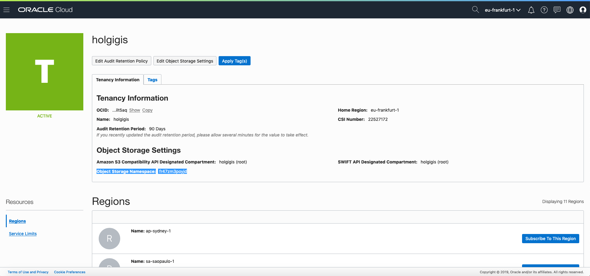

Now go to Menu option Identity-\>Users:


In Users area, click on copy button for your email address user(remember this user has admin role in OCI tenancy) so that you can copy the user’s OCID. Don’t forget to make a note in a txt file.

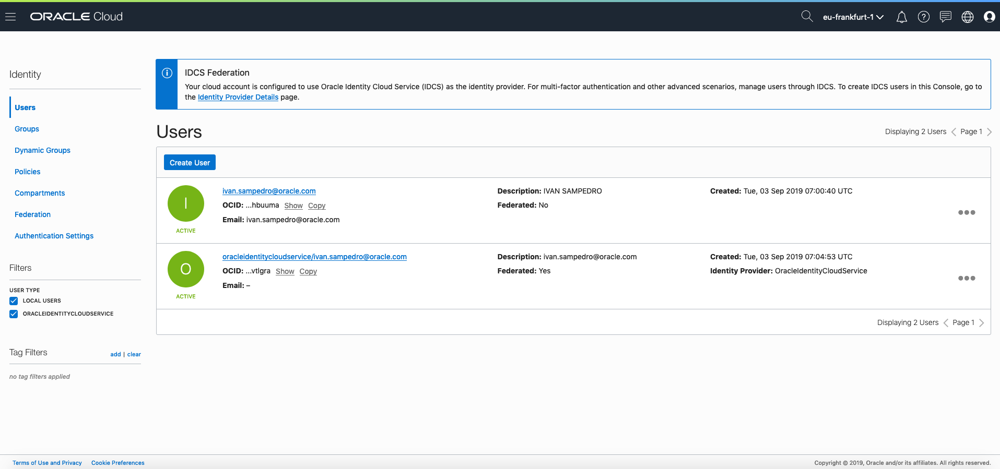

Now we will create an Auth token for the user by using a public and private key. We will provide you with two already created .pem keys to download in:

[<span class="underline">https://github.com/oraclespainpresales/GigisPizzaHOL/tree/master/microservices/Credentials</span>](https://github.com/oraclespainpresales/GigisPizzaHOL/tree/master/microservices/Credentials)

First thing you need to do is viewing content of Private Key and copying private key, making a note in a txt file. Then do the same with public key and copy content into clipboard.


Now click in your email user and you will be directed to a details screen, where you must click in Api Keys area in “Add Public Key”
button.


Now paste in popup window the Public Key previously copied in clipboard. Make sure you have copied public.pem content and not private.pem content. Click in Add button.

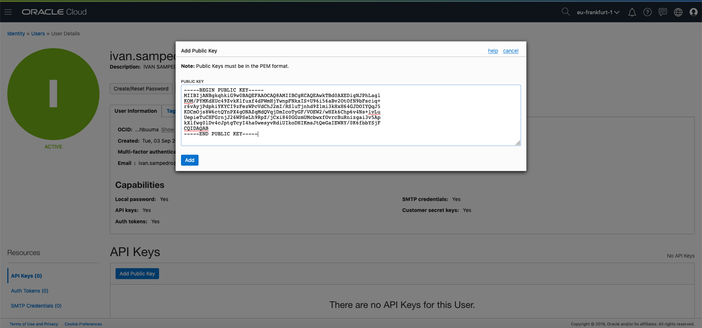

Now copy Fingerprint generated as it will be used later. Don’t forget to make a note in a txt file.


Now create parameter required (AuthToken) by clicking in Auth Tokens under Resources area, clicking in Generate Token button and then
providing a description:

IMPORTANT REMINDER: AFTER YOU CLICK IN Generate Token Button, COPY THIS AUTHTOKEN AND KEEP SAFE AS IT CANNOT BE FOUND LATER

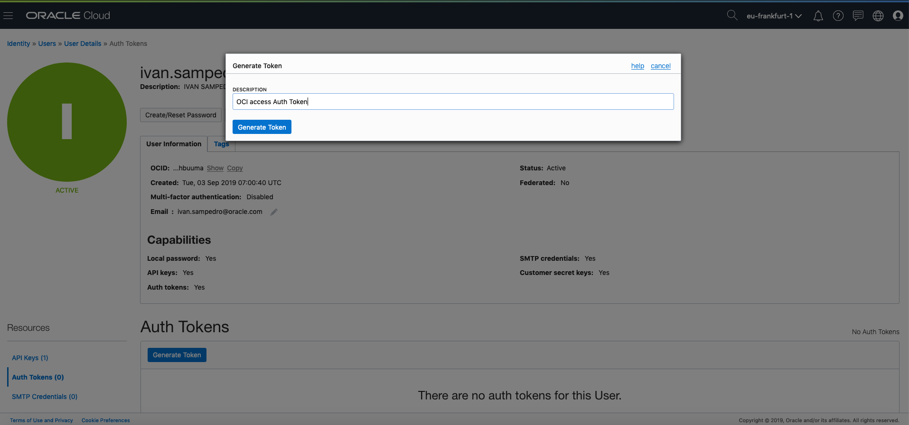

IMPORTANT: Copy the Generated Token in a txt file and keep safe as we will require it later:


Now we have to create a new Compartment as currently we only have the root one in tenancy by default. In OCI Dashboard Menu go to
Identity-\>Compartments 


Click on “Create Compartment” button and fill in Name(we have called it
HandsOnLab), Description and Parent Compartment(it must be root referred
with Tenancy name) and click in “Create Compartment” button:

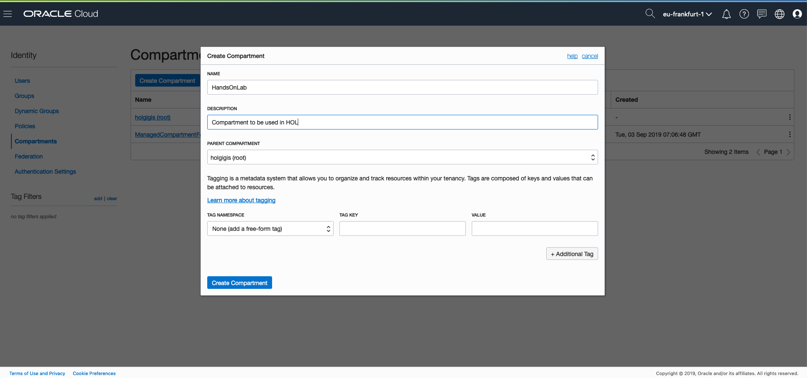

Now click in Compartment name you have just created (HandOnLab for me):

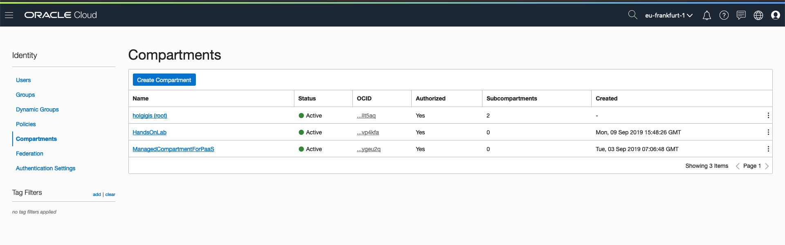

And click on copy link to copy the Compartment OCID. Don’t forget to make a note in a txt file.


This concludes the list of OCI tenancy parameters you will require to run next section.

# **Configuring a Developer Cloud Service Instance**

Now let’s check that Developer Cloud Service has been created so that we can configure it.

Check updated status by clicking in  icon:


Once the Developer Cloud Service instance has been provisioned, click on the right side menu and select: “Access Service Instance”:

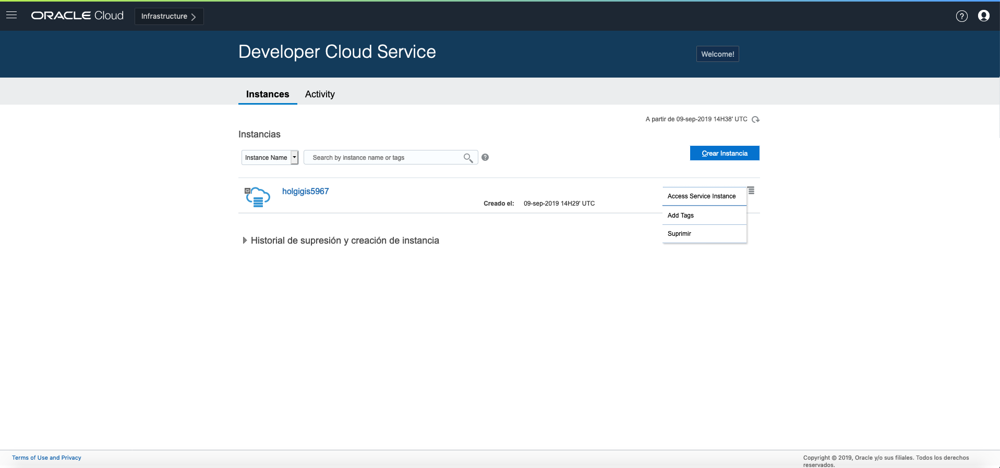

You will see next screen where you are requested to run some extra configurations related with Compute & Storage. Click in OCI Credentials link in Message and have close to you the txt file with OCI information previously gathered:


Select OCI for Account type and fill in the rest of the fields. Leave passphrase blank and also check the box below.

Then click on validate button and if compute and storage connections are correct, then click on Save button.


## Virtual Machines Template configuration in DevCS

Now we need to configure one or two VM servers to be able to build your project developments. We will create a VM Build Server to be used to compile and Build Microservices components and another to compile and Build Fn Function (Serverless) components that will require a different set of Software components:


To do this, we have to create a first virtual Machine Template to be used with Microservices, so click in Virtual Machines Templates tab:

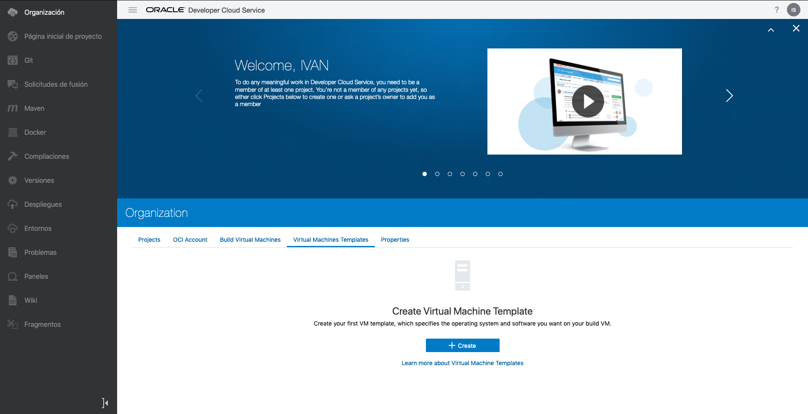

Now click on Create button:


Provide a Name(like VM\_basic\_Template) and select Oracle Linux 7 as Platform:

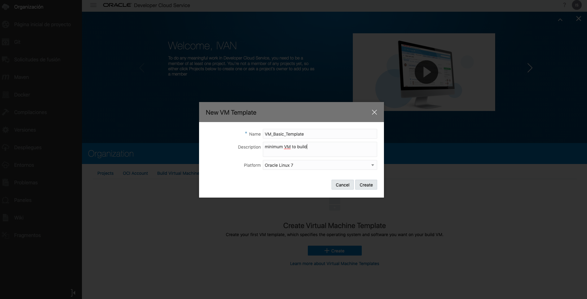

Now Click in Configure Software button:

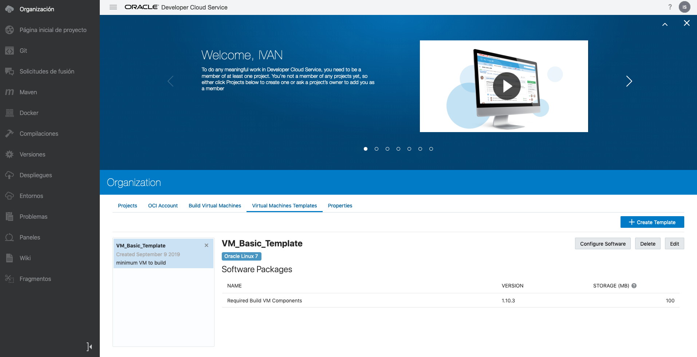

Now select the mínimum Software packages will will require later to build our project. If you remember from Introduction section, we will build microservices developed with Node JS v8 and Java . We will also require to access to OCI so OCICli will be required and thus Python will be also needed. Then we will have to build Docker images and also deploy those images in a Kubernetes Cluster thus KUBECtl will be needed too. Finally we also need the Minimum required Build VM components. So mark software components options below:

  - Docker 17.12
  - Kubectl
  - Node.js 8
  - OCIcli
  - Python 3.3.6
  - Required Build VM Components


Click in Done button and we will have finally our VM template created like below:

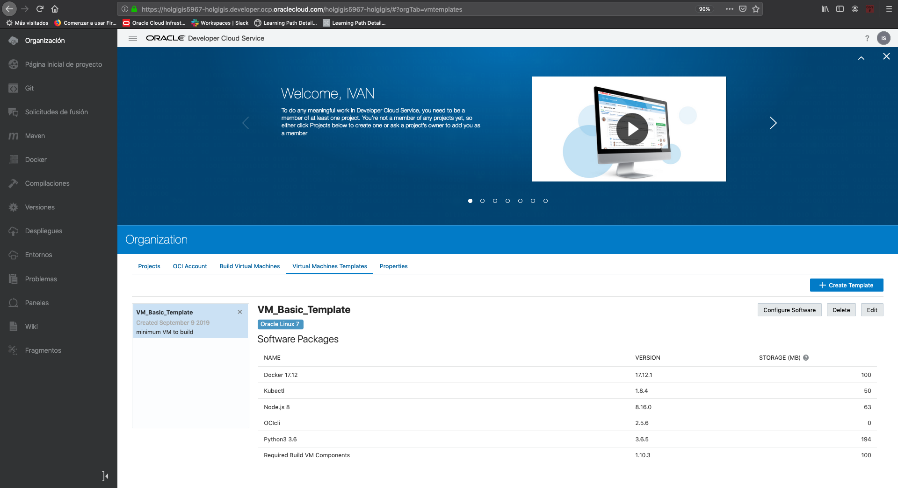

Now we will create a second Virtual Machine Template for Serverless Components. Click in Create Template again and fill in fields and click on Create button:


Now we will select specific Software components required for Fn Function build process. Click in Configure Software button:


Now configure software components. Fn 0 will have to be selected together with Docker, OCIcli, Kubectl, Python and required build VM
components. No Node JS and Java components this time required:

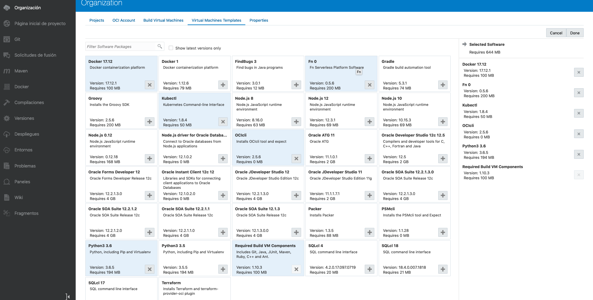

Click on Done and these are the software components in VM template:


## Build Virtual Machines configuration in DevCS

Now we have to create a couple of real VM in OCI based in Virtual Machine template just created. So, we will select Build Virtual Machines Tab and will click on Create button:

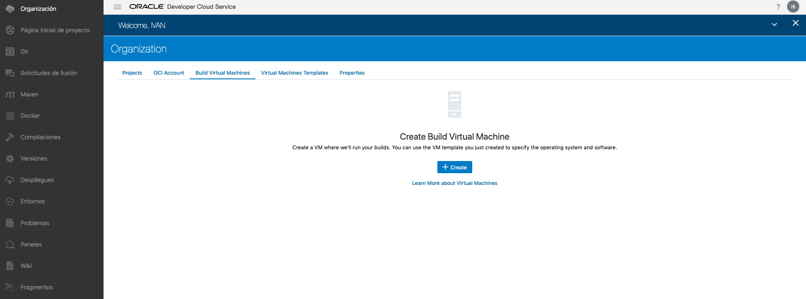

Now Select 1 as quantity, select the previously created template, your region and finally select as Shape the option VM.Standard.E2.2:


Now your VM will start creation process


It is important to modify to Sleep Timeout a recommend value of300 minutes (basically longer than lab duration) so that once started, the build server won’t automatically enter into sleep mode.


And now we will create following the same process a second Build Virtual machine using the Fn Function defined template:


IMPORTANT NOTE: At this point try to manually start both VM Servers like in screenshot below:


And check that Status changes to starting in both servers:


# **Creating a Kubernetes Cluster**

Now it is time to create a Kubernetes Cluster to deploy the microservices we will create in next section.

Start by creating a policy that allows Service OKE to be created to manage all resources in this tenancy. To do this in OCI Dashboard Menu go to Identity-\>Policies.

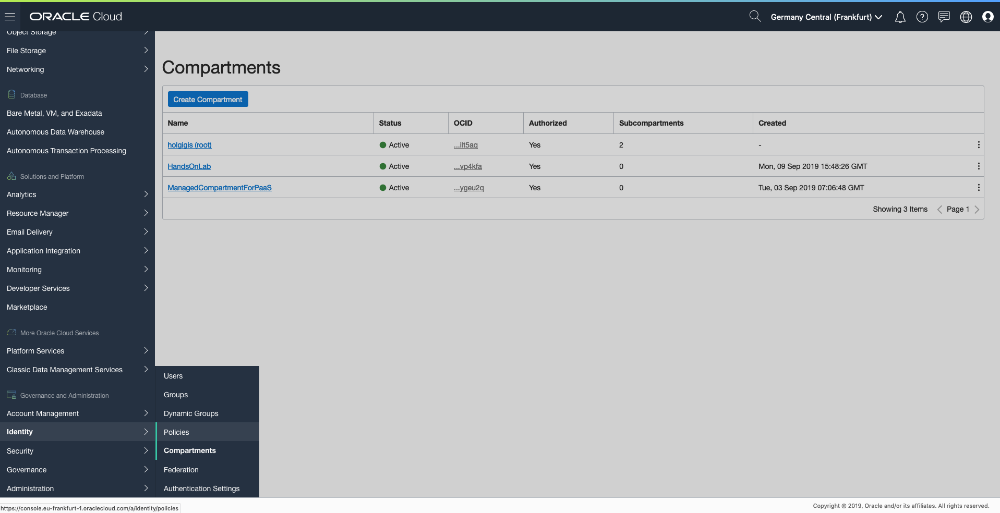

Check that root compartment is selected. Then click in Button Create Policy and fill in fields taking special care of filling in Statement field in Policy Statements area with this value:
```
Allow service OKE to manage all-resources in tenancy
```
And then click in Create button:


Then check that the policy has been created:


Then in OCI Dashboard Menu go to: Developer Services-\> Container Clusters (OKE)

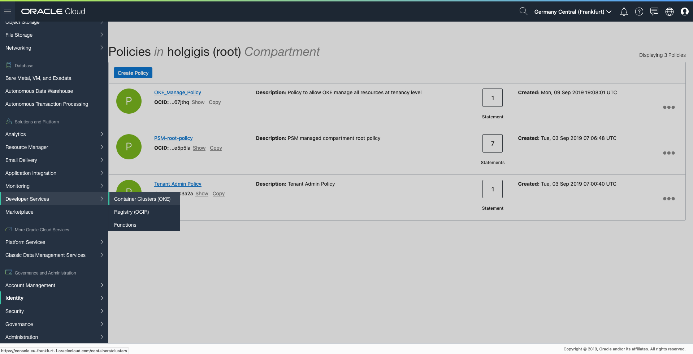

Select the compartment you have previously created under List Scope and click in Create Cluster button:

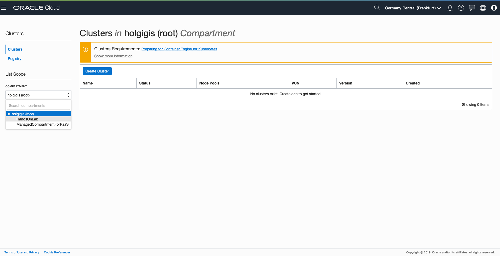

Provide a name for the cluster, then select QUICK CREATE option and Launch Workflow button:


Select Shape VM.Standard1.1 and 3 (or less if you don't want to create a 3 workernodes nodepool) in the NUMBER OF NODES (this number is the VMs that will be created into the node pool). Then click in NEXT button setting the default options for the rest of parameters for a cluster review:

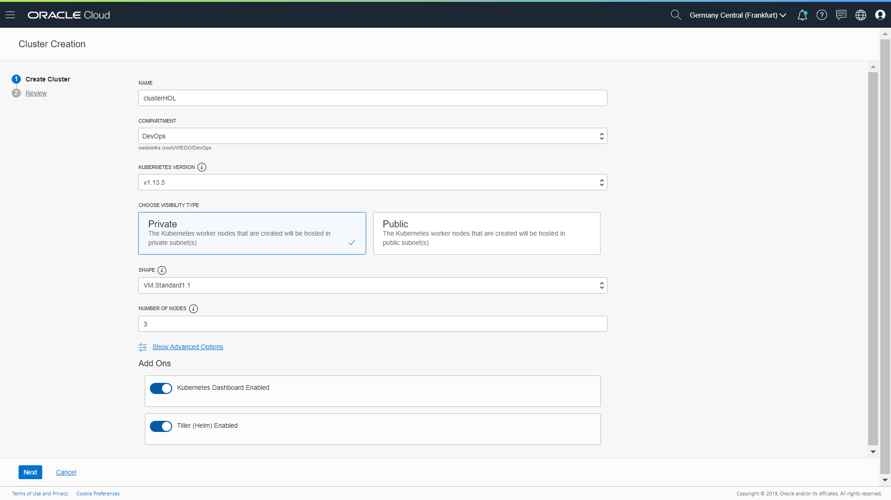

Review the cluster information before to create it, and click on Create Cluster Button or back to modify cluster options:

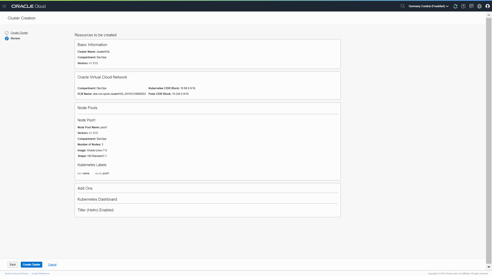

The previous QUICK CREATE Option will setup a 3 nodes Kubernetes Cluster with predefined Virtual Cloud Network, 3 Subnets, Security Lists, Route tables. When you are done with checks, please click on the Requesting Cluster area in your Cluster name.

Note: Cluster creation process can take several minutes.

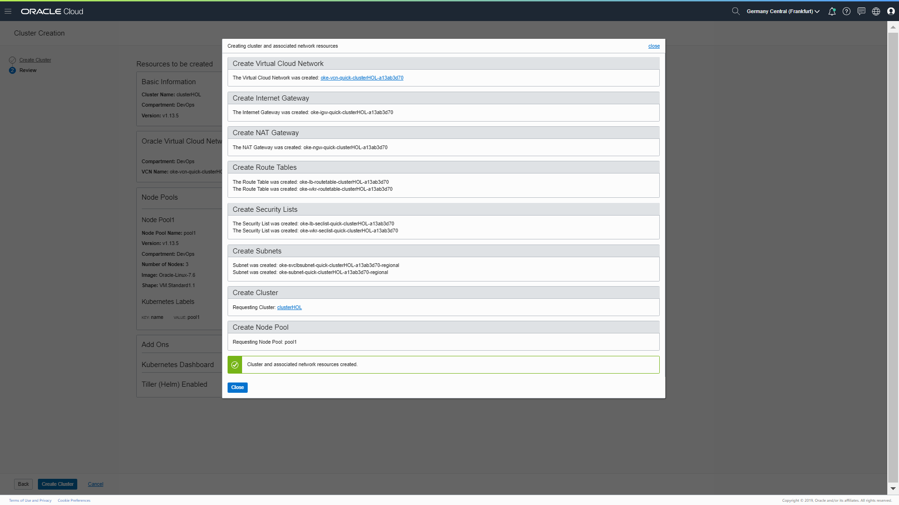

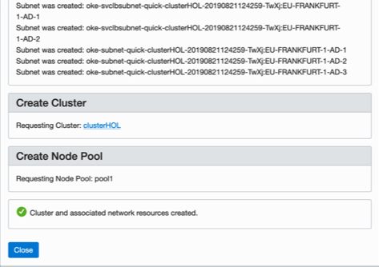

Then you are taken to the Cluster Information page. Please copy Cluster id and don’t forget to make a note in a txt file as you will need this data later:

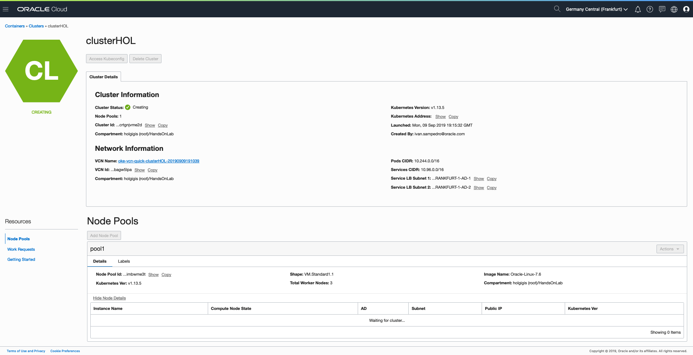

It will take several minutes for the cluster to be created. Once created, if you scroll down in previous screen and select Node Pools
under Resources area,you can check that a Node Pool with three Node Clusters have been created:

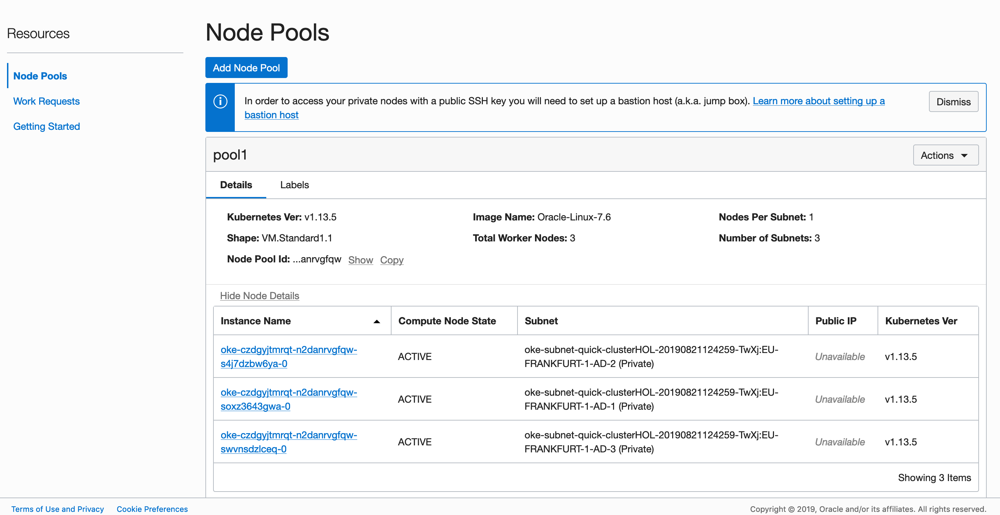

Note: you may find that Compute nodes have not been created yet as. This process can take several minutes as compute instances have to be created and then started:


Now your Kubernetes Cluster is created. But we need to run some extra steps to get started with managing the Kubernetes Cluster.

If you click under Resources section in Getting Started. This section explains steps to access to you Cluster dashboard by using Kubectl. In this section it is explained in detail how to install ocicli and kubectl to access to Kubernetes management tool:

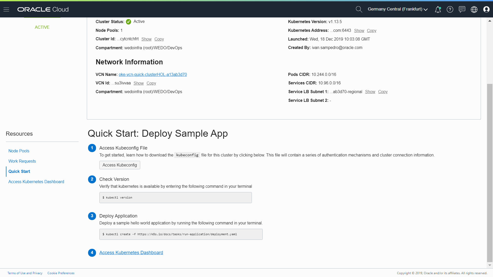


So that we avoid installing in your laptops these components that also require Python and other prereqs, we will provide you in next section with **two preinstalled options(YOU ONLY NEED TO DO ONE OF THE NEXT TWO SECTIONS)** for which **you should have either Virtual Box or Docker installed in advance in your laptop**:

1)  An OVA VM image if you already have VirtualBox installed
2)  A Docker Image if you already have Docker installed

## Using Virtualbox and a preconfigured VM image

You can start downloading OVA image from <span class="underline">[here](https://objectstorage.eu-frankfurt-1.oraclecloud.com/p/hZnw2wJSeVpigjnOHBwSO9-GcZrdNyjqgWi1FObBvHg/n/wedoinfra/b/DevCS_Clone_WedoDevops/o/HOL5967-OOW2019.ova "ova hol").</span>Alternative we will provide USB memory sticks with OVA image to be copied.

Note: If you are not familiar with VirtualBox, please make sure you have Guest Additions installed or follow this manual to install:
[<span class="underline">https://www.virtualbox.org/manual/ch04.html\#sharedfolders</span>](https://www.virtualbox.org/manual/ch04.html#sharedfolders)

This tooling will help you for instance to copy/paste between the VM and the host.

Once Image is downloaded or copied, please import the image in Oracle VM VirtualBox. Select Menu File and Import Appliance…:


Then choose the path to the .OVA copied or downloaded before and click in Continue button:

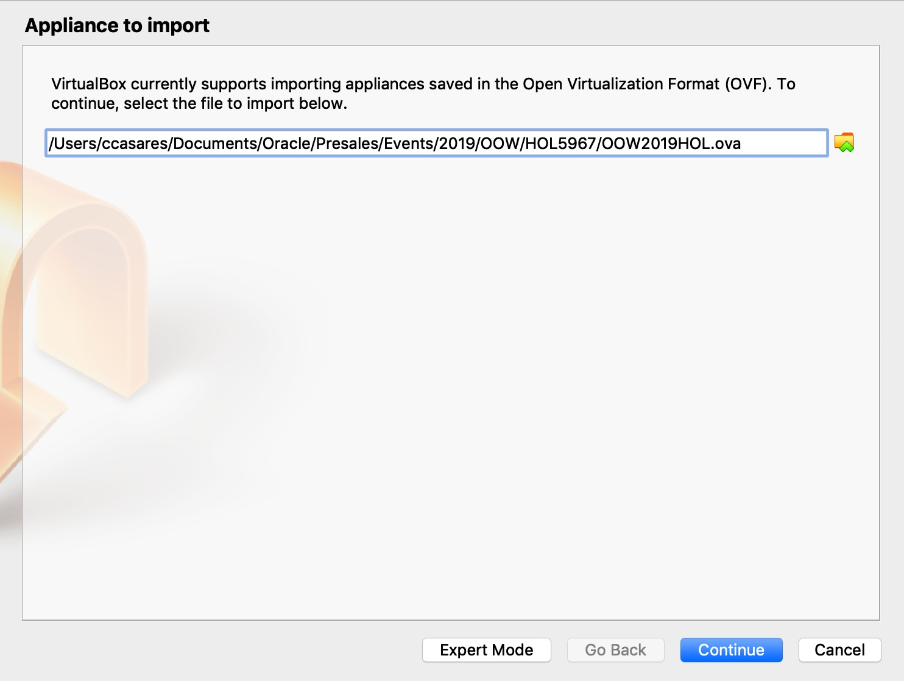

Leave default options and click on Import button:

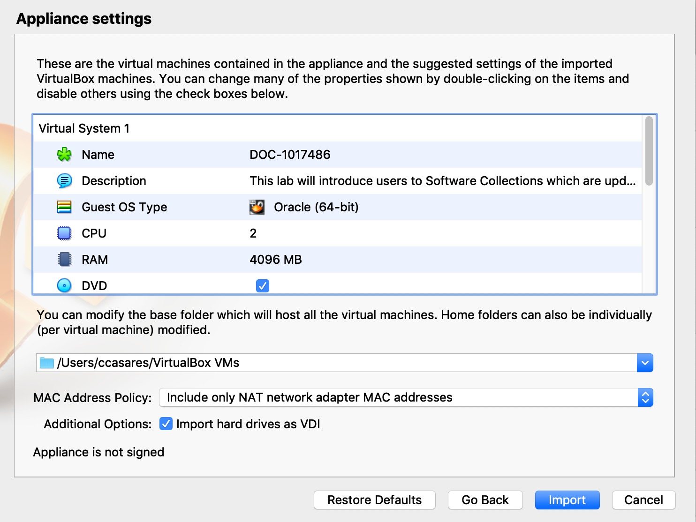

The process will take several minutes:

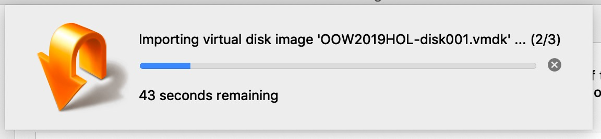

Once imported, you will have a VM named DOC-1017486. Start the VM by clicking in start button:


It should take some time to start the VM. Click on enter and you should see the login screen.

**NOTE:** If you face any issue, please check that Graphic Controller selected is VBoxSVGA as there are some issues in VirtualBox 6 if you use a different one.


Click on Hand-On Lab User. Password for user is oracle.


Once logged in, open a terminal window and execute next command to configure ocicli:

oci setup config


Keep your txt file with your OCI Tenancy parameters close as you will be asked for those parameters. Before starting, please copy into the VM the private key previously provided:


Decline to generate a new RSA key pair, copy your private key previously provided into the VM. We recommend you to paste it into this path:

/home/holouser/.oci


Now let’s configure kubectl. Inside your cluster information page, click the “Access Kubeconfig” button:

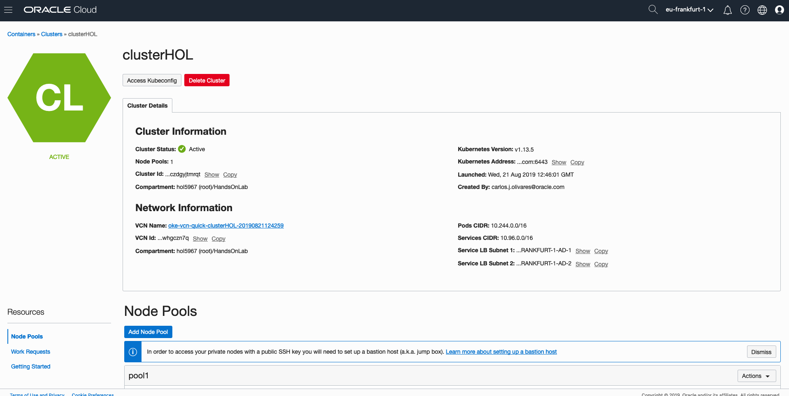

A popup window will appear providing you with the commands you have to run to configure kubectl to connect to the Kubernetes cluster just created(change value below with your own cluster id and region):
```
1)  mkdir -p $HOME/.kube
2)  mkdir -p $HOME/.kube
    oci ce cluster create-kubeconfig --cluster-id <your_cluster_id> --file $HOME/.kube/config --region eu-frankfurt-1 
    --token-version 2.0.0
3)  export KUBECONFIG=$HOME/.kube/config
```


When you execute commands below, you can face an issue and you must run an extra command to configure private key permissions:
oci setup-repair-file-permissions –file /home/holouser/.oci/private.pem


You will follow steps mentioned in Access Kubernetes Dashboard section, so that we can launch the Kubernetes Dashboard:


Click on SIGN IN button and finally you are logged in Kube Dashboard:


To enable Kubernetes to pull an image from Oracle Cloud Infrastructure Registry when deploying an application, you need to create a Kubernetes secret. The secret includes all the login details you would provide if you were manually logging in to Oracle Cloud Infrastructure Registry using the docker login command, including your auth token.

Run kubectl command below with your credentials(remember that username is made of object storage namespace/username and password is the
Authtoken we generated):

```
kubectl create secret docker-registry ocirsecret --docker-server=fra.ocir.io --docker-username='frcjosyavuar/carlos.j.olivares@oracle.com' --docker-password='gewuo5U)b2)T6;r1yL\>1' --docker-mail='carlos.j.olivares@oracle.com'
```

NOTE: To make sure that you don’t copy hidden characters, please copy this command template from: [<span class="underline">https://github.com/oraclespainpresales/GigisPizzaHOL</span>](https://github.com/oraclespainpresales/GigisPizzaHOL)

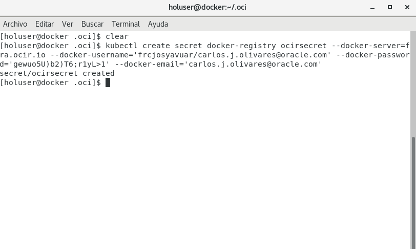

If you go then to Kubernetes Dashboard in browser inside the VM and navigate to Secrets menu under Config and Storage Area, you will see the Secret you have just created:


**IMPORTANT NOTE:** Once you finish this section, skip section below and move to next section Titled [**<span class="underline">Importing a Developer Cloud Service Project</span>**](#_Toc18932109)

## Using Docker and a preconfigured image

If you have docker already installed in your laptop (ideally on Mac or Linux as Windows docker version may face some issues), open a terminal window and pull docker image associated to this hands-on-lab:
```
docker pull colivares1974/ociimage:hol5967
```


Now create a folder in your local drive:
Linux/MacOS:
```Linux/MacOS: 
mkdir -p ~/ociimage/tmp
```
or Windows: 
```Windows: 
c:\> md ociimage/tmp
```


Launch Container while mounting the ociimage file:
```
docker run -it -p 8001:8001 -v ~/ociimage/tmp:/root/tmp colivares1974/ociimage:hol5967
```


Now let’s configure access to oci tenancy via ocicli with our tenancy details. info will be used by kubectl to configure a config file to access to Kubernetes cluster previously created. Then, to enable Kubernetes to pull an image from Oracle Cloud Infrastructure Registry when deploying our application, you need to create a Kubernetes secret. The secret includes all the login details you would provide if you were manually logging in to Oracle Cloud Infrastructure Registry using the docker login command, including your auth token. Finally we will launch Kubernetes proxy so that we can have access to Kubernetes Dashboard from a web browser.

All these steps are explained in detail:
1)  Edit oci config file using. Modify config file with your tenancy details:
```
nano .oci/config
```
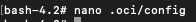
```
> Modify config file with your tenancy details(User OCID, Fingerprint,
> Tenancy OCID and Region). Keep path to private key in key\_file as it
> has already been loaded to that default path. When done press CTRL+o
> to save changes and CTRL+x to close nano editor:
```


2)  Launch command to create a kubeconfig file modifying cluster-id and region with your tenancy details:
```
oci ce cluster create-kubeconfig --cluster-id <cluster-id> --file $HOME/.kube/config --region <region>
```
For example I used this command for my tenancy:
```
oci ce cluster create-kubeconfig --cluster-id ocid1.cluster.oc1.iad.aaaaaaaaafqtomjsmq3tszddmuyggyrtmqzdenzrmyygmzjzhc2dkoldgvst --file $HOME/.kube/config --region us-ashburn-1
```


You can check details for config file created:
```
cat .kube/config
```


To setup KUBECONFIG env variable, run next command: 
```
export KUBECONFIG=$HOME/.kube/config
```
3)  Now let’s create Secret. You need to execute command below with your own tenancy credentials:
```
kubectl create secret docker-registry ocirsecret --docker-server=<region>.ocir.io --docker-username='<object_storage namespace>/<tenancy username>' --docker-password='<Auth Token>' --docker-email='<tenancy_username>'
```
> For example I used this command for my tenancy:
```
kubectl create secret docker-registry ocirsecret --docker-server=iad.ocir.io --docker-username='idkmbiwb03s9/colivares1974@gmail.com' --docker-password='vm{wRs\>0d9DR4HedsAIY' --docker-email='colivares1974@gmail.com'
```


If successful, this line should appear as in previous screen:
```
$ secret/ocirsecret created
```
# **Importing a Developer Cloud Service Project**

Once that we have a Kubernetes Cluster, let’s move on to next step which is importing a DevCS that contains all the microservices that we will have to deploy in this Kubernetes Cluster.

Go to your DevCS instance and in Organization Menu option, under Projects tab, click in Create:


Enter a Name for your Project, for Security select Private and your Preferred Language. Then Click in Next:

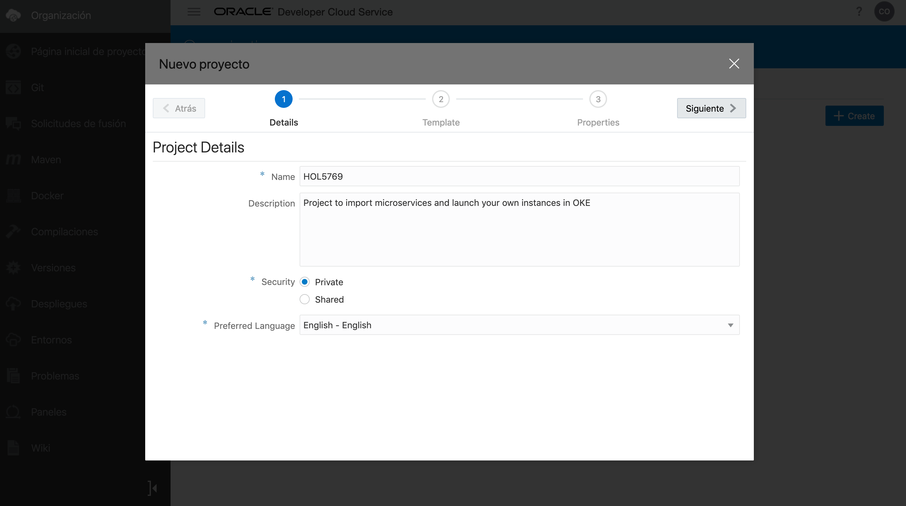

In Template Section, select Import Project Option:


For Properties section, we will provide you with details to connect to a preconfigured DevCS instance from which you an import the project in this url:

https://github.com/oraclespainpresales/GigisPizzaHOL/tree/master/microservices/Credentials

Click on Next:


In next section, select the Container named: “DevCS\_Clone\_Wedodevops” and the zip File available with the Project export to be imported. Then Click in Finish:


Then project start importing process:


Importing project goes on:


Finally you will have project imported:


Review different projects source code in Git menu:

Note: We will work in next sections with all git but db\_management.git and PizzaDeliveryMobileApp.git

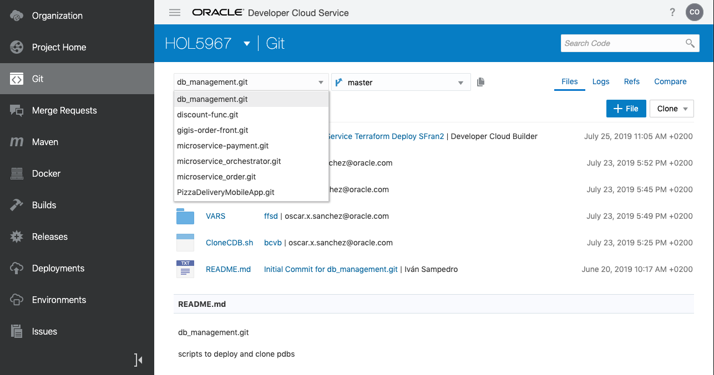

Now go to Builds Menu option and check different Jobs

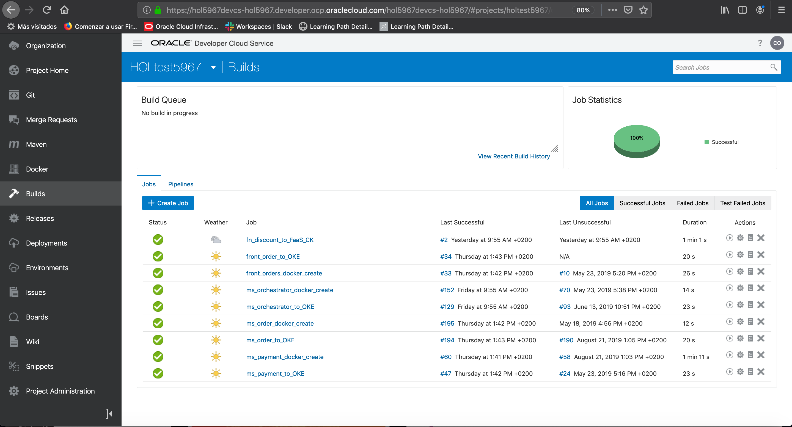

And click in Pipelines tab to check different Pipelines


# **Configuring the Project to match our Kubernetes Cluster**

What we have to do now is to adapt parameters and code in project we have just imported to fit with our OKE deployment in your OCI tenancy.

But before we have to create DNS Zones in OCI. A zone is a portion of the DNS namespace. A Start of Authority record (SOA) defines a zone. A zone contains all labels underneath itself in the tree, unless otherwise specified.

So let’s create a couple of DNS Zones. These will be used later to modify DNSZONE parameter in project. In OCI Dashboard Menu go to:
Networking-\>DNS Zone Management

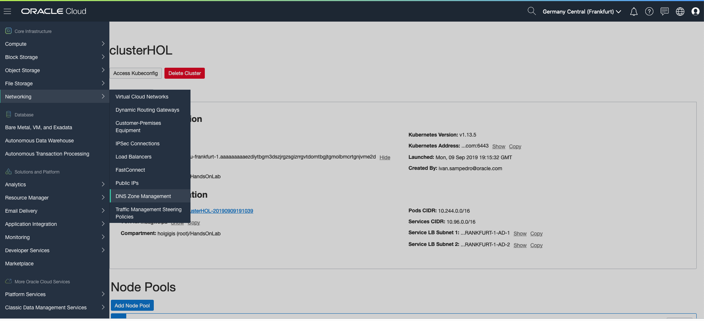

If not selected yet, select Compartment we created in List Scope Area. Then, click in Create Zone Button:

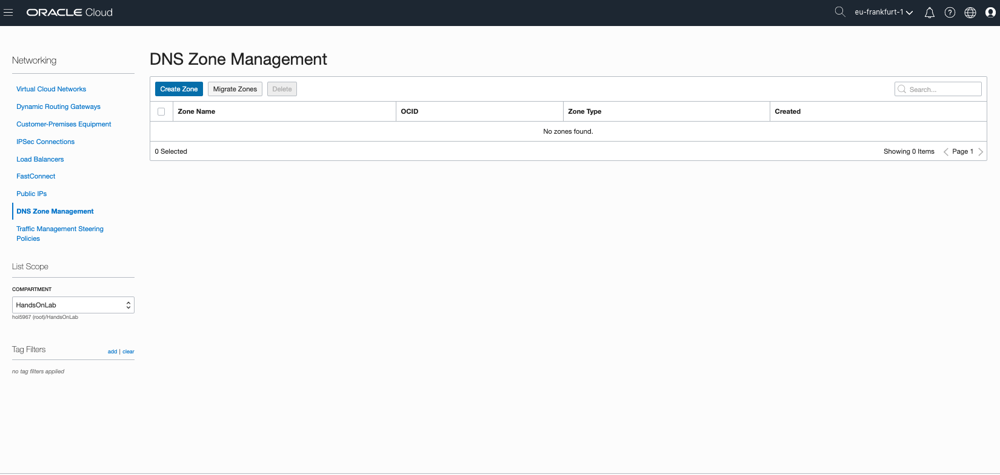

And create a Manual Zone of type Primary named for example hol5967 and your username.com:
```
hol5967-carlos.j.olivares.com
```
Then click in Submit button:


You have to create a second DNS zone with same parameters but named like previous one prefixed with front-:
```
front-hol5967-carlos.j.olivares.com
```
You should have a DNS Zone Management like this:


Now let’s go back to DevCS instance and let’s configure Build Jobs and Git:

## Configuring Builds

In this project we have three types of builds, one for Fn Function (Serverless) deployment, other 4 for docker build jobs and finally 4
others for OKE build jobs that will deploy previously generated docker images in OKE cluster.

### Fn Function Jobs modification

In DevCs interface, Click in Build Menu option, then select the Job named fn\_discount\_to\_FaaS\_CK. Then click in Configure button(right side of screen):


The screen will appear and will take you to Software tab where you have to select a Software template. Make sure you select
Vm\_basic\_Template\_FN so that Fn function build process will work:

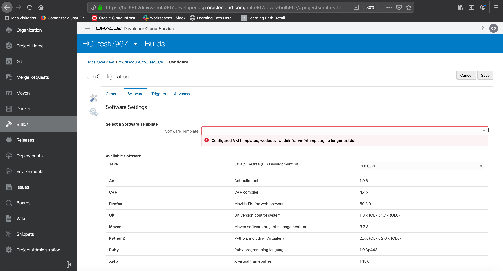

Now click in , then in Git tab and make sure that discount-func.git is selected as Repository


Then Select Parameter and add your tenancy parameters:

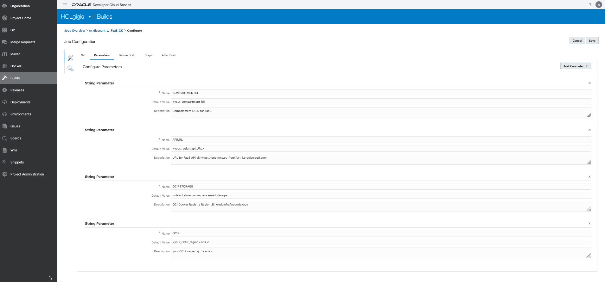

Finally select Steps tab and enter details with my tenancy details:

Remember that for Docker Login you have to enter as user:
```
<object storage namespace>/<OCI tenancy user>
```
And password is:
```
Authtoken for OCI Tenancy user
```
Also for Fn OCI section our Passphrase is empty. This has to be reflected as two single quotation marks: 
```
''
```
Finally check Unix Shell and modify it accordingly with your tenancy details:

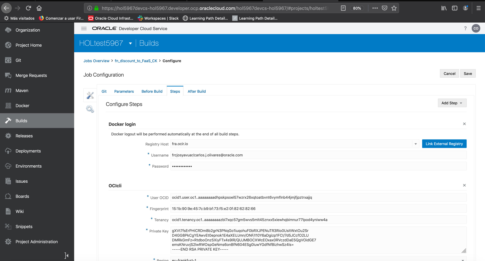


Please don’t forget to click Save button.

### Docker Jobs modification

Now let’s change the 4 Docker Jobs. Go back to Builds menu and select the Job named:

front\_order\_docker\_create

Then click in Configure Button:

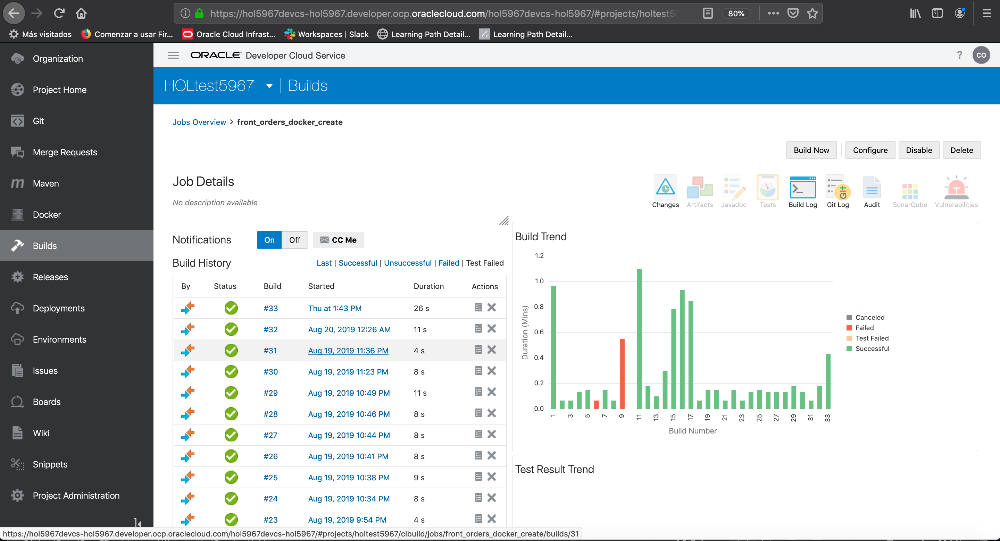

The screen will appear and will take you to Software tab where you have to select a Software template. Make sure you select Vm\_basic\_Template so that microservices and docker build process will work:

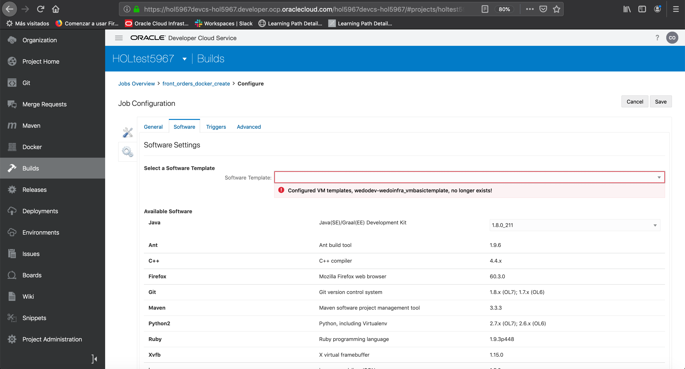

Now click in , then in Git tab and make sure that gigis-order-front.git is selected as Repository

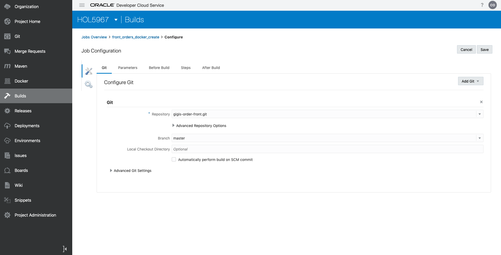

Then select Steps tab and enter details with my tenancy details: 
From:

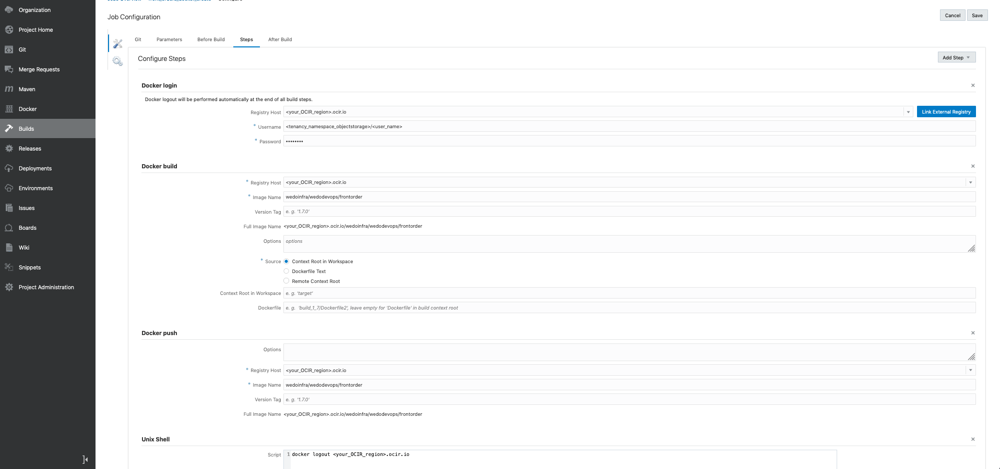

To your tenancy details: 
To check the name of your region identifier go to the table in this url:

<https://docs.cloud.oracle.com/iaas/Content/General/Concepts/regions.htm>

Remember that for Docker Login you have to enter as user:
```
<object storage namespace>/<OCI tenancy user>
```
And password is: 
```
Authtoken for OCI Tenancy user
```
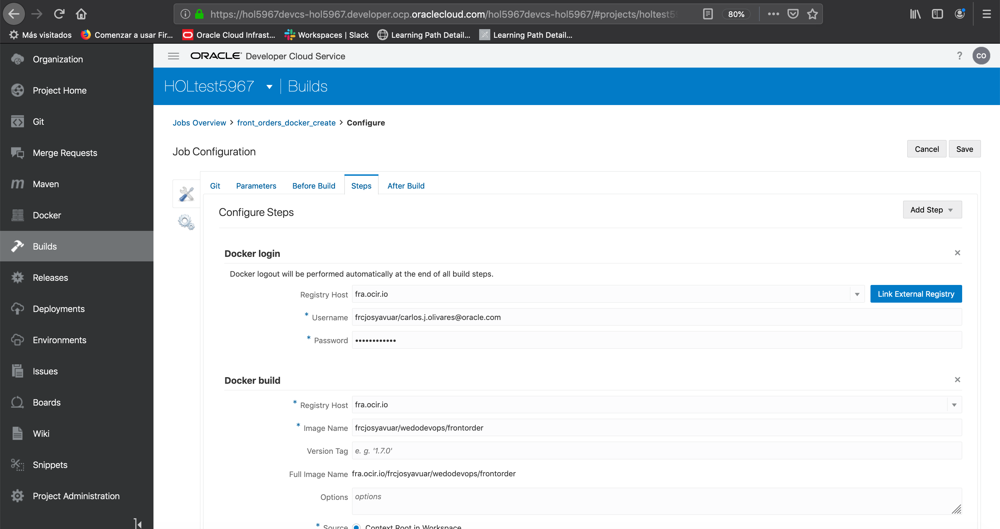

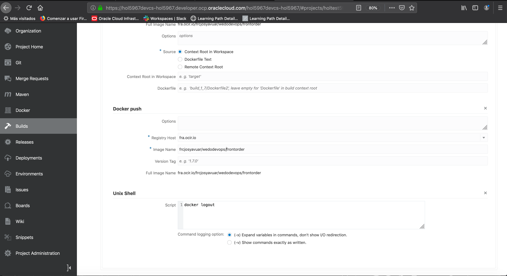

And Click Save Button
Important Note: change the three other docker Jobs in the same way:
```
  - ms_orchestrator_docker_create
  - ms_order_docker_create
  - ms_payment_docker_create
```
### OKE Jobs modification

Now let’s change the 4 Docker Jobs. Go back to Builds menu and select the Job named:
```
Front_order_to_OKE
```
Then click in Configure Button:

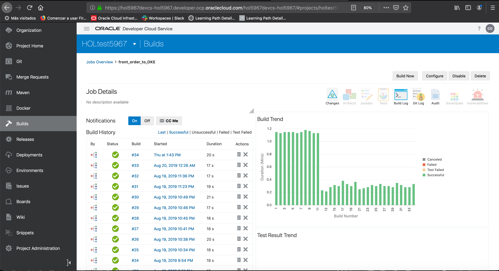

The screen will appear and will take you to Software tab where you have to select a Software template. Make sure you select Vm\_basic\_Template so that microservices and docker build process will work:


Now click in , then in Git tab and make sure that gigis\_order\_front.git is selected as Repository:


Click in Parameters tab and change Parameters from:


Changed to(your tenancy details):

Leave demozone as it is (default)

Important Note: for DNSZONE in this service select value with DNS Zone previously created with front- as prefix. For the three other OKE Jobs to modify later, select the DNS Zone name created without -front prefix.


Click in Steps tab and Change steps from:

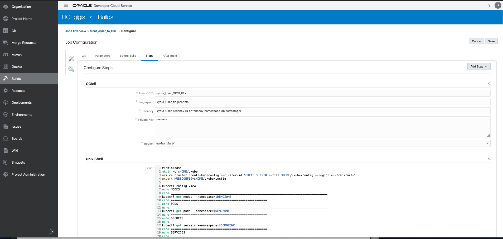

Changed to (your tenancy details):


And Click Save

Important Note: modify the three other docker Jobs in the same way as
previous job:

  - ms\_orchestrator\_to\_OKE    
      - VM Template: VM\_Basic\_Template    
      - Git Repo: microservice\_orchestrator.git

  - ms\_order\_to\_OKE    
      - VM Template: VM\_Basic\_Template    
      - Git Repo: gigis-order-front.git

  - ms\_payment\_to\_OKE:    
      - VM Template: VM\_Basic\_Template    
      - Git Repo: microservice-payment.git

## Configuring Git repositories

Now let’s change the yaml in different GIT repositories to fit with your Tenancy details(review all but db\_management.git, discount-func.git and PizzaDeliveryMobileapp.git).

Let’s get started by selecting microservice\_orchestrator.git:


Select only microservice-orchestrator.yaml (the two other .yaml don’t require to be modified):

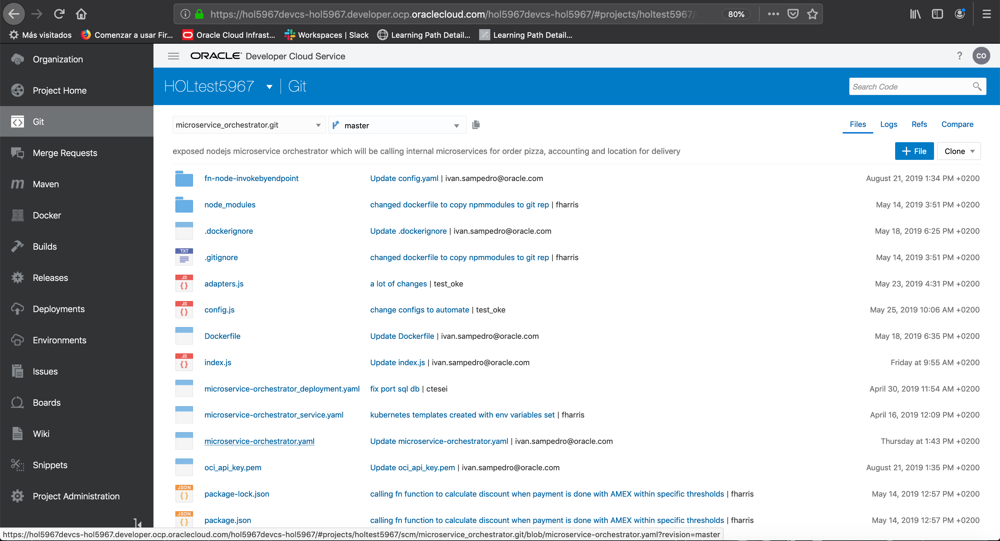

Now change references in yaml from:

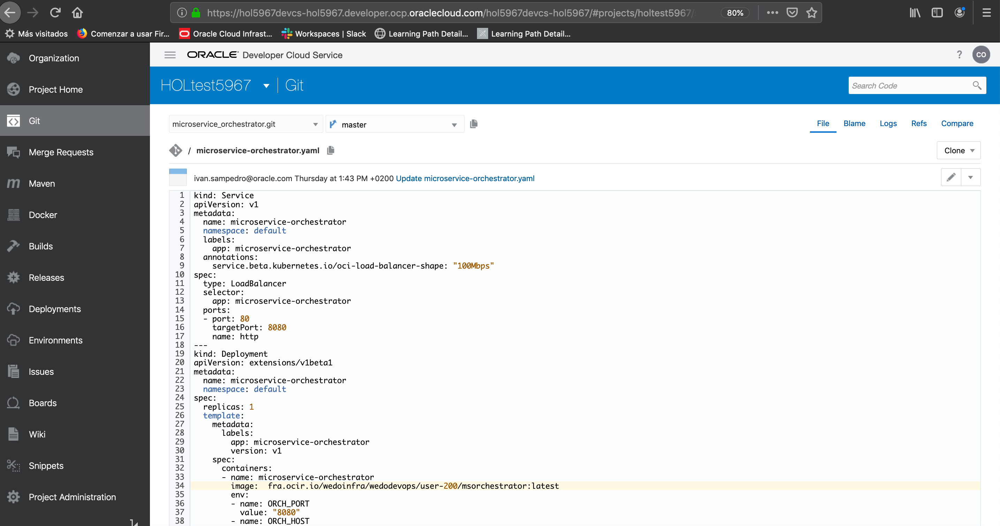

To your tenancy details in line 34 by clicking in edit button . Don’t forget to commit changes:

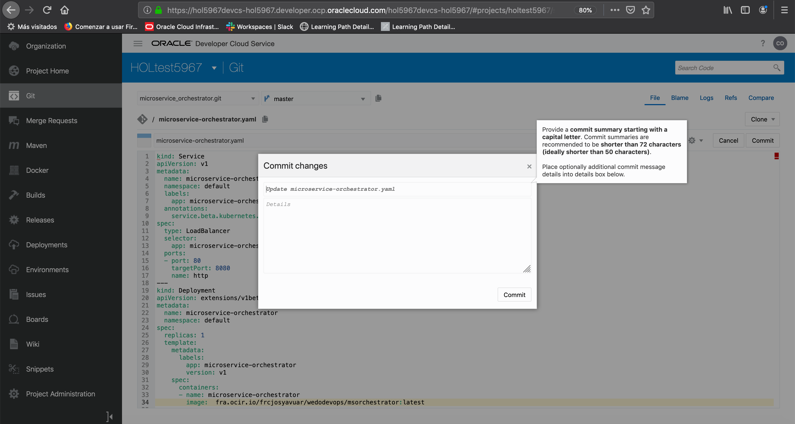

Important Note: modify the three other .yaml files in the same way in each git:


Now it is time to manually launch the build process….but before we have to do a couple of things:

1)  Create the application for the Fn function in OCI
2)  Create a policy so that the Fn fuction Managed Service(FaaS) can manage all the resources in the tenancy

Let’s start creating the application for the Fn function in OCI. Go back to OCI Dashboard console and go to: Developer Services -\> Functions:


There select your compartment:


Click in Create Application button:

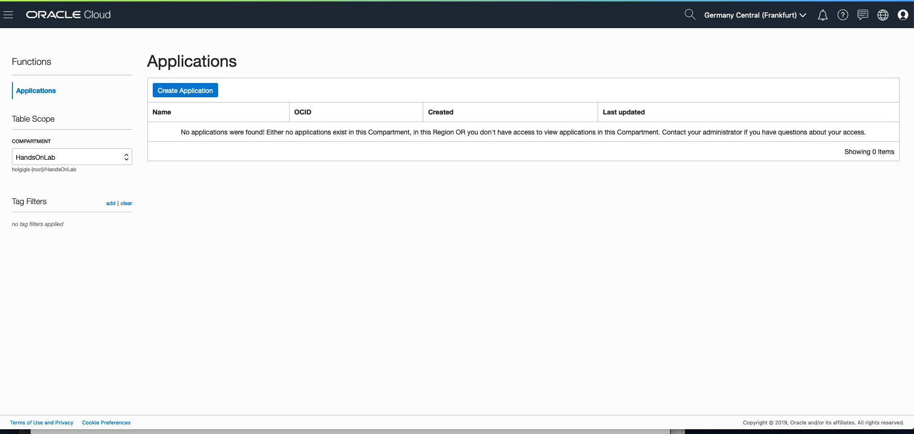

Important Note: So that we don’t have to modify source code, the application name must be: gigis-fn. Also remember to add the three subnets.


And click in create

Now let’s create the policy above mentioned. In OCI Console Menu go to: Identity -\>Policies:

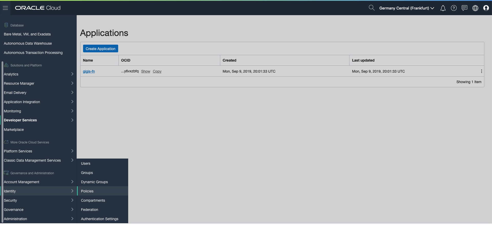

If not selected yet, select root Compartment in List Scope Area and click in Create Policy Button:


Fill in Name: Fn\_Tenancy\_Policy\_Resources add a Description and finally add next Statement:

allow service FaaS to manage all-resources in tenancy


Then click in Create Button.


A new policy is created.

Now let’s run the build process to check if all the changes have been done correctly. Go back to DevCS Dashboard and select Builds menu. There select Pipelines tab:

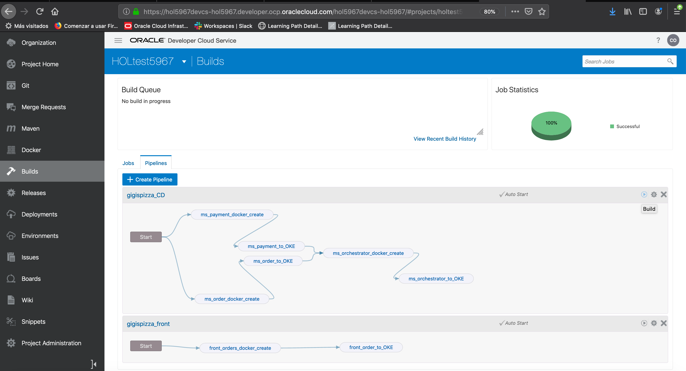

Then in gigispizza\_CD pipeline click in Build button so that build process starts: 


Check parameters are correct and click in Build Now button. Shortly afterwards The build process will start and you will have to wait for executor to start(an executor is one of the VM build servers that you previously configured):


Once an executor is assigned, you will have to check progress:


If job ends successfully you will see an screen like this:

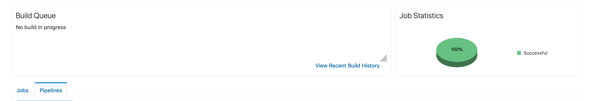

Note: If not successful, Click in View Recent Build History and check what Job failed.

Now let’s launch the second pipeline named gigispizza\_front in the same way, check parameters in popup window and click in Build now button:


If everything goes fine you should see an screen like this:


Finally go back to jobs tab, select the one named fn\_discount\_to\_FaaS\_CK and manually launch the build process for the
Fn Function service by clicking in Build Now button:

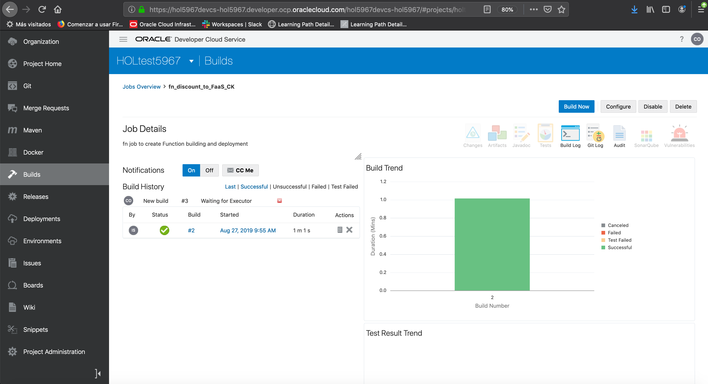

Check that deployment is successful:


# **Testing my implementation**

Now let’s see how to check that our microservices have been correctly deployed first and then, that they are working correctly.

First, come back to VM and if not launch yet, run the Kubernetes proxy program to have access to Kubernetes Dashboard(explained already in section Using Virtualbox and a preconfigured VM image).

Once logged in, navigate to services section and make a note of the two public ip addresses created, one for microservice orchestrator and the other for the front end:


If you open a browser and navigate to front-end url, you should see a page with orders already created:

Note: you may need to install a CORS plugin to avoid issues. We have used Firefox as browser and have installed the “CORS Everywhere” Extension:


If you now navigate to:
```
<microservice_orchestrator public ip>/getAllOrders 
```
you should see all the orders created:


# **Modify the Project to match new feature**

So that we can create a new upgrade feature to be used in Pizza orders, we will modify the frontend to support a new upgrade feature so that we can choose if we want to upgrade an order with a present or not.

To do this we have first to modify the. Frontend index.html feature so that we can see for each order if user has chosed upgrade or not. In next session we will modify a Digital Assistant(Skill in a chatbot) to ask for this upgrade before finish the pizza order. In DevCS go to gigis-order-front.git and open index.html:

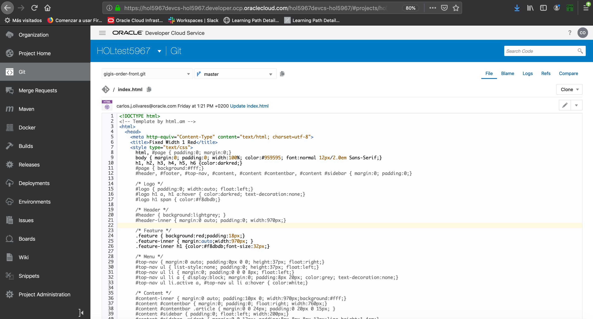

Click edit button to modify it:

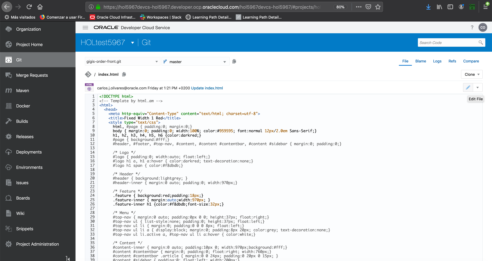

Add after toppings info in **line 206**.
```
"<li>Upgrade Selected: " + currentValue.upgrade + "</li>" +
```
Then commit your changes:


Go back to Builds section and then to pipelines tab and execute the gigispizza front pipeline:


Select Build Now button:


Check that build is successfully executed:


Now go back to gigis-frontend page opened in previous session, you still will see:


Reload the page and now you should see a new field Upgrade Selected appear:


Now I can create a new order using postman.

It has to be a POST request to endpoint:
```
<orchestrator ip>/createOrder
```
Header: 
```
Content-Type: application-json
```
And body of type raw(JSON):
```json
{
 "order": {
   "orderId": "FerInt047",
   "dateTimeOrderTaken": "2002-09-24-06:00",
   "takenByEmployee": "emp001",
   "customer": {
     "customerId": {
       "telephone": "657765412",
       "email": "ivan.smith@myemail.es"
     }
   },
   "pizzaOrdered": {
     "baseType": "dough & tomatoe & cheese",
     "topping1": "Cheese",
     "topping2": "Pepperoni",
     "topping3": "Prawn"
   },
   "totalPrice": "12$"
 },
 "payment": {
   "paymentid": "FerInt047",
   "paymentTime": "01-JUN-2019 12:45 AM",
   "orderId": "FerInt001",
   "paymentMethod": "AMEX",
   "serviceSurvey": "5",
   "totalPaid": "10",
   "customerId": "c345"
 },
 "customerAdress": {
   "street": "Plaza de la Puerta del Sol",
   "number": "s/n",
   "door": "",
   "email": "joe.smith@myemail.es",
   "cityCode": "28013",
   "city": "Madrid"
 }
}
```
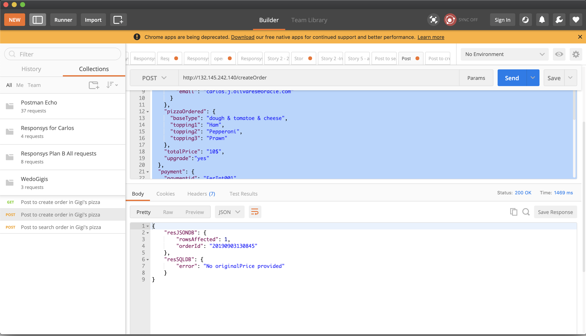

After that check in Orders list that this request with orderId is correctly created and appears in Microservice URL:


You can also use postman to check for instance by searching by your user email (in my case [<span class="underline">carlos.j.olivares@oracle.com</span>](mailto:carlos.j.olivares@oracle.com)) that the order has been correctly created:

It has to be a GET request to endpoint:
```
<orchestrator ip>/getOrder
```
Header: 
```
Content-Type: application-json
```
And body of type raw(JSON):
```json
{"orderId":"","where":[{"cond":{"field":"customer.customerId.email","operator":"LIKE","value":"'carlos.j.olivares@oracle.com'"},"relation":""}]}
```


# **The Cherry on the Cake: Digital Assistant User Interface**

## **Before You Begin**

This part of the hands-on lab is an entry-level exercise for modifying a skill in Oracle Digital Assistant.

## **Background**

Oracle Digital Assistant is an environment for building digital assistants, which are user interfaces driven by artificial intelligence
(AI) that help users accomplish a variety of tasks in natural language conversations. Digital assistants consist of one or more skills, which are individual chatbots that are focused on specific types of tasks.

In this lab, we are going to modify a skill that can be used for interactions with a pizzeria, including ordering. As part of this
process, you will:

  - Modify a conversation flow.
  - Validate, debug, and test your skill.

## **What Do You Need?**

  - Access to Oracle Digital Assistant.

[<span class="underline">http://hol.wedoteam.io:9990/botsui</span>](http://hol.wedoteam.io:9990/botsui)

  - A basic knowledge about Oracle Digital Assistant. If it’s the first time that you use it, please read carefully each step with this
    format
    
*Oracle Digital Assistant is a platform that allows enterprises to create and deploy digital assistants for their users.*

## Clone a Skill

In this lab, we're starting from an existing one. So, the first thing you'll do is clone an existing skill.

1. With the Oracle Digital Assistant UI open in your browser, click  to open the side menu.
2. Click Development and select Skills.
3. Click  again to collapse the side menu.
4. Search “HOL\_Microservices”


5. click on the menu


6. Click Clone to open Create clone form.
7. Introduce these values:    
    1.  Display Name: HOL\_XX (where XX is your initials. Example: John Snow Green should use HOL\_JSG)    
    2.  Name: HOL\_XX    
    3.  Check “Open cloned skill bot afterwards”    
    4.  Click “Clone” button

## Create Intents

*Oracle Digital Assistant's underlying natural language processing (NLP) engine doesn't inherently know about the business or task that skill is supposed to assist with. For the skill to understand what it should react to, you need to define intents and examples (utterances) for how a user would request a specific intent.*

As we don’t have enough time, we will skip this step.

## Modify the Dialog Flow

*The dialog flow is a conversation blueprint that defines interactions users may have with the skill. Each interaction is defined as a state. Each state references a component, which renders a skill response, receives user input, sets and resets variables, resolves user intents, or authenticates users.*

On this case, we are going to modify the existing dialog flow to ask the user to carry out an upgrade of their order, and we will give him a towel.

1. After cloning the skill on step one, you can test that all it’s ok. So, click Train button on the upper right corner.


2. *We provide two models that learn from your corpus: Trainer Ht and Trainer Tm. Each uses a different algorithm to reconcile the user  input against your intents. Trainer Ht uses pattern matching while Trainer Tm a machine learning algorithm which uses word vectors.*
In this case, we are going to use Ht 
Now click on Submit button
 


3. After a few seconds of training, you should receive a message that all it’s ok.


4. *The dialog flow definition is the model for the conversation itself, one that lets you choreograph the interaction between a skill and its users. Oracle Digital Assistant provide a graphical editor (conversation designer) and code editor.*

*Using the Skill Builder (code editor), you define the framework of the user-skill exchange in OBotML, Digital Assistant’s own implementation of YAML. This is a simple markup language, one that lets you describe a dialog both in terms of what your skill says and what it does.*

*You define each bit of dialog and its related operations as a sequence of transitory states, which manage the logic within the dialog flow. To cue the action, each state node within your OBotML definition names a component that provides the functionality needed at that point in the dialog. States are essentially built around the components. They contain component-specific properties and define the transitions to other states that get triggered after the component executes.*
 
Now, click on flows button on the left side.
 


5. Now we are going to include a new state to ask the customer if they want an upgrade and a free towel. Go to line 12 and declare a new “upgrade” variable to collect the customer’s answer. Keep in mind that editor provide the autosaving feature, don’t look for a Save button ;-)


6. Include a new state to ask about the upgrade to the customer. *Components give your skill its actual functionality. The state nodes in your dialog flow definition are built around them. These reusable units of work perform all manner of tasks and functions, from the basic management of the dialog flow to case-specific actions*

*Every state in your dialog flow names a component that performs an action, such as accepting user input, verifying that input, or responding with text. Each component has a specified set of properties that you can use to pass and receive values as well as control the component's behavior. For example, the following state uses the System.List component to display a list of values that the user can choose from.*

*There are two types of components that you can use in a dialog flow – built-in components and custom components. When the Dialog Engine enters a state in the dialog flow, it assesses the component. When it encounters one of the built-in components (noted by System.), it executes one of the generic tasks, such as display a message or prompt the user to enter text. When the Dialog Engine discovers a custom component, however, it calls the component's service, which hosts one or more custom components.*

Now, click on Components button.
 


7. On the components window, choose “User interface”


8.Now choose “Text”, after that on the value list select “confirmation” to insert the System.Text component after
    > “confirmation” status and click on Apply 
    

 
*The System.Text component enables your bot to set a context or user variable by asking the user to enter some text.*

*When the Dialog Engine enters a System.Text state for the first time, it prompts the user to enter some text. When the user enters a value, the Dialog Engine returns to this state. The component processes the user response and if it can convert the user input to the variable type, it stores the value in the variable. The Dialog Engine moves on to another state when this variable has a value.*

9. So, you can check that the new state has been included in the flow.


10. Rename “text” to “askUpgrade” as the state name. Fill in the blanks:
    
    1.  Prompt: "Do you want a 2-liter soda bottle for $1 and a free towel?"    
    2.  variable: upgrade    
    3.  Delete the following property "nlpResultVariable"    
    4.  maxPrompts: 3 (to ask 3 times about the upgrade. If you answer something different to yes or no three times, the component will execute “cancel” action.)    
    5.  translate: false    
    6.  Update transition actions so that it looks like the following:

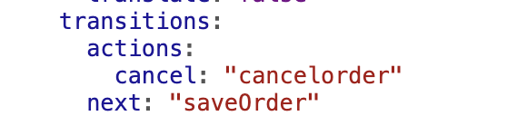

11. Move to the prior state named “confirmation” and change transition “next” value from “saveOrder” to “askUpgrade” to make the flow execute our new state. Result:


12. To check that your new code it’s okay, click on Validate button.


13. If all it’s okay, you will see this message:


14. If you have received this alert, review all the steps again and keep in mind that all indentations are very important


### Troubleshooting Errors in the Dialog Flow

If you don't see a success message, then most likely you misspelled a property name or did not follow the required two-space indenting
increments. In this case, scroll through the dialog flow until you see an  icon in the left margin. Mouse over the icon to display the tooltip with a description of the problem.

Besides, you can click the debug icon (), which appears to the left of the dialog flow editor. It often provides additional information about the reason. You close the debug window by clicking the debug icon again.

If you have gotten into a jam and can’t get anything to work, open the [<span class="underline">flow.txt</span>](https://docs.oracle.com/en/cloud/paas/digital-assistant/tutorial-skill/files/your-first-dialog-flow.txt), and replace the content in your dialog flow with the content from the file.

**Orders against our microservices**

Currently, our orders are being stored on a shared database. Now, we will modify the flow to point to our database.

*Most skills need to integrate with data from remote systems. For example, your skill might need to get a list of products or save order information. You use custom components to integrate a skill with a backend. Another use is to perform complex logic that you can't accomplish using FreeMarker. We are providing the custom components that carry out this actions.*

Look for state “saveOrder”


  - Change component name from devops.saveOrder to devops.saveOrderUpgrade
  - Change demozone value to yours. This value must be configured to the IP address of the microservice previously used and path to Creation order endpoint named: /createOrder. For example:

  - Include a new property named: upgrade with the variable you create to store the upgrade question "${upgrade.value.yesno}"
  - Also Include another property named email with the value of your email address so that this will be used as the email address that
    will appear in the order. For example: 
    
email: "carlos.j.olivares@oracle.com"

The final result looks like this:


**Test Your Skill**

Now that all of the skill's pieces are in place let's test its behavior.

1. Open the skill tester by clicking  on the bottom of the skill's left navigation bar.
2. Click Reset.
3. In the Message field, type I want to order a pizza and then press Enter.

All kind of pizza will be shown (choose one)
 
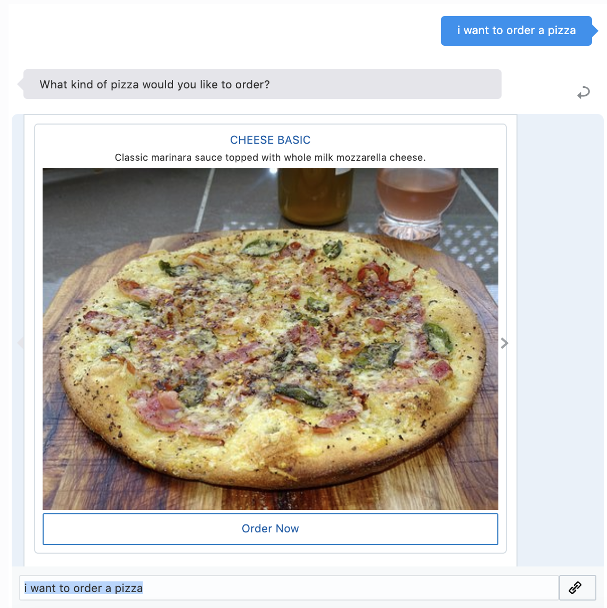
 
You should see a menu of pizza sizes:
 
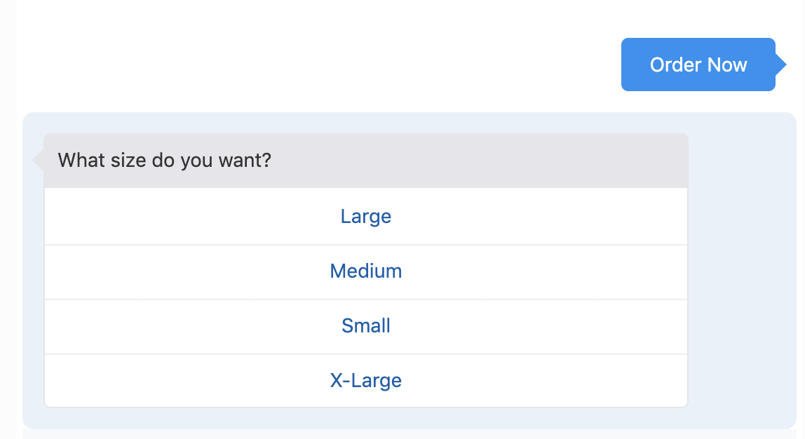

4. In the pizza size menu, select an option, e.g. Small.
5. Select a topping e.g. 1 2 4 (Mushrooms, BBQ Sauce, Tuna)

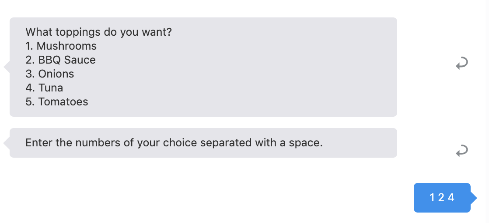

6. Enter a delivery location

You should receive an order confirmation similar to the one shown in the image below. Please click on Send Location 


7. Immediately you will be asked about payment method

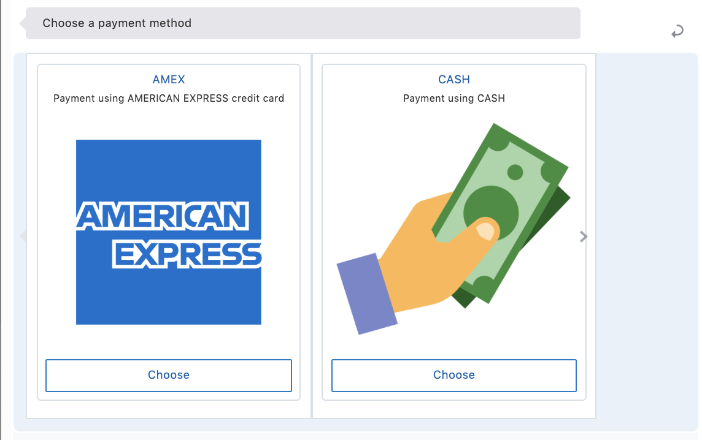

8. To end, our digital assistant will make a summary and ask about our upgrade.

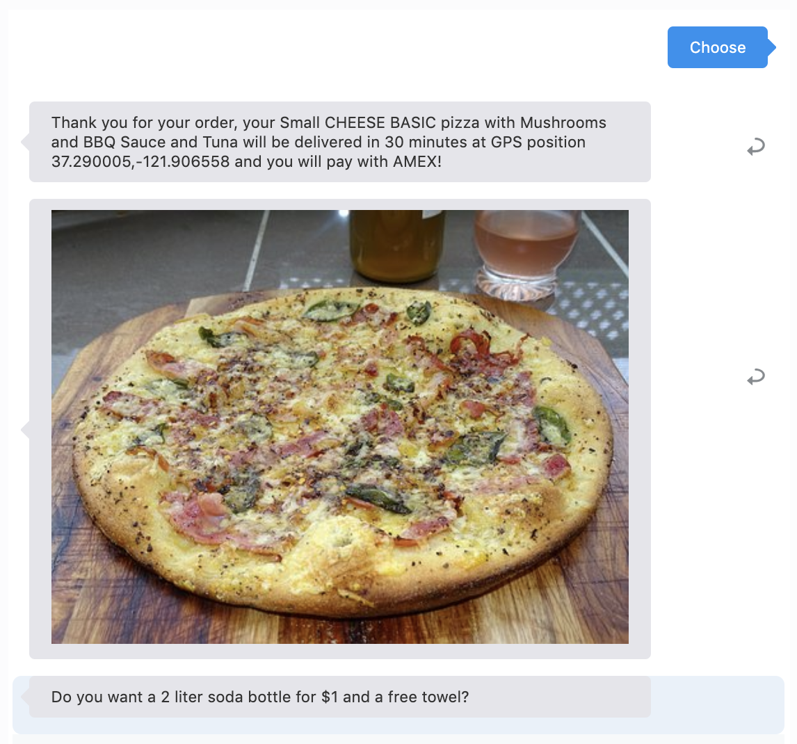

9. Due to we have defined a YES\_NO variable, it only accepts "YES" or "NO" values. Other "YES" or "NO" synonyms are also recognized, such as "YEAH", "NOPE".


10. > Now, we type Yes to finish the order.


11. Click **Reset**. To clean conversation screen an reset all the variables.
12. Now try entering I want a large cheese basic pizza with mushrooms, tuna, and tomatoes paying with cash and pressing Enter.

This time, you should be immediately presented with the results of the order after asking about the location.


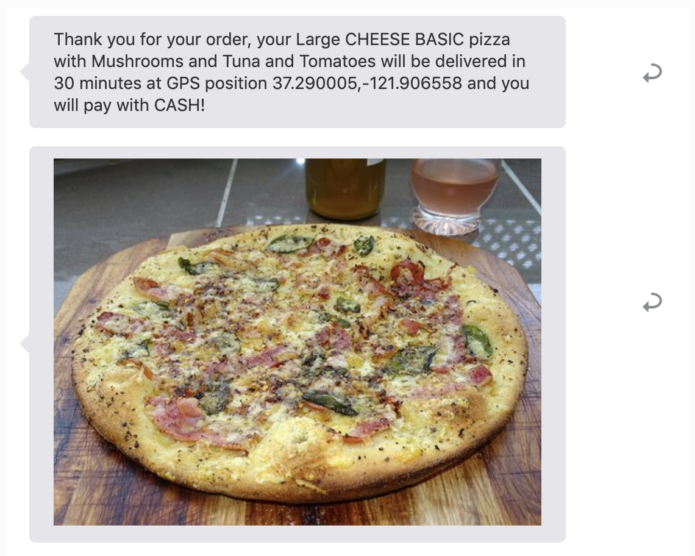


**Want to Learn More?**
- [<span class="underline">Using Oracle Digital Assistant</span>](http://www.oracle.com/pls/topic/lookup?ctx=en/cloud/paas/digital-assistant&id=DACUA-GUID-386AB33B-C131-4A0A-9138-6732AE841BD8)
