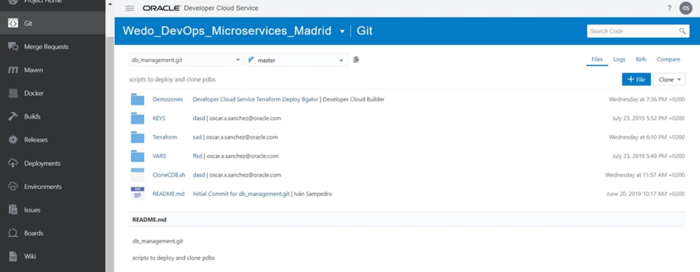
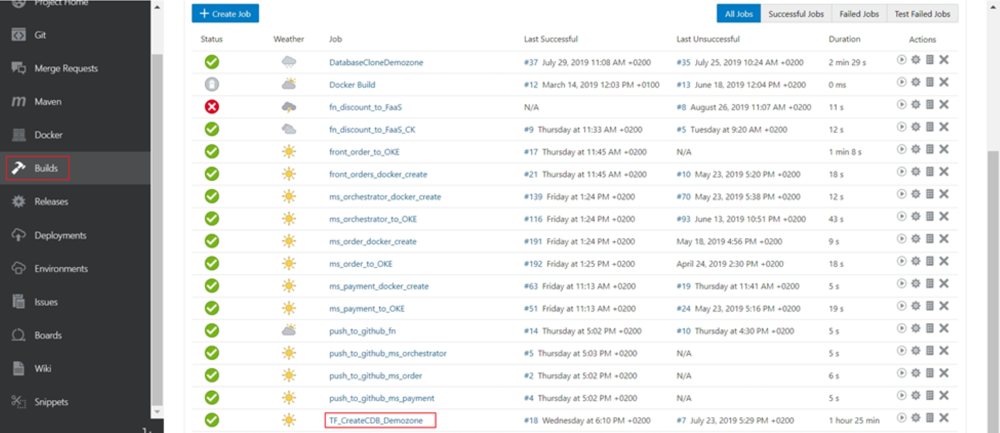
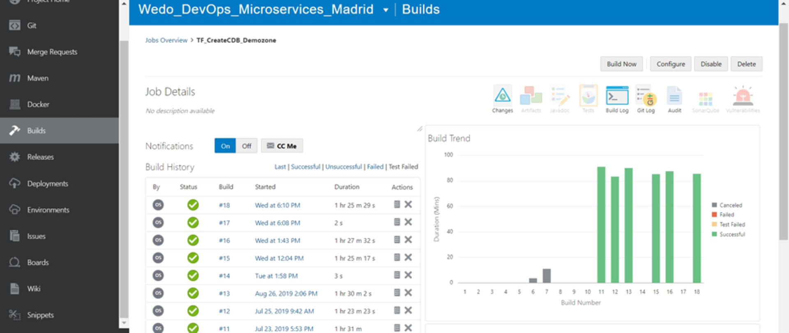
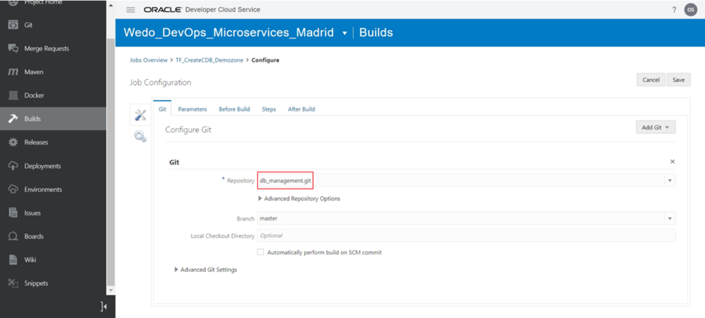
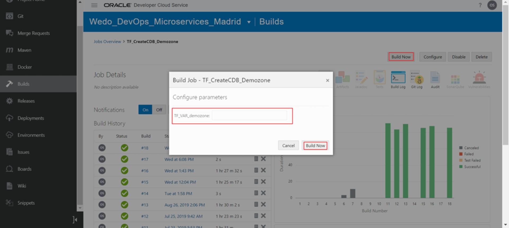
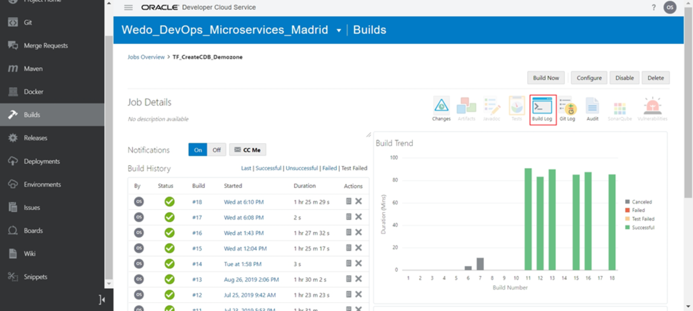

# Cloning Gigi's pizza multitenant & multimodal database.
## Data Management Architecture Deployment
We use Terraform scripts that create the Oracle Container database to Store the different PDBs. In this case the JSON PDB and SQL PDB are in the Container created and the Spatial Database is a read only Database outside the container and accessible from all DemoZones.
To clone JSON and SQL Databases, there is a job executed from Developer Cloud service that executes a Terraform script stored into a GIT Repository. 

If we go in developer Cloud Service to the Builds section, we can see the Job.

Click on the name of the job to see the info related, configure or execute it

In order to understand the job, we can click on configure and go through the steps configured in this job.
The first screen we can see is the Git repository selection, in which we already have selected db_datamanagement.git, which is the repository that contains the terraform scripts to clone the DB environment.

If we go to the steps tab, we can see in configure steps, that the job calls a .sh script called CloneCDB.sh, This script will launch the terraform script.

If we go back to the Git repository and look into the CloneCDB.sh script, we can see that it executes the Terraform script and save the terraform state.

Feel free to investigate the terraform scripts executed and also the other scripts used for the replication of the environment.
To execute the job, go to Builds and click on the TF_CreateCDB_Demozone job. Then click on build now. A prompt screen will appear asking the Demo Zone. This name will be used to create the DBCS that will contain the new PDBs. 

**Try to put a name shorter that 8 Characters to avoid errors in the name’s length of the DB.**

After this, the new Demo Zone will be created, you can check the status of the execution by clicking on the log of the execution

At the end of the execution, you should see the job executed SUCCESSFULLY.  It will also show the IP of the new CDB host so you can connect to it.
The Services for the new PDBs created have the same name, only the new IP changes from the original.
