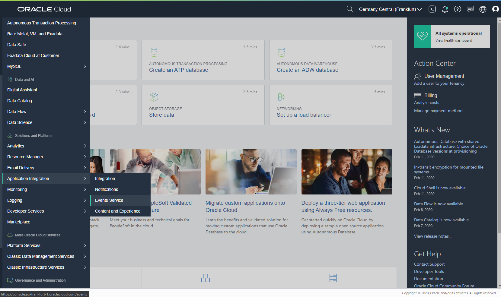
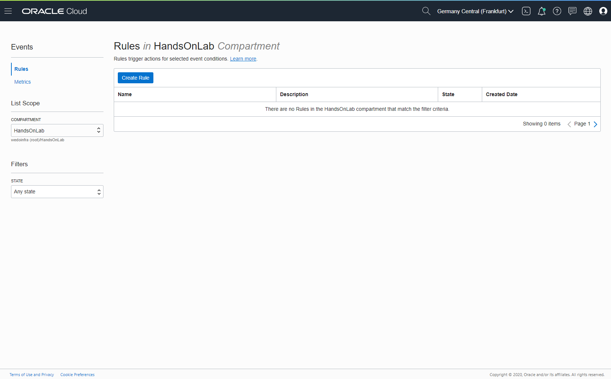
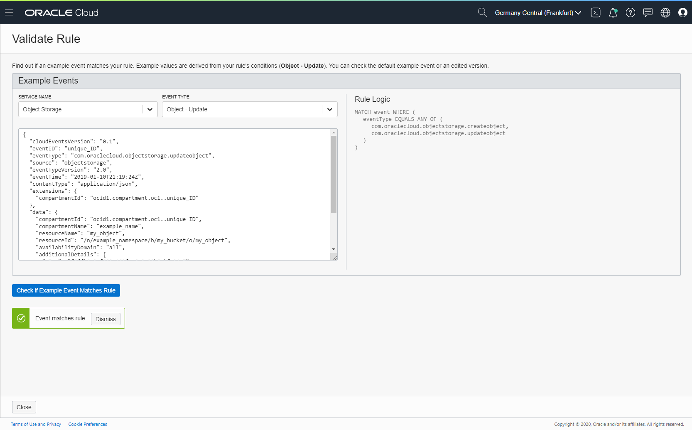
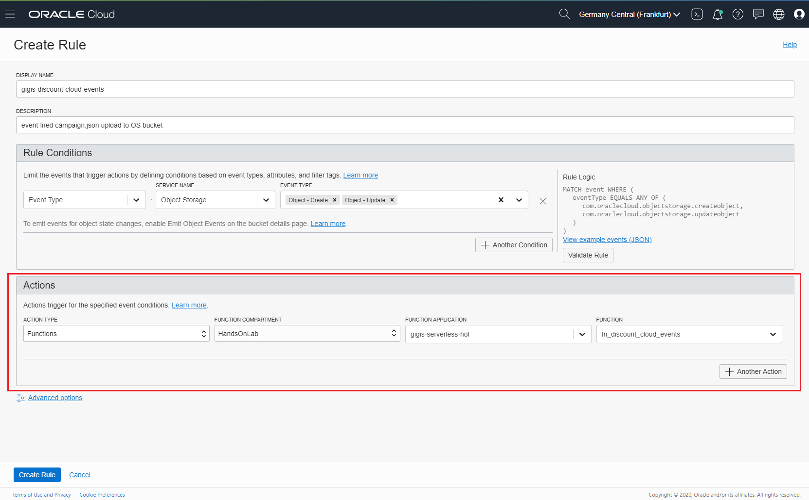
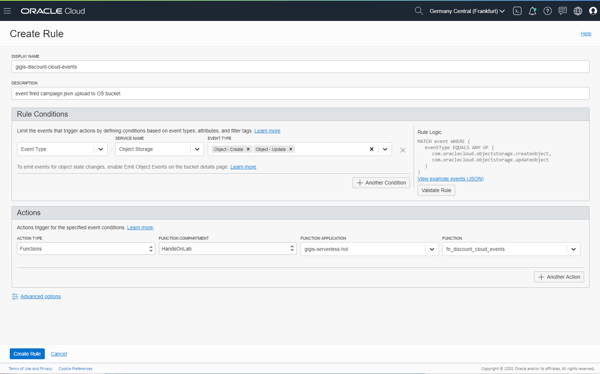
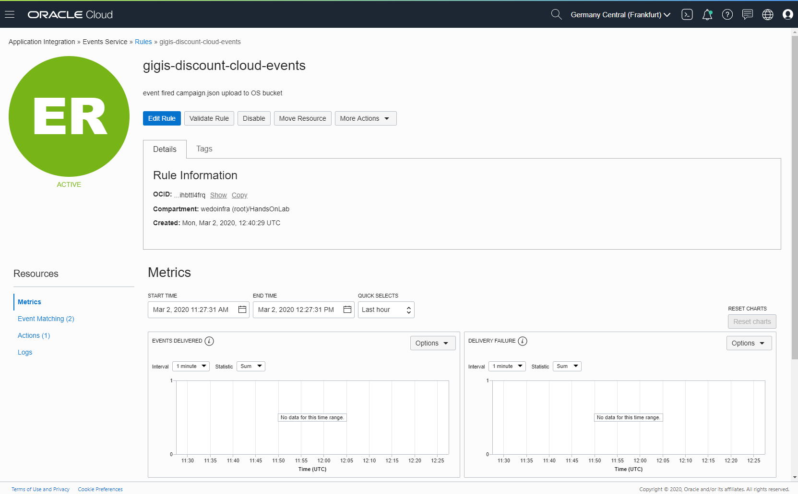

# Event Service - Cloud Event Creation
After Object Storage Bucket configuration (and **fn_discount_cloud_events** function creation), you must create the event  that will be fired when a new file will be uploaded (or rewriting an existing file) to the bucket.

Next Create a new rule clicking Create Rule Button.

Write a rule name like [gigis-discount-cloud-events] and a description. 
Then Select Service Name [Object Storage]. 
Next Event Type [Object-Create] and [Object-Update]

You could test  your event clicking in Validate Rule button. Review the cloud event generated json object and click in Check if Example Event Matches Rule button. Click Close to return previous menu.

In Actions, select Action Type [Functions]
Function Compartment select your compartment [HandsOnLab]
Function Application select your serverless app [gigis-serverless-hol]
Function select [fn_discount_cloud_events]

Finally click Create Rule button to create the new rule.

You can review your new rule in main Events Service > Rules menu. You could see Event Matching (2) and Actions (1) and when you upload a campaign.json file to the bucket, you could review the Logs section of the Rule.

# Continue with HOL

* Continue with the last fn serverles function [fn_discount_campaign](https://github.com/oraclespainpresales/GigisPizzaHOL/blob/master/serverless/fn_pizza_discount_campaign.md)
* Or return to the [main HOL manual](https://github.com/oraclespainpresales/GigisPizzaHOL/blob/master/serverless/gigis-serverless-HOL.md)
