# Function fn discount campaign With pooled connections
This serverless function access **ATP DB** with **JDBC UCP driver** and get information about current and enabled discount campaigns. Whether the current pizza order has a discount campaign available, based on the dates, method of payment and pizza price then this function will response with the new pizza order price, applying the discount to the original pizza price. 

In this function you will use pooled connections with UCP jdbc driver instead of a DB direct jdbc connection. DB wallet should be downloaded locally and unzipped in an OCI private Object Storage Bucket (keeping the appropiate policy access to FaaS service to access the private bucket), after that you could create a method to upload these wallet files to your container. You will do almost the same but unzipping the wallet.zip in the docker image creation (the code is in the Dockerfile).

If you do the optional Developer Cloud Service part of the lab, you will create a CI/CD pipeline with the same procedure but without download wallet.zip locally or using a private object storage bucket and the addional download method (this method should be quite similar to the **fn_pizza_discount_cloud_events**) to read the file from the bucket.

Table of Contents:
1. [fn discount campaign IDE preparation](#fn-discount-campaign-ide-preparation)
2. [fn discount campaign java code](#fn-discount-campaign-java-code)
3. [Changing func.yaml file](#changing-funcyaml-file)
4. [Overwriting pom.xml file](#overwriting-pomxml-file)
5. [Creating OCI config and oci_api_key.pem files](#creating-oci-config-and-oci_api_keypem-files)
6. [Creating Multi Stage Dockerfile](#creating-multi-stage-dockerfile)
7. [Copy necessary .libs and .so files](#copy-necessary-libs-and-so-files)
8. [Deploy fn discount campaign function](#deploy-fn-discount-campaign-function)
9. [Code recap (OPTIONAL)](#code-recap-optional)
10. [Continue the HOL](#continue-the-hol)

Verify that your cloud_events function has 2 files (func.yaml and pom.xml) and a **src** directory.

```sh 
cd fn_discount_campaign_pool

ls -la
```

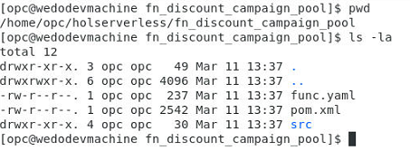

The serverless function should be created at ```src/main/java/com/example/fn/HelloFunction.java``` and you can review the example code with and your IDE or text editor. This file will be change in the next section.

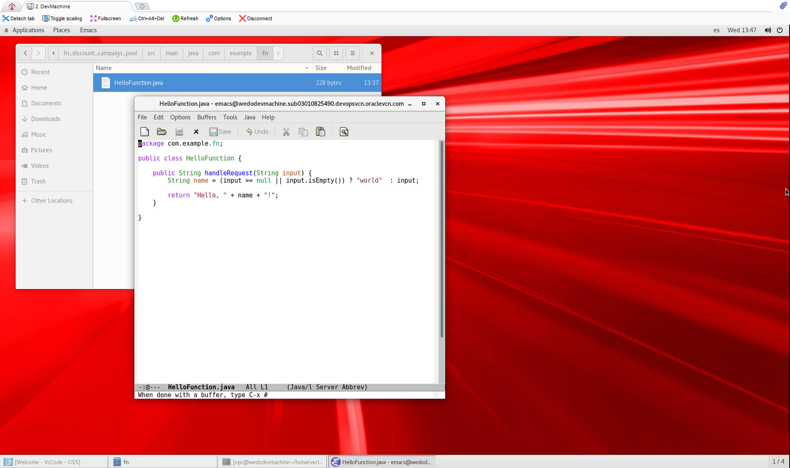

A Junit textfile should be created at ```src/test/java/com/example/fn/HelloFunctionTest.java``` and used to test the serverless function before deploy it in OCI FaaS. We won't use Junit testing in this lab, but you could add some testing Junit file to your serverles function if you want.

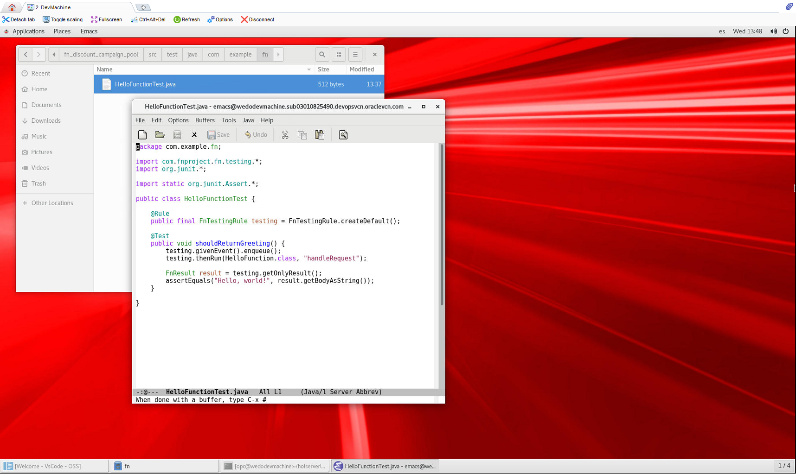

## fn discount campaign IDE preparation
You could deploy this new serverless function in your FaaS environment, but the idea is to change the example code by the real function code. You can use a text editor or you favourite IDE software. In this lab we used Visual Studio Code (from the developer machine imagen in OCI marketplace), so all images was captured with that IDE, but you can use what you want.

Open Visual Studio Code (Applications -> Accessories in the development VM) or your favourite IDE 

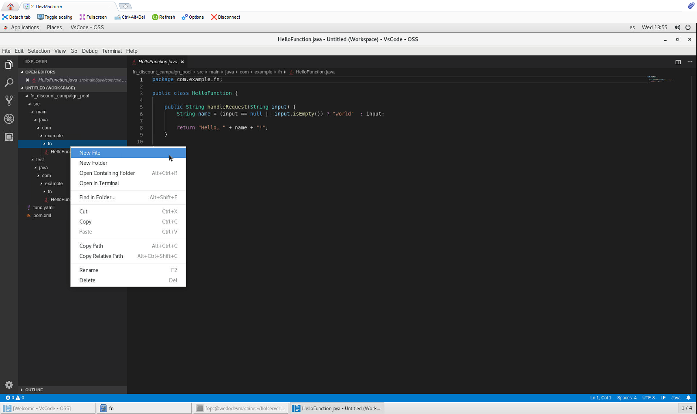

Select **add workspace folder ...** in the Start Menu.

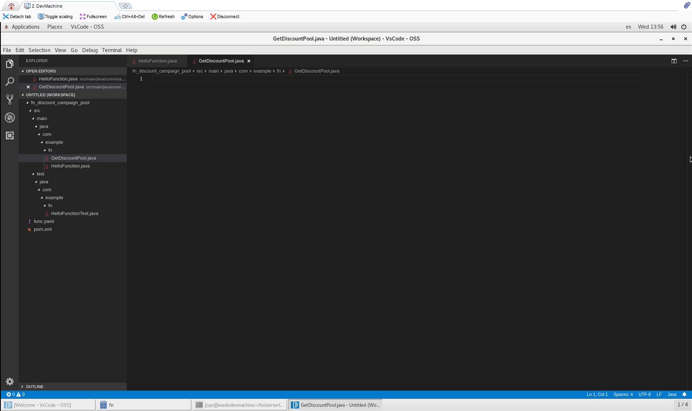

Click in HOME directory and next select the appropiate path to your function project directory [opc/holserverless/fn_discount_campaign_pool]. Then click Add button to create a workspace from this directory in Visual Studio Core.

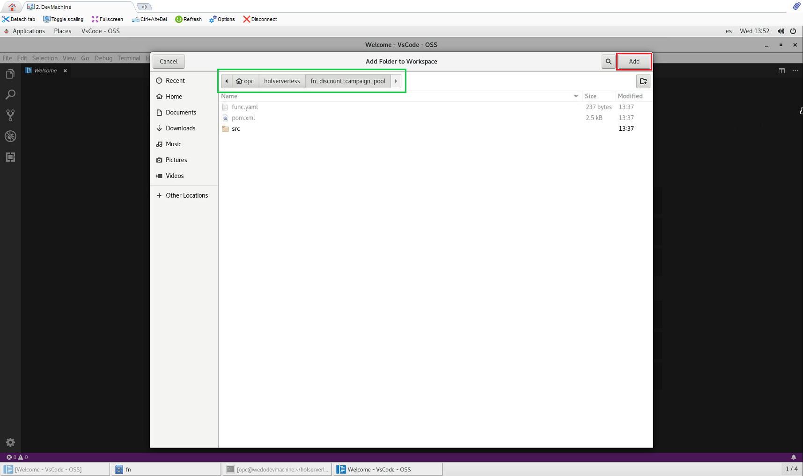

A new project will be available as workspace in the IDE

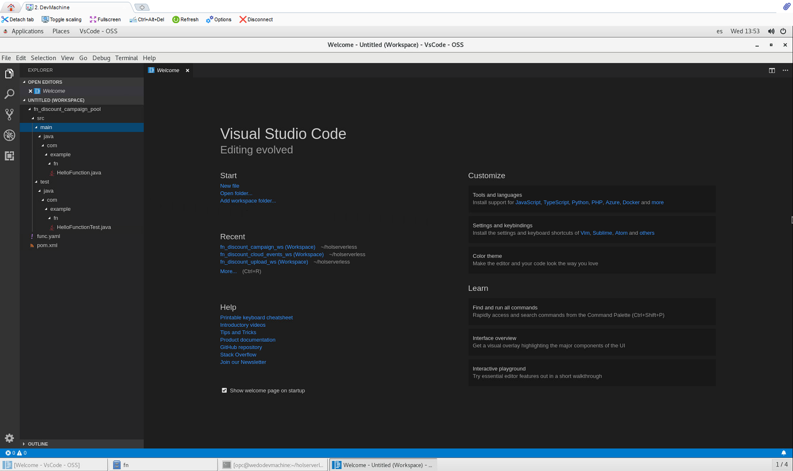

You can click in **HelloFunction.java** to review your serverless function code. Same for **HelloFunctionTest.java** file.

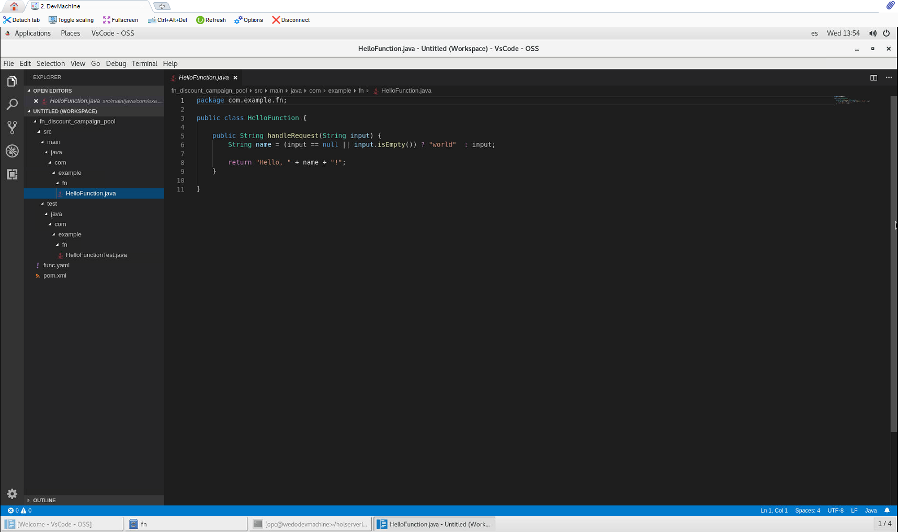

### fn discount campaign java code
The function code is in the next github [repository](https://github.com/oraclespainpresales/fn_pizza_discount_campaign_pool). You can open it in other web brower tab (```CRTL + mouse click```, to review the project.

You can access java code to copy and paste it in your develpment machine IDE project. You could clone this github repository if you want, instead of copy and paste the different files. You can learn how to clone the git repo in this [section](clone-git project to IDE).

For educational purposes you will change the code created before with ```fn init``` command instead of clone the git repo, but you could use that method to replicate the entire function project.

You can copy the java function code creating a new file with the function name, in the fn directory or overwriting the existing code inside the **[HelloFunction.java]** function and next rename it (F2 key or right mouse button and Rename). We show you both methods in the next sections, please choose one of them.

#### Creating new file
Create new file in ```/src/main/java/com/example/fn``` directory. Right mouse button and then New File.


Then set the same name as java class **[GetDiscountPool.java]**


Now copy raw function code and paste it from the [java function code](https://raw.githubusercontent.com/oraclespainpresales/fn_pizza_discount_campaign_pool/master/src/main/java/com/example/fn/GetDiscountPool.java).

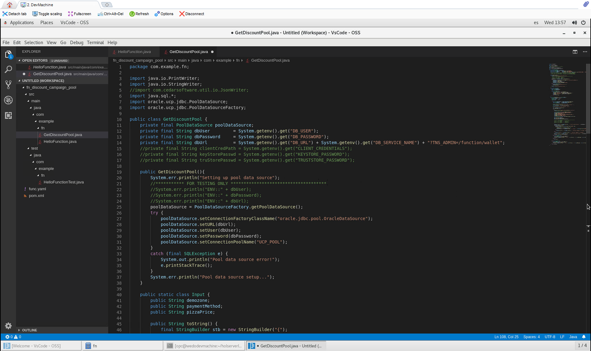

Delete HelloFunction.java and HelloFunctionTest.java from your IDE project.

#### Overwriting HelloFunction.java
You can overwrite the HelloFunction.java code with the GetDiscount Function code.

Select the raw [java function code](https://raw.githubusercontent.com/oraclespainpresales/fn_pizza_discount_campaign_pool/master/src/main/java/com/example/fn/GetDiscountPool.java) from the repository and paste it overwriting the HelloFunction.java Function.


Click right mouse button in the HelloFunction.java file to Rename the file. You can press F2 key to rename the HelloFunction.java file as a shortcut.

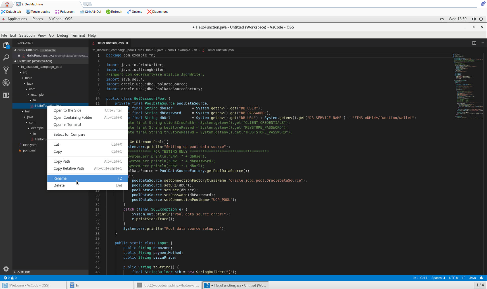

Change the name of the java file to **[GetDiscountPool.java]**.

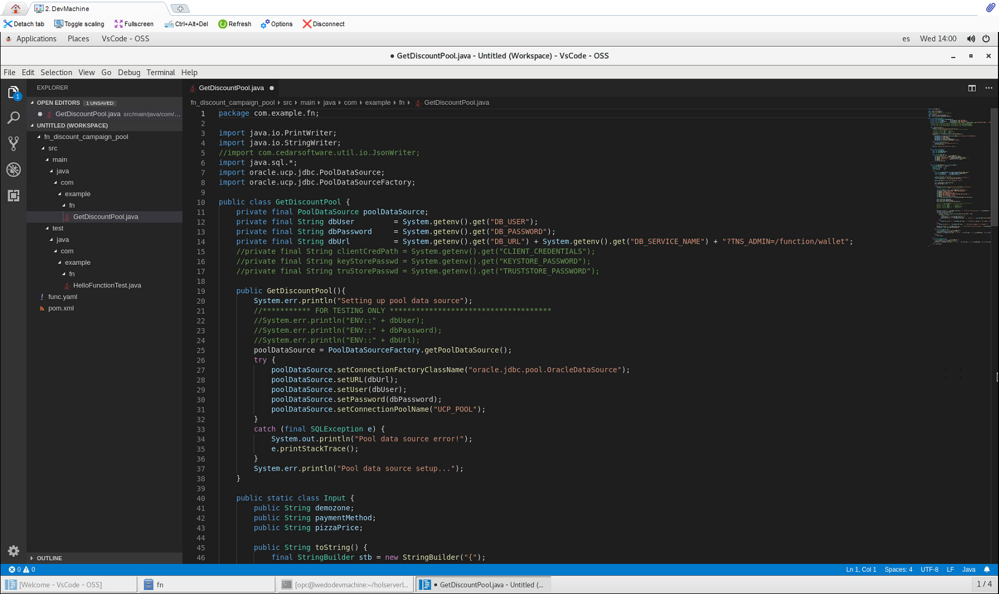

You can delete the HelloFunctionTest.java file (and the test directory tree) or rename it and change the code to create your JUnit tests. In this lab we won't create JUnit test.


You should have the java function code, the func.yaml and pom.xml files in your project directory right now.

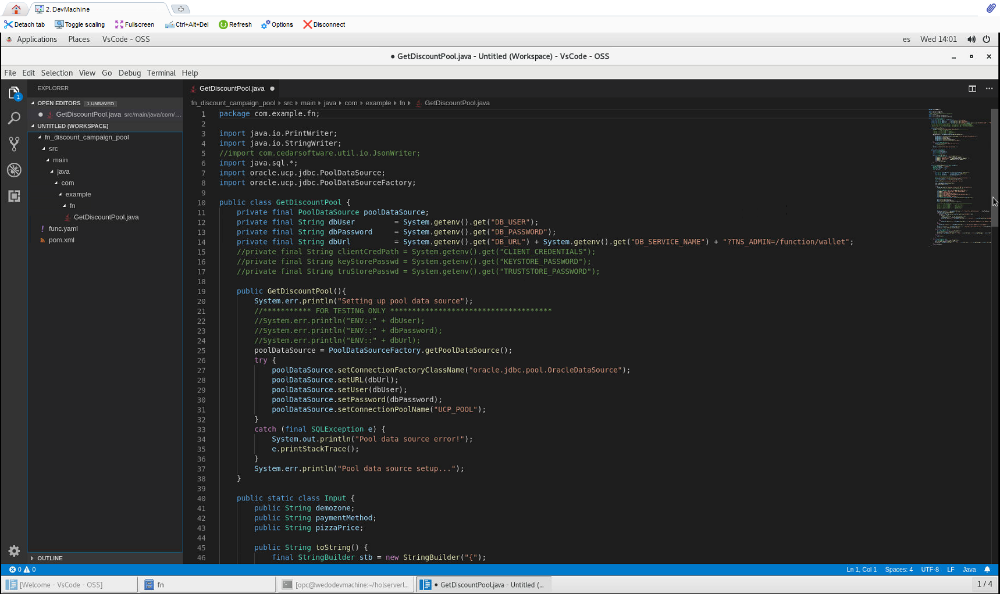

## Changing func.yaml file
You have to delete several files in the func.yaml code to create your custom Docker multi stage file. In you IDE select func.yaml file and delete next lines:
```
runtime: java
build_image: fnproject/fn-java-fdk-build:jdk11-1.0.107
run_image: fnproject/fn-java-fdk:jre11-1.0.107
cmd: com.example.fn.HelloFunction::handleRequest
```
Next add this two lines to configure your function with 512 or 1024 MB of memory and 120 seconds of timeout.
```yaml
memory: 512
timeout: 120
```


## Overwriting pom.xml file
Next you must overwrite the example maven pom.xml file with the [pom.xml](https://raw.githubusercontent.com/oraclespainpresales/fn_pizza_discount_campaign_pool/master/pom.xml) content of the github function project. Maven is used to import all the dependencies and java classes needed to create your serverless function jar. 

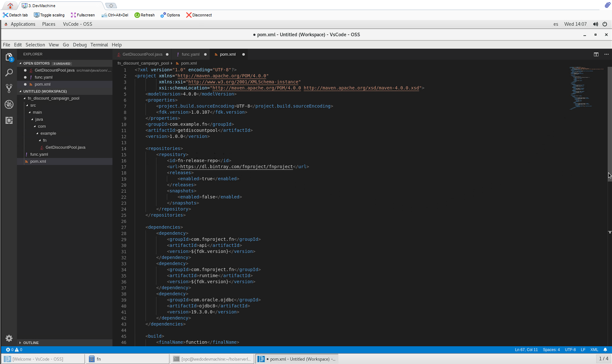

Then click in File -> Save All in your IDE to save the changes.

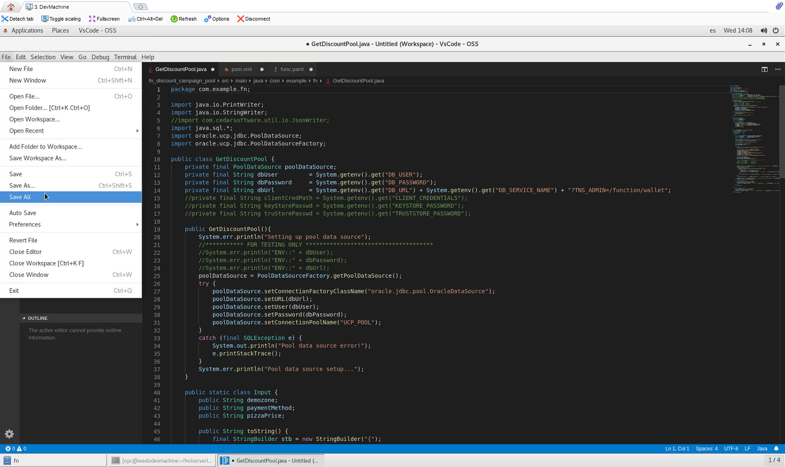

## Creating Multi Stage Dockerfile
You must create a new multi stage docker file, to deploy your serverless function as a docker image in your OCIR repository. This file must be created before deploying the function.

Select fn_discount_cloud_events folder in your IDE and create new file with [Dockerfile] name clicking right mouse button

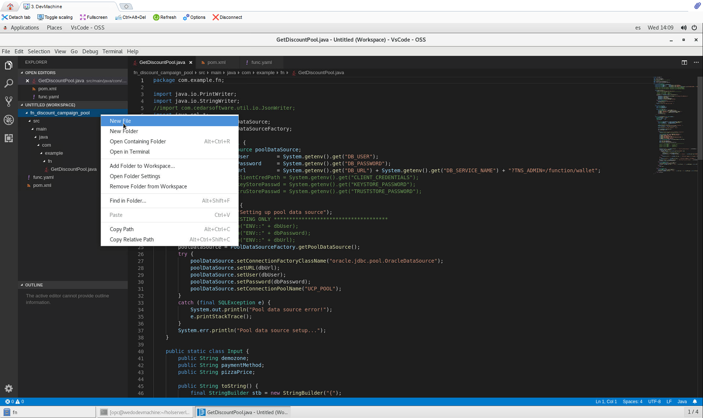

Next copy from raw [Docker file code](https://raw.githubusercontent.com/oraclespainpresales/fn_pizza_discount_campaign_pool/master/Dockerfile) to your new local Dockerfile file.

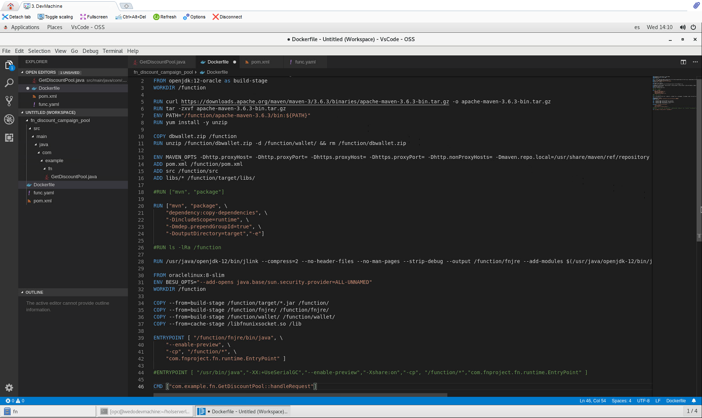

After that, click in File -> Save All in your IDE to save all changes.

## Copy necessary files
To run the serverless function as a docker container you will need to download a dbwallet.zip file (generated when you created the ATP db).

### JDBC drivers and data access libs.
You can use [maven repository web](https://mvnrepository.com/artifact/com.oracle.database.jdbc?sort=newest) look for your apropiate maven repo or library and import to your **pom.xml** project copying from the **maven tab**. Next you could download the lib file from **Files** clicking in **jar**.

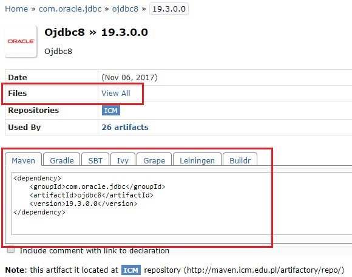

```java
<dependencies>   
    <dependency>
        <groupId>com.oracle.ojdbc</groupId>
        <artifactId>ojdbc8</artifactId>
        <version>19.3.0.0</version>
    </dependency>
</dependencies>
```

### dbwallet.zip file
You have to include dbwallet.zip file in your IDE project. You have several methods to do that.

1. If you downloaded it when you created the ATP db, you can upload or copy to your development manchine root project directory.
   - You can use a SCP conection to your development machine if your using the markerplace one or if you are using mobxterm create a SSH connection.
   
   - Mobaxterm create a **SFTP connection** for you and then you can upload the **dbwallet.zip** file to your **lib** directory.
   
   
   
   - Select your dbwallet.zip or drag & drop in your fn_discount_campaign directory to copy dbwallet.zip file.
   
   
   
2. If you didn't downloaded before, you can generate it going to ATP OCI menu and download and import it now as is described in [ATP section](https://github.com/oraclespainpresales/GigisPizzaHOL/blob/master/gigis-serverless-HOL.md#get-atp-wallet-file).

3. Or you could run an OCI cli command to download it directly to your root project directory. You'll need your ATP OCID value to run this oci cli command from a linux terminal in your development machine.

```sh
cd $HOME/holserverless/fn_discount_campaign_pool

oci db autonomous-data-warehouse generate-wallet --autonomous-data-warehouse-id <your_ATP_OCID_value> --password WalletPassw0rd --file dbwallet.zip
```
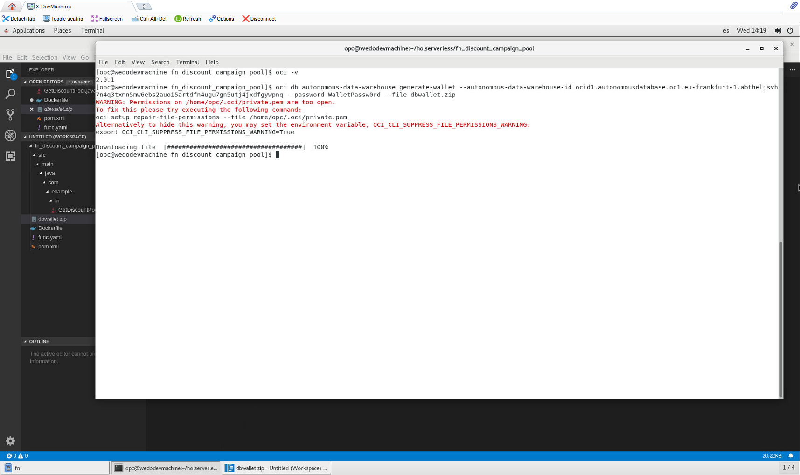

## Deploy fn discount campaign function
To deploy your serverless function please follow next steps, your function will be created in OCI Functions inside your serverles app [gigis-serverless-hol]. 

Open a terminal in your development machine and execute:
```sh
cd $HOME/holserverless/fn_discount_campaign_pool
```
Then you must login in OCIR registry with ```docker login``` command. Introduce your OCI user like ```<namespace>/<user>``` when docker login ask you about username and your previously created **OCI Authtoken** as password.
```sh
docker login fra.ocir.io
```


You must execute next command with ```--verbose``` option to get all the information about the deploy process.
```sh
fn --verbose deploy --app gigis-serverless-hol
```

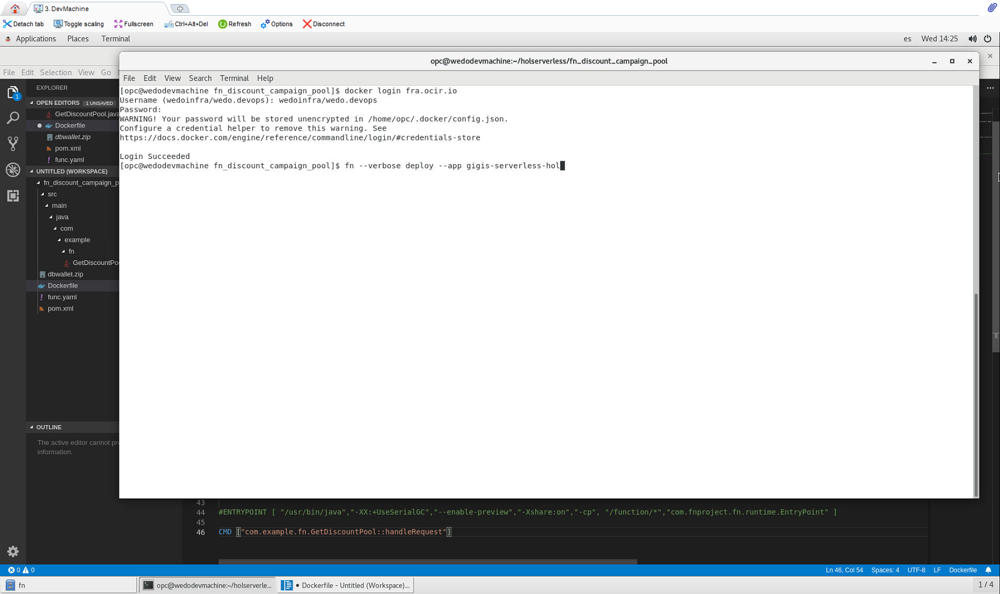

Wait to maven project download dependencies and build jar, docker image creation and function deploy in OCI serverless app finish.


Check that your new function is created in your serverless app [gigis-serverless-hol] at Developer Services -> Functions menu.

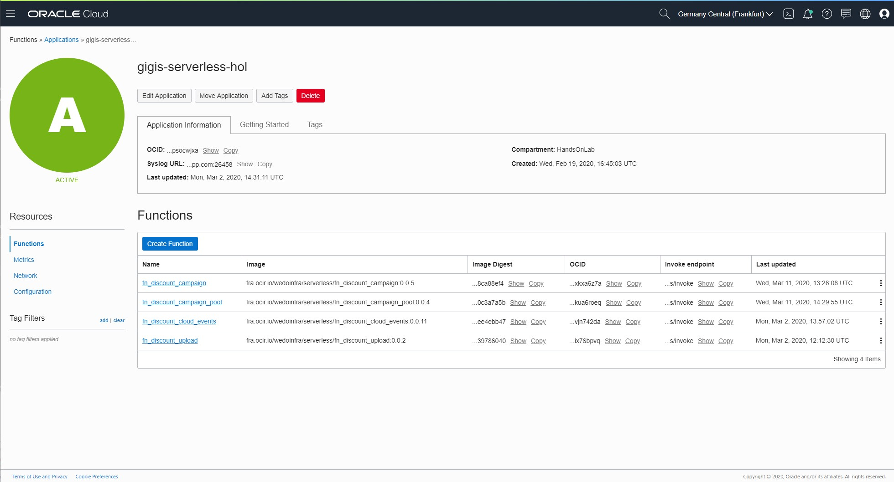

If you want to change your Fucntion time-out or memory amount. Click in Edit Function button and then change **TIMEOUT** from [30] to [120] seconds for example. Then Click Save Changes Button.

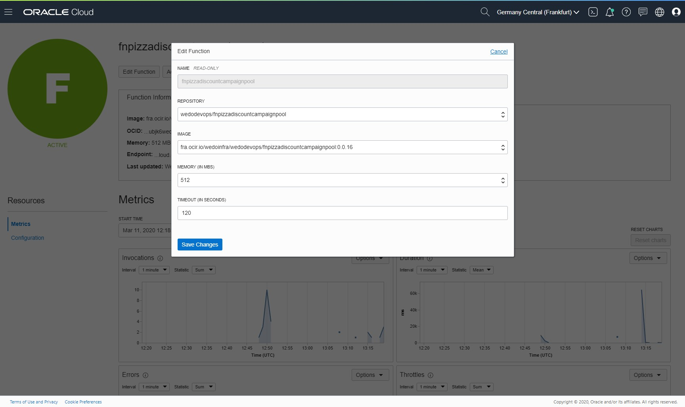

Now you can continue with the [execution of the serverless application](https://github.com/oraclespainpresales/GigisPizzaHOL/blob/master/gigis-serverless-HOL.md#event-service---cloud-event-creation) or optionally review the code to know more about this serverless function.

## Code recap (OPTIONAL)
You copy the function code and made several changes in the configuration files like func.yaml and pom.xml then you created a new Dockerfile to deploy the function. Now we'll explain this changes:

### GetDiscountPool.java
To create the UCP pool data connection you must import several oracle ojdbc driver libraries: [oracle.ucp.jdbc.PoolDataSource] and [oracle.ucp.jdbc.PoolDataSourceFactory]

```java
package com.example.fn;

import java.io.PrintWriter;
import java.io.StringWriter;
import java.sql.*;
import oracle.ucp.jdbc.PoolDataSource;
import oracle.ucp.jdbc.PoolDataSourceFactory;
```
Your function name is the same as main class and this class must have a public handleRequest method. String invokeEndpointURL and String functionId variables must be changed to call your [GetDiscountPool] function. You must declare several private variables for the DataSource pool and the connection credentials. Its important that ```TNS_ADMIN=/function/wallet``` point to the wallet directory in the Dockerfile definition.
```java
public class GetDiscountPool {
    private PoolDataSource poolDataSource;
    private final String dbUser         = System.getenv().get("DB_USER");
    private final String dbPassword     = System.getenv().get("DB_PASSWORD");
    private final String dbUrl          = System.getenv().get("DB_URL") + System.getenv().get("DB_SERVICE_NAME") + "?TNS_ADMIN=/function/wallet";
```
The class constructor define the Data Source Pool connection. You need the db credentials (as environment variables) and your ATP wallet files (unzipped in the Dockerfile definition and docker image creation)
```java
    public GetDiscountPool(){        
        System.err.println("Setting up pool data source");
        //*********** FOR TESTING ONLY *************************************
        //System.err.println("ENV::" + dbUser);
        //System.err.println("ENV::" + dbPassword);
        //System.err.println("ENV::" + dbUrl);
        poolDataSource = PoolDataSourceFactory.getPoolDataSource();
        try {
            poolDataSource.setConnectionFactoryClassName("oracle.jdbc.pool.OracleDataSource");
            poolDataSource.setURL(dbUrl);
            poolDataSource.setUser(dbUser);
            poolDataSource.setPassword(dbPassword);
            poolDataSource.setConnectionPoolName("UCP_POOL");
        }
        catch (SQLException e) {
            System.out.println("Pool data source error!");
            e.printStackTrace();
        }
        System.err.println("Pool data source setup...");
    }
```
As you can see there is an **Input** class that get the pizza input data in JSON format and set the class variables: demozone, paymentMethod and pizzaPrice.
```java
    public static class Input {
        public String demozone;
        public String paymentMethod;
        public String pizzaPrice;

        public String toString() {
            StringBuilder stb = new StringBuilder("{");
            stb.append("'demozone':'").append(demozone).append("'");
            stb.append("'paymentMethod':'").append(paymentMethod).append("'");
            stb.append("'pizzaPrice':'").append(pizzaPrice).append("'");
            stb.append("}");
            return stb.toString();
        }
    }
    
    public String handleRequest(Input pizzaData) {
        String exitValues    = "SALIDA::";
        ResultSet resultSet  = null;
        Connection con       = null;
        float discount       = 0;
```
This assignment could be ignored and use the pizzaData member variables directly, but we transform them to UpperCase to avoid Upper Lower comparison problems.
```java
        try {
            String paymentMethod = pizzaData.paymentMethod.toUpperCase();
            String demozone      = pizzaData.demozone.toUpperCase();
            String pizzaPrice    = pizzaData.pizzaPrice;
```
Connection to the ATP DB using connection pool, ```poolDataSource.getConnection();```.
```java
           //cast string input into a float
            System.out.println("inside Discount Function gigis fn function!!! ");
            float totalPaidValue  = Float.parseFloat(pizzaPrice);

            System.setProperty("oracle.jdbc.fanEnabled", "false");

            conn = poolDataSource.getConnection();
            conn.setAutoCommit(false);                 
```
Configure the prepareStatement SQL
```java
                    StringBuilder stb = new StringBuilder("SELECT NVL (");
                    stb.append("(SELECT SUM(DISCOUNT) FROM CAMPAIGN WHERE ");
                    stb.append("DEMOZONE LIKE ? ");
                    stb.append("AND PAYMENTMETHOD LIKE ? ");
                    stb.append("AND CURRENT_DATE BETWEEN DATE_BGN AND DATE_END+1 ");
                    stb.append("AND MIN_AMOUNT <= ?)");
                    stb.append(",0) as DISCOUNT FROM DUAL");
                    PreparedStatement pstmt = con.prepareStatement(stb.toString());

                    pstmt.setString(1,demozone);
                    pstmt.setString(2,paymentMethod);
                    pstmt.setFloat(3,Float.parseFloat(pizzaPrice));
```
The SQL statement is:
```sql
SELECT NVL (
    SELECT SUM(DISCOUNT) FROM CAMPAIGN 
        WHERE DEMOZONE LIKE <demozone_value>
        AND PAYMENTMETHOD LIKE <payment_method_value>
        AND CURRENT_DATE BETWEEN DATE_BGN AND DATE_END
        AND MIN_AMOUNT <= <pizza_price_value>
    ),0 as DISCOUNT FROM DUAL
);    
```
That SQL statement get sum of all discounts (avoiding 'null' value with NVL command as 0) enabled in the current date and payment method (CASH, VISA, AMEX or MASTERCARD) for pizza price value equal or lower than min amount. 

For example if there are two discounts: one of 5% for min amount of 10$ and other one of 5% for min amount of 15$ and the pizza price order is 20$ the discount applied should be of 10% (5% + 5% because min amounts 10 and 15 are lower than 20).

If pizza price is 13$ the discount applied is 5% because min amount 10 is lower than 13, but second 5% is not applied because min amount 15 is higher than 13.

Last part of the function is to calculate the discount as described before, according to the SQL value and then return the new pizza price.
```java
                System.out.println("[" + pizzaData.toString() + "] - Pizza Price before discount: " + totalPaidValue + "$");
                resultSet = pstmt.executeQuery();
                if (resultSet.next()){                                                
                    discount = Float.parseFloat(resultSet.getString("DISCOUNT"))/100;                        
                    if (discount > 0){
                        //apply calculation to float eg: discount = 10%
                        totalPaidValue -=  (totalPaidValue*discount);
                        System.out.println("[" + pizzaData.toString() + "] - discount: " + resultSet.getString("DISCOUNT") + "%");
                    }
                    else
                        System.out.println ("[" + pizzaData.toString() + "] - No Discount campaign for this payment! [0%]");
                }
                else {
                    System.out.println ("[" + pizzaData.toString() + "] - No Discount campaign for this payment!");
                }
                System.out.println("[" + pizzaData.toString() + "] - total Pizza Price after discount: " + totalPaidValue + "$");
                exitValues = Float.toString(totalPaidValue);                               
            }     
            catch (Exception ex) {
                StringWriter errors = new StringWriter();
                ex.printStackTrace(new PrintWriter(errors));                 
                exitValues = pizzaData.toString() + " - Error: " + ex.toString() + "\n" + ex.getMessage() + errors.toString();                        }  
```
Very important to close the pool connection.
```java
            finally {
                con.close();
            }
        }       
        catch (final Exception ex){
            final StringWriter errors = new StringWriter();
            ex.printStackTrace(new PrintWriter(errors));                 
            exitValues = pizzaData.toString() + " - Error: " + ex.toString() + "\n" + ex.getMessage() + errors.toString();;
        }
        return exitValues;
    }
}
```
### func.yaml

```yaml
schema_version: 20180708
name: fn_discount_cloud_campaign
version: 0.0.1
```
You must have deleted this 4 lines to create your customized Dockerfile. This lines are using to setup the default deploy fn docker images for java.
```
runtime: java
build_image: fnproject/fn-java-fdk-build:jdk11-1.0.105
run_image: fnproject/fn-java-fdk:jre11-1.0.105
cmd: com.example.fn.HelloFunction::handleRequest
```
Last line is the entry point to execute the function. Represent the path to the funcion name and handleRequest public method and you can find it in the new Dockerfile as CMD command.
```
cmd: com.example.fn.HelloFunction::handleRequest
```
Last line is the entrypoint to execute the function. Represent the path to the funcion name [HelloFunction] and [handleRequest] public method. Also you will find it in the new multi stage Dockerfile as CMD command.
```
cmd: com.example.fn.HelloFunction::handleRequest
```
Next you could add this two lines to configure your serverless function directly
```yaml
memory: 512
timeout: 120
```
### pom.xml
Pom.xml file is your maven project descriptor. First of all you must review properties, groupId, artifactId and version. In properties you select the fdk version for your project. GroupId is the java path to your class. ArtifactId is the name of the artifact to create and version is its version number [1.0.105].
```xml
    <properties>
        <project.build.sourceEncoding>UTF-8</project.build.sourceEncoding>
        <fdk.version>1.0.105</fdk.version>
    </properties>
    <groupId>com.example.fn</groupId>
    <artifactId>getdiscount</artifactId>
    <version>1.0.0</version>
```
In repositories section you must describe what repositories will be used in your project. For this serverless function you will use only one repository (fn repository) but you could add more repositories as your needs.
```xml
    <repositories>
        <repository>
            <id>fn-release-repo</id>
            <url>https://dl.bintray.com/fnproject/fnproject</url>
            <releases>
                <enabled>true</enabled>
            </releases>
            <snapshots>
                <enabled>false</enabled>
            </snapshots>
        </repository>
    </repositories>
 ```
In the dependencies section you will describe your classes dependencies. In this pom.xml you have to put all jdbc dependencies and driver connection to the ATP: ojdbc8 for **version 19.3.0.0**. Take into account that maven repo dependency ```com.oracle.ojdbc``` is **o**jdbc and not jdbc.

```xml
     <dependencies>
        <dependency>
            <groupId>com.fnproject.fn</groupId>
            <artifactId>api</artifactId>
            <version>${fdk.version}</version>
        </dependency>
        <dependency>
            <groupId>com.fnproject.fn</groupId>
            <artifactId>runtime</artifactId>
            <version>${fdk.version}</version>
        </dependency>
        <dependency>
            <groupId>com.oracle.ojdbc</groupId>
            <artifactId>ojdbc8</artifactId>
            <version>19.3.0.0</version>
        </dependency>
    </dependencies>
```
Build section is used to define the maven and other building configurations like jdk version [12] for example. And we are testing other jdk versions like 11 and 13. All these testing that we are doing is to try the graalvm native image in this kind of serverless projects. The problem with native image is that you need all jar/class dependecies and some manual configuration (like reflection or jni) to create a runnable native image with graalvm compiler.

As you can see the final jar name ([finalName] tag) is **[function.jar]** that it will be use in Dockerfile jlink an jdeps RUN commands.
```xml
    <build>
        <finalName>function</finalName>
        <plugins>
            <plugin>
                <groupId>org.apache.maven.plugins</groupId>
                <artifactId>maven-compiler-plugin</artifactId>
                <version>3.3</version>
                <configuration>
                    <source>12</source>
                    <target>12</target>
                </configuration>
            </plugin>
            <plugin>
                 <groupId>org.apache.maven.plugins</groupId>
                 <artifactId>maven-surefire-plugin</artifactId>
                 <version>2.22.1</version>
                 <configuration>
                     <useSystemClassLoader>false</useSystemClassLoader>
                 </configuration>
            </plugin>
        </plugins>
    </build>
```
### Dockerfile
You created a multi stage Dockerfile to customize the serverless function deploy. You have several stages before to create the final image docker. This intermediate stages are not included in the final image. In this dockerfile first stage is created as cache-stage and include the .so lib. Then you can see a second stage [build-stage] from a openjdk-12 image with oracle flavor to create the maven package.
```dockerfile
FROM delabassee/fn-cache:latest as cache-stage
FROM openjdk:12-oracle as build-stage
WORKDIR /function
RUN curl https://downloads.apache.org/maven/maven-3/3.6.3/binaries/apache-maven-3.6.3-bin.tar.gz -o apache-maven-3.6.3-bin.tar.gz 
RUN tar -zxvf apache-maven-3.6.3-bin.tar.gz
ENV PATH="/function/apache-maven-3.6.3/bin:${PATH}"
```
To access to your ATP DB you have to insert the dbwallet.zip file that you downloaded when you created the ATP DB. The dbwallet.zip must be unzipped, so you need to install unzip in this temporal stage layer ```yum install -y unzip```. Then you can unzip the **dbwallet.zip** file, copy the unzipped files to **[/function/wallet]** directory and finally delete these unzipped files. In the optional part of the demo with developer cloud service you can create a pipeline to download the dbwallet.zip file with oci cli command in real time, avoiding to download the dbwallet.zip file to your laptop or server hard disk. That method is safer than manual downloading.
```dockerfile
RUN yum install -y unzip

COPY dbwallet.zip /function
RUN unzip /function/dbwallet.zip -d /function/wallet/ && rm /function/dbwallet.zip
```
Database Resident Connection Pool (DRCP) in Autonomous Database supports easier and more efficient management of open connections. You should include (SERVER=POOLED) in your tnsnames.ora connection string. In this case you will change tnsnames.ora file once it would be unzipped and sed command will change the ```high.atp.oraclecloud.com)``` connection string to ```high.atp.oraclecloud.com)(SERVER=POOLED)```.
```dockerfile
RUN sed -i 's/high.atp.oraclecloud.com)/high.atp.oraclecloud.com)(SERVER=POOLED)/g' /function/wallet/tnsnames.ora
```
In this part of the dockerfile you will create the package, so you have to use the **pom.xml** file and insert all the jar dependecies from jdbc jar and other jar libraries.
```dockerfile
ENV MAVEN_OPTS -Dhttp.proxyHost= -Dhttp.proxyPort= -Dhttps.proxyHost= -Dhttps.proxyPort= -Dhttp.nonProxyHosts= -Dmaven.repo.local=/usr/share/maven/ref/repository
ADD pom.xml /function/pom.xml
ADD src /function/src
ADD libs/* /function/target/libs/

#RUN ["mvn", "package"]

RUN ["mvn", "package", \
    "dependency:copy-dependencies", \
    "-DincludeScope=runtime", \
    "-Dmdep.prependGroupId=true", \
    "-DoutputDirectory=target","-e" ]
```
After maven package and jar creation in this temporal layer target directory. You can see a [jdeps](https://docs.oracle.com/en/java/javase/13/docs/specs/man/jdeps.html) and [jlink](https://docs.oracle.com/en/java/javase/13/docs/specs/man/jlink.html) executions. They are java tools to analize dependencies and optimize them, creating a improve and compressed custom docker image. 
```dockerfile
RUN /usr/java/openjdk-12/bin/jlink --compress=2 --no-header-files --no-man-pages --strip-debug --output /function/fnjre --add-modules $(/usr/java/openjdk-12/bin/jdeps --ignore-missing-deps --print-module-deps --class-path '/function/target/*' /function/target/function.jar)
```
Final stage layer of this dockerfile get the jars generated in the previous temporal layers, and optimized with jdeps and jlink, get the /libfnunixsocket.so lib and the wallet files to be used in the function jar execution. Finally as always the CMD command with the Function **handleRequest** entrypoint path. 

The command ```ENV BESU_OPTS="--add-opens java.base/sun.security.provider=ALL-UNNAMED"``` came from besu [troubleshooting](https://besu.hyperledger.org/en/stable/HowTo/Troubleshoot/Troubleshooting/) to avoid next warning when you begin a jdbc connection in openjdk 9 or later.

```
WARNING: An illegal reflective access operation has occurred
WARNING: Illegal reflective access by org.bouncycastle.jcajce.provider.drbg.DRBG (file:/Users/madelinemurray/besu/build/distributions/besu-1.1.2-SNAPSHOT/lib/bcprov-jdk15on-1.61.jar) to constructor sun.security.provider.Sun()
WARNING: Please consider reporting this to the maintainers of org.bouncycastle.jcajce.provider.drbg.DRBG
WARNING: Use --illegal-access=warn to enable warnings of further illegal reflective access operations
WARNING: All illegal access operations will be denied in a future release
```

You must include ```COPY --from=cache-stage /libfnunixsocket.so /lib``` to copy the unix lib **libfnunixsocket.so** to your docker image as without this unix lib the connection will fail.
```dockerfile
FROM oraclelinux:8-slim
ENV BESU_OPTS="--add-opens java.base/sun.security.provider=ALL-UNNAMED"
WORKDIR /function

COPY --from=build-stage /function/target/*.jar /function/
COPY --from=build-stage /function/fnjre/ /function/fnjre/
COPY --from=build-stage /function/wallet/ /function/wallet/
COPY --from=cache-stage /libfnunixsocket.so /lib

ENTRYPOINT [ "/function/fnjre/bin/java", \
    "--enable-preview", \
    "-cp", "/function/*", \
    "com.fnproject.fn.runtime.EntryPoint" ]

#ENTRYPOINT [ "/usr/bin/java","-XX:+UseSerialGC","--enable-preview","-Xshare:on","-cp", "/function/*","com.fnproject.fn.runtime.EntryPoint" ]

CMD ["com.example.fn.GetDiscountPool::handleRequest"]
```
# Continue the HOL

* [Execute you serverless Application](https://github.com/oraclespainpresales/GigisPizzaHOL/blob/master/serverless/funtion_testing.md)
