# Function fn discount cloud-events
This serverless function will get **cloud events** in json format then access **campaigns.json** file, parse it and send each campaign inside the camapigns.json file to **fn_discount_upload** serverless function.

Table of Contents:
1. [fn discount cloud-events IDE preparation](#fn-discount-cloud-events-ide-preparation)
2. [fn discount cloud-events java code](#fn-discount-cloud-events-java-code)
3. [Changing func.yaml file](#changing-funcyaml-file)
4. [Overwriting pom.xml file](#overwriting-pomxml-file)
5. [Creating OCI config and oci_api_key.pem files](#creating-oci-config-and-oci_api_keypem-files)
6. [Creating Multi Stage Dockerfile](#creating-multi-stage-dockerfile)
7. [Deploy fn discount cloud-events function](#deploy-fn-discount-cloud-events-function)
8. [New Environment Variables](#new-environment-variables)
9. [Code recap (OPTIONAL)](#code-recap-optional)
10. [Continue the HOL](#continue-the-hol)

Verify that your cloud_events function has 2 files (func.yaml and pom.xml) and a **src** directory.

```sh 
cd fn_discount_cloud_events

ls -la
```

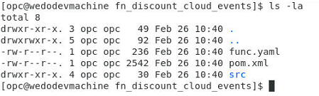

The serverless function should be created at ```src/main/java/com/example/fn/HelloFunction.java``` and you can review the example code with and your IDE or text editor. This file will be change in the next section.

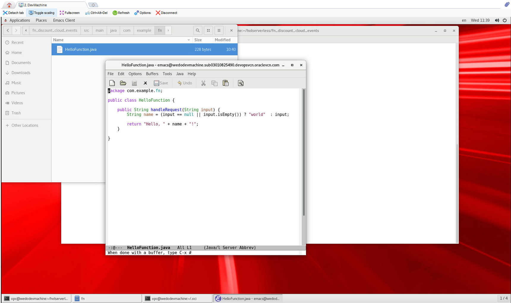

A Junit textfile should be created at ```src/test/java/com/example/fn/HelloFunctionTest.java``` and used to test the serverless function before deploy it in OCI FaaS. We won't use Junit testing in this lab, but you could add some testing Junit file to your serverles function if you want.

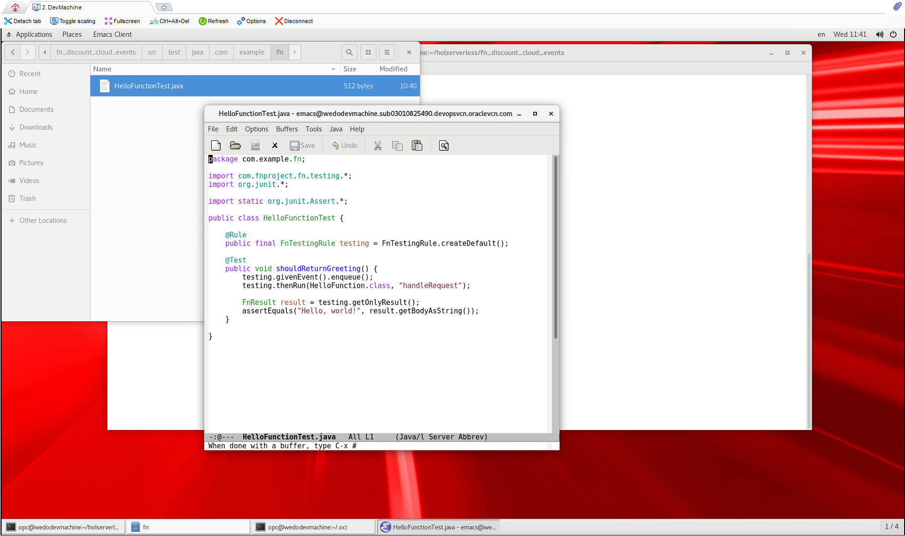

## fn discount cloud-events IDE preparation
You could deploy this new serverless function in your FaaS environment, but the idea is to change the example code by the real function code. You can use a text editor or you favourite IDE software. In this lab we used Visual Studio Code (from the developer machine imagen in OCI marketplace), so all images was captured with that IDE, but you can use what you want.

Open Visual Studio Core (Applications -> Accessories in the development VM) or your favourite IDE 

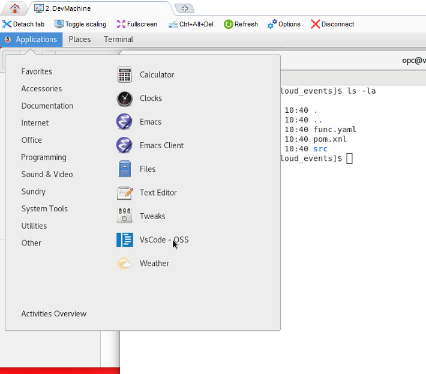

Select **add workspace folder ...** in the Start Menu.

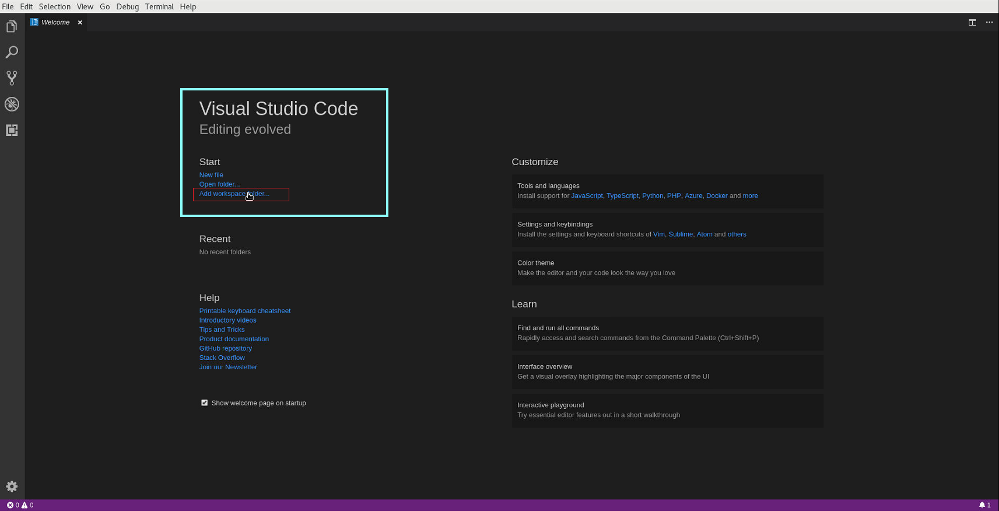

Click in HOME directory and next select the appropiate path to your function project directory [opc/holserverless/fn_discount_cloud_events]. Then click Add button to create a workspace from this directory in Visual Studio Core.

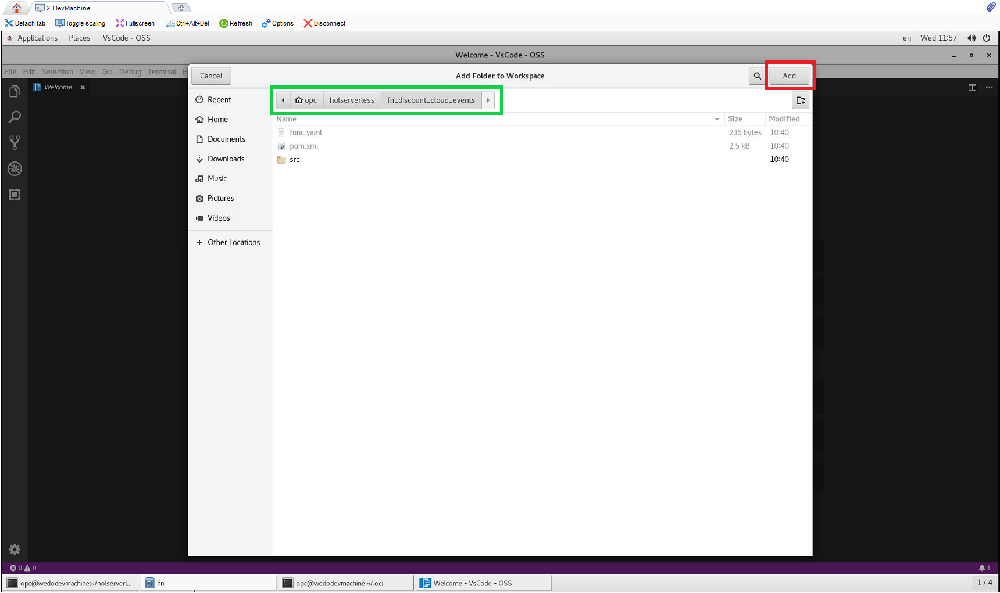

A new project will be available as workspace in the IDE

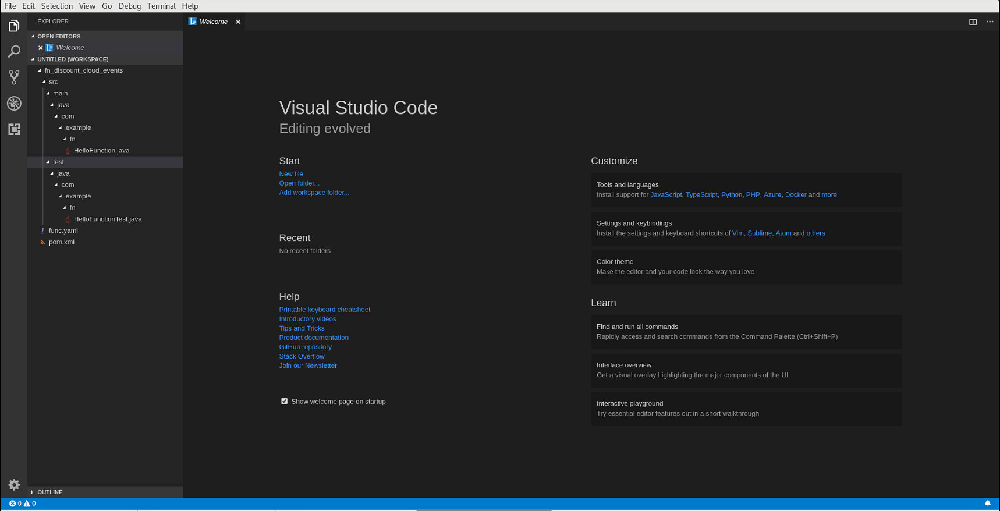

You can click n HelloFunction.java to review your serverless function code. Same for HelloFunctionTest.java file.


## fn discount cloud-events java code
The function code is in the next github [repository](https://github.com/oraclespainpresales/fn-pizza-discount-cloud-events). You can open it in other web brower tab, to review the project.

You can access java code to copy and paste it in your develpment machine IDE project. You could clone this github repository if you want, instead of copy and paste the different files. You can learn how to clone the git repo in this [section](clone-git project to IDE).

For educational purposes you will change the code created before with ```fn init``` command instead of clone the git repo, but you could use that method to replicate the entire function project.

You can copy the java function code creating a new file with the function name, in the fn directory or overwriting the existing code inside the **[HelloFunction.java]** function and next rename it (F2 key or right mouse button and Rename). We show you both methods in the next sections, please choose one of them.

### Creating new file
Create new file in ```/src/main/java/com/example/fn``` directory. Right mouse button and then New File.

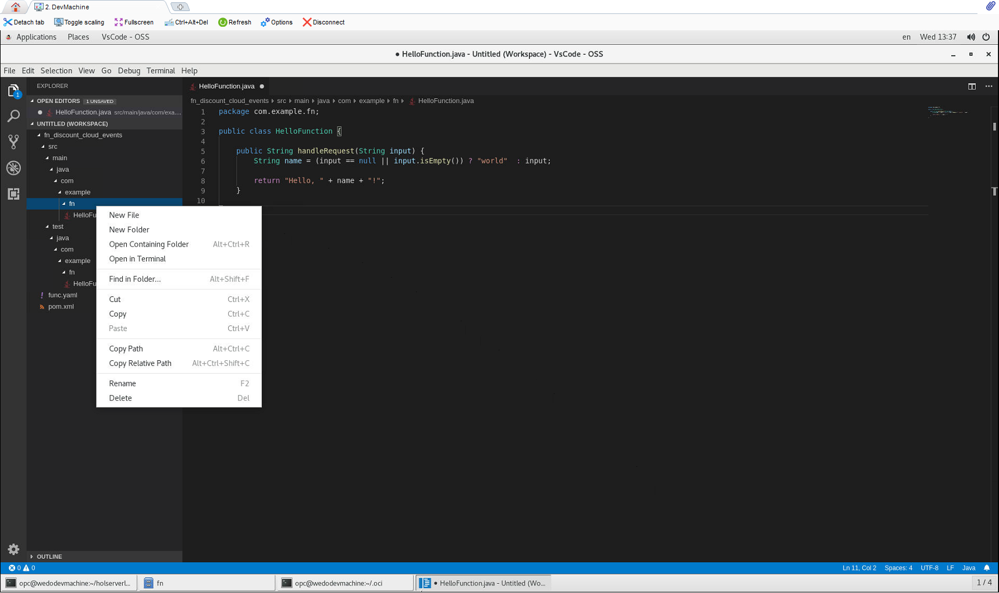

Then set the same name as java class **[DiscountCampaignUploader.java]**

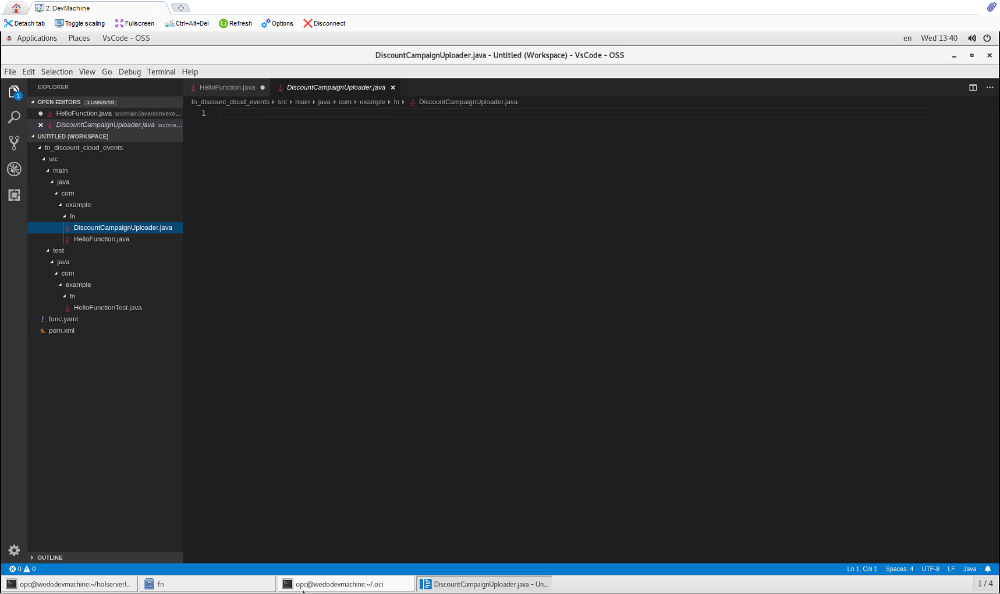

Now copy raw function code and paste it from the [java function code](https://raw.githubusercontent.com/oraclespainpresales/fn-pizza-discount-cloud-events/master/src/main/java/com/example/fn/DiscountCampaignUploader.java).

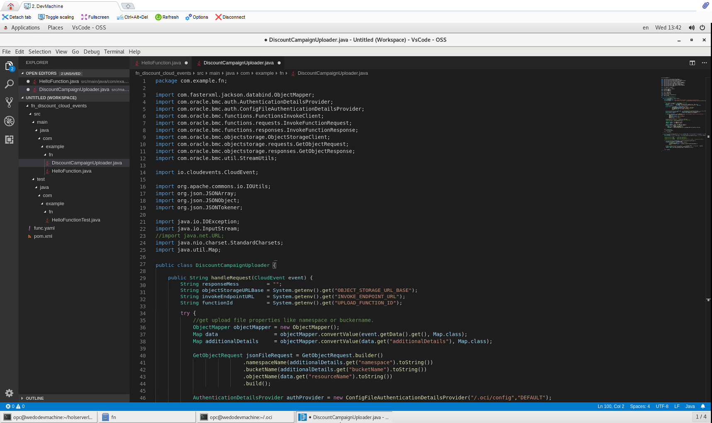

Delete HelloFunction.java and HelloFunctionTest.java from your IDE project.

### Overwriting HelloFunction.java
You can overwrite the HelloFunction.java code with the DiscountCampaignUploader Function code.

Select the raw [java function code](https://raw.githubusercontent.com/oraclespainpresales/fn-pizza-discount-cloud-events/master/src/main/java/com/example/fn/DiscountCampaignUploader.java) from the repository and paste it overwriting the HelloFunction.java Function.


Click right mouse button in the HelloFunction.java file to Rename the file. You can press F2 key to rename the HelloFunction.java file as a shortcut.


Change the name of the java file to **[DiscountCampaignUploader.java]**.

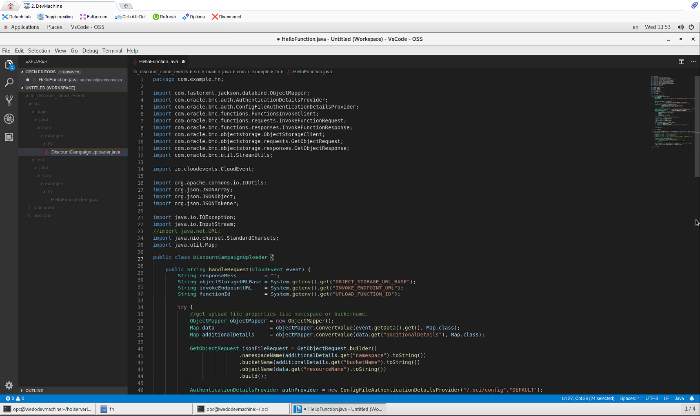

You can delete the HelloFunctionTest.java file (and the test directory tree) or rename it and change the code to create your JUnit tests. In this lab we won't create JUnit test.

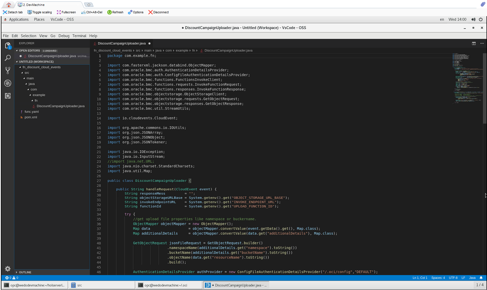

## Changing func.yaml file
You have to delete several files in the func.yaml code to create your custom Docker multi stage file. In you IDE select func.yaml file and delete next lines:

```
runtime: java
build_image: fnproject/fn-java-fdk-build:jdk11-1.0.105
run_image: fnproject/fn-java-fdk:jre11-1.0.105
cmd: com.example.fn.HelloFunction::handleRequest
```

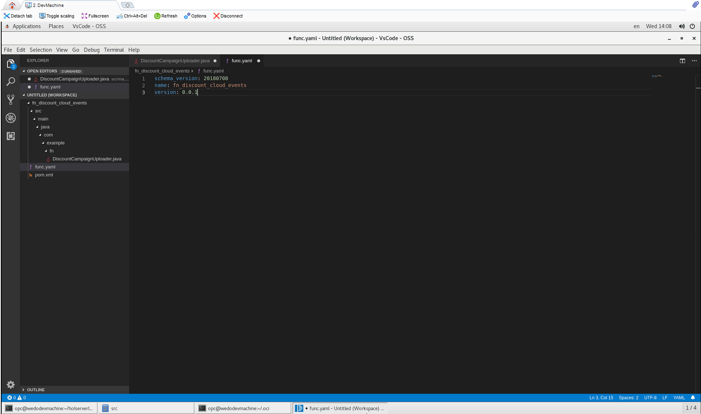

## Overwriting pom.xml file
Next you must overwrite the example maven pom.xml file with the [pom.xml](https://raw.githubusercontent.com/oraclespainpresales/fn-pizza-discount-cloud-events/master/pom.xml) content of the github function project. Maven is used to import all the dependencies and java classes needed to create your serverless function jar.


## Creating OCI config and oci_api_key.pem files
For security reasons this two files haven't been uploaded to github and also depends on your oci tenancy and project information. This two files are easy to generate from a Developer Cloud Service pipeline that is explained in the [optional part of this HOL](https://github.com/oraclespainpresales/GigisPizzaHOL/blob/master/devcs2fn.md). You will can review it if you complete the optional part.

You must create a new directory in your IDE project called **[oci-config]**, this directory will contain the OCI cli configuration necessary for your future docker image creation. 

- Select fn_discount_cloud_events directory.
- Right mouse button and New Folder.
- Write **oci-config** as directory name and press enter key.


Next create **config** file:
- Select in oci-config directory and Click right mouse button New File.
- Write config name and press enter key.
- Write your oci config data

```text
[DEFAULT]
tenancy=<your_tenancy_ocid_like_ocid1.tenancy.oc1..aaaaaaaacc...>
region=<your_tenancy_region_like_eu-frankfurt-1>
user=<your_user_ocid_like_ocid1.user.oc1..aaaaaaaadn622k...>
fingerprint=<your_api_key_fingerprint_like_15:1b:90:9e:45:7c:b9:bf:73:f5:e2:0f:82:62:82:66>
key_file=<image_path_to_your_pem_file_like_/.oci/oci_api_key.pem>
```

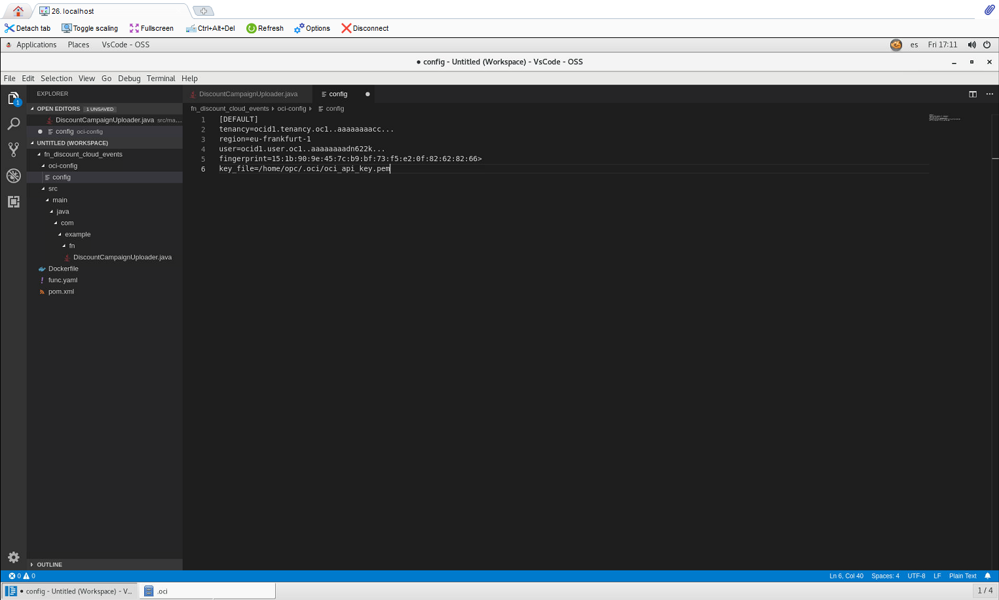

Next create **oci_api_key.pem** file:
- Select in oci-config directory and Click right mouse button New File.
- Write oci_api_key.pem name and press enter key.
- Write your private key in oci_api_key.pem

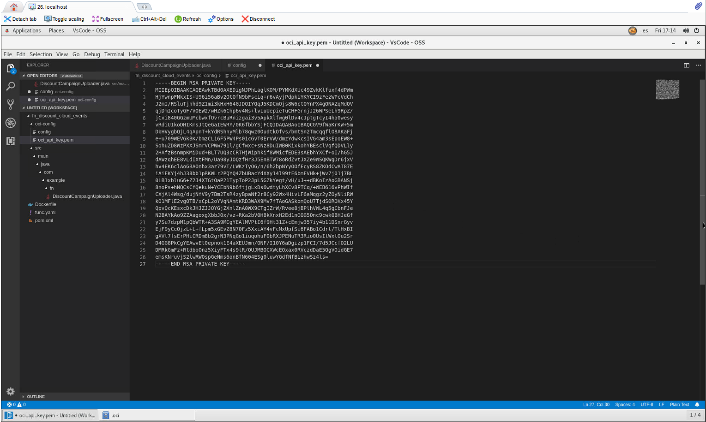

To finish this section, please Select File -> Save All in your IDE to save all the changes.

## Creating Multi Stage Dockerfile
You must create a new multi stage docker file, to deploy your serverless function as a docker image in your OCIR repository. This file must be created before deploying the function.

Select fn_discount_cloud_events folder in your IDE and create new file with [Dockerfile] name clicking right mouse button

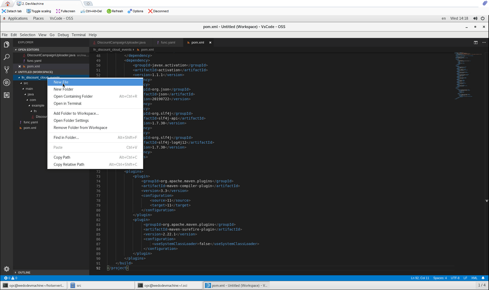

Next copy from raw [Docker file code](https://raw.githubusercontent.com/oraclespainpresales/fn-pizza-discount-cloud-events/master/Dockerfile) to your new local Dockerfile file.

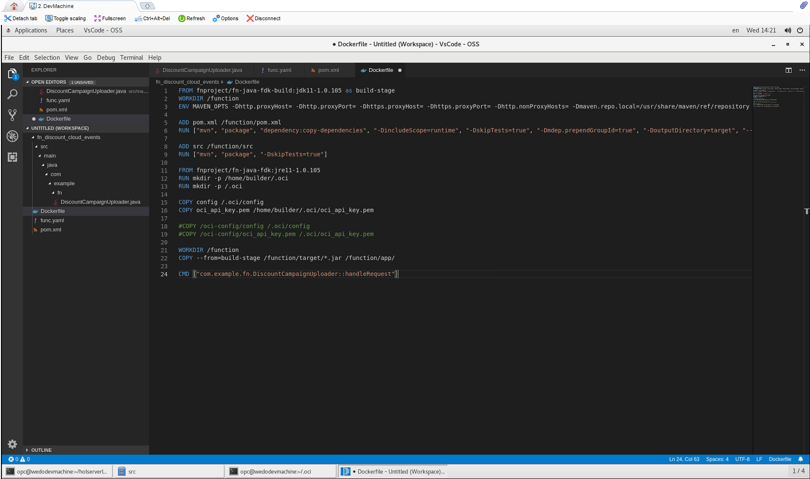

Then review the code of the dockerfile file and comment next lines putting # before the sentences. This lines is for the optional part of the demo that takes the oci **config** and **oci_api_key.pem** files from a pipeline build machine that is in developer cloud service. In that machines, the oci config file **key_file** var, point to /home/builder/.oci/oci_api_key.pem path for the api private key file, but you will can know more about that, if you complete the optional part of the HOL.
Comment:
```dockerfile
RUN mkdir -p /home/builder/.oci
```
As
```dockerfile
#RUN mkdir -p /home/builder/.oci
```
Then comment this two lines:
```dockerfile
COPY config /.oci/config
COPY oci_api_key.pem /home/builder/.oci/oci_api_key.pem
```
As
```dockerfile
#COPY config /.oci/config
#COPY oci_api_key.pem /home/builder/.oci/oci_api_key.pem
```
Then uncomment next two lines deleting the # at the begining of the sentences.
```dockerfile
#COPY /oci-config/config /.oci/config
#COPY /oci-config/oci_api_key.pem /.oci/oci_api_key.pem
```
As
```dockerfile
COPY /oci-config/config /.oci/config
COPY /oci-config/oci_api_key.pem /.oci/oci_api_key.pem
```
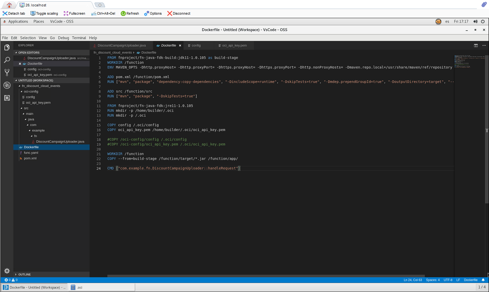

After that, click in File -> Save All in your IDE to save all changes.

## Deploy fn discount cloud-events function
To deploy your serverless function please follow next steps, your function will be created in OCI Functions inside your serverles app [gigis-serverless-hol]. 

Open a terminal in your development machine and execute:
```sh
cd $HOME/holserverless/fn_discount_cloud_events
```
Then you must login in OCIR registry with ```docker login``` command. Introduce your OCI user like ```<namespace>/<user>``` when docker login ask you about username and your previously created **OCI Authtoken** as password.
```sh
docker login fra.ocir.io
```
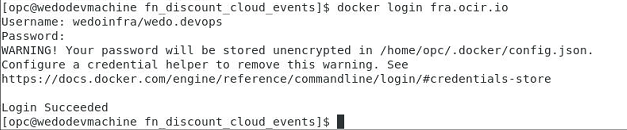

You must execute next command with ```--verbose``` option to get all the information about the deploy process.
```sh
fn --verbose deploy --app gigis-serverless-hol
```


Wait to maven project download dependencies and build jar, docker image creation and function deploy in OCI serverless app finish.


Check that your new function is created in your serverless app [gigis-serverless-hol] at Developer Services -> Functions menu.

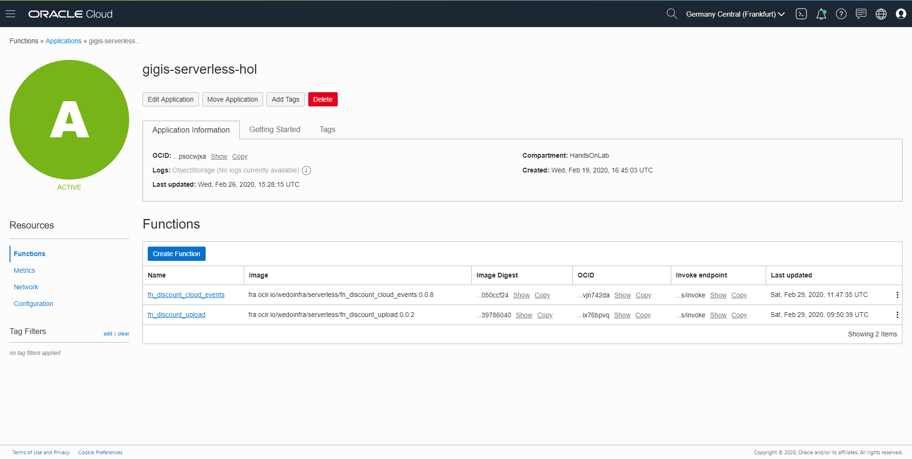

## New Environment Variables
after you have created and deployed fn_discount_upload and fn_discount_cloud_events, you have to create 3 additional environment variables in fn_discount_cloud_events that will link both functions.

Click in [fn_discount_cloud_events] function and next **Configuration** menu.


Create 3 additional variables:
|| Key | Value | Section |
| ------------- | ------------- | ------------- | ------------- |
|01|INVOKE_ENDPOINT_URL|```https://<your_endpoint_id.eu-frankfurt-1.functions.oci.oraclecloud.com```|invoke Endpoint of **fn_discount_upload**|
|02|UPLOAD_FUNCTION_ID|ocid1.fnfunc.oc1.eu-frankfurt-1.aaaaaaaaack6vdtmj7n2w...|OCID of **fn_discount_upload**|
|03|OBJECT_STORAGE_URL_BASE|```https://objectstorage.<YOUR_OCI_REGION>.oraclecloud.com/```|[Regions](https://docs.cloud.oracle.com/iaas/Content/General/Concepts/regions.htm)|

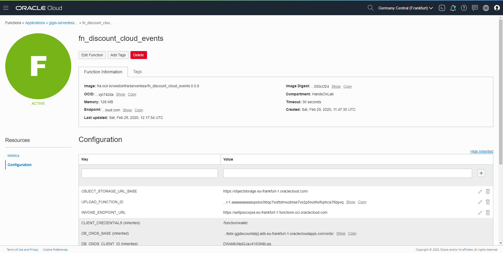

You must change your Fucntion time-out. Click in Edit Function button and then change **TIMEOUT** from [30] to [120] seconds. Then Click Save Changes Button.

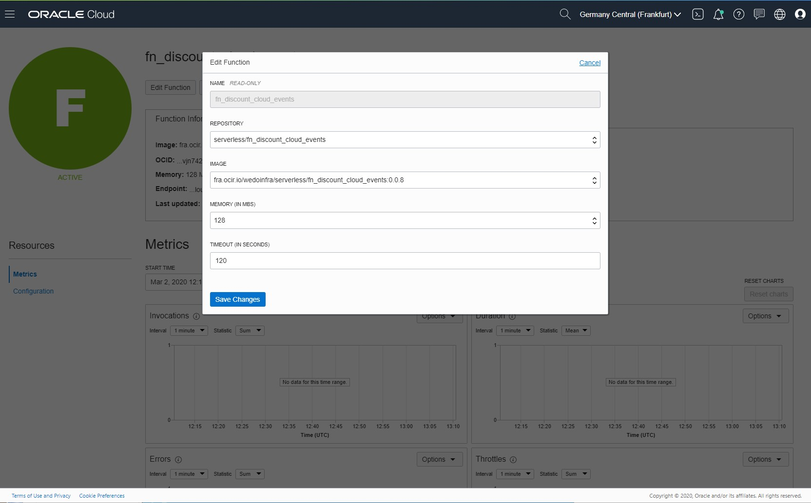

## Code recap (OPTIONAL)
You copy the function code and made several changes in the configuration files like func.yaml and pom.xml then you created a new Dockerfile to deploy the function. Now we'll explain you such changes:

### DiscountCampaignUploader.java
Your function java file name **[DiscountCampaignUploader.java]** is the same as main class **[DiscountCampaignUploader]** and this class must have a unique **public** method **[handleRequest]** that is the entrypoint of the serverless function. ObjectStorageURLBase, invokeEndpointURL and functionId vaiables are setted from function environment variables that you created before in OCI.
```java
public class DiscountCampaignUploader {

    public String handleRequest(CloudEvent event) {
        String responseMess         = "";
        String objectStorageURLBase = System.getenv().get("OBJECT_STORAGE_URL_BASE");
        String invokeEndpointURL    = System.getenv().get("INVOKE_ENDPOINT_URL");
        String functionId           = System.getenv().get("UPLOAD_FUNCTION_ID");

```
Next is the code for cloud event trigger catch. After a cloud event trigger is fired, you'll must receive a cloud event (JSON format) similar to:
```yaml
{
    "eventType" : "com.oraclecloud.objectstorage.createobject",
    "cloudEventsVersion" : "0.1",
    "eventTypeVersion" : "2.0",
    "source" : "ObjectStorage",
    "eventTime" : "2020-01-21T16:26:30.849Z",
    "contentType" : "application/json",
    "data" : {
      "compartmentId" : "ocid1.compartment.oc1..aaaaaaaatz2chvjiz4d3xdrtzmtxspkul",
      "compartmentName" : "DevOps",
      "resourceName" : "campaigns.json",
      "resourceId" : "/n/wedoinfra/b/bucket-gigis-pizza-discounts/o/campaigns.json",
      "availabilityDomain" : "FRA-AD-1",
      "additionalDetails" : {
        "bucketName" : "bucket-gigis-pizza-discounts",
        "archivalState" : "Available",
        "namespace" : "wedoinfra",
        "bucketId" : "ocid1.bucket.oc1.eu-frankfurt-1.aaaaaaaasndscagkbrqhfcrezkla6cqa2sippfq",
        "eTag" : "199f8dbf-0b8c-41b6-9596-4d2a6792d7e5"
      }
    },
    "eventID" : "3e47d127-19de-6eb8-eb67-0c1ab961fcbc",
    "extensions" : {
      "compartmentId" : "ocid1.compartment.oc1..aaaaaaaatz2chvjiz4d3xdrtzmtxspkul"
    }
}
```
Next piece of code, parse the cloud-event json description and it get the important data like compartmentid, object storage name, bucket name or namespace.
```java
	//get upload file properties like namespace or buckername.
            ObjectMapper objectMapper = new ObjectMapper();
            Map data                  = objectMapper.convertValue(event.getData().get(), Map.class);
            Map additionalDetails     = objectMapper.convertValue(data.get("additionalDetails"), Map.class);

            GetObjectRequest jsonFileRequest = GetObjectRequest.builder()
                            .namespaceName(additionalDetails.get("namespace").toString())
                            .bucketName(additionalDetails.get("bucketName").toString())
                            .objectName(data.get("resourceName").toString())
                            .build();
```
That relevant data will be used to access (in authProvider object) to the object storage bucket and get the **campaigns.json** file (resourceName variable from cloud-event JSON file).
```java
    AuthenticationDetailsProvider authProvider = new ConfigFileAuthenticationDetailsProvider("/.oci/config","DEFAULT");
    ObjectStorageClient objStoreClient         = ObjectStorageClient.builder().build(authProvider);
    GetObjectResponse jsonFile                 = objStoreClient.getObject(jsonFileRequest);

    StringBuilder jsonfileUrl = new StringBuilder("https://objectstorage.eu-frankfurt-1.oraclecloud.com/n/")
	    .append(additionalDetails.get("namespace"))
	    .append("/b/")
	    .append(additionalDetails.get("bucketName"))
	    .append("/o/")
	    .append(data.get("resourceName"));
```
Next the json file is parsed to get the discount campaings (JSONArray) and then send these campaigns to the next serverless function.
```java
    System.out.println("JSON FILE:: " + jsonfileUrl.toString());
    //InputStream isJson = new URL(jsonfileUrl.toString()).openStream();
    InputStream isJson = jsonFile.getInputStream();

    JSONTokener tokener = new JSONTokener(isJson);
		JSONObject joResult = new JSONObject(tokener);

    JSONArray campaigns = joResult.getJSONArray("campaigns");
    System.out.println("Campaigns:: " + campaigns.length());
    for (int i = 0; i < campaigns.length(); i++) {
	JSONObject obj = campaigns.getJSONObject(i);
	responseMess += invokeCreateCampaingFunction (invokeEndpointURL,functionId,obj.toString());
    }
```
This serverless function has a private method [invokeCreateCampaingFunction] used to send the payload (camapaign) data to the next serverless function in the application. The method uses the endpoint and OCID destination function data to send it the campaign (in json format) that it was parsed previously from campaigns.json file. 
```java
private String invokeCreateCampaingFunction (String invokeEndpointURL, String functionId, String payload) throws IOException {
	String response                            = "";
	AuthenticationDetailsProvider authProvider = new ConfigFileAuthenticationDetailsProvider("/.oci/config","DEFAULT");

	//System.out.println("TENANT:: " + authProvider.getTenantId());
	//System.out.println("USER::   " + authProvider.getUserId());
	//System.out.println("FINGER:: " + authProvider.getFingerprint());
	//System.out.println("PATHPK:: " + IOUtils.toString(authProvider.getPrivateKey(), StandardCharsets.UTF_8));

	try (FunctionsInvokeClient fnInvokeClient = new FunctionsInvokeClient(authProvider)){
	    fnInvokeClient.setEndpoint(invokeEndpointURL);
	    InvokeFunctionRequest ifr = InvokeFunctionRequest.builder()
		    .functionId(functionId)
		    .invokeFunctionBody(StreamUtils.createByteArrayInputStream(payload.getBytes()))
		    .build();

	    System.err.println("Invoking function endpoint - " + invokeEndpointURL + " with payload " + payload);
	    InvokeFunctionResponse resp = fnInvokeClient.invokeFunction(ifr);
	    response = IOUtils.toString(resp.getInputStream(), StandardCharsets.UTF_8);
	}

	return response;
}
```
### func.yaml
```yaml
schema_version: 20180708
name: fn_discount_cloud_events
version: 0.0.1
```
You must have deleted these 4 lines to create your customized Dockerfile. These lines are commands to setup the default deploy fn docker image for java and the function entrypoint call [handleRequest].
```
runtime: java
build_image: fnproject/fn-java-fdk-build:jdk11-1.0.105
run_image: fnproject/fn-java-fdk:jre11-1.0.105
cmd: com.example.fn.HelloFunction::handleRequest
```
Last line is the entrypoint to execute the function. Represent the path to the funcion name [HelloFunction] and [handleRequest] public method. Also you will find it in the new multi stage Dockerfile as CMD command.
```
cmd: com.example.fn.HelloFunction::handleRequest
```
### pom.xml
Pom.xml file is your maven project descriptor. First of all you must review properties, groupId, artifactId and version. In properties you select the fdk version for your project. GroupId is the java path to your class. ArtifactId is the name of the artifact to create and version is its version number.
```xml
    <properties>
        <project.build.sourceEncoding>UTF-8</project.build.sourceEncoding>
        <fdk.version>1.0.105</fdk.version>
    </properties>
    <groupId>com.example.fn</groupId>
    <artifactId>discountcampaignuploader</artifactId>
    <version>1.0.0</version>
```
In repositories section you must describe what repositories will be used in your project. For this serverless function you will use only one repository (fn repository) but you could add more repositories as your needs.
```xml
    <repositories>
        <repository>
            <id>fn-release-repo</id>
            <url>https://dl.bintray.com/fnproject/fnproject</url>
            <releases>
                <enabled>true</enabled>
            </releases>
            <snapshots>
                <enabled>false</enabled>
            </snapshots>
        </repository>
    </repositories>
 ```
In the dependencies section you will describe your classes dependencies, for example the cloud-event api, de fn api or classes to parse and write json files.
```xml
    <dependencies>
        <dependency>
            <groupId>com.fnproject.fn</groupId>
            <artifactId>api</artifactId>
            <version>${fdk.version}</version>
        </dependency>
        <dependency>
            <groupId>io.cloudevents</groupId>
            <artifactId>cloudevents-api</artifactId>
            <version>0.2.1</version>
        </dependency>
        <dependency>
            <groupId>com.oracle.oci.sdk</groupId>
            <artifactId>oci-java-sdk-full</artifactId>
            <version>1.12.3</version>
        </dependency>
        <dependency>
            <groupId>com.fasterxml.jackson.core</groupId>
            <artifactId>jackson-databind</artifactId>
            <version>2.10.1</version>
            <scope>compile</scope>
        </dependency>
        <dependency>
            <groupId>javax.activation</groupId>
            <artifactId>activation</artifactId>
            <version>1.1.1</version>
        </dependency>
        <dependency>
            <groupId>org.json</groupId>
            <artifactId>json</artifactId>
            <version>20190722</version>
        </dependency>
        <dependency>
            <groupId>org.slf4j</groupId>
            <artifactId>slf4j-api</artifactId>
            <version>1.7.30</version>
        </dependency>
        <dependency>
            <groupId>org.slf4j</groupId>
            <artifactId>slf4j-log4j12</artifactId>
            <version>1.7.30</version>
        </dependency>
    </dependencies>
```
Build section is used to define the maven and other building configurations like jdk version [11] for example.
```xml
    <build>
        <plugins>
            <plugin>
                <groupId>org.apache.maven.plugins</groupId>
                <artifactId>maven-compiler-plugin</artifactId>
                <version>3.3</version>
                <configuration>
                    <source>11</source>
                    <target>11</target>
                </configuration>
            </plugin>
            <plugin>
                 <groupId>org.apache.maven.plugins</groupId>
                 <artifactId>maven-surefire-plugin</artifactId>
                 <version>2.22.1</version>
                 <configuration>
                     <useSystemClassLoader>false</useSystemClassLoader>
                 </configuration>
            </plugin>
        </plugins>
    </build>
```
### Dockerfile
You created a multi stage Dockerfile to customize the serverless function deploy. You have several stages before to create the final image docker. This intermediate stages are not included in the final image. In this dockerfile first stage is created from a JDK11 of fn project docker image to create the jar function file.
```dockerfile
FROM fnproject/fn-java-fdk-build:jdk11-1.0.105 as build-stage
WORKDIR /function
ENV MAVEN_OPTS -Dhttp.proxyHost= -Dhttp.proxyPort= -Dhttps.proxyHost= -Dhttps.proxyPort= -Dhttp.nonProxyHosts= -Dmaven.repo.local=/usr/share/maven/ref/repository

ADD pom.xml /function/pom.xml
RUN ["mvn", "package", "dependency:copy-dependencies", "-DincludeScope=runtime", "-DskipTests=true", "-Dmdep.prependGroupId=true", "-DoutputDirectory=target", "--fail-never"]

ADD src /function/src
RUN ["mvn", "package", "-DskipTests=true"]
```
Second stage is the final stage and the final docker image. First stage was jdk:11 and that one is jre:11. It takes the output from first stage named build-stage to create the final docker image. At this stage you might create the **.oci** config dir to include your OCI private api key [oci_api_key.pem] file and your OCI [config] file.
```dockerfile
FROM fnproject/fn-java-fdk:jre11-1.0.105
#RUN mkdir -p /home/builder/.oci
RUN mkdir -p /.oci

#COPY config /.oci/config
#COPY oci_api_key.pem /home/builder/.oci/oci_api_key.pem

COPY /oci-config/config /.oci/config
COPY /oci-config/oci_api_key.pem /.oci/oci_api_key.pem
```
Copy the jar function from build stage temporal layer and set the entrypoint to execute the funcion handleRequest method when the docker container will be created.
```dockerfile
WORKDIR /function
COPY --from=build-stage /function/target/*.jar /function/app/

CMD ["com.example.fn.DiscountCampaignUploader::handleRequest"]
```
# Continue the HOL
Now that you create and configured fn_discount_upload and fn_discount_cloud_events, you must configure the Events Service in your Object Storage Bucked created previously.

* [Events Service](https://github.com/oraclespainpresales/GigisPizzaHOL/blob/master/serverless/event-service.md)
