# Function fn discount upload
This serverless function will upload discount campaign received in json format to **CAMPAIGN table** in the **ATP DB** via **ORDS** (*Oracle REST Data Services*). This function will be invoked by **fn_discount_cloud_events** that is the function that catch cloud events, access campaign.json file in a Object Storage bucket and will send each campaign inside that json file, to this **[fn_discount_upload]** serverless function.

Table of Contents:
1. [fn discount upload IDE preparation](#fn-discount-upload-ide-preparation)
2. [fn discount upload java code](#fn-discount-upload-java-code)
3. [Changing func.yaml file](#changing-funcyaml-file)
4. [Overwriting pom.xml file](#overwriting-pomxml-file)
5. [Creating OCI config and oci_api_key.pem files](#creating-oci-config-and-oci_api_keypem-files)
6. [Creating Multi Stage Dockerfile](#creating-multi-stage-dockerfile)
7. [Deploy fn discount upload function](#deploy-fn-discount-upload-function)
8. [Code recap (OPTIONAL)](#code-recap-optional)
9. [Continue the HOL](#continue-the-hol)

Verify that your cloud_events function has 2 files (func.yaml and pom.xml) and a **src** directory.

```sh 
cd fn_discount_upload

ls -la
```

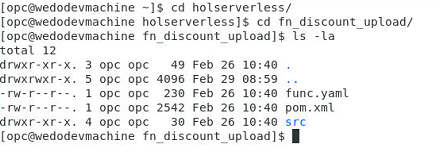

The serverless function should be created at ```src/main/java/com/example/fn/HelloFunction.java``` and you can review the example code with and your IDE or text editor. This file will be change in the next section.

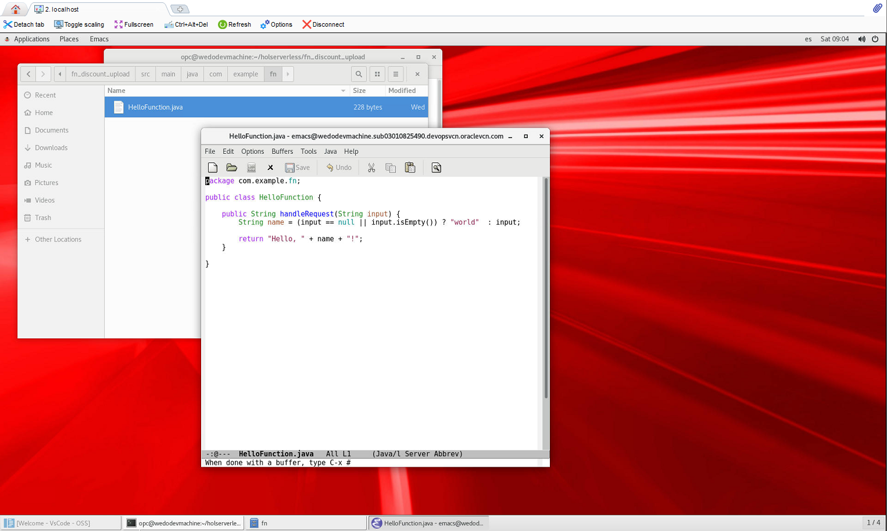

A Junit textfile should be created at ```src/test/java/com/example/fn/HelloFunctionTest.java``` and used to test the serverless function before deploy it in OCI FaaS. We won't use Junit testing in this lab, but you could add some testing Junit file to your serverles function if you want.

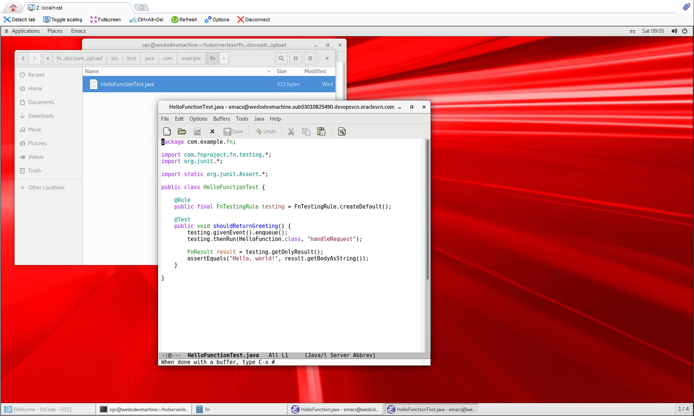

## fn discount upload IDE preparation
You could deploy this new serverless function in your FaaS environment, but the idea is to change the example code by the real function code. You can use a text editor or you favourite IDE software. In this lab we used Visual Studio Code (from the developer machine imagen in OCI marketplace), so all images was captured with that IDE, but you can use what you want.

Open Visual Studio Code (Applications -> Accessories in the development VM) or your favourite IDE 

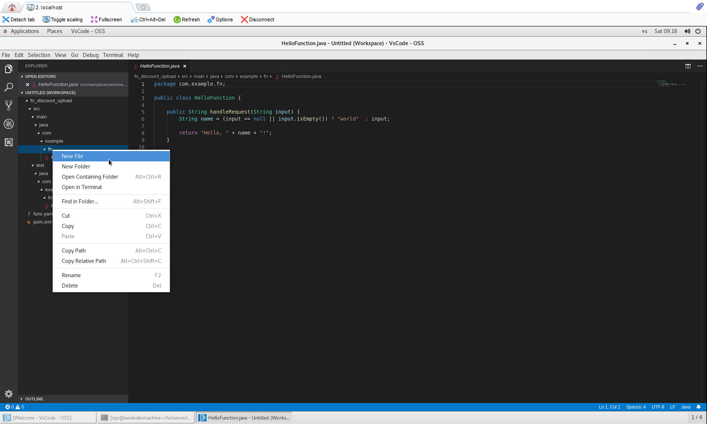

Select **add workspace folder ...** in the Start Menu.

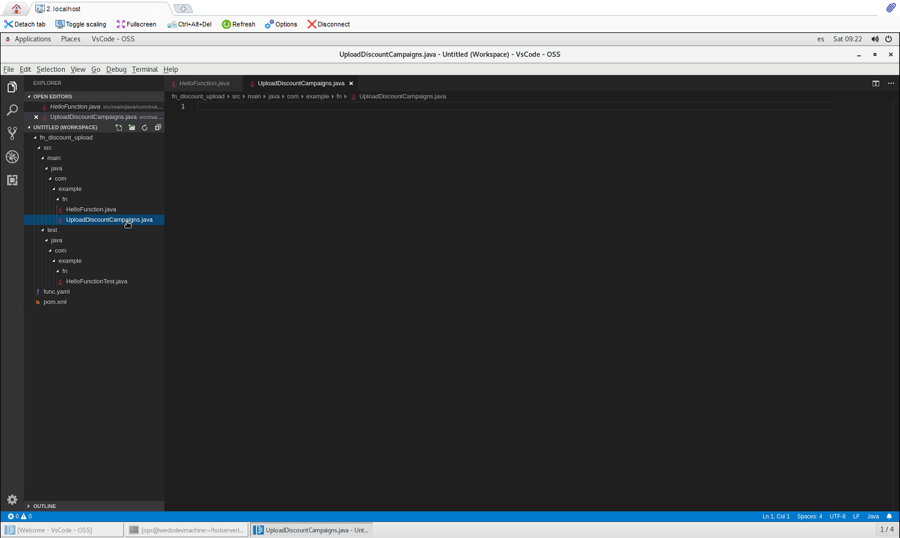

Click in HOME directory and next select the appropiate path to your function project directory [opc/holserverless/fn_discount_upload]. Then click Add button to create a workspace from this directory in Visual Studio Core.

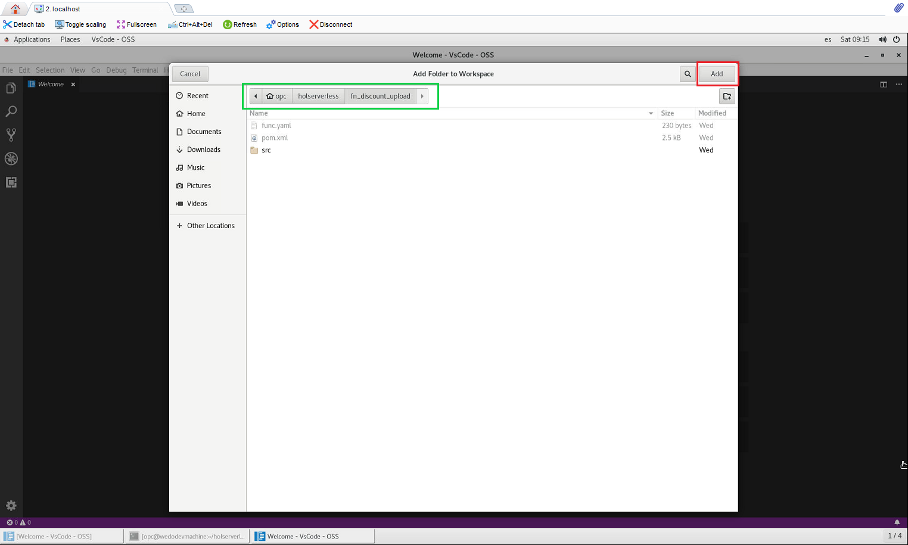

A new project will be available as workspace in the IDE

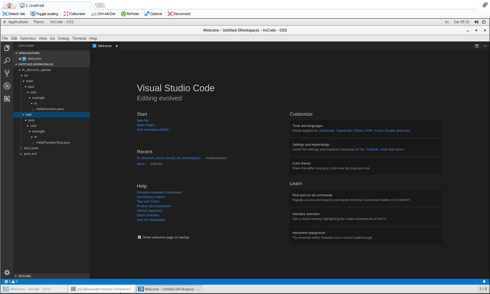

You can click in **HelloFunction.java** to review your serverless function code. Same for **HelloFunctionTest.java** file.

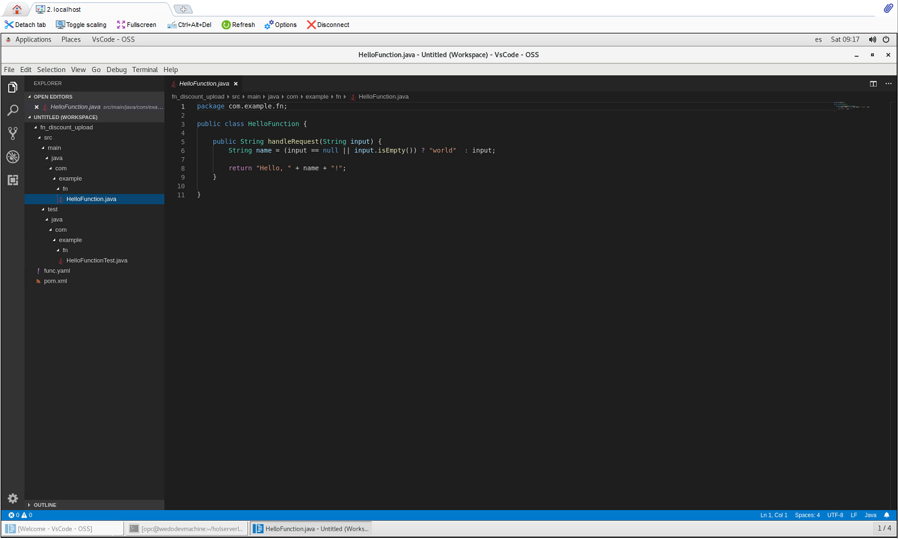

### fn discount upload java code
The function code is in the next github [repository](https://github.com/oraclespainpresales/fn_pizza_discount_upload). You can open it in other web brower tab (```CRTL + mouse click```, to review the project.

You can access java code to copy and paste it in your develpment machine IDE project. You could clone this github repository if you want, instead of copy and paste the different files. You can learn how to clone the git repo in this [section](clone-git project to IDE).

For educational purposes you will change the code created before with ```fn init``` command instead of clone the git repo, but you could use that method to replicate the entire function project.

You can copy the java function code creating a new file with the function name, in the fn directory or overwriting the existing code inside the **[HelloFunction.java]** function and next rename it (F2 key or right mouse button and Rename). We show you both methods in the next sections, please choose one of them.

#### Creating new file
Create new file in ```/src/main/java/com/example/fn``` directory. Right mouse button and then New File.


Then set the same name as java class **[UploadDiscountCampaigns.java]**


Now copy raw function code and paste it from the [java function code](https://raw.githubusercontent.com/oraclespainpresales/fn_pizza_discount_upload/master/src/main/java/com/example/fn/UploadDiscountCampaigns.java).


Delete HelloFunction.java and HelloFunctionTest.java from your IDE project.

#### Overwriting HelloFunction.java
You can overwrite the HelloFunction.java code with the DiscountCampaignUploader Function code.

Select the raw [java function code](https://raw.githubusercontent.com/oraclespainpresales/fn_pizza_discount_upload/master/src/main/java/com/example/fn/UploadDiscountCampaigns.java) from the repository and paste it overwriting the HelloFunction.java Function.

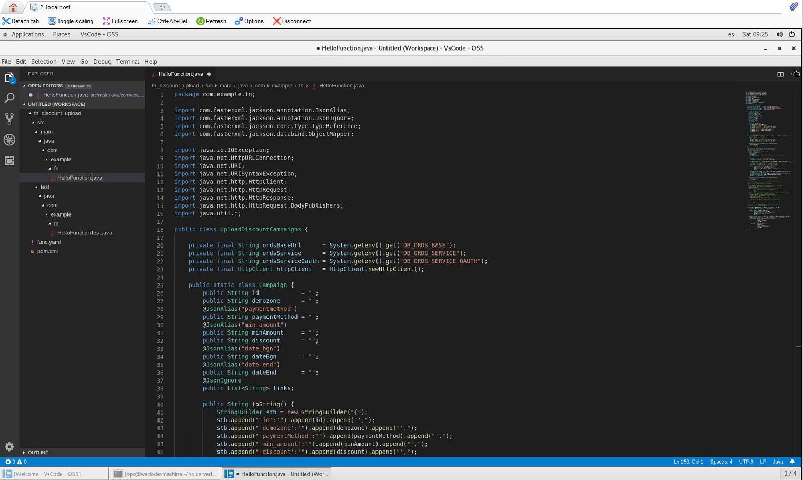

Click right mouse button in the HelloFunction.java file to Rename the file. You can press F2 key to rename the HelloFunction.java file as a shortcut.

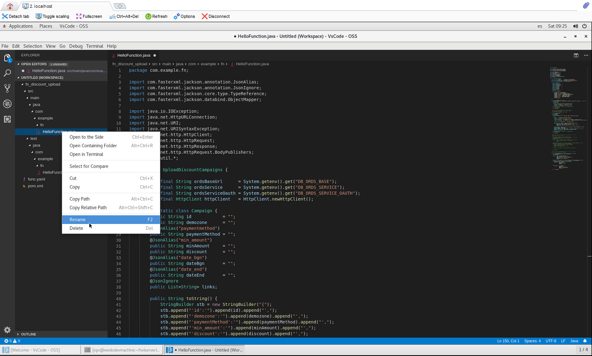

Change the name of the java file to **[UploadDiscountCampaigns.java]**.

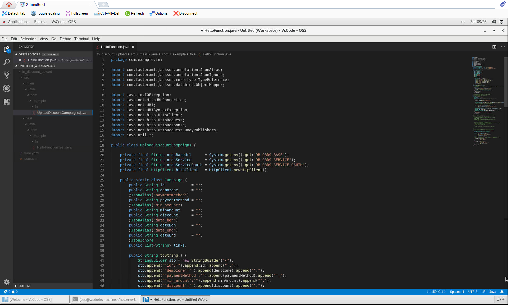

You can delete the HelloFunctionTest.java file (and the test directory tree) or rename it and change the code to create your JUnit tests. In this lab we won't create JUnit test.

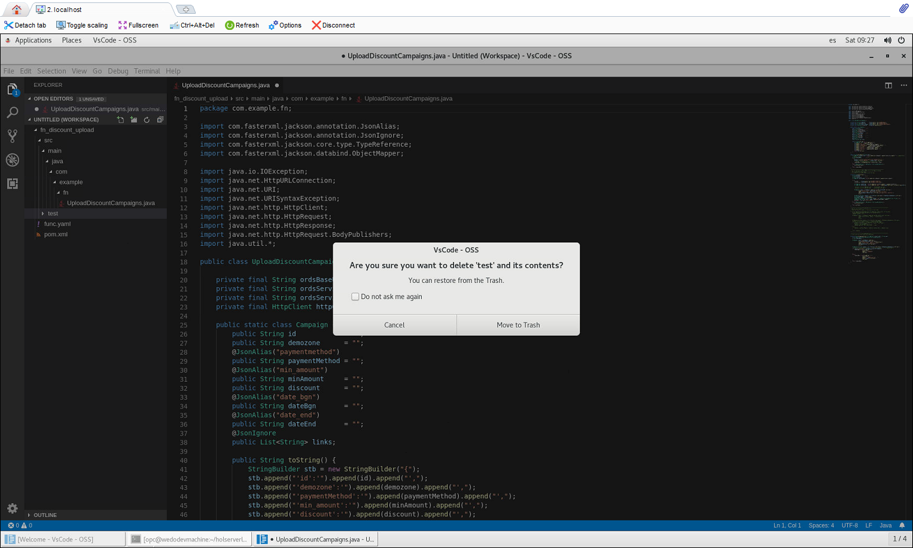

You should have the java function code, the func.yaml and pom.xml files in your project directory right now.

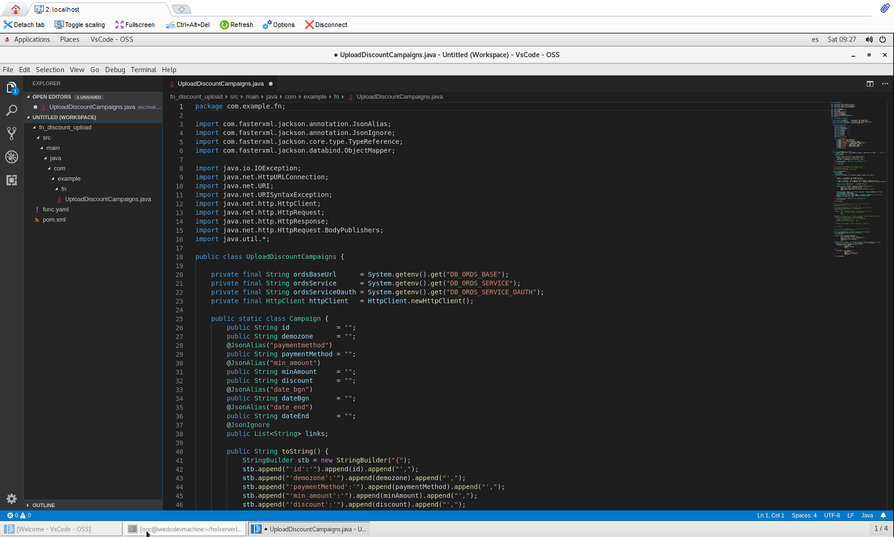

## Changing func.yaml file
You have to delete several files in the func.yaml code to create your custom Docker multi stage file. In you IDE select func.yaml file and delete next lines:

```
runtime: java
build_image: fnproject/fn-java-fdk-build:jdk11-1.0.105
run_image: fnproject/fn-java-fdk:jre11-1.0.105
cmd: com.example.fn.HelloFunction::handleRequest
```
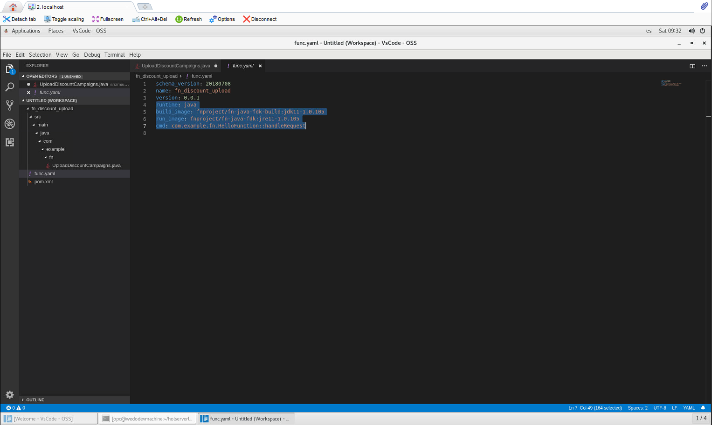

## Overwriting pom.xml file
Next you must overwrite the example maven pom.xml file with the [pom.xml](https://raw.githubusercontent.com/oraclespainpresales/fn_pizza_discount_upload/master/pom.xml) content of the github function project. Maven is used to import all the dependencies and java classes needed to create your serverless function jar. Before click in Save All, review that your dependency **com.fasterxml.jackson.core** version is **2.9.10.1** or higher due a security reasons.

```xml
<dependency>
    <groupId>com.fasterxml.jackson.core</groupId>
    <artifactId>jackson-databind</artifactId>
    <version>2.9.10.1</version>
    <scope>compile</scope>
</dependency>
```
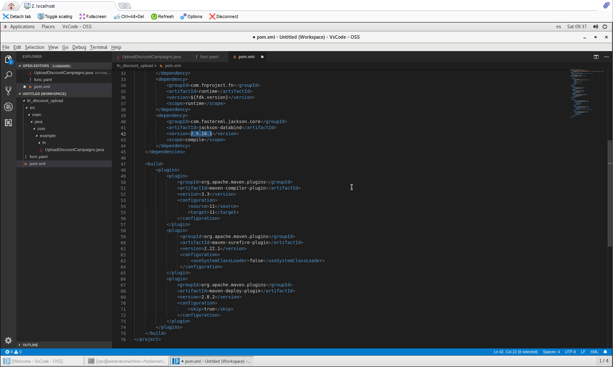

Then click in File -> Save All in your IDE to save the changes.

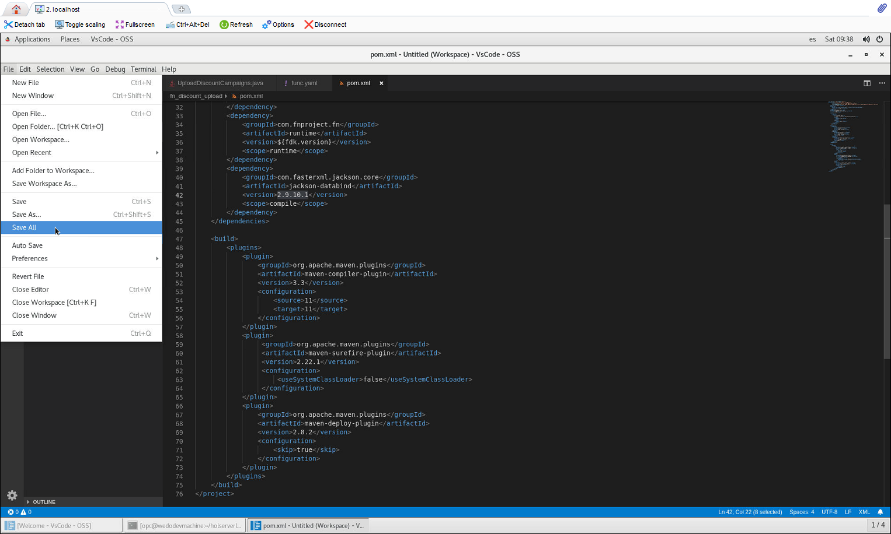

## Creating Multi Stage Dockerfile
You must create a new multi stage docker file, to deploy your serverless function as a docker image in your OCIR repository. This file must be created before deploying the function.

Select fn_discount_cloud_events folder in your IDE and create new file with [Dockerfile] name clicking right mouse button

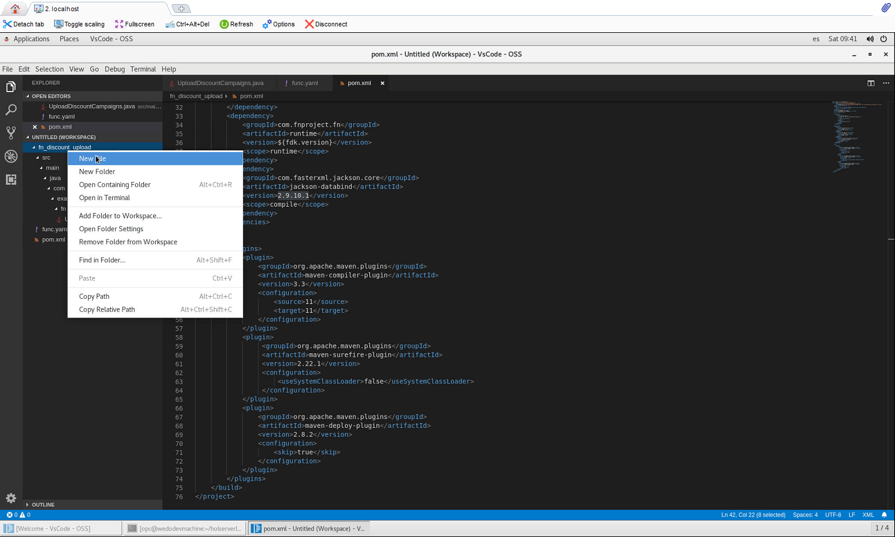

Next copy from raw [Docker file code](https://raw.githubusercontent.com/oraclespainpresales/fn_pizza_discount_upload/master/Dockerfile) to your new local Dockerfile file.

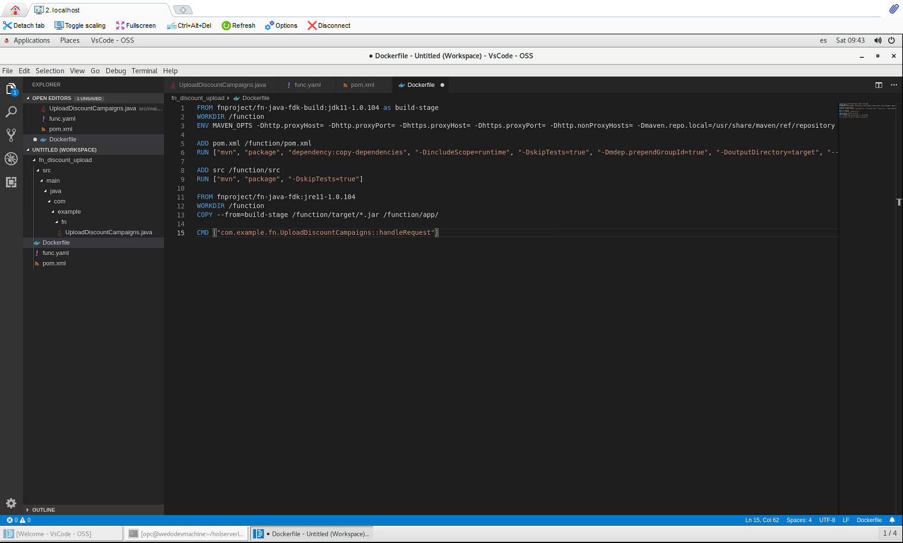

After that, click in File -> Save All in your IDE to save all changes.

## Deploy fn discount upload function
To deploy your serverless function please follow next steps, your function will be created in OCI Functions inside your serverles app [gigis-serverless-hol]. 

Open a terminal in your development machine and execute:
```sh
cd $HOME/holserverless/fn_discount_upload
```
Then you must login in OCIR registry with ```docker login``` command. Introduce your OCI user like ```<namespace>/<user>``` when docker login ask you about username and your previously created **OCI Authtoken** as password.
```sh
docker login fra.ocir.io
```


You must execute next command with ```--verbose``` option to get all the information about the deploy process.
```sh
fn --verbose deploy --app gigis-serverless-hol
```

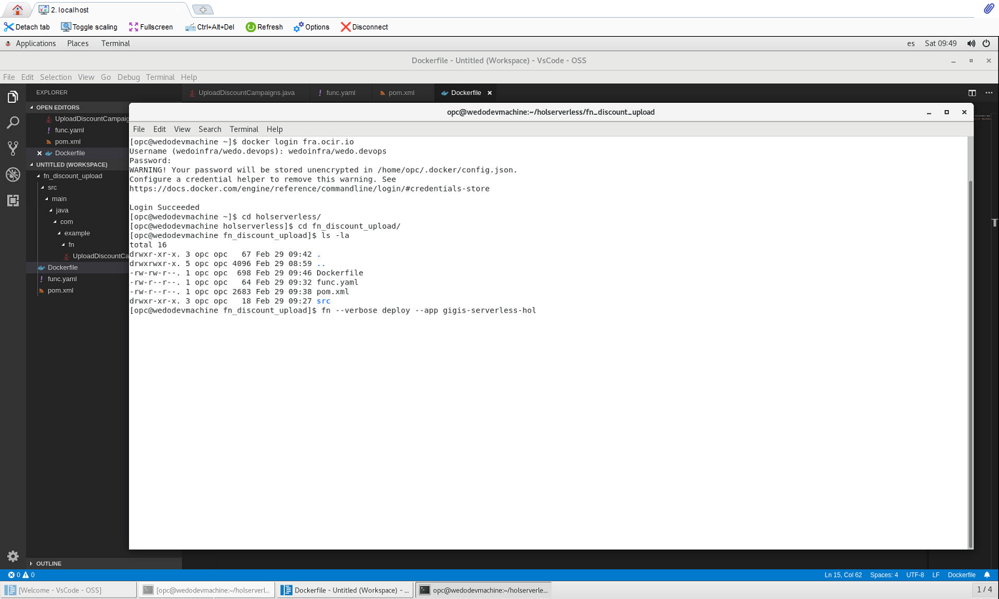

Wait to maven project download dependencies and build jar, docker image creation and function deploy in OCI serverless app finish.

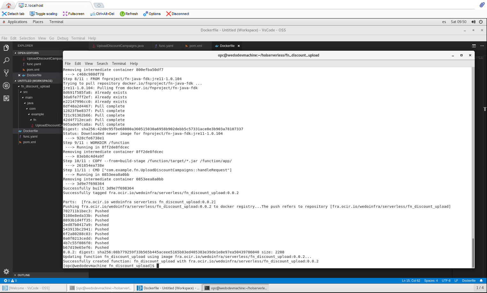

Check that your new function is created in your serverless app [gigis-serverless-hol] at Developer Services -> Functions menu.


Click in the function name **fn_discount_upload**, click in show OCID and show Endpoint and note their ids as you will need them to create the environment variables in **fn_discount_cloud_events** function section in the next function creation.

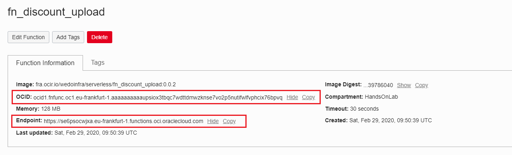

You must change your Fucntion time-out. Click in Edit Function button and then change **TIMEOUT** from [30] to [120] seconds. Then Click Save Changes Button.

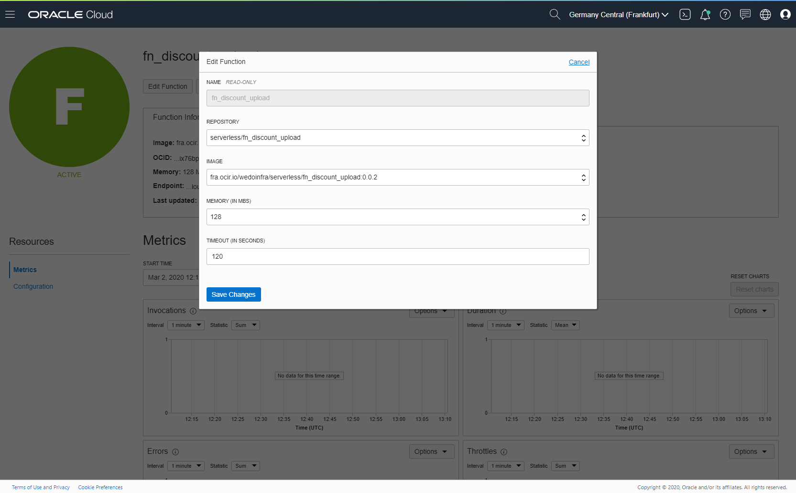

Now you can continue with the creation of the next [fn_discount_cloud_events](https://github.com/oraclespainpresales/GigisPizzaHOL/blob/master/fn_pizza_discount_cloud_events.md) serverless function or optionally review the code to know more about this serverless function.

## Code recap (OPTIONAL)
You copy the function code and made several changes in the configuration files like func.yaml and pom.xml then you created a new Dockerfile to deploy the function. Now we'll explain this changes:

### UploadDiscountCampaigns.java
Your function name is the same as main class and this class must have a public handleRequest method. String invokeEndpointURL and String functionId variables must be changed to call your [UploadDiscountCampaigns] function. 

This function class has another Object class named Campaign, used to create campaign objects received from cloud-event function as a json format. With **@JasonAlias** annotation you can parse the json parameter name to class parameter name. 

For example if you have received a json campaign as: ```{"demozone": "MADRID","paymentmethod": "VISA","date_bgn": "2020-02-17T00:00:00Z","date_end": "2020-02-22T00:00:00Z","min_amount": "15","discount": "10"}``` and you pass it to Campaign constructor like 
```campaign = new ObjectMapper().readValue(response.body(), Campaign.class);```, paymentmethod jason parameter will be assigned to paymentMethod Campaign parameter, same for min_amout to minAmount, date_bgn to dateBgn and date_end to dateEnd.

The variable ```StringBuilder ordsServiceUrl = new StringBuilder(ordsBaseUrl).append(ordsService).append("/");``` get the information from environment variables: ordsBaseUrl, ordsService, ordsServiceOauth to compose the ORDS Service URL.

```java
public class UploadDiscountCampaigns {

    private final String ordsBaseUrl      = System.getenv().get("DB_ORDS_BASE");
    private final String ordsService      = System.getenv().get("DB_ORDS_SERVICE");
    private final String ordsServiceOauth = System.getenv().get("DB_ORDS_SERVICE_OAUTH");
    private final HttpClient httpClient   = HttpClient.newHttpClient();

    public static class Campaign {
        public String id            = "";
        public String demozone      = "";
        @JsonAlias("paymentmethod")
        public String paymentMethod = "";
        @JsonAlias("min_amount")
        public String minAmount     = "";
        public String discount      = "";
        @JsonAlias("date_bgn")
        public String dateBgn       = "";
        @JsonAlias("date_end")
        public String dateEnd       = "";
        @JsonIgnore
        public List<String> links;

        public String toString() {
            StringBuilder stb = new StringBuilder("{");
            stb.append("'id':'").append(id).append("',");
            stb.append("'demozone':'").append(demozone).append("',");
            stb.append("'paymentMethod':'").append(paymentMethod).append("',");
            stb.append("'min_amount':'").append(minAmount).append("',");
            stb.append("'discount':'").append(discount).append("',");
            stb.append("'date_ini':'").append(dateBgn).append("',");
            stb.append("'date_end':'").append(dateEnd).append("'");
            stb.append("}");
            return stb.toString();
        }
    }

    public String handleRequest(String input) {
        StringBuilder ordsServiceUrl = new StringBuilder(ordsBaseUrl).append(ordsService).append("/");//.append(input);
        //Campaign campaign            = null;
        String responseMess          = "";
        try {
            System.err.println("inside Load Discount Campaign Function!");
            System.err.println("ORDS URL: " + ordsServiceUrl.toString());
            //campaign = getCampaignDiscount (ordsServiceUrl, input);
            responseMess = setCampaignDiscount (ordsServiceUrl, input);
        }
        catch (URISyntaxException | IOException | InterruptedException e) {
            e.printStackTrace();
        }
        return responseMess;
    }
```
As you can see ```campaign = getCampaignDiscount (ordsServiceUrl, input);``` is commented as we created a getCampaignDiscount method also commented, for testing purpouses only. This method retrieve a campaign file from the ATP db and create a Campaign object. But you won't be use it in the demo so we commented it.
```java
/************************getCampaignDiscount ********************************** 
     * get one row from ATP
     * input must be an id number or field value in json format
    */
    /* private Campaign getCampaignDiscount (StringBuilder ordsServiceUrl, String input) 
        throws URISyntaxException,IOException,InterruptedException {
        Campaign campaign = null;
        
        HttpRequest request = HttpRequest.newBuilder(new URI(ordsServiceUrl.toString()))
                    .header("Authorization", "Bearer " + getAuthToken())
                    .GET()
                    .build();

        HttpResponse<String> response = this.httpClient.send(request, HttpResponse.BodyHandlers.ofString());
        System.err.println("Response HTTP:::" +response.statusCode());
        if( response.statusCode() == HttpURLConnection.HTTP_NOT_FOUND ) {
            System.err.println("Campaign with id " + input + " not found!");
            campaign = new Campaign();
            campaign.demozone = "NOT FOUND RECORD " + input;
        }
        else {
            campaign = new ObjectMapper().readValue(response.body(), Campaign.class);
        }
        
        return campaign;
    } */
```
The setCamapignDiscount method is used to send a discount campaign to ATP DB via ORDS and create a new File in CAMPAIGN Table. Responses vary depends on the response type: INSERTED if the response is a StatusCode = HTTP_CREATED or ERROR otherwise. 
```java
    /************************setCampaignDiscount ********************************** 
     * insert one row in ATP from a json format data
    */
    private String setCampaignDiscount (StringBuilder ordsServiceUrl, String input) 
        throws URISyntaxException,IOException,InterruptedException {
        String responseMess = "";
        
        HttpRequest request = HttpRequest.newBuilder()
                    .uri(new URI(ordsServiceUrl.toString()))
                    .header("Authorization", "Bearer " + getAuthToken())
                    .header("Content-Type", "application/json")
                    .POST(BodyPublishers.ofString(input))
                    .build();

        HttpResponse<String> response = this.httpClient.send(request, HttpResponse.BodyHandlers.ofString());
        //System.err.println("Response HTTP:::" +response.statusCode() + " " + response.body());
        if( response.statusCode() == HttpURLConnection.HTTP_CREATED) {
            responseMess = new StringBuilder ("[")
                            .append(input)
                            .append("] - INSERTED")
                            .toString();
        }
        else {
            responseMess = new StringBuilder ("[")
                            .append(input)
                            .append("] - ERROR insertion!! - ")
                            .append(response.statusCode())
                            .toString();
        }
        return responseMess;
    }
```
Last method use the getAuthToken method to connect to ATP via ORDS with authToken credentials. This method generates a 1h access token to the ATP DB getting the OAuth data from environment variales: DB_ORDS_CLIENT_ID and DB_ORDS_CLIENT_SECRET previously configured in your serverless application in OCI. Remember that this two values where created when you expose the campaign schema in the [ATP ORDS configuration](https://github.com/oraclespainpresales/GigisPizzaHOL/blob/master/gigis-serverless-HOL.md#atp-ords-configuration).
```java
    /************************GET TOKEN ********************************** 
     * get the appropiate token to Oauth access with ORDS to ATP DB
     * this is an only 1h hour Token
     * use CLIENT_ID and CLIENT_SECRET to get the token
    */
    private String getAuthToken() {
        String authToken           = "";
        String clientId            = "";
        String clientSecret        = "";
        StringBuilder authTokenURL = new StringBuilder(ordsBaseUrl).append(ordsServiceOauth);

        try {
            clientId     = System.getenv().get("DB_ORDS_CLIENT_ID");
            clientSecret = System.getenv().get("DB_ORDS_CLIENT_SECRET");

            StringBuilder authString   = new StringBuilder(clientId).append(":").append(clientSecret);
            StringBuilder authEncoded  = new StringBuilder("Basic ").append(Base64.getEncoder().encodeToString(authString.toString().getBytes()));

            //System.err.println("ORDS URL token: " + authTokenURL.toString());
            //System.err.println("ORDS URL 64B  : " + authEncoded.toString());

            HttpRequest request = HttpRequest.newBuilder(new URI(authTokenURL.toString()))
                    .header("Authorization", authEncoded.toString())
                    .header("Content-Type", "application/x-www-form-urlencoded")
                    .POST(HttpRequest.BodyPublishers.ofString("grant_type=client_credentials"))
                    .build();

            HttpResponse<String> response = this.httpClient.send(request, HttpResponse.BodyHandlers.ofString());
            String responseBody = response.body();
            ObjectMapper mapper = new ObjectMapper();
            TypeReference<HashMap<String, String>> typeRef = new TypeReference<HashMap<String, String>>() {};
            HashMap<String, String> result = mapper.readValue(responseBody, typeRef);
            authToken = result.get("access_token");
        }
        catch (URISyntaxException | IOException | InterruptedException e) {
            e.printStackTrace();
        }
        return authToken;
    }
```


### func.yaml

```yaml
schema_version: 20180708
name: fn_discount_cloud_events
version: 0.0.1
```
You must have deleted this 4 lines to create your customized Dockerfile. This lines are using to setup the default deploy fn docker images for java.
```
runtime: java
build_image: fnproject/fn-java-fdk-build:jdk11-1.0.105
run_image: fnproject/fn-java-fdk:jre11-1.0.105
cmd: com.example.fn.HelloFunction::handleRequest
```
Last line is the entry point to execute the function. Represent the path to the funcion name and handleRequest public method and you can find it in the new Dockerfile as CMD command.
```
cmd: com.example.fn.HelloFunction::handleRequest
```
Last line is the entrypoint to execute the function. Represent the path to the funcion name [HelloFunction] and [handleRequest] public method. Also you will find it in the new multi stage Dockerfile as CMD command.
```
cmd: com.example.fn.HelloFunction::handleRequest
```
### pom.xml
Pom.xml file is your maven project descriptor. First of all you must review properties, groupId, artifactId and version. In properties you select the fdk version for your project. GroupId is the java path to your class. ArtifactId is the name of the artifact to create and version is its version number [1.0.104].
```xml
    <properties>
        <project.build.sourceEncoding>UTF-8</project.build.sourceEncoding>
        <fdk.version>1.0.104</fdk.version>
    </properties>
    <groupId>com.example.fn</groupId>
    <artifactId>discountcampaignuploader</artifactId>
    <version>1.0.0</version>
```
In repositories section you must describe what repositories will be used in your project. For this serverless function you will use only one repository (fn repository) but you could add more repositories as your needs.
```xml
    <repositories>
        <repository>
            <id>fn-release-repo</id>
            <url>https://dl.bintray.com/fnproject/fnproject</url>
            <releases>
                <enabled>true</enabled>
            </releases>
            <snapshots>
                <enabled>false</enabled>
            </snapshots>
        </repository>
    </repositories>
 ```
In the dependencies section you will describe your classes dependencies, for example the cloud-event api, de fn api or classes to parse and write json files. Check your **com.fasterxml.jackson.core** for [security reasons](https://github.com/oraclespainpresales/fn_pizza_discount_upload/network/alert/pom.xml/com.fasterxml.jackson.core:jackson-databind/open)
```xml
    <dependencies>
        <dependency>
            <groupId>com.fnproject.fn</groupId>
            <artifactId>api</artifactId>
            <version>${fdk.version}</version>
        </dependency>
        <dependency>
            <groupId>com.fnproject.fn</groupId>
            <artifactId>runtime</artifactId>
            <version>${fdk.version}</version>
            <scope>runtime</scope>
        </dependency>
        <dependency>
            <groupId>com.fasterxml.jackson.core</groupId>
            <artifactId>jackson-databind</artifactId>
            <version>2.9.10.1</version>
            <scope>compile</scope>
        </dependency>
    </dependencies>    
```
Build section is used to define the maven and other building configurations like jdk version [11] for example.
```xml
    <build>
        <plugins>
            <plugin>
                <groupId>org.apache.maven.plugins</groupId>
                <artifactId>maven-compiler-plugin</artifactId>
                <version>3.3</version>
                <configuration>
                    <source>11</source>
                    <target>11</target>
                </configuration>
            </plugin>
            <plugin>
                 <groupId>org.apache.maven.plugins</groupId>
                 <artifactId>maven-surefire-plugin</artifactId>
                 <version>2.22.1</version>
                 <configuration>
                     <useSystemClassLoader>false</useSystemClassLoader>
                 </configuration>
            </plugin>
            <plugin>
                <groupId>org.apache.maven.plugins</groupId>
                <artifactId>maven-deploy-plugin</artifactId>
                <version>2.8.2</version>
                <configuration>
                    <skip>true</skip>
                </configuration>
            </plugin>
        </plugins>
    </build>
```
### Dockerfile
You created a multi stage Dockerfile to customize the serverless function deploy. You have several stages before to create the final image docker. This intermediate stages are not included in the final image. In this dockerfile first stage is created from a JDK11 of fn project docker image [1.0.104 version] to create the jar function file.
```dockerfile
FROM fnproject/fn-java-fdk-build:jdk11-1.0.104 as build-stage
WORKDIR /function
ENV MAVEN_OPTS -Dhttp.proxyHost= -Dhttp.proxyPort= -Dhttps.proxyHost= -Dhttps.proxyPort= -Dhttp.nonProxyHosts= -Dmaven.repo.local=/usr/share/maven/ref/repository

ADD pom.xml /function/pom.xml
RUN ["mvn", "package", "dependency:copy-dependencies", "-DincludeScope=runtime", "-DskipTests=true", "-Dmdep.prependGroupId=true", "-DoutputDirectory=target", "--fail-never"]

ADD src /function/src
RUN ["mvn", "package", "-DskipTests=true"]
```
Copy the jar function from build stage temporal layer and set the entrypoint to execute the funcion handleRequest method when the docker container will be created.
```dockerfile
FROM fnproject/fn-java-fdk:jre11-1.0.104
WORKDIR /function
COPY --from=build-stage /function/target/*.jar /function/app/

CMD ["com.example.fn.UploadDiscountCampaigns::handleRequest"]
```
# Continue the HOL

* [fn_discount_cloud_events](https://github.com/oraclespainpresales/GigisPizzaHOL/blob/master/serverless/fn_pizza_discount_cloud_events.md)
