# Gigi's Discount Campaigns - Serverless HOL
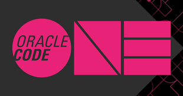](https://www.oracle.com/code-one/)

This HOL is based in a Demo developed by Spain Presales Tech Team as part of an innovation initiative to approach Oracle Cloud Solutions by providing practical examples that could be “touched” and easily understood.

Demo is known as Gigi’s Pizza. This Use Case is focused in serverless (fn) and Autonomous DataBase. In Gigi's Pizza demo we have three microservices coded in different languages like nodejs and of course Java (Helidon framework). This three microservices are part of a delivery pizza app, one microservice controls the orders, other one controls the pizza delivery and the last one controls the accounting. 


In the first demo version, we had one serverless function that got you a pizza price discount acording to a basic bussiness rule, if the pizza price was between 10$ - 15$ you received discount of 1%, if the pizza price was between 15$ - 19$ you received 2% and if the pizza price was over 19$ you received a 2% discount. It was very interesting to show a basic serverless function and graalvm compiler, but the idea is to show you more about serverless. Now we show you a more elaborated serverless app and you can touch it and modify the code as your needs.


This serverless Hands On Lab includes:

* Oracle ATP - Autonomous Transaction Processing - Autonomous Database as main repository.
* Oracle ORDS (REST) access to ATP using serverless Functions.
* Oracle JDBC access to ATP using serverless Functions.
* Oracle Cloud Infrastructure - Object Storage to upload json files with discount campaigns.
* CloudEvents to trigger this json files and upload them to the ATP.
* Oracle managed Functions (serverless fn based) to upload data, get data and send it to microservices.

## In this Hands on Lab

All HOL was written in English and all the screenshots are in English Language. We recomend you that select English as your default language in Oracle Cloud. Select the Earth Icon at the top right (near your profile icon) and change the language to English.

In this HOL you will create a serverless app for discount campaigns. 
You will:

- Create and Configure a **VCN Virtual Cloud Network** to connect the serverless functions.
- Create and Configure an **ATP (Autonomous Database)** to store the discount campaign.
- Create an **OCI Object Storage** to upload the json files.
- Create a **CloudEvents** trigger to upload automatically the campaigns to ATP.
- Create a discount campaign **json file** like this:

```yaml
{
  "campaigns": [
    {
    "demozone": 'MADRID',
    "paymentmethod": "VISA",
    "date_bgn": "2020-01-21T00:00:00Z",
    "date_end": "2020-01-22T00:00:00Z",
    "min_amount": "15",
    "discount": "10"
    },
    {
    "demozone": "MADRID",
    "paymentmethod": "AMEX",
    "date_bgn": "2020-01-21T00:00:00Z",
    "date_end": "2020-01-22T00:00:00Z",
    "min_amount": "7",
    "discount": "10"
    }
  ]
}
```

- Create **2 serverless Functions** to capture the event, process the file and upload the data to ATP PDB.
- Create **1 serverless Function** to get the discount amount for a pizza order

If you attend our previous HOL about Gigi's pizza, you had created a Cloud Account and DevCS instance, but if you don't have any Oracle Cloud Account you could create one, following the first step of the LAB. 

(OPTIONAL) All the code project could be stored in a project and GIT repos in Developer Cloud Service. if you attended our previous LAB about microservices (gigi's pizza) before, you should have a DevCS instance with the Gigi's project copied on it. You can use that DevCS instance and the same Gigi's project to do this optional part.

## Setting up an Oracle Cloud Account

As an attendee to OOW/CodeOne 19 you have been provided with access to a free trial account part of Free Oracle Cloud Program with 500$ / 30 days trial. This trial is associated with the email address you used to register to event.

Go to [<span class="underline">http://cloud.oracle.com</span>](http://cloud.oracle.com) and click in the “Try for Free” button in the top right:

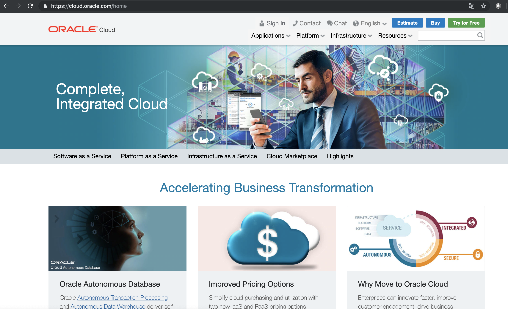

Then enter your email address and select your Country/Territory:

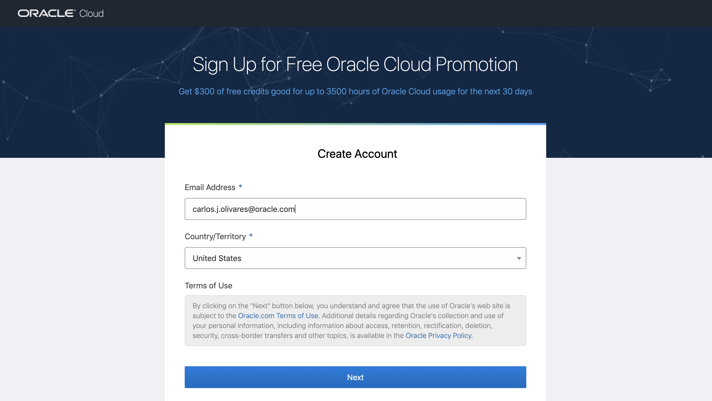

The system will detect that your email address has been whitelisted as Oracle attendee and you will be offered a free trial with no need to use a credit card or sms. Trial offered is for 500$ for 30 days.


Fill in required fields. For account type, select “Personal Use”. Select a name for your trial tenancy, a region and the rest of details:


Then enter a password required to authenticate in your tenancy when provisioned. Remember password has to be longer than 12 character and including at least an upper character and a special character:

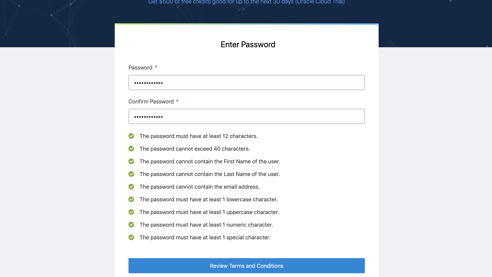

Accept the Terms and Conditions:


And you will be redirected to the initial page or Oracle Cloud Infrastructure to authenticate for the first time in your tenancy:

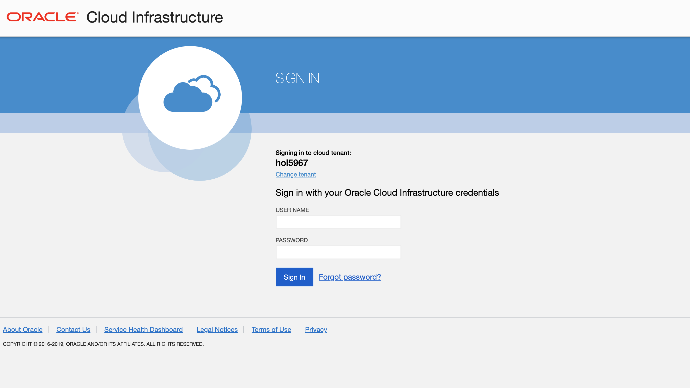

Enter your user and password just created:

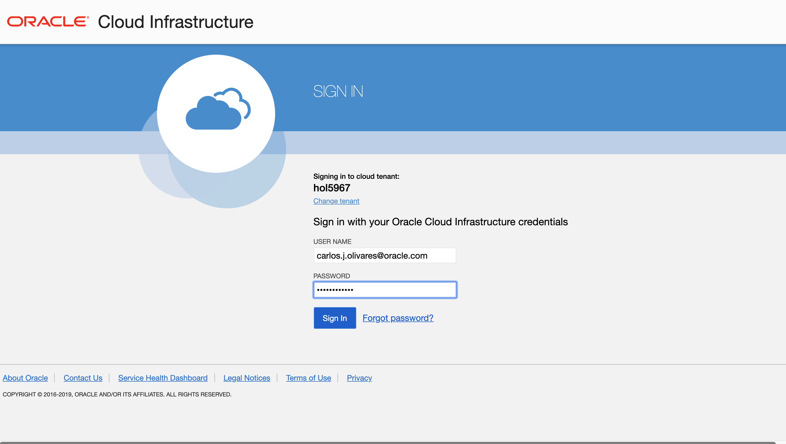

And you will be directed to initial Oracle Cloud Infrastructure Dashboard (referred from now on as OCI Dashboard):


## Getting key config data from Oracle Cloud Tenancy

Now before we are able to configure a Developer Cloud Service Instance, let’s gather some key info about our OCI tenancy that will be required throughout the whole lab. So we recommend you to create a txt file where you store this basic info you will be required to use several times during this lab:

  - Tenancy OCID
  - User OCID
  - Private Key
  - Public Key
  - Fingerprint
  - Auth Token
  - Compartment OCID
  - Object Storage Namespace

### How to get OCI tenancy config data

In Oracle Cloud Infrastructure interface menu, go to Administration-\>Tenancy Details:

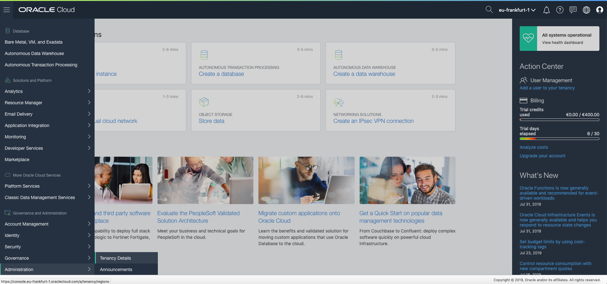

In Tenancy information area, select copy button so that you copy the OCID for tenancy and don’t forget to make a note in a txt file.

Also copy the Object Storage Namespace under the Object Storage Setting area and don’t forget to make a note in a text file.


Now go to Menu option Identity-\>Users:

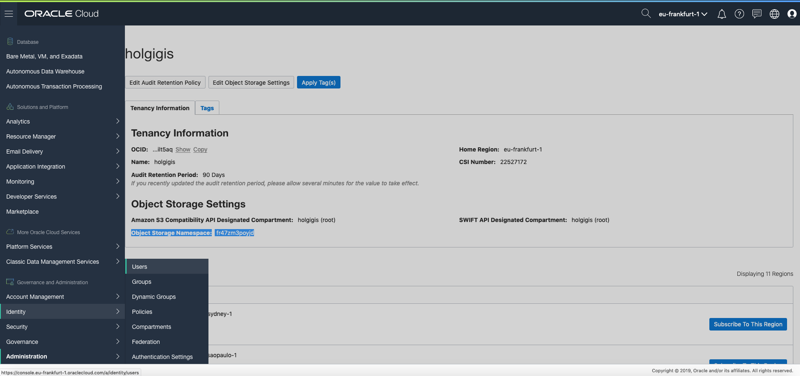

In Users area, click on copy button for your email address user(remember this user has admin role in OCI tenancy) so that you can copy the user’s OCID. Don’t forget to make a note in a txt file.


Now we will create an Auth token for the user by using a public and private key. We will provide you with two already created .pem keys to download in:

[<span class="underline">https://github.com/oraclespainpresales/GigisPizzaHOL/tree/master/microservices/Credentials</span>](https://github.com/oraclespainpresales/GigisPizzaHOL/tree/master/microservices/Credentials)

First thing you need to do is viewing content of Private Key and copying private key, making a note in a txt file. Then do the same with public key and copy content into clipboard.

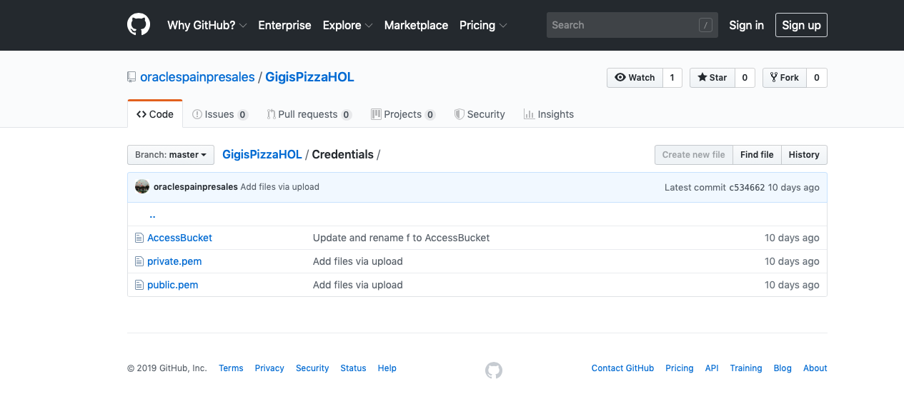

Now click in your email user and you will be directed to a details screen, where you must click in Api Keys area in “Add Public Key”
button.

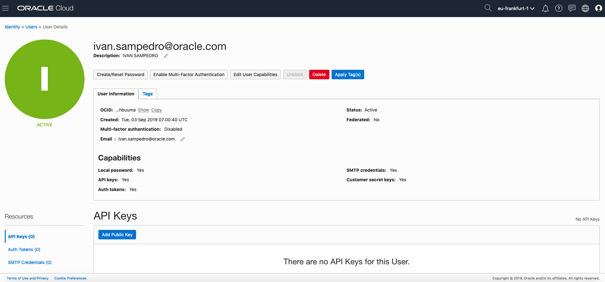

Now paste in popup window the Public Key previously copied in clipboard. Make sure you have copied public.pem content and not private.pem content. Click in Add button.


Now copy Fingerprint generated as it will be used later. Don’t forget to make a note in a txt file.

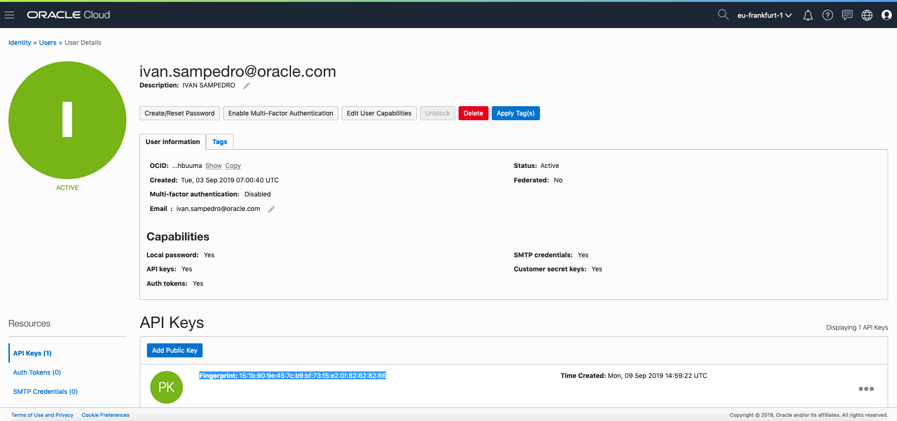

Now create parameter required (AuthToken) by clicking in Auth Tokens under Resources area, clicking in Generate Token button and then
providing a description:

IMPORTANT REMINDER :grey_exclamation::grey_exclamation:: AFTER YOU CLICK IN Generate Token Button, COPY THIS AUTHTOKEN AND KEEP SAFE AS IT CANNOT BE FOUND LATER


IMPORTANT: Copy the Generated Token in a txt file and keep safe as we will require it later:


Now we have to create a new Compartment as currently we only have the root one in tenancy by default. In OCI Dashboard Menu go to
Identity-\>Compartments 


Click on “Create Compartment” button and fill in Name(we have called it
HandsOnLab), Description and Parent Compartment(it must be root referred
with Tenancy name) and click in “Create Compartment” button:


Now click in Compartment name you have just created (HandOnLab for me):


And click on copy link to copy the Compartment OCID. Don’t forget to make a note in a txt file.

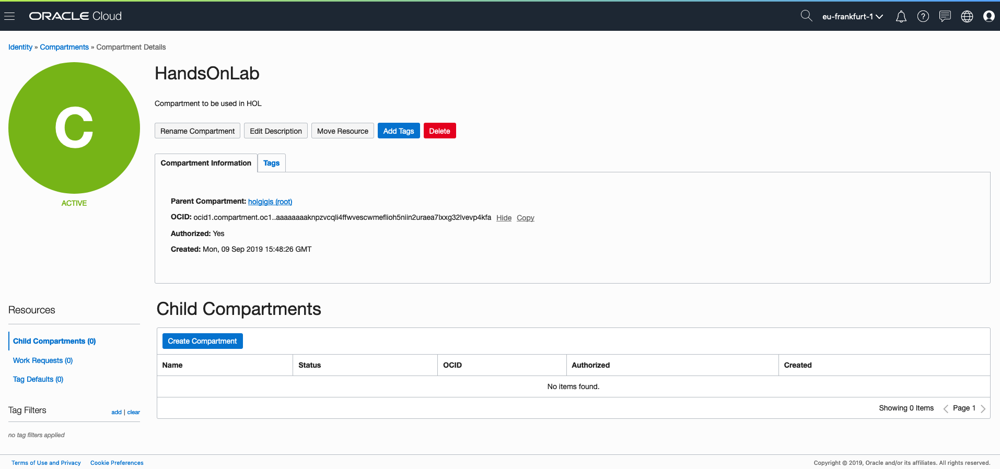

This concludes the list of OCI tenancy parameters you will require to run next section.

## Create OCI Resources
- VCN - Virtual Cloud Network
- Object Storage
- ATP - Autonomous Transaction Processing
- IAM FaaS Policy
- Function App
- Cloud Events

## VCN - Virtual Cloud Network Creation
If you have created previously a VCN in your compartment, you can use it instead of create a new one, but if you don't have any VCN created, please follow next steps:

Go to Core Infrastructure -> Networking in the main menu and click in Virtual Cloud Networks.

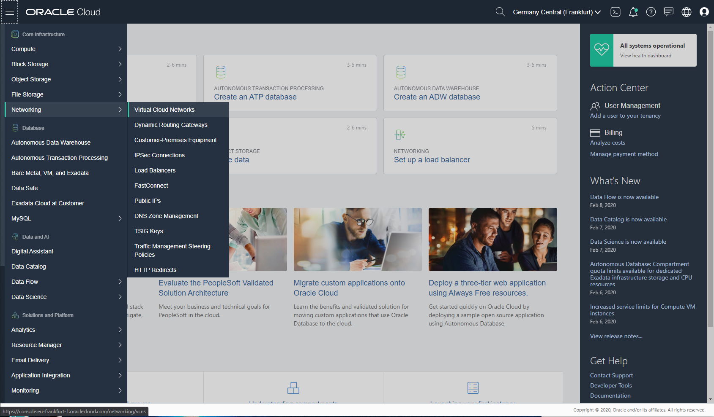

Check that you are in you HandsOnLab compartment. If the compartment doesn't appear in the dropdown list, please refresh your browser (F5). After refreshing, select the HandsOnLab compartment. Then click Networking Quickstart button.

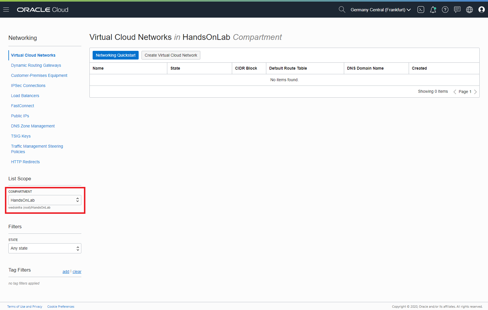

Select VCN with Internet Connectivity if it's not selected and click Start Workflow button


Write a descriptive name for the new VCN like functions-vcn or something like that. Check the compartment name [HandsOnLab]. Then write the CIDRs for public and private networks. You can copy them from the Example text.

* VCN CIDR BLOCK: **10.0.0.0/16**
* PUBLIC SUBNET CIDR BLOCK: **10.0.0.0/24**
* PRIVATE SUBNET CIDR BLOCK: **10.0.1.0/24**

Click Next button to continue the creation process

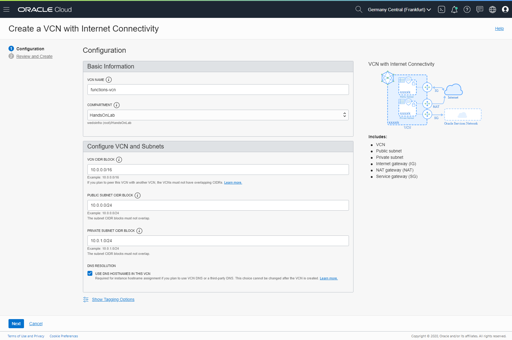

Review and check data for the new vnc and click Create button

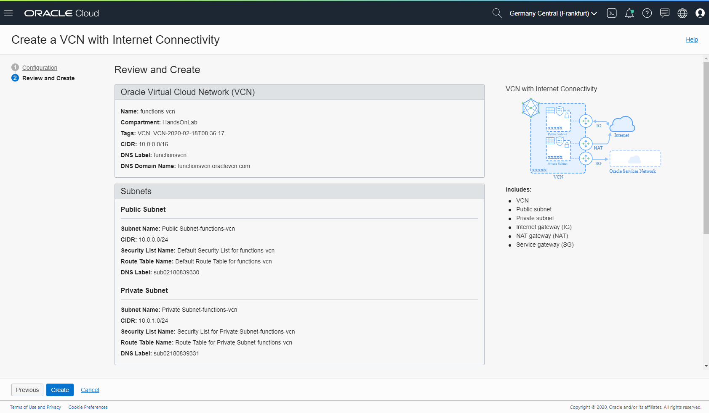

You should see a creation process window. It takes a few second to create the new vnc.

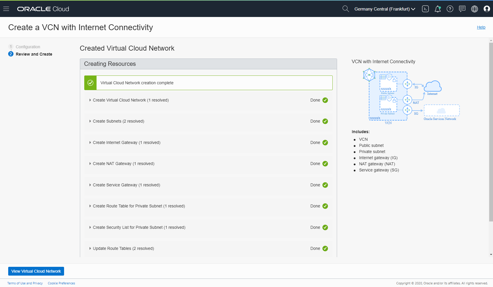

You new vnc should be created. You can check vnc subnets (2 networks: public and private), route tablets, internet gateway and so. You can click on Security List to check available open ports for example.

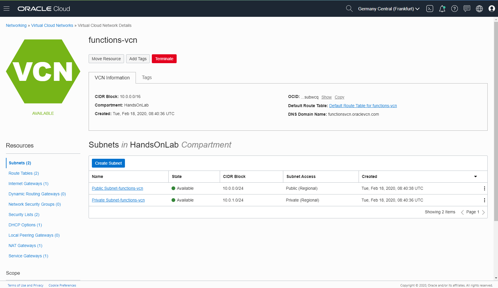

### Virtual Developer cloud Machine
After VNC creation would be a good time to create your [developer cloud machine](https://github.com/oraclespainpresales/GigisPizzaHOL/blob/master/devmachine-marketplace/devmachine-marketplace.md) if don't have one  with the appropiate software [requisites](https://github.com/oraclespainpresales/GigisPizzaHOL/blob/master/developer-machine/developer-machine.md).

## Object Storage Creation
Once you created a VNC, you will need an Object Storage element to upload discount campaign json files. Let's create an Object Storage Bucket following next steps:

Go to Core Infrastructure -> Object Storage in the main menu and click in Object Storage.


Check your campartment name [HandsOnLab] and click Create Bucket button.

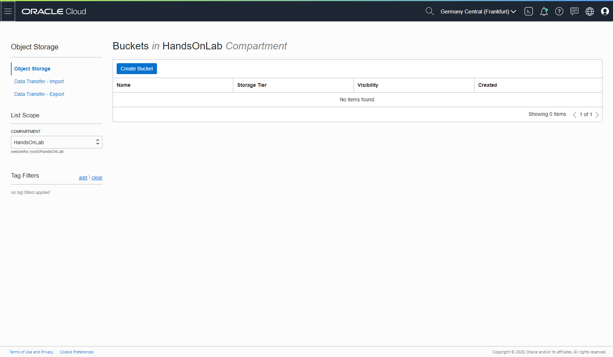

Write a descriptive name for the bucket as GigisDiscountCampaigns-Bucket or something like that. Then check STANDARD selection, check EMIT OBJECT EVENTS to enable CloudEvents in this bucket and check ENCRYPT USING ORACLE MANAGED KEYS. Next click Create Bucket button.

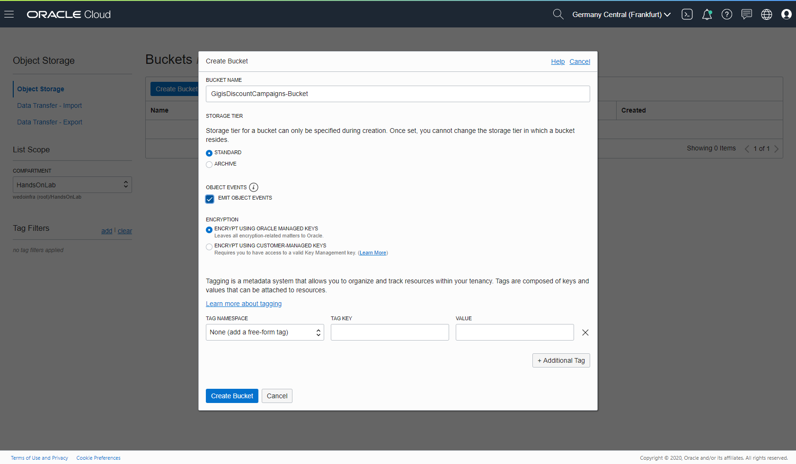

Review you new bucket.

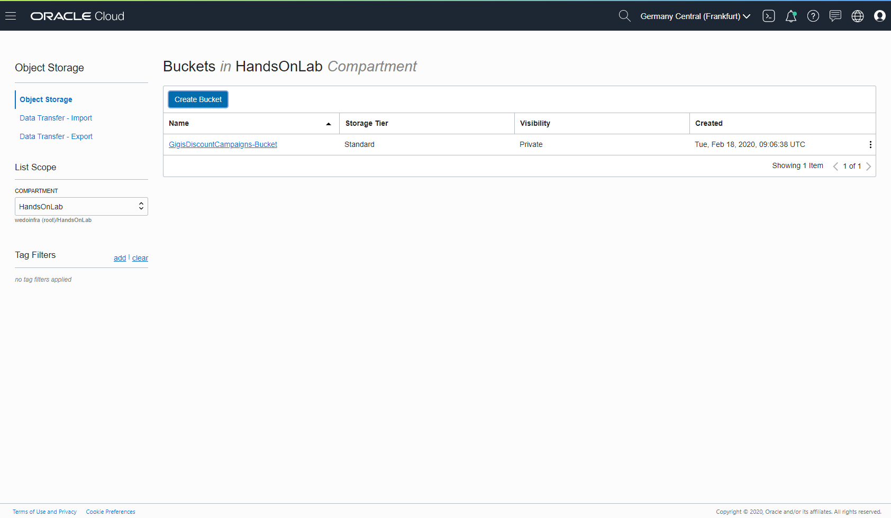

## ATP - Autonomous Database Creation
This demo includes an ATP as data repository and you will access to this Database with two differents methods [ORDS or REST] and [JDBC]. In this section you will create an ATP DB from your always free tier (always free tier includes 2 ATP testing DBs) and next section you will configure it to access from JDBC and ORDS (REST). Please follow next step to create the ATP DB.

Click over Oracle Cloud logo and then click Create an ATP Database from Quick Actions menu. You can go to Database main menu and click Autonomous Transaction Processing and then click Create Autonomous Database, but first option is quicker.

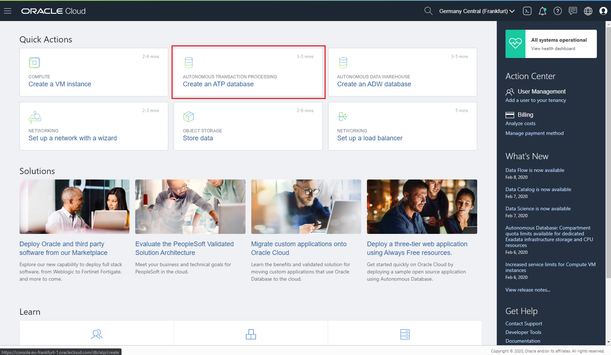

Check your compartment [HandsOnLab]. Write a display name (can contain spaces) for the ATP and a Database name (not spaces and only 14 chars). Check Transacion Processing is selected and Shared Infrastructure. Then Check Always Free to enable always free instance.

Warning NOTE :grey_exclamation::grey_exclamation:: If your Always Free Autonomous Database has **no activity for 7 consecutive days**, the database will be automatically stopped. Your data will be preserved, and you can restart the database to continue using it. If the database **remains stopped for 3 months, it will be reclaimed**.

Always free instance use 18c database version only, check it. Then write an ADMIN password for the DB.
Next Click Create Autonomous Database button.

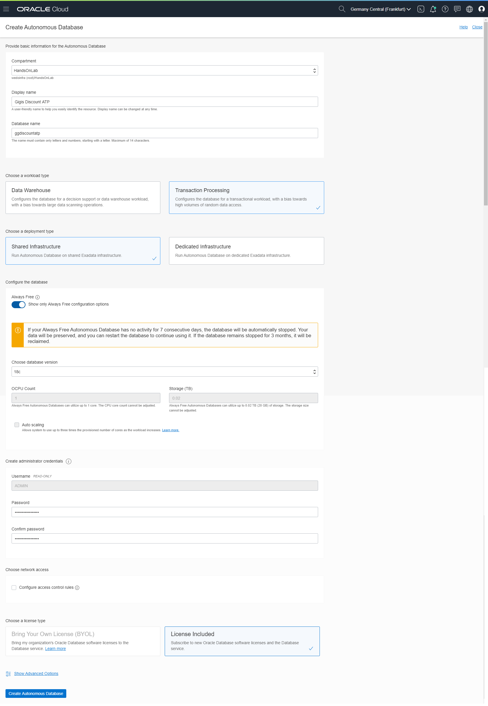

After several seconds you should see the ATP provisioning in Orange. When the ATP logo changes from orange to green the ATP will be ready for service.

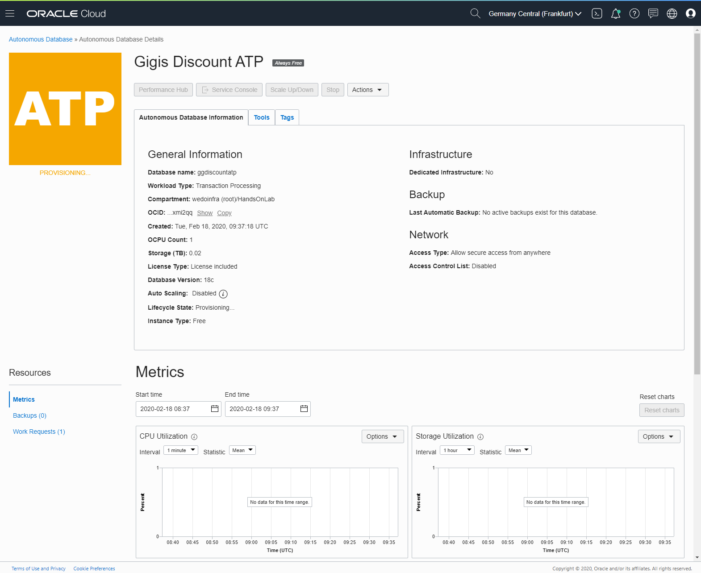

## ATP - Autonomous Database Configuration
When your always free ATP goes green (available) you can configure it to access from JDBC (wallet) and ORDS. Of course you will have to create a new schema to store the discount campaigns. So let's configure your ATP DB following next steps:

### Get ATP Wallet file
To secure the access to an ATPDB from JDBC you will need a wallet file. This file contains the conection strings, profile access and credentials to access to the ATP. Next diagram describe the connection to the ATP from JDBC driver.

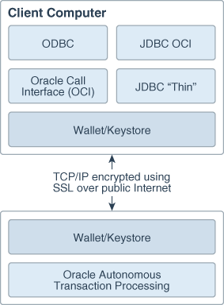

Click DB Connection button to access wallet download and connection Strings menu.

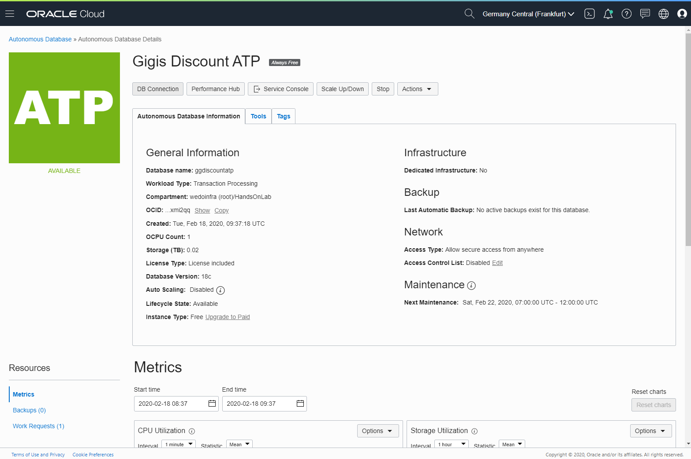

In this menu you can check the connection strings to the ATP. As you can see you could connect with differents service names like TP, TPURGENT, LOW, MEDIUM or HIGH. You can visit the ["Exadata Infrastructure web"](https://docs.oracle.com/en/cloud/paas/atp-cloud/atpug/connect-predefined.html#GUID-9747539B-FD46-44F1-8FF8-F5AC650F15BE) to know about the Service Names meaning. You will use MEDIUM TNS in this demo.

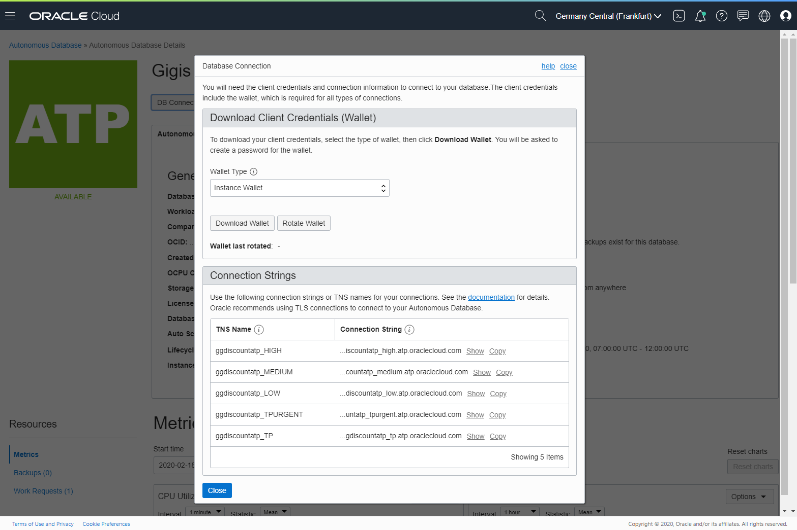

Click Download Wallet button to download to your computer/laptop the ATP **dbwallet.zip** file. You will write a password to download the wallet, please write one [WalletPassw0rd] and note it for future uses. Click Download button to download the wallet zip file.

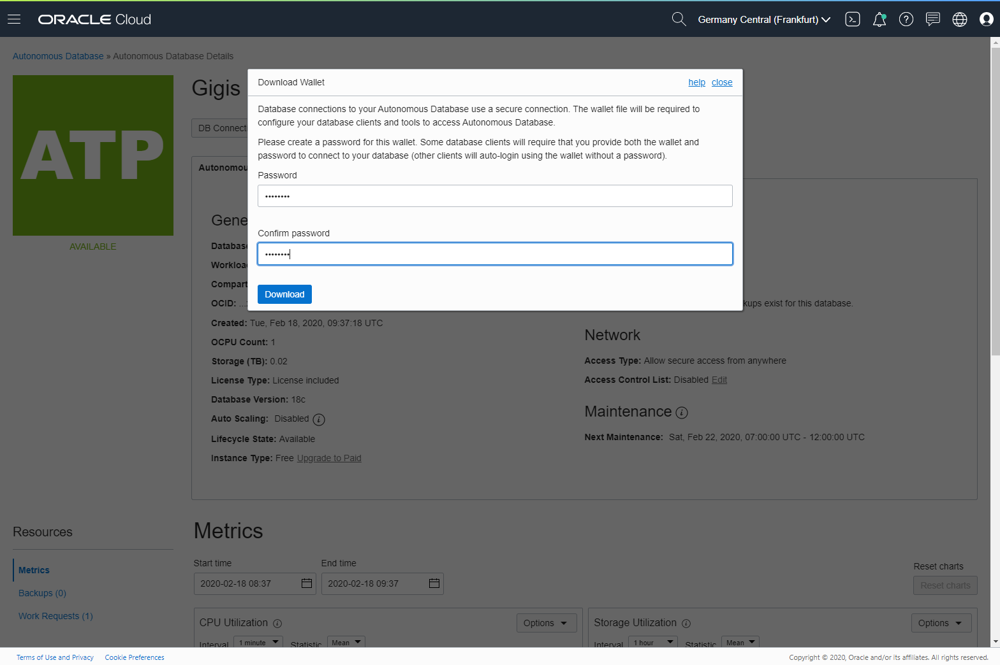

After wallet file download, click Close button to close the connections menu.

### ATP Service Console
Next step in your ATP configuration is to access to ATP Service Console clicking in Service Console button.

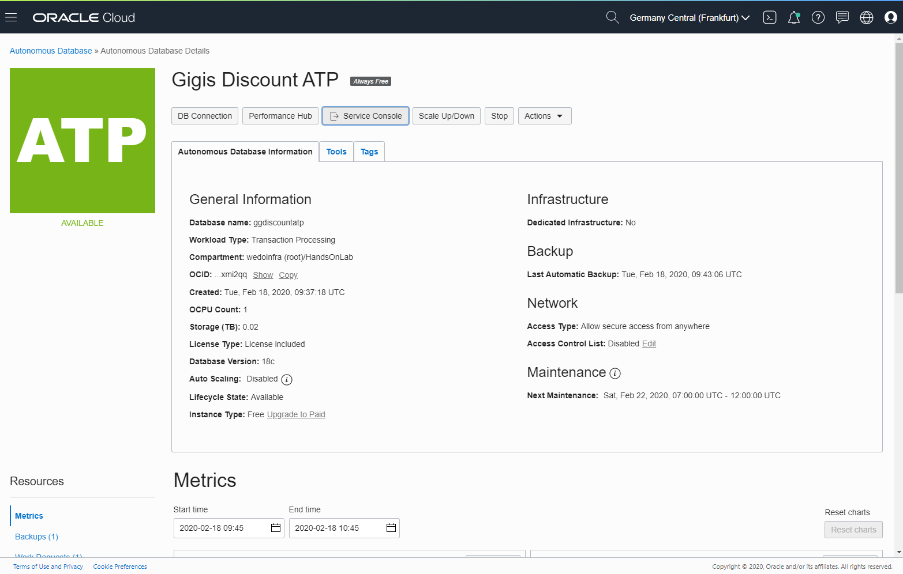

A new browser tab will appear with ATP Service Console menu. You can see the ATP Overview and Performance.


If you click in Activity you will see a real time monitor and monitored SQL dashboard.

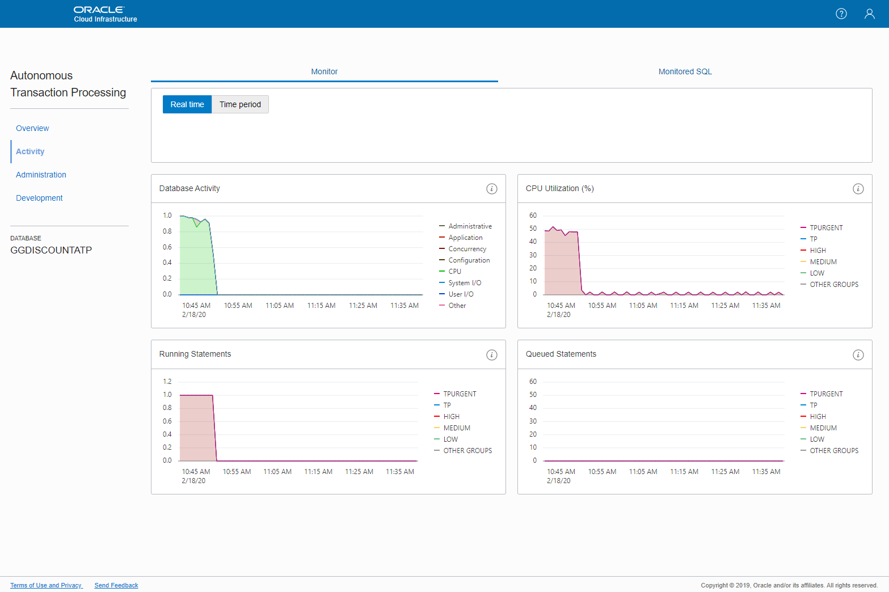

Next click Development menu and then click SQL Developer Web

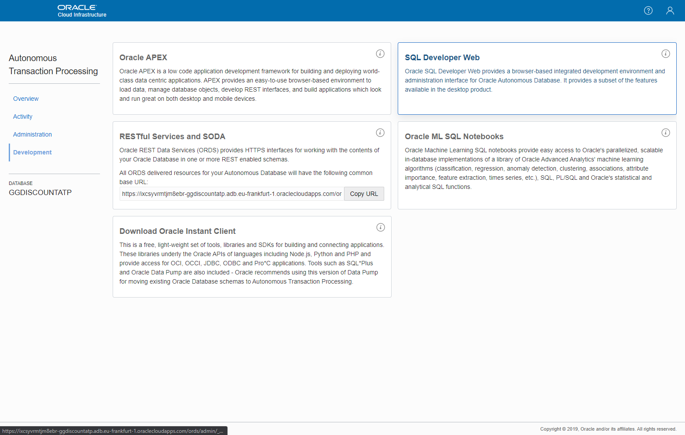

A new browser tab will appear with Username and Password login form to access to ATP via web browser. Write username as ADMIN and your ATP admin password that you wrote in the ATP creation process and click Sign in button.

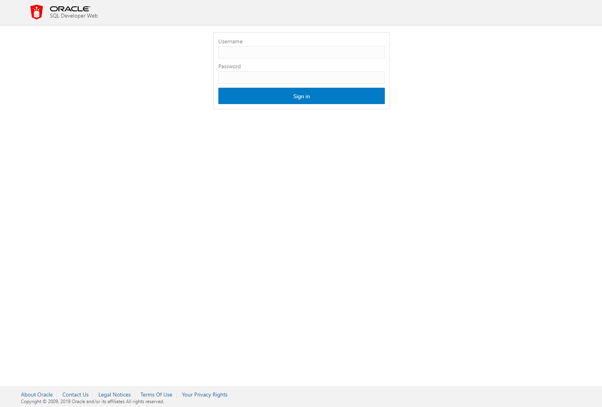

Now you can write and execute SQL commands in Worksheet tab. Click on Green Play button to run the SQL commands when you want.

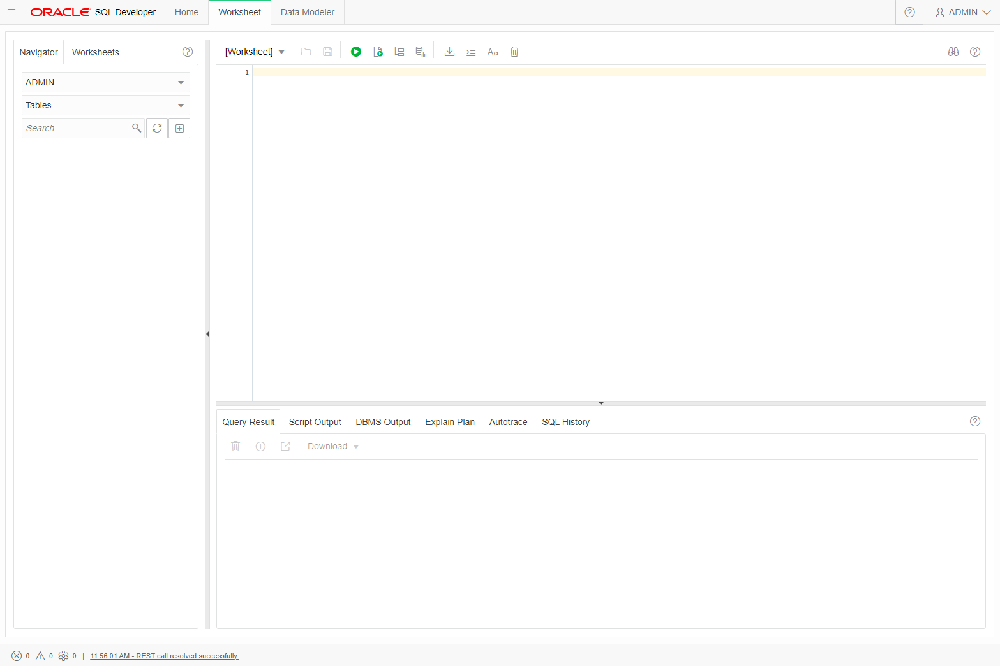

### ATP Schema and Tables Creation
Now you can create schemas and tables in the ATP. First you have to create a new schema and next you will can create the discount campaign table.

To create the new schema called **MICROSERVICE** (or other descriptive name) you must copy this SQL sentences in the Worksheet of SQL Developer webapp.

```sql
-- USER SQL
CREATE USER "MICROSERVICE"
IDENTIFIED BY "AAZZ__welcomedevops123"
DEFAULT TABLESPACE "DATA"
TEMPORARY TABLESPACE "TEMP"
QUOTA UNLIMITED ON "DATA"
ACCOUNT UNLOCK;
```

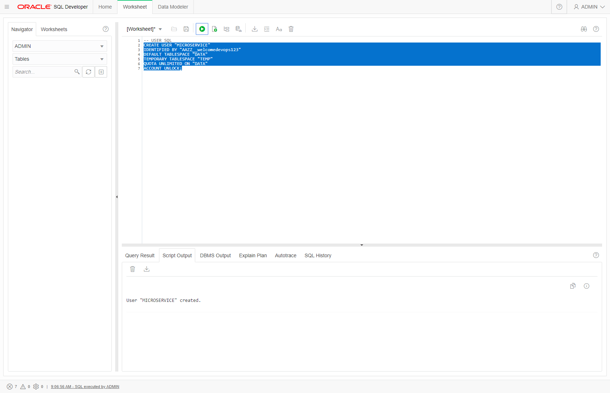

Grant Roles to the new MICROSERVICE user/schema writing this sentence:

```sql
-- USER ROLES
GRANT "CONNECT","RESOURCE","DWROLE" TO "MICROSERVICE";
```

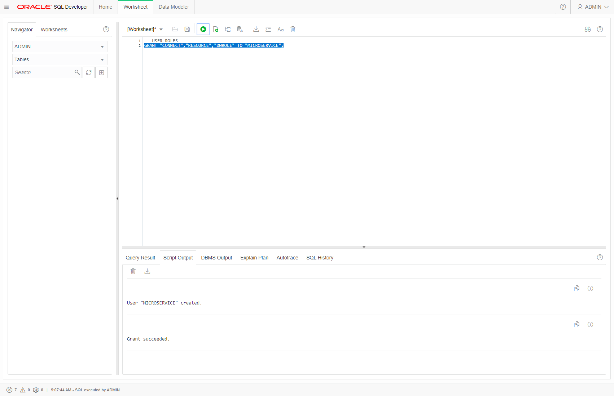

Next you must create the CAMPAIGN table in the new MICROSERVICE schema, writing this SQL sentence in Worksheet:

```sql
-- CAMPAIGN TABLE
CREATE TABLE "MICROSERVICE"."CAMPAIGN" (
	"ID" NUMBER GENERATED BY DEFAULT ON NULL AS IDENTITY MINVALUE 1 MAXVALUE 9999999999999999999999999999 INCREMENT BY 1 START WITH 1 CACHE 20 NOORDER  NOCYCLE  NOKEEP  NOSCALE  NOT NULL ENABLE, 
	"PAYMENTMETHOD" VARCHAR2(20 BYTE) COLLATE "USING_NLS_COMP" NOT NULL ENABLE, 
	"MIN_AMOUNT" NUMBER NOT NULL ENABLE, 
	"DISCOUNT" NUMBER NOT NULL ENABLE, 
	"DATE_BGN" DATE NOT NULL ENABLE, 
	"DATE_END" DATE NOT NULL ENABLE, 
	"DEMOZONE" VARCHAR2(30 BYTE) COLLATE "USING_NLS_COMP" NOT NULL ENABLE, 
	CONSTRAINT "CAMPAIGN_PK" PRIMARY KEY ("ID")
);
```

After table created, select MICROSERVICE, Tables and Click on Campaign Table to review the table records. If you don't see MICROSERVICE please refresh your browser.


### ATP ORDS Configuration
Next you have to configure ORDS (Oracle REST Data Services) to upload data to new table from REST calls. One of the serverless Function upload data with ORDS and other one get data with JDBS driver to show you different ways to deal with data from an ATP Database.

Write next SQL sentences in Worksheet as you write in the previous section.
```sql
GRANT CONNECT, RESOURCE TO MICROSERVICE;
```
```sql
GRANT UNLIMITED TABLESPACE TO MICROSERVICE;
```

Enable ORDS for your new Schema:
```sql
BEGIN    
    ORDS.ENABLE_SCHEMA(p_enabled => TRUE,
                       p_schema => 'MICROSERVICE',
                       p_url_mapping_type => 'BASE_PATH',
                       p_url_mapping_pattern => 'atp',
                       p_auto_rest_auth => TRUE);
    COMMIT;
END;
```
Sign out SQL Developer web as ADMIN user and Sign in again as MICROSERVICE user. To do that you must change the HTML  SQL Developer web URL from **admin** to <schema_name> **atp**:
From
```html
https://<your-ATP-Instance>.adb.<your_region>.oraclecloudapps.com/ords/admin/_sdw/?nav=worksheet 
```
To
```html
https://<your-ATP-instance>.adb.<your_region>.oraclecloudapps.com/ords/atp/_sdw/?nav=worksheet
```
Now you must write MICROSERVICE as username and the password [AAZZ__welcomedevops123] that you write when you created the user MICROSERVICE before. Then continue creating the ORDS privilages and credential with MICROSERVICE user:

Create privileges and Auth token for ORDS Calls:
```sql
DECLARE
 l_roles     OWA.VC_ARR;
 l_modules   OWA.VC_ARR;
 l_patterns  OWA.VC_ARR;
BEGIN
 l_roles(1)   := 'SQL Developer';
 l_patterns(1) := '/campaign/*';
 ORDS.DEFINE_PRIVILEGE(
     p_privilege_name => 'rest_privilege',
     p_roles          => l_roles,
     p_patterns       => l_patterns,
     p_modules        => l_modules,
     p_label          => '',
     p_description    => '',
     p_comments       => NULL);
 COMMIT;
 END;
 ```
Create an oauth client associated with the privilege. Change p_owner and p_support_email to your name and email.
```sql
BEGIN
  OAUTH.create_client(
    p_name            => 'Rest Client',
    p_grant_type      => 'client_credentials',
    p_owner           => 'Iván Sampedro Postigo',
    p_description     => 'ORDS Oauth Access to Campaign discounts',
    p_support_email   => 'ivan.sampedro@oracle.com',
    p_privilege_names => 'rest_privilege'
  );

  COMMIT;
END;
```
Grant the SQL Developer role to the client application:
```sql
BEGIN
  OAUTH.grant_client_role(
    p_client_name => 'Rest Client',
    p_role_name   => 'SQL Developer'
  );
  COMMIT;
END;
```
You can now grab the client_id and client_secret executing next SQL sentence:
```sql
SELECT id, name, client_id, client_secret 
FROM user_ords_clients;
```


Note client_id and client_secrect fields, because you will use them later in the LAB. They are necessary to configure the serverless Functions ATP ORDS access.

Change the timestamp and date formats. Please run this two sentences. Please click in the second play icon.
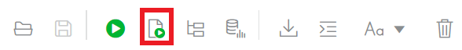
```sql
alter session set nls_timestamp_tz_format='DD/MM/YYYY HH24:MI:SS.FF6 TZR';
alter session set nls_date_format='DD/MM/YYYY';
```

### ATP Enable ORDS Table
You must execute this command in Worksheet tab, to enable ORDS in campaign table of MICROSERVICE schema
```sql
BEGIN
  ORDS.enable_object(
    p_enabled         => TRUE,
    p_schema          => 'MICROSERVICE',
    p_object          => 'CAMPAIGN',
    p_object_type     => 'TABLE',
    p_object_alias    => 'campaign',
    p_auto_rest_auth  => FALSE);
  COMMIT;
END;
```
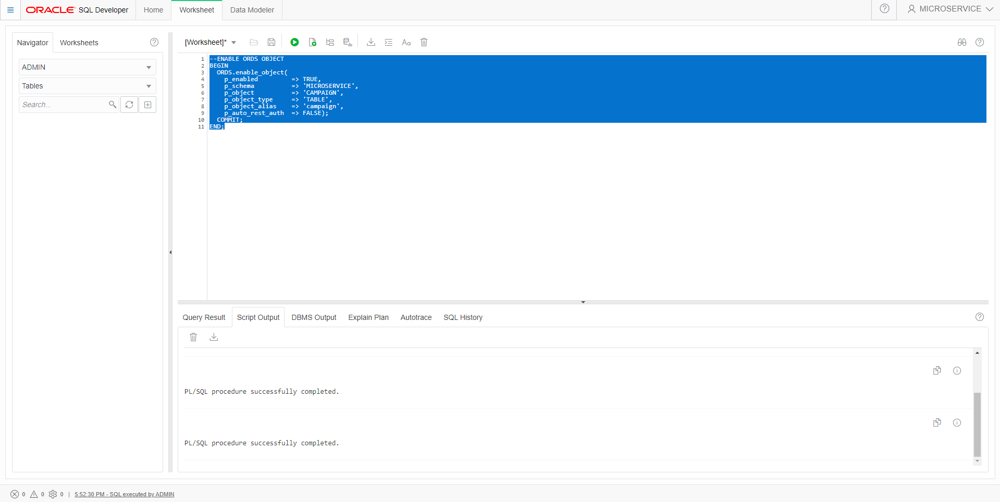

### ATP ORDS URL
Note also ORDS and SODA URL from ATP Service Console, you will need when you configure your serverless app. Click Copy URL button and note it.

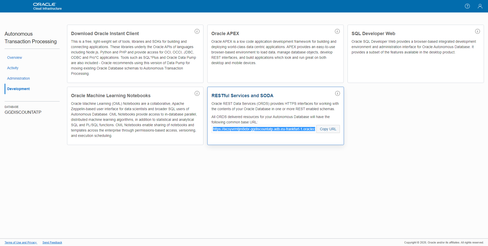

## OCI IAM FaaS Policy
You have to create IAM-Security rules or policies to enable FaaS to use resources in your tenancy. Go to main menu Governance & Administration (at the bottom of main menu) and select Identity -> Policies.

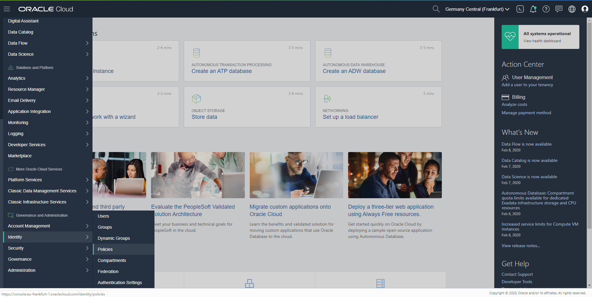

Check that your selected compartment is the root compartment. All policies created in parent compartments are inherited to theirs "sons"
and as security best practice, you must create important policies always at root compartment level, because only the tenant administrators can change the policies at this compartment level.

Click Create Policy button to create the new FaaS policy.

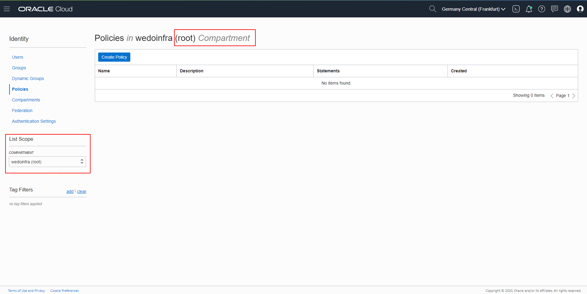

Write a Policy name [FaaSPolicy] and a description [FaaS management] to remember that policy use. Then copy next policy sentence in Policy Statements field.
```
Allow service FaaS to manage all-resources in tenancy
```
Then click Create button.


Review your new Policy to check the sentence.


## Oracle FaaS Serverless Application Creation
In this section you will create the FaaS serverless application (with 3 serverless functions inside) and configure the environment variables to access to the ATP Database. 

First you must create the serverless Application in OCI Managed Function Service. Go to Developer Services in the main menu and select Functions.

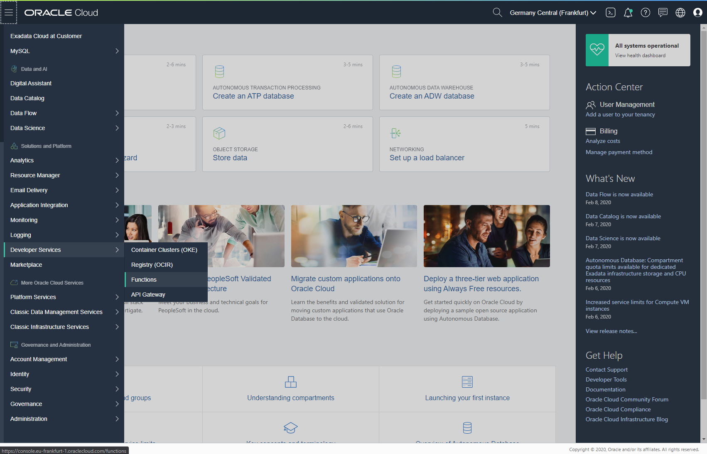

Check that your compartment is [HandsOnLab] and click Create Application.

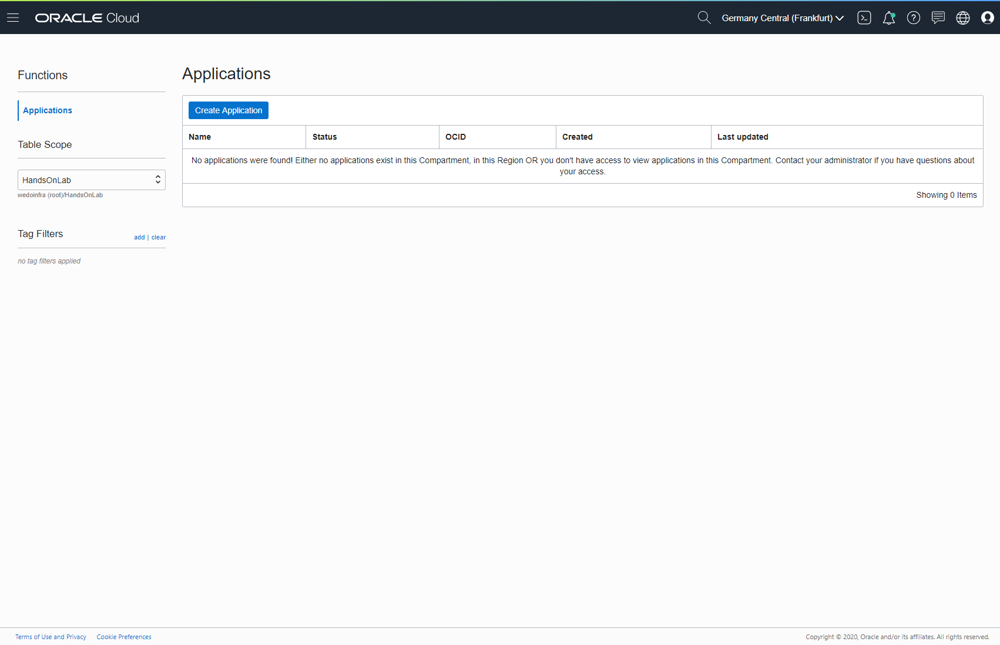

Write a Name for your serverless application, something descriptive like gigis-serverless-hol. Then select the VCN that you created in the previous section [functions-vcn] and select Public Subnet-functions-vcn (Regional) as Subnets.

The Logging Policy is none at this point, but in next sections you could change it to generate log tracing.

Click Create button to create your new serverless app.

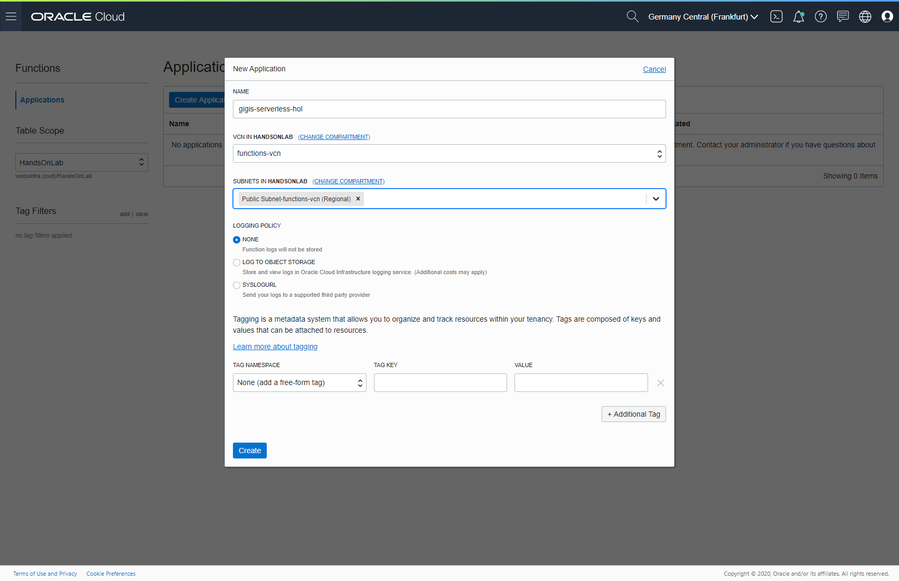

Now you have a new serverless application but without configuration, so let's configure your new serverless application. Click on the application name [gigis-serverless-hol].

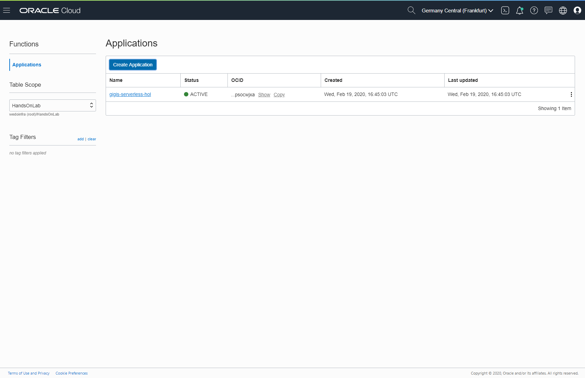

As you can see Functions are empty because you haven't created a serverless function yet. But the serverless application will be composed of 3 serverless functions, that you will create in next sections after application configuration.


Click Configuration menu to configure your serverless app environment variables.

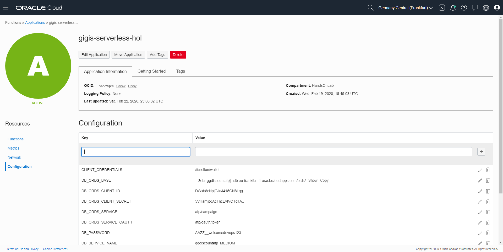

### Function Environment Variables
You must create all next environment variables to setup your serverless application, before functions creation. When you create the serverless functions, they will can access your ATP Database with both ORDS or JDBC methods. **Bold** values would be changed by your own values.

|| Key | Value | Section |
| ------------- | ------------- | ------------- | ------------- |
|01| CLIENT_CREDENTIALS|/function/wallet|N/A|
|02| DB_ORDS_BASE|https://**ixcsyvrmtjm8ebr-ggdiscountatp**.adb.**eu-frankfurt-1**.oraclecloudapps.com/ords/|[<span class="underline">from ORDS URL Section</span>](#atp-ords-url)|
|03| DB_ORDS_CLIENT_ID|**DWxb8cNpjGJaJ415GN8Lqg..**|[<span class="underline">from ORDS Section</span>](#atp-ords-configuration)|
|04| DB_ORDS_CLIENT_SECRET|**5VHamjpqAcTncEyIVOTdTA..**|[<span class="underline">from ORDS Section</span>](#atp-ords-configuration)|
|05| DB_ORDS_SERVICE|atp/campaign|[<span class="underline">from ORDS Section</span>](#atp-enable-ords-table)|
|06| DB_ORDS_SERVICE_OAUTH|atp/oauth/token|[from ATP ORDS documentation](https://oracle-base.com/articles/misc/oracle-rest-data-services-ords-authentication)|
|07| DB_USER|**MICROSERVICE**|[from SQL USER creation](#atp-schema-and-tables-creation)|
|08| DB_PASSWORD|**AAZZ__welcomedevops123**|[from SQL USER creation](#atp-schema-and-tables-creation)|
|09| DB_URL|jdbc:oracle:thin:@|[from Java and JDBC documentation](https://docs.oracle.com/cd/B28359_01/java.111/b31224/jdbcthin.htm)|
|10| DB_SERVICE_NAME|**ggdiscountatp_MEDIUM**|[<span class="underline">from Get ATP Wallet file Section</span>](#get-atp-wallet-file)|
|11| KEYSTORE_PASSWORD |**WalletPassw0rd**|[<span class="underline">from Wallet Section</span>](#get-atp-wallet-file)|
|12| TRUSTSTORE_PASSWORD |**WalletPassw0rd**|[<span class="underline">from Wallet Section</span>](#get-atp-wallet-file)|

### Functions Logging
If you want to create a function logging to trace your code, you have several methods: create log in an OCI object storage bucket, use a remote syslog server or use the OCI logging service.

If your tenancy has OCI logging service enabled, you can send log traces to OCI logging system and see them after functions execution. To check if your tenancy has the OCI logging service enabled, go to main menu -> Solutions and Platform and Logging.

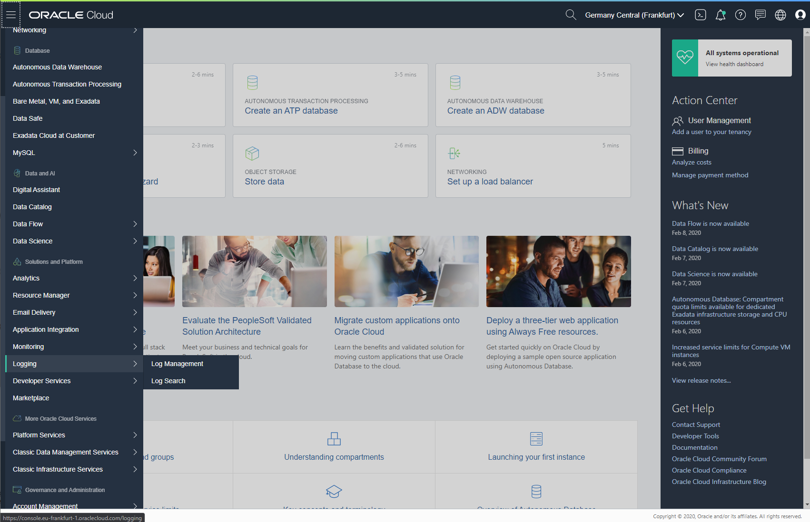

Optionally and if your tenancy logging service is not enabled yet, you could create a free account in [papertrail](https://papertrailapp.com/) or similar service as syslog remote server, to send log traces from the serverless functions.

Next sections will guide you to create an OCI logging service or a remote syslog server with papertrail, choose one of both methods as your needs.

#### OCI Logging Service Configuration
Go to Logging service clicking in the main menu Solutions & Platform -> Logging -> Log Management


A message like "There is no group created in this compartment..." will be showed if you don't have created any Log Group before. Then click Create Log Group button to create a new Log group.

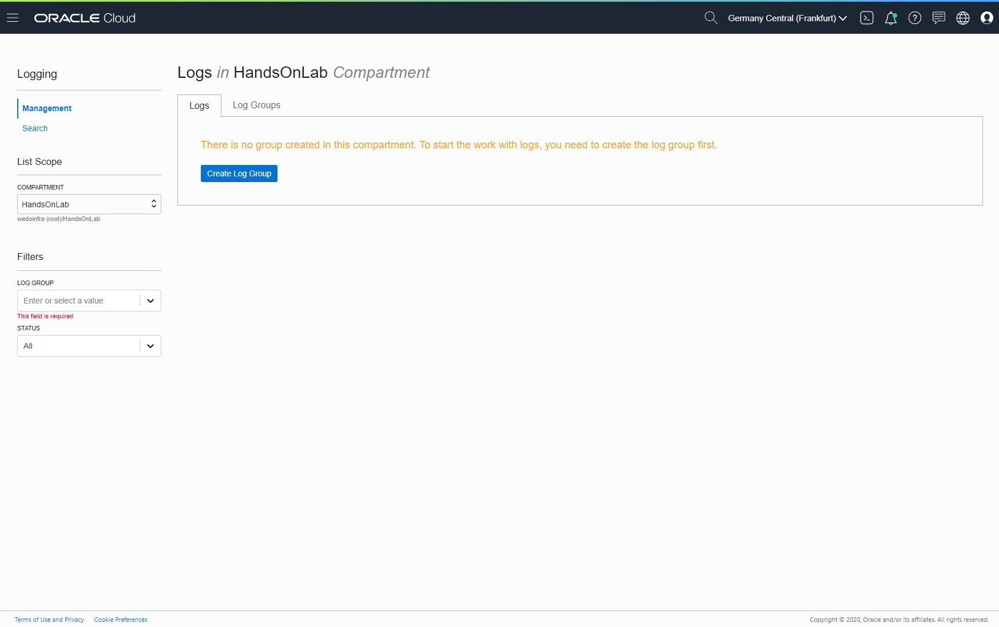

Write a name for the Log Group [FunctionsLogGroup] and a description. Then click Create button.

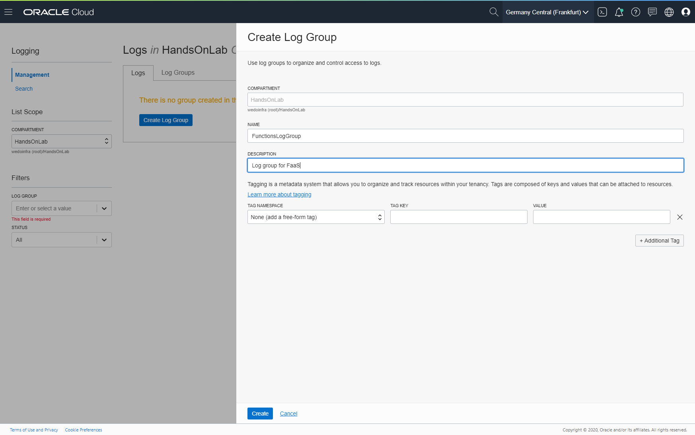

A new empty Logging group should be created. Next click Enable Log button

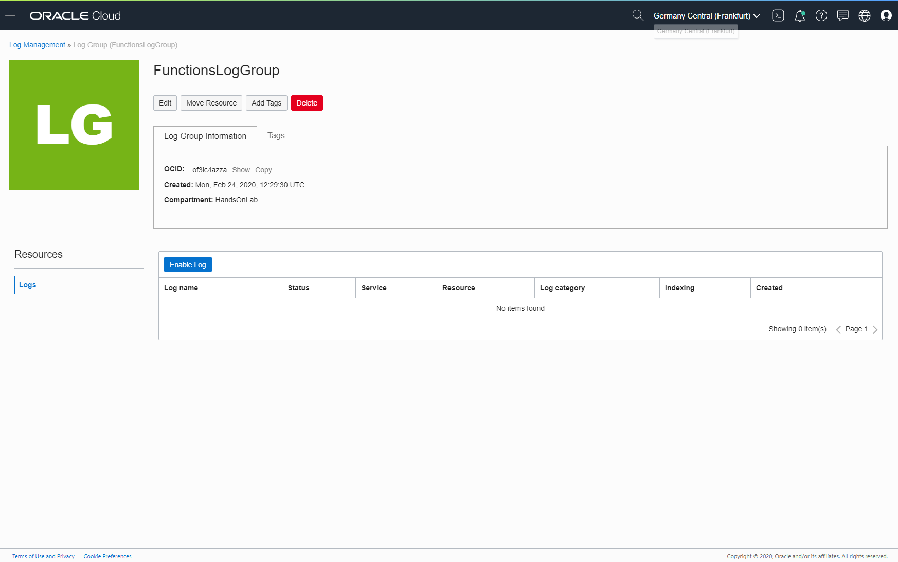

Check your compartment is selected. Follow next steps:
* Select [Functions] in Service dropdown menu.
* Select you serverless app [gigis-serverless-hol] in Resource dropdown menu.
* Select invoke in Log Creation dropdown.
* Write a Log Name [gigis-FaaS-invoke-logging] for this log trace.

Then click Enable Log button

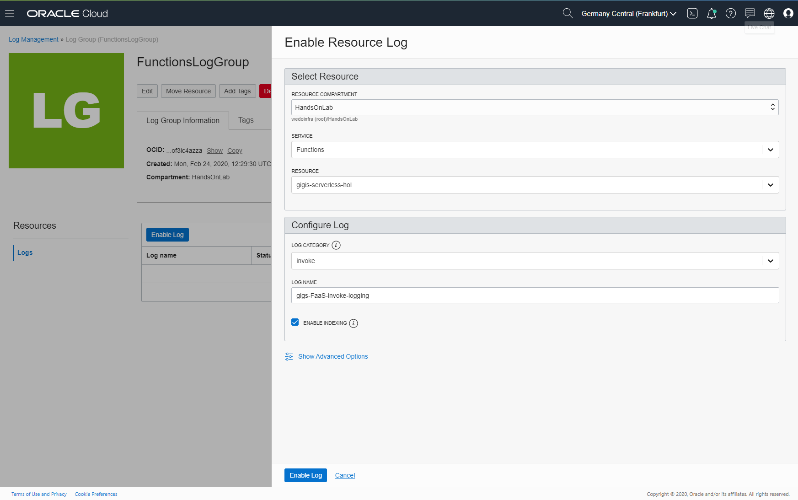

Check that your serverless app change Logs field from none to ObjectStorage. Go Functions -> Applications -> [gigis-serverless-hol] to review that field.

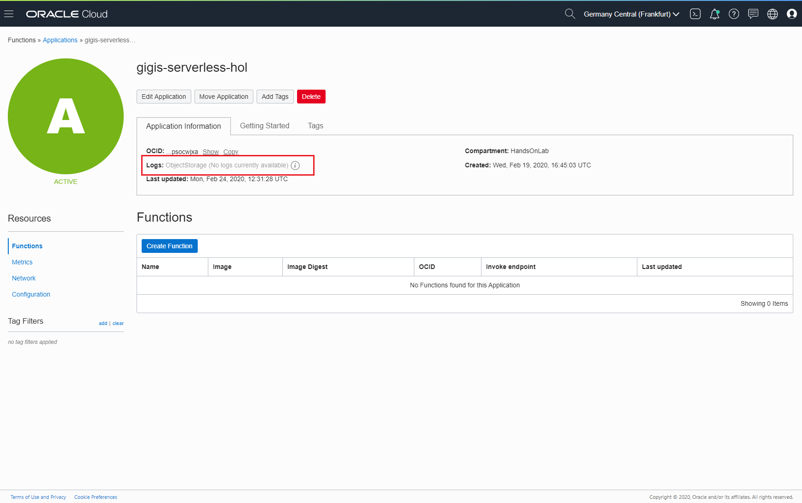

Now you have configured the functions logging and you should see log traces in the logging service when a serverless Function will be invoked.

#### Papertrail syslog Configuration
If your tenancy logging service is not enabled yet or you want to use a syslog instead the logging service, you should follow next steps to configure a syslog server for logging serverless functions.

Open a new browser tab and surf the web to www.papertrail.com to create a new account. click Sign Up green button to create your new papertrail account.


Write your name, email and password. Then select a country, check privacy notice and click Start Logging button.

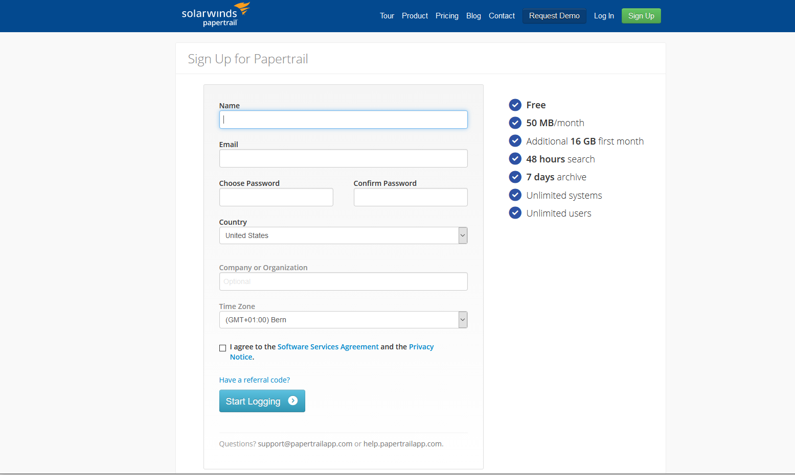

Log into your new account and select Settings -> Account to configure your remote syslog server.

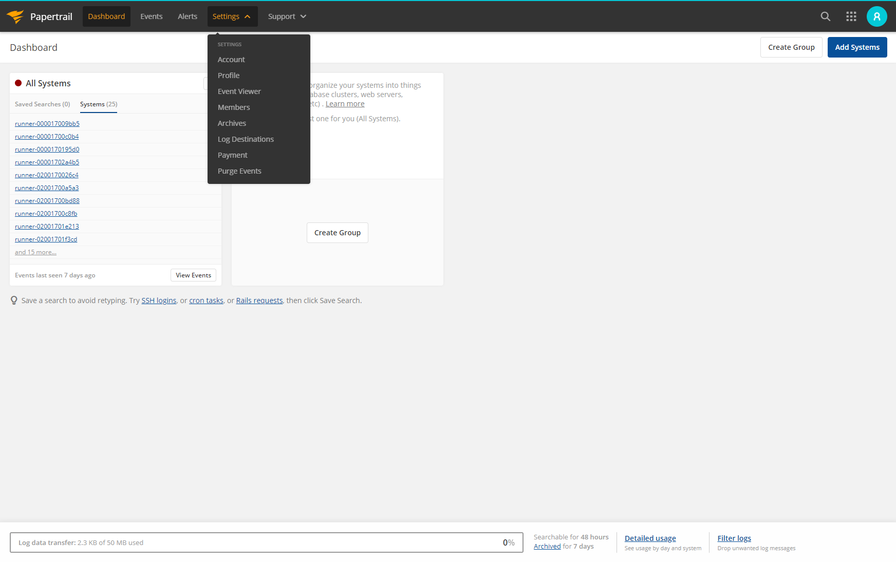

Select Log Destinations and click Create Log Destination button.

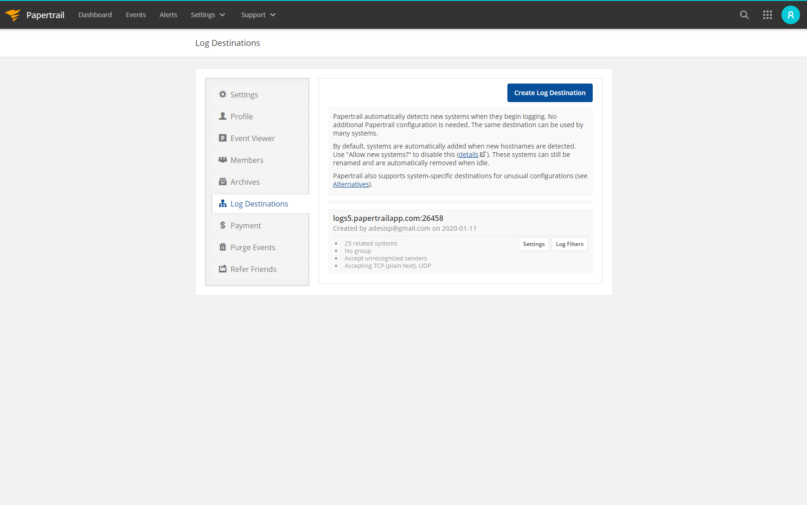

Check Yes, recognize logs from new systems and Accept connections via.. TCP > TLS encryption and UDP > Plain Text. Then click Create button.


In Log Destinations you should see a new syslog URL like **[log<number>.papertrail.com:<port>]**. Please note this URL to copy it to syslog remote server in OCI Functions menu.
	
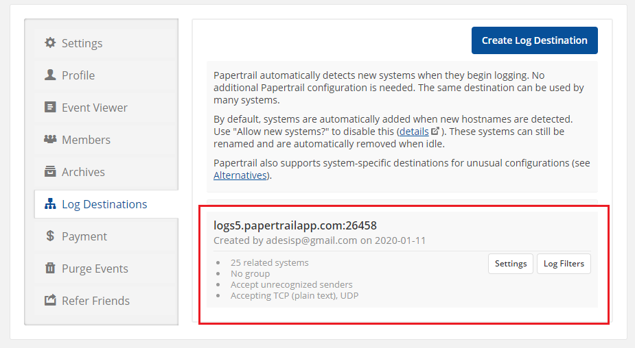

Go to Functions menu and [gigis-serverless-hol] app. Then Click Edit button.

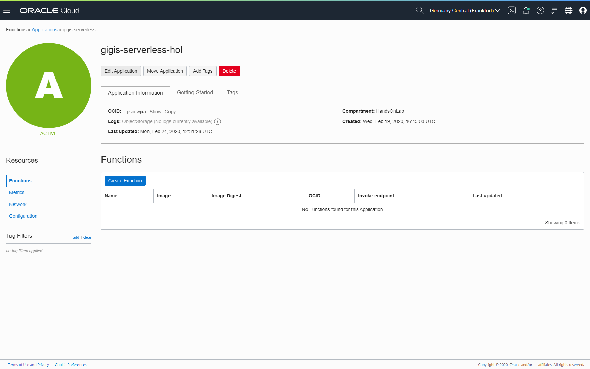

Change Logging Policy from none or Object Storate to SYSLOGURL and copy the papertrail syslog server URL as **[tcp://your-papertrail-log-url]**. Then click Save Changes.

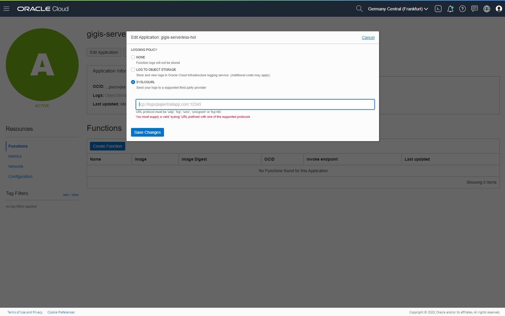

Now you have configured your remote syslog server in papertrail. When a Function is invoked you should see a new logging trace line in papertrail [Events] dashboard. You can open papertrail in a separate tab or window web browser to see your functions logging in almost real-time.

# Serverless Functions Coding
In this section you will review the discount campaign functions code and you will copy them to your [development computer](https://github.com/oraclespainpresales/GigisPizzaHOL/blob/master/developer-machine/developer-machine.md) to create the functions in OCI and launch the application. If you don't have a laptop or desktop with the appropiate tools, we recomend you create a [development machine](https://github.com/oraclespainpresales/GigisPizzaHOL/blob/master/devmachine-marketplace/devmachine-marketplace.md) in your compartment.

Check that you have installed and configured next development resources and applications:

- IDE software (Visual code, Eclipse, Jdeveloper ...)
- Java jdk 11 & 13 (to use in your IDE workspaces)
- Docker (to create and push docker images)
- Fn cli (to create FDKs, create the functions and upload them to FaaS in OCI)
- OCI cli installed and configured

Please check that your development computer has internet connection without any limitation like proxies, firewalls and ports blocked to avoid connection problems when you upload or send fn commands to the serverless functions in OCI FaaS.

## Creating the Serverless Functions.
To create your three serverless functions you must configure a fn context in your development machine. We have created the HOL with a recomended linux machine. Please follow the **Getting Started** instructions in your OCI serverless app. 

Go to your serverless app in main menu Developer Services -> Functions.


Select your serverless app [gigis-serverless-hol]


Select Getting Started TAB. 


### Fn context
Before you create the new 3 functions you must follow steps **from 3 to 5** of Geeting Started guide to create your serverless fn context as the steps are unique for your tenancy (they are set with your appropiate information).


* Create a context for your compartment and select it for use.
```sh
fn create context <YOUR-COMPARTMENT> --provider oracle
fn use context <YOUR-COMPARTMENT>
```
* Update the context with the compartment ID and the Oracle Functions API URL.
```sh
fn update context [YOUR-COMPARTMENT-OCID]
fn update context api-url https://functions.[your-region].oraclecloud.com
```
* Update the context with the location of the OCI Registry you want to use. The [OCIR-REPO] name could be what ever you want and the fn deploy will create the repo if the repo doesn't exists.
```sh
fn update context registry [YOUR-OCIR-REGION].ocir.io/[YOUR-TENANCY-NAMESPACE]/[YOUR-OCIR-REPO]
```


Verify your current used context and OCIR repo - marked with (*):

```sh
fn list context
```
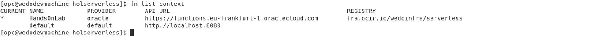

## Create Fn Serverless Functions
Once you create your new fn context, you can continue creating your three serverless functions. For educational purposes you will change the code created with ```fn init``` commands instead of clone them from a git repository.

You could clone the serverless functions from a GIT repository if you needed (developer cloud optional part of the HOL or github), instead of copy and paste the content of the files. You can learn how to clone from the GIT repository in this [section](clone-git project to IDE). 

To create a serverless function you must execute **fn init** command. So you will have to execute that command 3 times, one for each function. Fn commands will be executed in your development machine in $HOME directory or other directory that you create for the lab, for example [holserverless].

Optionally you could create a 4th function to get discounts but using a pool DataSource instead of a direct JDCB connection as you can see in the 3rd function [fn_discount_campaign].

```sh
mkdir holserverless

cd holserverless

fn init --runtime java fn_discount_upload
fn init --runtime java fn_discount_cloud_events
fn init --runtime java fn_discount_campaign
```


Optional:
```
fn init --runtime java fn_discount_campaign_pool
```
Then you must modify each function with the appropiate code in the next labs.
