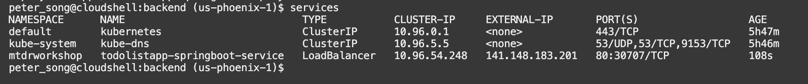
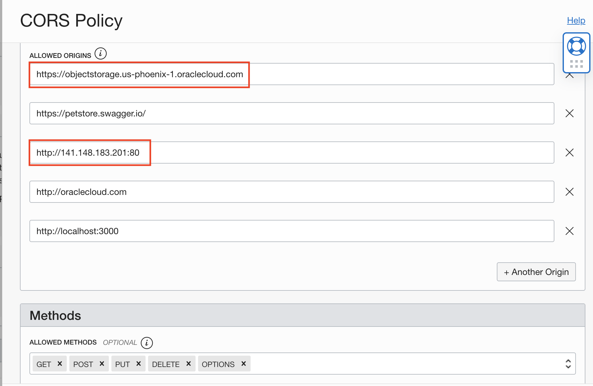
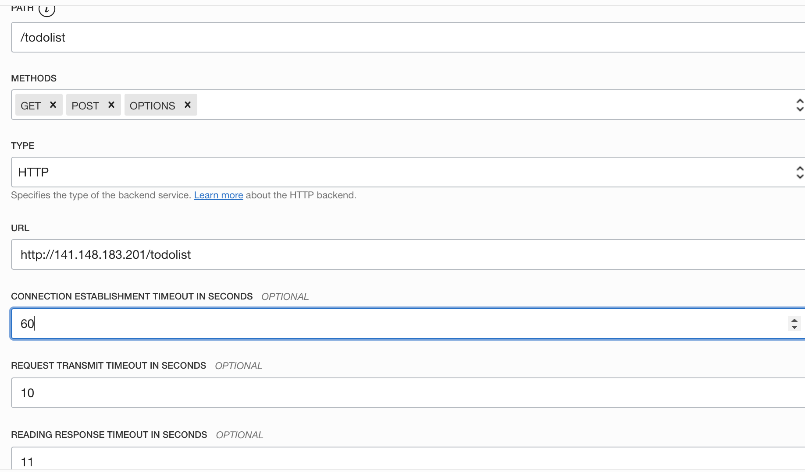
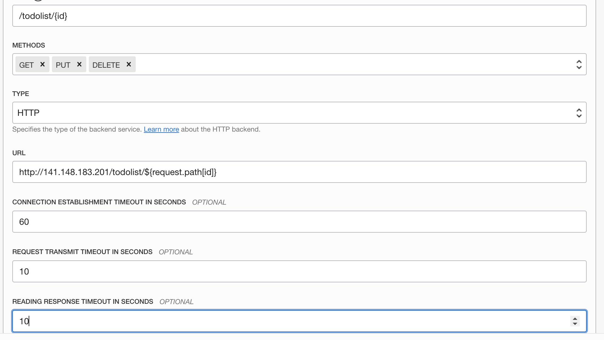

# Deploy the Backend Docker Image to Kubernetes

## Introduction

In this lab, you will make changes and deploy the pre-built SpringBoot Java backend Docker image to OKE, then configure the API Gateway.

Estimated time: 15 minutes

Watch the video below for a quick walk-through of the lab.

[](youtube:-twDGXrjOrI)

### Understand the Java backend application

As with most React applications (https://reactjs.org/), this application uses remote APIs to handle data persistence. The backend implements five REST APIs including:

* Retrieving the current list of todo items
* Adding a new todo item
* Finding a todo item by its ID
* Updating an existing todo item
* Deleting a todo item

The APIs are documented using Swagger. You can search for this address: https://objectstorage.eu-frankfurt-1.oraclecloud.com/n/oracleonpremjava/b/todolist/o/swagger_APIs_definition.json in swagger's console

The backend is implemented using the following Java classes (under ./backend/src/main/java/com/springboot...):

* MyTodoListApplication.java: Starts and configures the main entry points
* ToDoItem.java: Maps a Todo Item instance to and from the JSON document
* OracleConfiguration.java: Connects SpringBoot backend to Oracle Autonomous Database
* ToDoItemService.java: Implements the SpringBoot service and exposes the REST APIs
* ToDoItemController.java: Implements the endpoints and populates data 


### Objectives

* Build and deploy the Docker image of the application
* Deploy the image on the Oracle Kubernetes Engine (OKE)
* Describe the steps for Undeploying
* Configure the API Gateway
* Test the backend application

### Prerequisites

* This lab requires the completion of the **Setup Dev Environment** tutorial (aka Lab 1).

## **Task 1**: Build and Push the Docker Images to the OCI Registry

The OCI Container Registry is where your Docker images are managed. A container registry should have been created for you in Lab 1 in your compartment.

1. Edit ./backend/src/main/java/com/springboot/config/CorsConfig.java. Locate the following code fragment:

  

    - Replace `us-phoenix-1` in  `"https://objectstorage.us-phoenix-1.oraclecloud.com"` with your region

    - Save the file

    - This will allow the appropriate object storage bucket to access your application.

2. Run `build.sh` script to build and push the SpringBoot image into the repository

    ```
    <copy>
    cd $MTDRWORKSHOP_LOCATION/backend
    </copy>
    source build.sh
    ```
  In a couple of minutes, you should have successfully built and pushed the images into the OCI repository.

3. Check your container registry in your compartment
  - Go to the Console, click the hamburger menu in the top-left corner and open **Developer Services > Container Registry**.

  

## **Task 2**: Deploy on Kubernetes and Check the Status

1. Run the `deploy.sh` script

    ```
    <copy>
    cd $MTDRWORKSHOP_LOCATION/backend
    ./deploy.sh
    </copy>
    ```

  If everything runs correctly the script will output something like this:

  


2. Check the status using the following commands

  The following command returns the Kubernetes services of the MyToDo application with a load balancer exposed through an external API
    ```
    <copy>
    services
    </copy>
    ```
  This will run `kubectl get services` (but the setup script creates aliases for ease of use). After running the command above, it should output the external IP address.

  

3. The following command returns all the pods running in your Kubernetes cluster:
    ```
    <copy>
    pods
    </copy>
    ```
    Pods is an alias for `kubectl get services`.

    

4. You can tail the log of one of the pods by running:

    ```
    <copy>
    kubectl -n mtdrworkshop logs -f <pod name>
    </copy>
    ```

  $ kubectl logs -f <pod name>

  Example: `kubectl -n mtdrworkshop logs -f todolistapp-springboot-deployment-54c967665-6482r`

    

  If the logs return **'Tomcat started on port(s): 8080 (HTTP) with context path'**, then you can move on to task 4!
## **Task 3**: UnDeploy (optional)

  If you make changes to the image, you need to delete the service and the pods by running undeploy.sh then redo Steps 2 & 3.

  1. Run the `undeploy.sh` script

    ```
    <copy>
    cd $MTDRWORKSHOP_LOCATION/backend
    ./undeploy.sh
    </copy>
    ```

  2. Rebuild the image + Deploy + (Re)Configure the API Gateway

## **Task 4**: Configure the API Gateway

The API Gateway protects any RESTful service running on Container Engine for Kubernetes, Compute, or other endpoints through policy enforcement, metrics, and logging.
Rather than exposing the SpringBoot service directly, we will use the API Gateway to define cross-origin resource sharing (CORS).

The setup script already creates an API gateway, but you still need to create the deployments in the API gateway.

1. From the hamburger menu navigate to **Developer Services** > **API Management > Gateways**
   
   

2. Click on the todolist gateway that has been created for you

   

3. Create a todolist deployment by clicking Create Deployment

   

4. Configure Cross-origin resource sharing (CORS) policies with the details below:

    - CORS is a security mechanism that will prevent loading resources from unspecified origins (domain, scheme, or port).
    - Allowed Origins: is the list of all servers (origins) that are allowed to access the API deployment typically your Kubernetes cluster IP.
    - Replace the `.us-phoenix-1` portion with whichever region was set in task 1.
    - Replace the 3rd IP address with the external IP address of your Load Balancer (you can get this by `services`)
    - Allowed methods: GET, PUT, DELETE, POST, OPTIONS are all needed.
    - To configure additional origins, click `Another Origin` in the bottom right of the figure below

    

5. Configure the Headers

  

6. Configure the routes: we will define two routes:
  - /todolist for the first two APIs: GET, POST, and OPTIONS

      

  - /todolist/{id} for the remaining three APIs: (GET, PUT and DELETE). Format should be: http://public_ip/${request.path[id]}

      


## **Task 5**: Testing the Backend Application Through the API Gateway

1. Navigate to the newly create Gateway Deployment Detail and copy the endpoint

   

2. To test the endpoint, copy the gateway endpoint in your browser and append "todolist"

   

  It should display the Todo Item(s) in the TodoItem table that was created during the setup.

You may now **proceed to the next lab**.

## Acknowledgements

* **Author** -  Peter Song, Developer Advocate JDBC
* **Contributors** - Jean de Lavarene, Sr. Director of Development, JDBC/UCP
* **Last Updated By/Date** - Peter Song Developer Advocate February 2022
