# OML Data Preparation 

## Introduction
In this Lab, you will be working on a Data Miner Workflow, you must create a Data Miner Project, which serves as a container for one or more Workflows.

*Estimated Lab Time*: 60 Minutes

<!-- ### About Oracle Machine Learning "Regression" -->


<!-- [](youtube:zQtRwTOwisI) -->


### Objectives
In this lab, you will:
* Identify Data Miner interface components.
* Create a Data Miner project.
* Build a Workflow document that uses Regression models to predict customer behavior.


### Prerequisites
This lab assumes you have:
- A Free Tier, Paid or LiveLabs Oracle Cloud account
- SSH Private Key to access the host via SSH
- You have completed:
    - Lab: Generate SSH Keys (*Free-tier* and *Paid Tenants* only)
    - Lab: Prepare Setup (*Free-tier* and *Paid Tenants* only)
    - Lab: Environment Setup
    - Lab: Initialize Environment


## **STEP 1:** Install the Data Miner Repository

If you have not yet set up Oracle Data Miner, or have not created the data mining user, you must first complete the tasks presented in the tutorial [Setting Up Oracle Data Miner 19c Release 2](https://docs.oracle.com/en/database/oracle/oracle-database/19/tutorial-install-dm-repo/)

1. Add a Data Miner Connection.
    - From the SQL Developer menu, select **Tools > Data Miner > Make Visible**.
    - In the Data Miner tab, click the Add Connection tool (green "+" icon).
    - Select DMUSER from the Connection list and then click **OK**.

2. Install the Data Miner Repository.
    - Double-click on DMUSER.
    - Click Yes in the Required Privileges Missing window

    

    - Enter the password for the SYS account and click OK.
    - Click OK on the Repository Installation Settings window.
    - Click Start to grant permissions to the Data Miner account and install the demo data.

    
    - Click Yes on the Installing Demo Data window.

## **STEP 2:** Start creating a Data Miner Project
Before you begin working on a Data Miner Workflow, you must create a Data Miner Project, which serves as a container for one or more Workflows.
In the tutorial Setting up Oracle Data Miner 11g Release 2, you learned how to create a database account and SQL Developer connection for a data mining user named dmuser. This user has access to the sample data that you will be mining.

1. To create a Data Miner Project, perform the following steps.
    In the Data Miner tab, right-click the data mining user connection that you previously created, and select **New Project**, as shown here:

    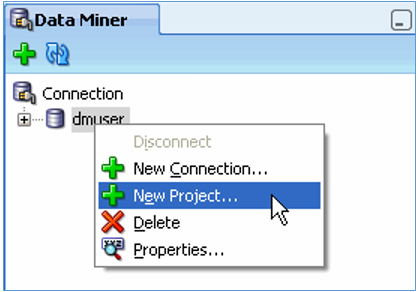

2. In the Create Project window, enter a project name (in this example Data_Preparation) and then click **OK**.

    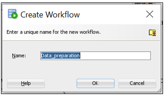

    ***Note***: You may optionally enter a comment that describes the intentions for this project. This description can be modified at any time.

    `Result`: The new project appears below the data mining user connection node.

    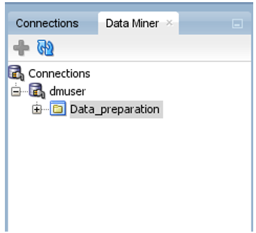

## **STEP 3:** Build a Data Miner Workflow

1. A Data Miner Workflow is a collection of connected nodes that describe a data mining processes.
   A workflow.
      - Provides directions for the Data Mining server. For example, the workflow says, "Build a model with these characteristics." The data-mining server builds the model with the results returned to the workflow.
      - Enables you to interactively build, analyze, and test a data mining process within a graphical environment.
      - Might be used to test and analyze only one cycle within a particular phase of a larger process, or it may encapsulate all phases of a process designed to solve a particular business problem.

2. What Does a Data Miner Workflow Contain?
    - Visually, the workflow window serves as a canvas on which you build the graphical representation of a data mining process flow, like the one shown here.

   

   ***Notes***:
    - Each element in the process is represented by a graphical icon called a node.
    - Each node has a specific purpose, contains specific instructions, and may be modified individually in numerous ways.
    - When linked together, workflow nodes construct the modeling process by which your particular data mining problem is solved.

    As you will learn, any node may be added to a workflow by simply dragging and dropping it onto the workflow area. Each node contains a set of default properties. You modify the properties as desired until you are ready to move onto the next step in the process.

3. Sample Data Mining Scenario

    In this topic, you will create a data mining process that predicts the revenue of customers. 
    To accomplish this goal, you build a workflow that enables you to:

    - Identify and examine the source data
    - Extract data from multiple sources.
    - Combine the data from multiple sources into a common format that can be utilized for ML. 

    `To create the workflow for this process, perform the following steps.`

## **STEP 4:** Create a Workflow and Add data for the workflow

1. Right-click on your project (Retail\_Data\_Analysis) and select **New Workflow** from the menu. For this workflow we will be using these three tables :  `DATA_REL, JSON_PURCHASEORDER, XML_PURCHASEORDER`

    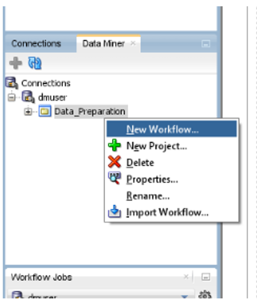

    `Result`: The Create Workflow window appears.

2. In the Create Workflow window, enter **Praparing\_Data** as the name and click **OK**.
   
   

    `Result`:
     - In the middle of the SQL Developer window, an empty workflow canvas opens with the name that you specified.
     - On the right-hand side of the interface, the Component Palette tab of the Workflow Editor appears (shown below with a red border).
     - In addition, three other Oracle Data Miner interface elements are opened:
       * The Thumbnail tab
       * The Workflow Jobs tab
       * The Property Inspector tab

    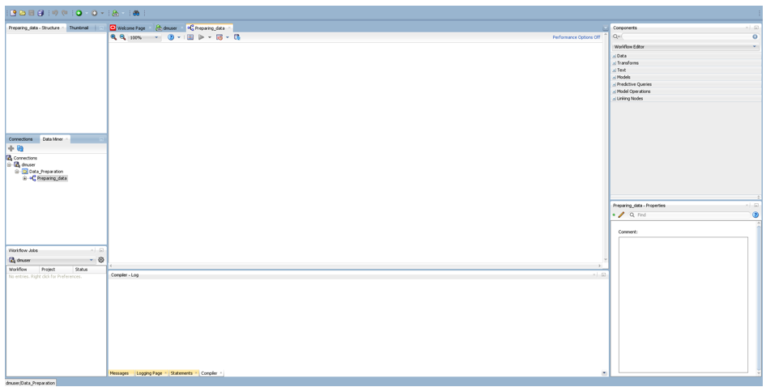


3. The first element of any workflow is the source data. We will extract data from a JSON table and a XM table. Here, we cannot directly add a data source. We will use a query editor to read the tables in a relational table format. You add a Data Source node to the workflow, and select the JSON\_PURCHASEORDER and XML\_PURCHASEORDER tables as the data source.

    In the Component Palette, click the **Data** category. A list of data nodes appear, as shown here.
    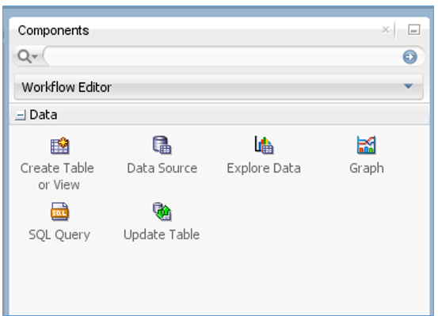

4. Drag and drop the two SQL Query nodes onto the Workflow pane.

    `Result`: A SQL Query node appears in the Workflow pane. Right Click on it and select edit option from the context menu.  Paste the below queries for JSON and XML tables respectively. Now Click in ‘OK’.

    **JSON:**
    ````
    <copy>
    SELECT jt.* FROM JSON_PURCHASEORDER, JSON_TABLE(JSON_DOCUMENT, '$[*]'  COLUMNS (INVOICENO VARCHAR2(256) PATH '$.INVOICENO', STOCKCODE VARCHAR2(256) PATH '$.STOCKCODE', DESCRIPTION VARCHAR2(1024) PATH DESCRIPTION, QUANTITY Number PATH QUANTITY, INVOICEDATE VARCHAR2(1024) PATH INVOICEDATE, UNITPRICE NUMBER(38,2) PATH UNITPRICE, CUSTOMERID VARCHAR2(1024) PATH CUSTOMERID, STATE VARCHAR2(256)  PATH STATE)) jt
    </copy>
    ````

    **XML:**
    ````
    <copy>
    SELECT xt.* FROM   XML_PURCHASEORDER x, XMLTABLE('PURCHASEORDER' PASSING x.XML_DOCUMENT COLUMNS INVOICENO VARCHAR2(256), STOCKCODE VARCHAR2(256), DESCRIPTION VARCHAR2(1024),QUANTITY NUMBER,  INVOICEDATE VARCHAR2(1024), UNITPRICE NUMBER(38,2), CUSTOMERID VARCHAR2(1024), STATE VARCHAR2(256) ) xt
    </copy>
    ````

    **Notes:**
      - Oracle Data Miner generates workspace node names and model names automatically. In this example, the name "SQL Query" is generated. You may not get exactly the same node and model names as shown in this lesson.
      - You can change the name of any workspace node or model using the Property Inspector.

    

5. Drag and drop the **Create Table or View** node onto the Workflow pane. Right click on the Query nodes and connect them to the output nodes. Rename the output nodes.
    
    Oracle Data Miner generates workspace node names and model names automatically. The table name can be changed from the **Properties** Panel, as shown below.

     

6. Right click on the output table of JSON and XML and then click on ‘Run’

    

7. Click on each of the Output Node and select ‘View Data’

    

    Combine the data from two different sources (XML and JSON), now in two tables into a single table.

8. Drag a SQL Query control and connect it to both the XML and JSON table. Write a UNION Query like mentioned below to append the two tables. Then we connect the Query control table to an Output table. 
   
    `Note`: Change the table names according to our project. 

    SELECT * FROM "JSON\_DATA1\_N$10002" UNION ALL SELECT * FROM "XML\_DATA2\_N$10005"

    We can view the combined data by connecting this query to an Output table and executing ‘Run’ on the Output table.

    

9. We add the RDBMS regular table data, using a data source. Drag and drop the **Data Source** node onto the Workflow pane.

    `Result`: A Data Source node appears in the Workflow pane and the Define Data Source wizard opens.
   
    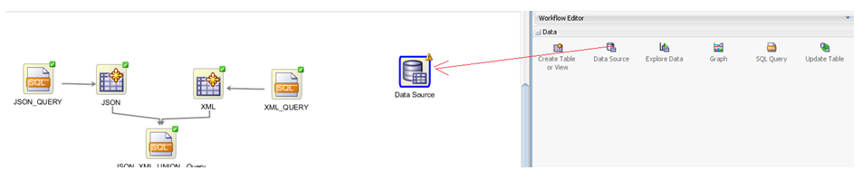

    In Step 1 of the wizard
    Select DATA_RELTN from the Available Tables/Views list, as shown here:

    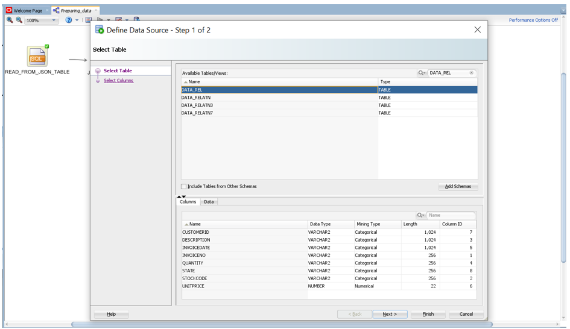 

    `Note:`You may use the two tabs in the bottom pane in the wizard to view and examine the selected table. The Columns tab displays information about the table structure, and the Data tab shows a subset of data from the selected table or view.

10. Click **Next** to continue.
    In Step 2 of the wizard
    - you may remove individual columns that you do not need in your data source. In our case, we will keep all of the attributes that are defined in the table.
    - At the bottom of the wizard window, click Finish.

     

    `Result`: As shown below, the data source node name is updated with the selected table name, and the properties associated with the node are displayed in the Property Inspector, located below the Component Palette pane.
   
    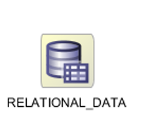
   
    `Notes`:
    - You can resize nodes in the workflow canvas by entering or selecting a different value from the Zoom options. Notice that 75% has been selected from the Zoom pull-down list.
    - You can add descriptive information about any node by using the Details tab in the Property Inspector.
    - The Thumbnail tab also provides a smaller display of the larger workflow window. As you drag nodes around the workflow window, the thumbnail view automatically adjusts.

## **STEP 5:** Examine the Source Data

You can use an Explore Data node to examine the source data. Although this is an optional step, Oracle Data Miner provides this tool to enable you to verify if the selected data meets the criteria to solve the stated business problem.

Follow these steps.
  
1. Drag and drop the Explore Data node from the Component Palette to the Workflow, like
    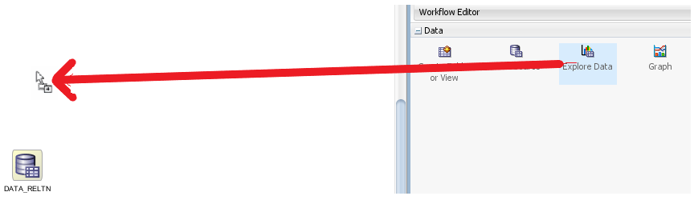
                
    `Result`: A new Explore Data node appears in the workflow pane, as shown here. (As before, a node name is automatically generated.)
     

    `Notes`:
    A yellow Information (!) icon in the border around any node indicates that it is not complete. Therefore, at least one additional step is required before the Explore Data node can be used.
   
    In this case, a data source node must be "linked" to the Explore Data node to enable further exploration of the source data.

2. To link the data source and explore data nodes, use the following instructions.
    Right-click on the data source node (DATA\_RELTN), select **Connect** from the pop-up menu, and then drag the pointer to the Explore Data node, as shown here:

    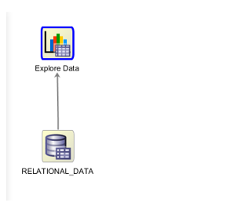 

3. Then, click the Explore Data node to connect the two nodes. The resulting display looks like this:
   
    

4. Right click Explore data and click edit. Next, select a "Group By" attribute for the data sourceA. Double-click the Explore Data node to display the Select Attributes window..
    In the Group By list, select the CUSTOMER_ID attribute, as shown here:
    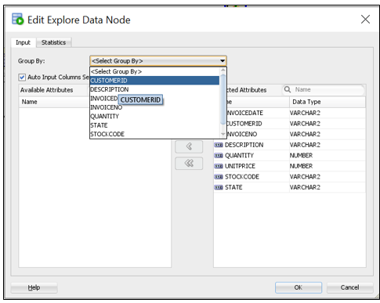

    Then, click OK.

    `Note`: The Select Attributes window also allows you to remove (or re-add) any attributes from the source data.

5. Next, right-click the Explore Data node and select Run.

    

    `Result`
    - Data Miner displays status information in the Workflow Jobs tab while processing the node.
    - When the update is complete, the data source and explore data nodes show a green check mark in the borders, like this:

    
    `Note`: When you run any process from the workflow canvas, the steps that you have specified are executed by the Oracle Data Miner Server.
   
6. To see results from the Explore Data node, perform the following:
    Right-click on the Explore Data node and select View Data from the menu
    

    Go to the statistics tab and click on one of the rows.

    

    `Result:` A new tab opens for the data profile node, as shown below

    `Notes`:
    - Data Miner calculates a variety of information about each attribute in the data set, as it relates to the "Group By" attribute that you previously defined, including a Histogram, Distinct Values, Mode, Average, Min and Max value, Standard Deviation, Variance, Skewness, and Kurtosis.
    - The display enables you to visualize and validate the data, and also to manually inspect the data for patterns or structure.

7. Select any of the attributes in the Name list to display the associated histogram in the bottom window.
    When you are done examining the source data, dismiss the Explore Data tab by clicking the Close icon (X). 
  
    Next, you move from a high-level manual analytic exercise to using the power of database data mining.

## **STEP 6:** Append Data from Two Different Table

1. Now we can append the data from `DATA_REL` and `JSON_XML_COMBINED` into a single table using the `UNION ALL` query in the `SQL Query` control and store the data in a output table. Steps will be similar to what we had mentioned earlier. 
Before we `JOIN` the tables, we will update some of the attributes to numeric type, so that the data types of both tables match during the join.  Add a `Transform` node and connect the `DATA_REL` table to the `Transform` node. 
   
    

2. Right Click on the `Transform` node and select `Run` option. Now you can view the data statistics when you Right Click on the `Transform` node and Select the `Edit` option

     

3.  The edit Wizard comes up for the `Transform` Node. Click on the Browse table button, and select the XML\_JSON\_COMBINED data table.  Click on the `Add Custom Transformation` button as marked in the image.

    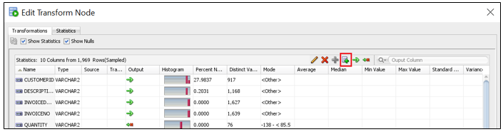 

4. We want to convert the datatype of Quantity column from Varchar2 to Numeric. From the `Functions` tab, expand `Conversion` and click on the `TO_NUMBER` function to bring it to the `Expression` panel.

    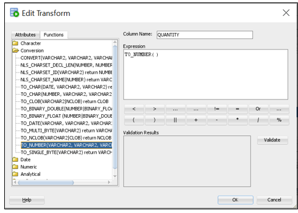

5. Now select the `Attributes` Tab and Click on `QUANTITY`, to select this attribute.  Type the `Column Name`. Keep it same `QUANTITY`.  Now `validate` the expression by clicking the Validate button. After successful validation, click on the `OK` button.

    


6. Now select the varchar2 ‘Quantity’ column and click on the `Exclude Column` button as shown below. Now you can see an x mark in the output column for the variable. We do this because we do not need this varchar column anymore; instead, we have the numeric `Quantity` column. Click on `OK` now.

    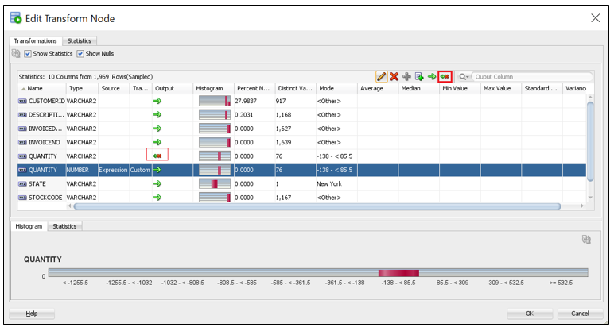

7. Now drag a `Create Table` node into the canvas and connect it with the `Transform` node. Right click on the `output node` and select `Run` from the context menu.  After successful execution, again right click on `output node` and select `View Data`.

    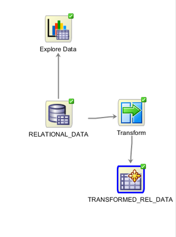

8. We select the `Column` tab and check the `Quantity` column. It will now be shown as numeric.

   

9. Drag a `SQL Query` node. Connect it to the Relational DB table and combined JSON and XML table.  Right Click on the node and select the `Edit` option. The Editor window opens up.

    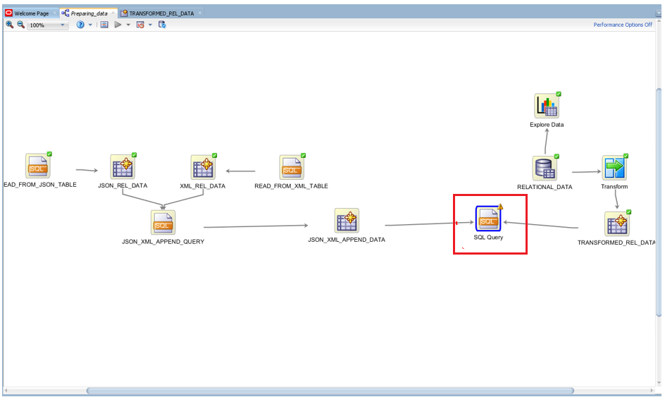

    Copy paste the below query and change the table or Node names according to your project. The UNION ALL command combines the result set of two or more SELECT statements, thus resulting in a table with all the data from both the tables. 

    select "JSON\_XML\_N$10088"."CUSTOMERID","JSON\_XML\_N$10088"."DESCRIPTION","JSON\_XML\_N$10088"."INVOICEDATE","JSON\_XML\_N$10088"."INVOICENO","JSON\_XML\_N$10088"."QUANTITY","JSON\_XML\_N$10088"."STATE","JSON\_XML\_N$10088"."STOCKCODE","JSON\_XML\_N$10088"."UNITPRICE" from "JSON\_XML\_N$10088"
    UNION ALL 
    select "DATA\_RELATN\_N$10029"."CUSTOMERID","DATA\_RELATN\_N$10029"."DESCRIPTION","DATA\_RELATN\_N$10029"."INVOICEDATE","DATA\_RELATN\_N$10029"."INVOICENO","DATA\_RELATN\_N$10029"."QUANTITY","DATA\_RELATN\_N$10029"."STATE","DATA\_RELATN\_N$10029"."STOCKCODE","DATA\_RELATN\_N$10029"."UNITPRICE" from "DATA\_RELATN\_N$10029"
   
    Click OK.

    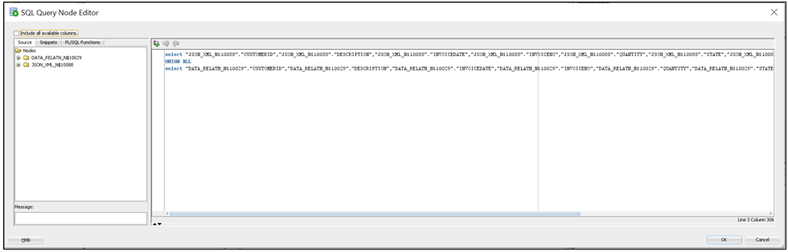

10. Now, Right click on the `SQL Query` node and select `Run`.  After successful completion, a green tick mark will appear on the node. 

    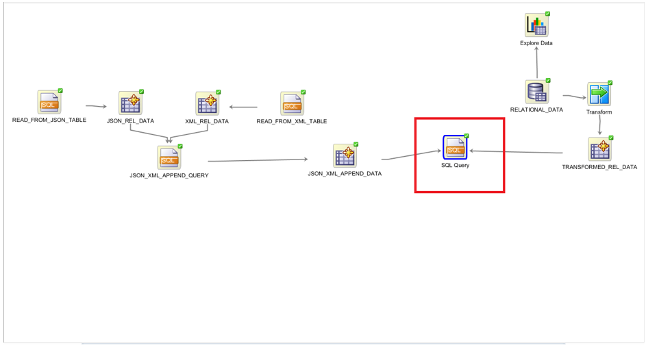

11. Now drag a `Create Table` node to get an `Output table`. Connect it to the Query node.  Now Right Click on the `Output table` and select `Run`.  This will store the resullt set from query into the table.

    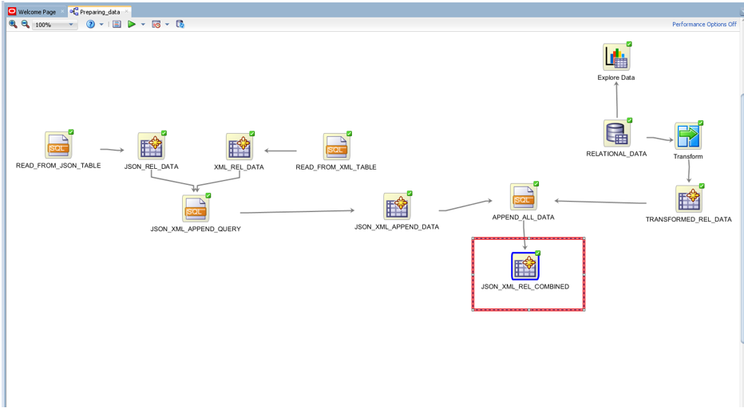

12. Drag a `Transform` node into the canvas as shown below. Connect it to the `output table` that contains the combined XML and JSON data. After connecting, right click and select the `Run` option
    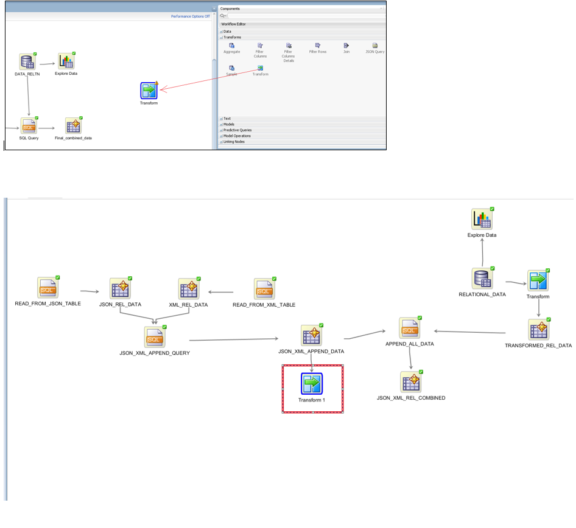 
   
13. Now Right Click on the `Transform node` and select Edit option.  This will open up the `Edit Transform Node` wizard. Click on the `Add Custom Transformation` button as marked in the image. 

    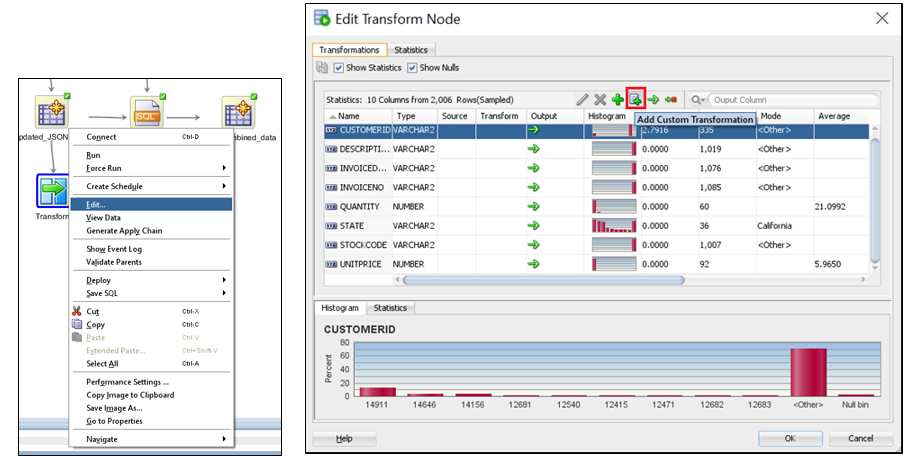

14. We want to create a new attribute called TOTALAMOUNT which will be a product of QUANTITY*UNITPRICE
    
    Select the two attributes QUANTITY and UNITPRICE along with the * symbol for multiplication.

    

15. Name the `Column Name` TOTALAMOUNT, click on the `validate` button to Validate the expression and  then click `OK`.
    The new attribute is now visible in the attribute `Names` Column. Click OK. 

    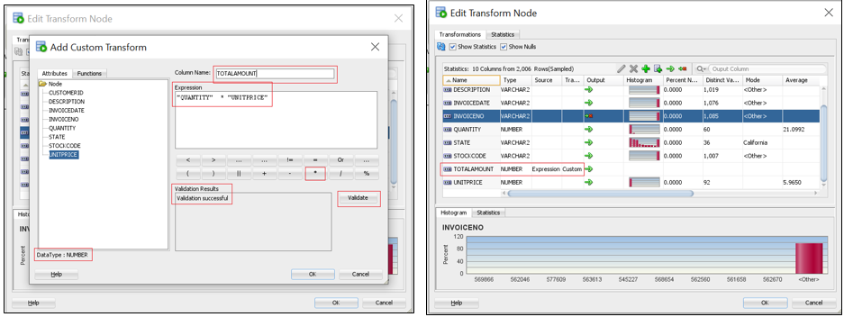

16. Right Click and Run the `Transform node`.  After that drag a `Create Table` node to create an output table. Connect it to `Transform` node and then Right Click and select the `Run` option.  The transformed table data will be stored in the output table.

    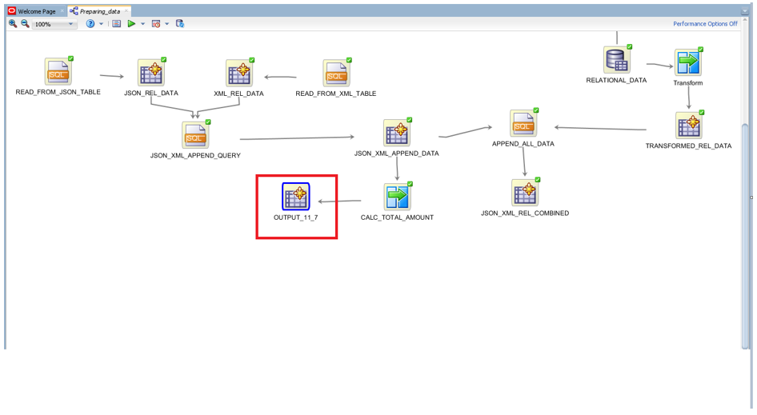

## **STEP 7:** Create Attributes Using Aggregate Function

Now we will create 3 new attributes with the aggregate function. Three attributes (QUANTITY, TOTALAMOUNT, and UNITPRICE) will be aggregated using the SUM function, grouped by CUSTOMERID and STATE.

1.  Drag the `Aggregate` node into the canvas and connect it to the transformed table data. Right click and select the `Edit` option from context menu.  

    

2.  Click on the `Aggregate Wizard` on the Edit Aggregate node window. Now we will define the aggregation. In our case, we check the check box of the `Sum` function of `Numerical` data. Click on the Next button.

    

3.  In the `Select Columns` step of the wizard, we select the three columns, `QUANTITY, TOTALAMOUNT, and UNITPRICE` and click `Next`.
    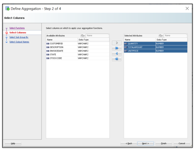

4.  In `Select Sub Group By`, we do not select any columns and click on Next. 

    

5.  Now the new column names can be seen. Click on the `Finish` button.
    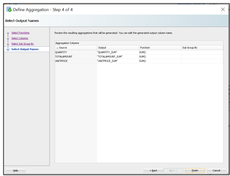

6.  Now Click on the `Edit` button beside the `Group By` field.
    
   
7.  Select the two columns CUSTOMERID and STATE for Group by and Click `Ok`. We can see the output columns listed in the wizard. Click `Ok`. 
    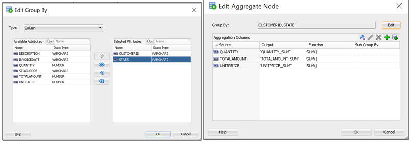

8.  Drag a Create Table node to the canvas and connect it with the `Aggregate` node.  Right Click on the `output table` node and select `Run` option. After the execution is completed, data is stored in the `output node`. Now Right Click on the `Output Node` and select `View Data` to see the aggregated data in the output table.
    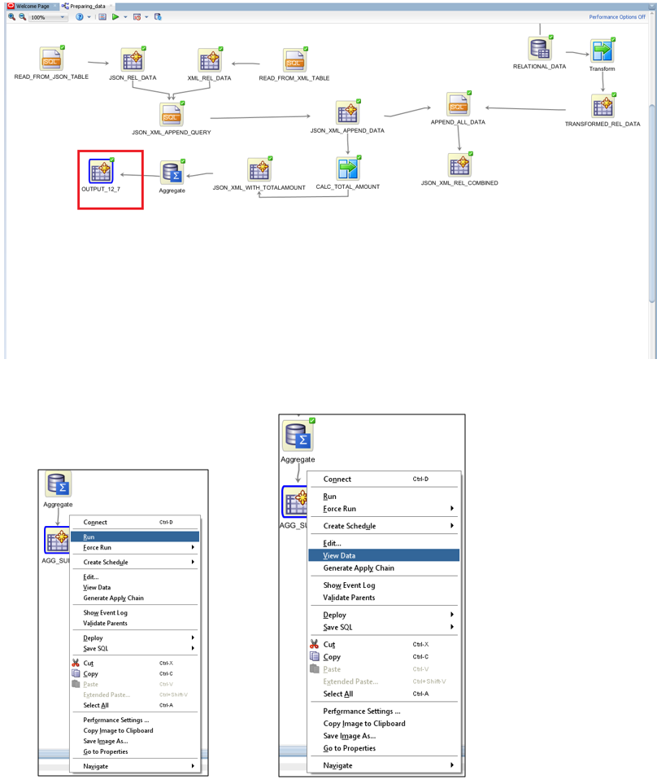

9.  We can see the aggregated columns as shown below. 
    

10. Now we will go ahead with another aggregation, we will do a `Count(Distinct)` with three columns: DESCRIPTION, INVOICEDATE and STOCKCODE.  

11. Drag a new `Aggregate Node` to the canvas and connect it to the Transformed Data, output node. 
    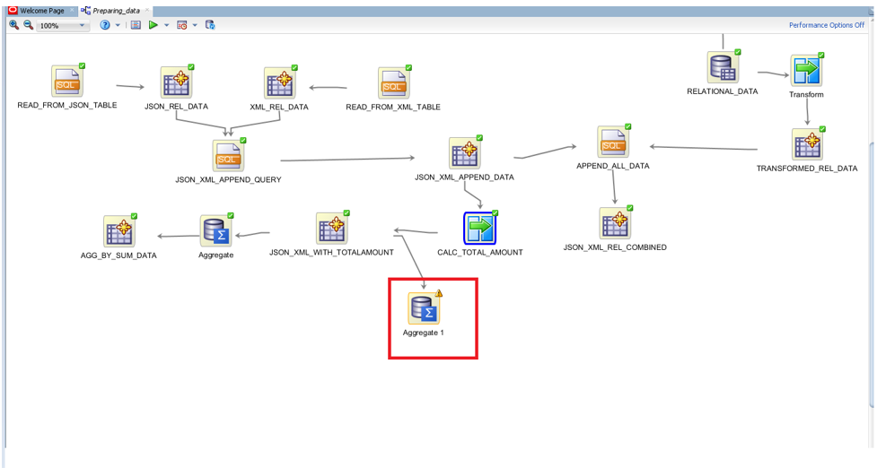
    
12. Right Click on the `Aggregate` node and select the Edit option.  The Aggregation wizard opens up.  In the Select Functions step, check the `COUNTDISTINCT()` function under the Character functions and select `Next`.
    
   
13. Select the columns STOCKCODE, INVOICEDATE and DESCRIPTION in the `Select Columns` step and click on `Next`

   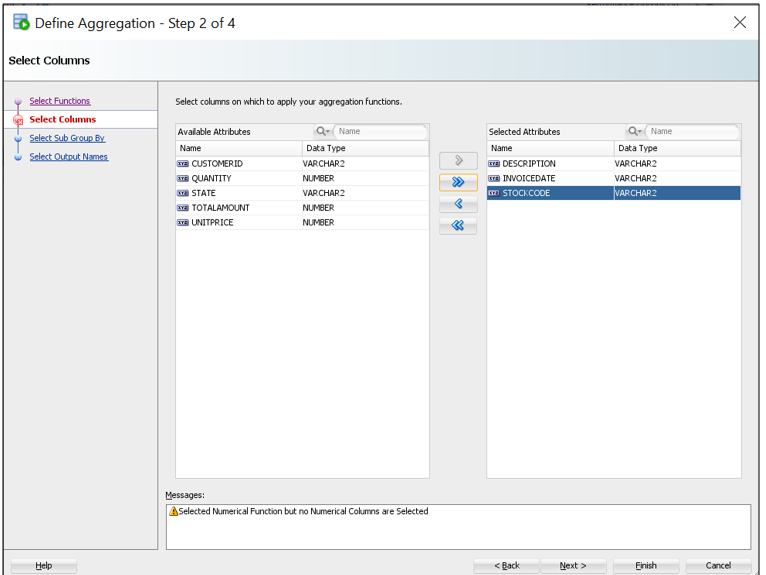

14. Skip the `Select Sub Group By` step in the wizard, Click on `Next`.  The three new columns will be listed. Click `Finish`. 

    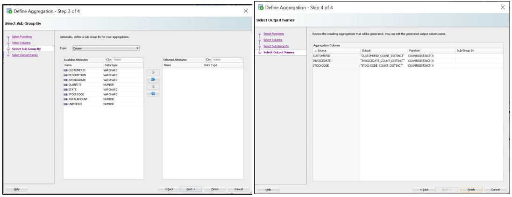

15. Click on the `Edit` button to select the `Group By` Columns, Select CUSTOMERID and STATE and click Ok
    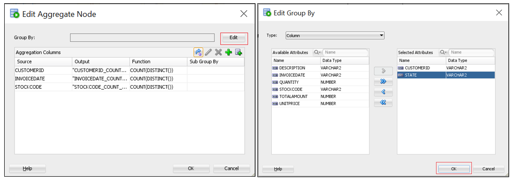

16. Click `Ok` to close the wizard
    

17. Drag a `Create Table` node to the canvas and connect it with the `Aggregate` node.  Right click on the Output node and select the `Run` option. The aggregated data will be stored in the `output` table.  Right click on the Output node and select `View Data` to see the aggregated data.

    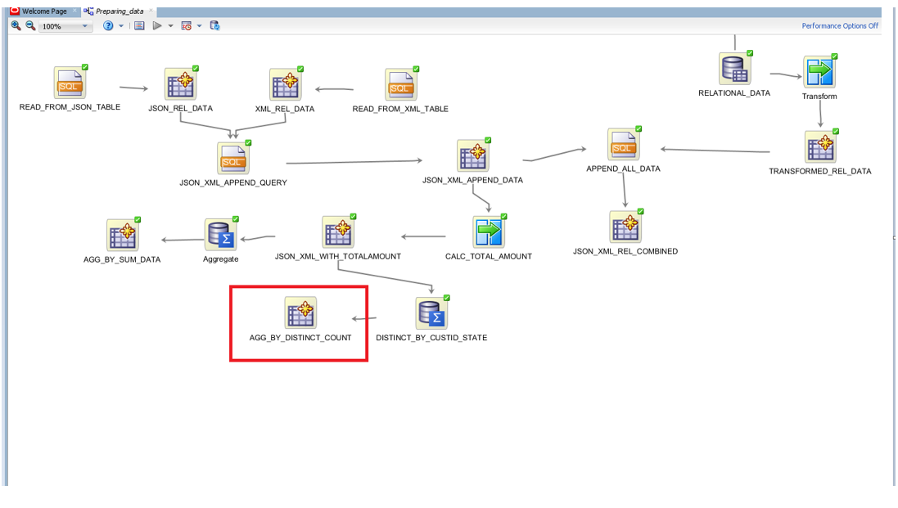 
    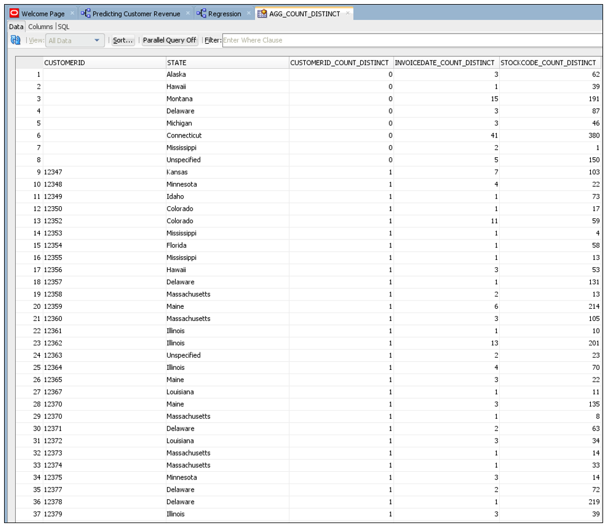 

## **STEP 8:** Join the Two Tables Using Join Node

1. Drag a `Join` node into the Canvas. Connect the `Join` node with the two output tables, containing the aggregated data (Sum Aggregation and Distinct Count aggregated data).

   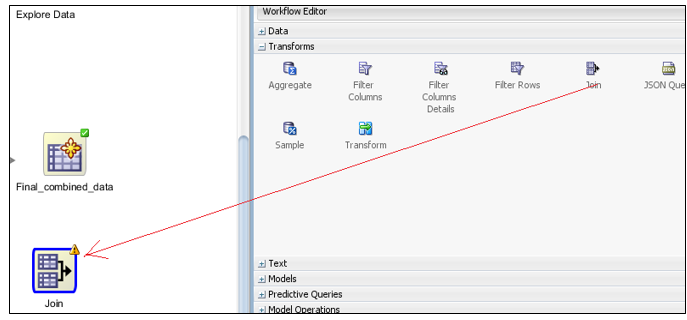
   

2.  Right Click on the `Join` node and select `Edit`, to start the `Join` Node wizard. In the Wizard click on the + sign as shown in the image below.

   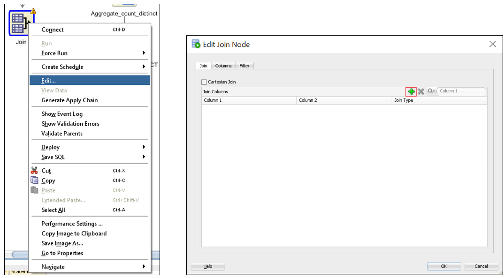

3. Select the Source tables as shown, and then select the join columns.  We will use CUSTOMERID and STATE as the join columns.  Select each of the join column pairs from both the tables, and click on the Add button to add the join criteria. After selecting both join columns, click Ok. 

    

4. Now remove the redundant columns from the join table output. To remove the redundant columns, select the columns and click on the x button as shown below. When prompted for confirmation, select `Yes`.

   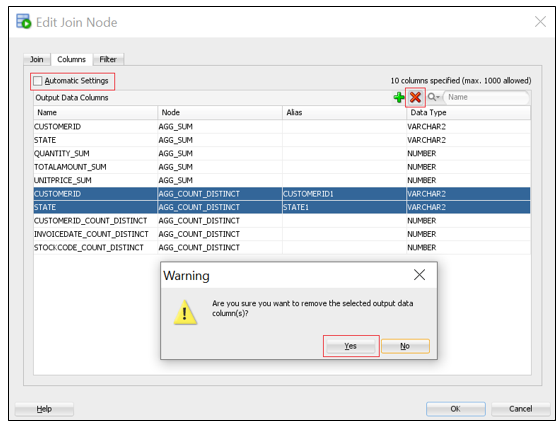

5. Go to the filter tab and we will add a filter to remove NULL values from the CUSTOMERID column of both tables. The criteria will be as below. The column names can be selected by clicking on the right panel displaying the table name and its columns.

    "AGG_SUM"."CUSTOMERID" IS NOT NULL  And "AGG\_COUNT\_DISTINCT"."CUSTOMERID" IS NOT NULL

    Click on the `Validate` button to validate your query. After the query is validated, click on `Ok`. Close the wizard by clocking `Ok`.

    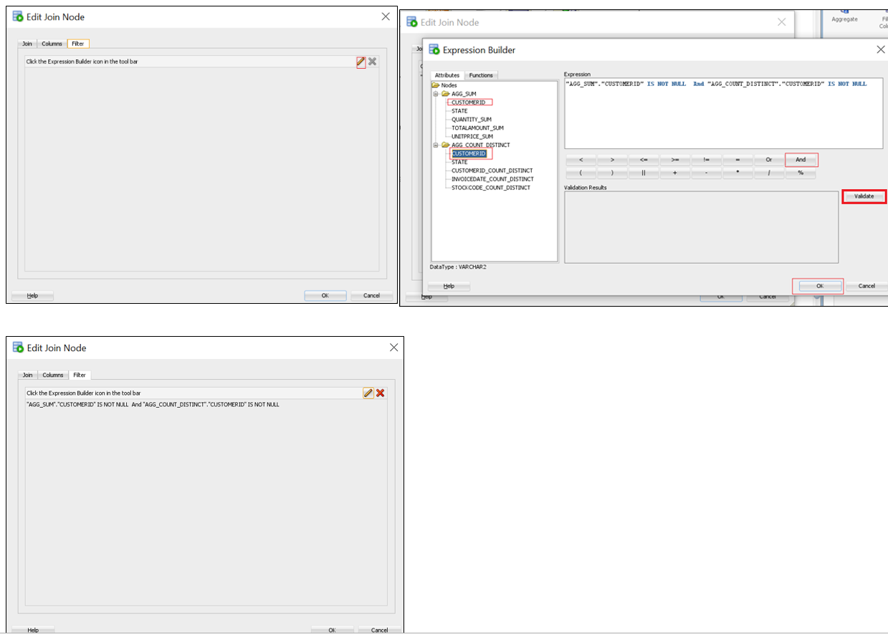

6. Right Click on the `Join` node and select `Run` to execute the join node. Drag a `Create Table` node to the canvas. Connect the `Join` node to the output table and execute the output table, by selecting `Run`. 

    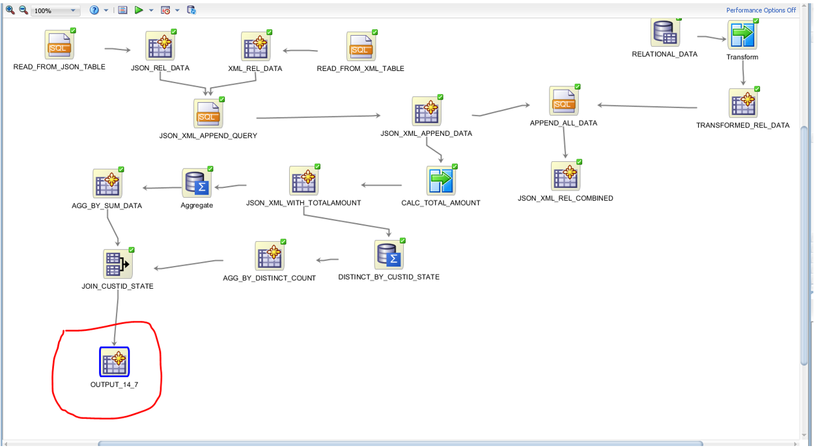

7. Right click on the output node and select `View` to see the joined data

   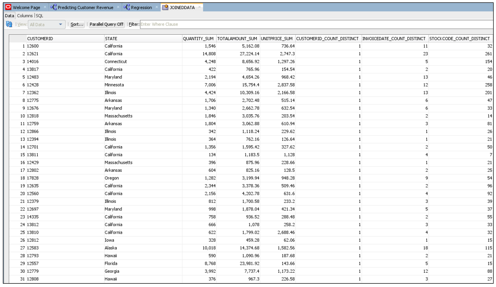

8. The next step is to remove the rows with duplicate CUSTOMERID.  
    Add a SQL Query node to the workflow and connect it to the Joined data output node. 

    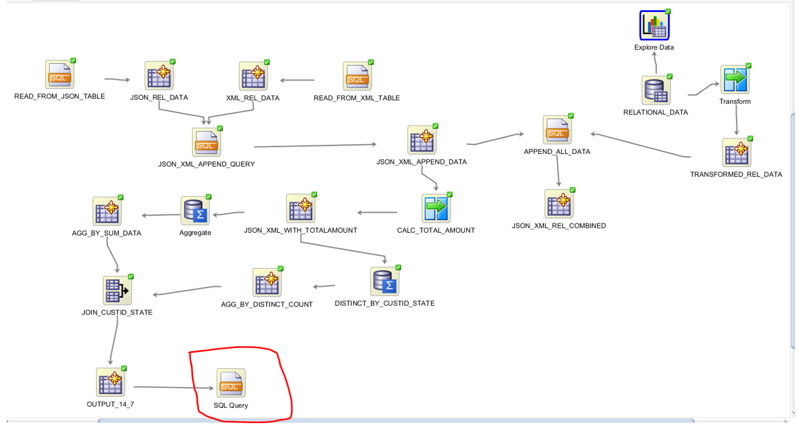

9. Right Click on the `SQL Query` node and select the Edit option. In the `SQL Query Node Editor` window, write a similar query as mentioned below. Change the table names according to your project. Then click `Ok`. 
    SELECT * from "JOINEDDATA\_N$10059" where customerid not in (select customerid from "JOINEDDATA\_N$10059" group by customerid having count(*) > 1)

    

10. Drag a `Create Table` node into the workflow and connect it with the `SQL Query` node.  Right Click on `SQL Query` node and select `Run`.

    

11. After successful execution, right click on the `Output` Table node and select `View Data`. Now we have records with unique CUSTOMERID and here from NULL values. 

    

12. Save the workflow by clicking the Save All icon in main toolbar

    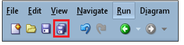

    Now your data is ready for usage in machine learning algorithms. 
    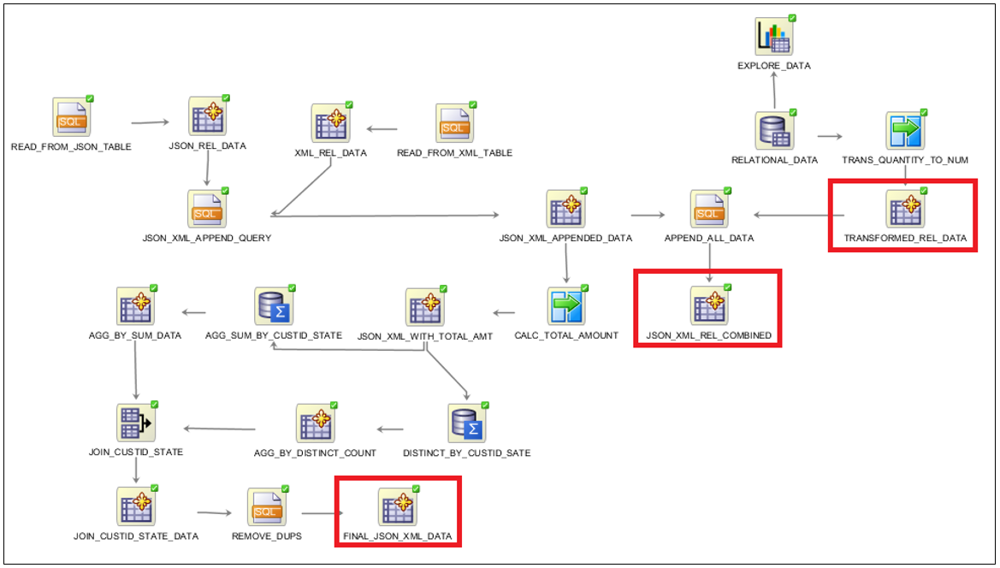

We have the three final source tables:
-	JSON and XML data combined
-	JSON, XML and RELATIONAL data combined
-	Transformed Relational Data

**This concludes this lab. You may now [proceed to the next lab](#next).**

## Rate this Workshop
When you are finished don't forget to rate this workshop!  We rely on this feedback to help us improve and refine our LiveLabs catalog.  Follow the steps to submit your rating.

1.  Go back to your **workshop homepage** in LiveLabs by searching for your workshop and clicking the Launch button.
2.  Click on the **Brown Button** to re-access the workshop  

   

3.  Click **Rate this workshop**

   

<!-- If you selected the **Green Button** for this workshop and still have an active reservation, you can also rate by going to My Reservations -> Launch Workshop. -->

## Acknowledgements
* **Authors** - Balasubramanian Ramamoorthy, Amith Ghosh
* **Contributors** - Laxmi Amarappanavar, Ashish Kumar, Priya Dhuriya, Maniselvan K, Pragati Mourya.
* **Last Updated By/Date** - Ashish Kumar, LiveLabs Platform, NA Technology, April 2021

 


