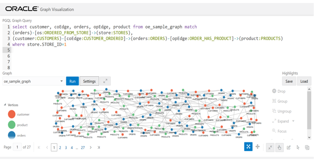

# Oracle Graph

## Introduction

This lab walks you through the steps of setting up the environment for property graph. Below are the prerequisites:

-	The Oracle Graph Server and Graph Client must be installed.
-	max\_string\_size must be enabled.
-	AL16UTF16 (instead of UTF8) must be specified as the NLS\_NCHAR\_CHARACTERSET.
-	AL32UTF8 (UTF8) should be the default character set,  but  AL16UTF16 must be the NLS\_NCHAR\_CHARACTERSET.

### Before You Begin

**What Do You Need?**

This lab assumes you have completed the following labs:
- Lab 1:  Login to Oracle Cloud
- Lab 2:  Generate SSH Key
- Lab 3:  Create Compute instance
- Lab 4:  Environment setup

**Oracle Graph Server and Client**

It is a software package for use with the Property Graph feature of Oracle Database. Oracle Graph Server and Client includes the high speed in-memory analytics server (PGX) and client libraries required for graph applications.

Oracle Graph Client: A zip file containing Oracle Graph Client.

Oracle Graph Server: An rpm file containing an easy to deploy Oracle Graph Server.

**For installing the Graph server, the prerequisites are:**
-	Oracle Linux 6 or 7 x64 or a similar Linux distribution such as RedHat
-	Oracle JDK 8

**For installing the Graph client, the prerequisites are:**
-	A Unix-based operation system (such as Linux) or macOS or Microsoft Windows
-	Oracle JDK 11


**Note:** Graph client and Sever installation is completed and the setup is ready for use.

### Interactive Graph Shell

Both the Oracle Graph server and client packages contain an interactive command-line application for interacting with all the Java APIs of the product, locally or on remote computers.

This interactive graph shell dynamically interprets command-line inputs from the user, executes them by invoking the underlying functionality, and can print results or process them further.

This graph shell is implemented on top of the Java Shell tool (JShell).

The graph shell automatically connects to a PGX instance (either remote or embedded depending on the --base_url command-line option) and creates a PGX session.

**About Oracle Graph**

Oracle’s converged, multi-model database natively supports graphs and delivers high performance, scalable graph data management, query, and analytics for enterprise applications. State-of-the-art graph features are available along with functionality required for enterprise grade applications: fine-grained security, high availability, easy manageability, and integration with other data in an application.


Oracle’s mission is to help people see data in new ways, discover insights, and unlock endless possibilities.  Graph analysis is about understanding relationships and connections in data, and detecting patterns that identify new insights. With Oracle’s Graph offerings developers can use a comprehensive suite of graph query and analytics tools to integrate graphs into applications on enterprise grade data management infrastructure.

**For example,** graph algorithms can identify what individual or item is most connected to others in social networks or business processes.  They can identify communities, anomalies, common patterns, and paths that connect individuals or related transactions.
Every Oracle Database now includes both property graph and RDF graph data models as well as algorithms, query languages, and visualization tools.


**Property Graph database includes:**

- PGX in-memory graph engine
- PGQL graph query language
- 50+ Graph algorithms
- Support for graph visualization


Customers use Property Graphs in fraud analytics, vulnerability analysis, recommendation systems, and more.

**RDF Graph database includes:**

- SPARQL graph query language
- Java APIs via open source Apache Jena
- W3C standards support for semantic data, ontologies and inferencing
- RDF Graph views of relational tables

Customers use RDF Graphs in linked data and data sharing applications in pharma, publishing, public sector and more.
This workbook provides an overview of Oracle Graph support for property graph features.


### Introduction to Property Graph

**What Are Property Graphs?**

A property graph consists of a set of objects or vertices, and a set of arrows or edges connecting the objects. Vertices and edges can have multiple properties, which are represented as key-value pairs.

**Each vertex has a unique identifier and can have:**

- A set of outgoing edges
- A set of incoming edges
- A collection of properties

**Each edge has a unique identifier and can have:**

- An outgoing vertex
- An incoming vertex
- A text label that describes the relationship between the two vertices
- A collection of properties


The following figure illustrates a very simple property graph with two vertices and one edge. The two vertices have identifiers 1 and 2. Both vertices have properties name and age. The edge is from the outgoing vertex 1 to the incoming vertex 2. The edge has a text label knows and a property type identifying the type of relationship between vertices 1 and 2.


Figure: Simple Property Graph Example


**A very brief note on PGQL**

The [pgql-lang.org](pgql-lang.org) site and specification [pgql-land.org/spec/1.2](pgql-land.org/spec/1.2) are the best reference for details and examples. For the purposes of this lab, however, here are minimal basics.

The general structure of a PGQL query is

SELECT (select list) FROM (graph name) MATCH (graph pattern) WHERE (condition)


PGQL provides a specific construct known as the MATCH clause for matching graph patterns. A graph pattern matches vertices and edges that satisfy the given conditions and constraints.
() indicates a vertex variable

  -an undirected edge, as in (source)-(dest)

-> an outgoing edge from source to destination

<- an incoming edge from destination to source

[]  indicates an edge variable


### Oracle Graph Video

[](youtube:-DYVgYJPbQA)
[](youtube:zfefKdNfAY4)

### Want to learn more
- [Oracle Graph](https://docs.oracle.com/en/database/oracle/oracle-database/19/spatl/index.html)
- [GeoRaster Developer's Guide](https://docs.oracle.com/en/database/oracle/oracle-database/19/geors/index.html)


## Step 1: Graph Server

1. For connecting to graph server, open a terminal in VNC and execute below steps as oracle user.
 ````
<copy>
   cd /opt/oracle/graph/pgx/bin
</copy>
````

2. Start Graph server
````
<copy>
./start-server
</copy>
````


The PGX server is now ready to accept requests.
Now that the server is started, will keep this window open and will proceed to start the client now.

3. Connect to Graph Client

The Graph Shell uses JShell, which means the shell needs to run on Java 11 or later. In our case the installation is completed, the shell executables can be found in /u01/graph/oracle-graph-client-20.1.0/bin after server installation or <\INSTALL\_DIR>/bin after client installation.

For connecting to graph client, open a putty session and execute below commands as oracle user.

````
<copy>
export JAVA_HOME=/u01/graph/jdk-11.0.5/
cd /u01/graph/oracle-graph-client-20.1.0/bin
</copy>
````

The graph shell automatically connects to a PGX instance (either remote or embedded depending on the --base_url command-line option) and creates a PGX session.

To launch the shell in remote mode, specify the base URL of the server with the --base_url option. For example:

````
<copy>
[oracle@bigdata bin]$ ./opg-rdbms-jshell --base_url http://machine-IP-address:7007
</copy>
````
Below screenshot is an example how Connection to a PGX server using Jshell looks like


4. Make a JDBC connection to the database:
At the jshell prompt.

````
<copy>
var jdbcUrl = "jdbc:oracle:thin:@<\instance_ip_address>:<\DB_Port>/SGRPDB";

</copy>
````

````
<copy>
var user = "appgrph";
</copy>
````

````
<copy>
var pass = "Oracle_4U";
</copy>
````

````
<copy>
var conn = DriverManager.getConnection(jdbcUrl, user, pass) ;
</copy>
````

Set auto commit to false.

This is needed for PGQL DDL and other queries.

````
<copy>
conn.setAutoCommit(false);
</copy>
````

Get a PgqlConnection.This will run PGQL queries directly against the VT$ (vertex) and GE$ (edge) tables

````
<copy>
var pgql = PgqlConnection.getConnection(conn);
</copy>
````


## Step 2: Create Graph

**Note: Below steps are already completed.**

We have created the views for the use of orders and order_items as multiple edge tables using below commands.

````
<copy>
Create or replace view co_edge as select * from orders;
Create or replace view oc_edge as select * from orders;
Create or replace view os_edge as select * from orders;
Create or replace view so_edge as select * from orders;
Create or replace view op_edge as select * from order_items;
Create or replace view po_edge as select * from order_items;
</copy>
````


We used a property graph query language [PGQL](http://pgql-lang.org) DDL to define and populate the graph.  The statement is as follows:

````
<copy>
CREATE PROPERTY GRAPH OE_SAMPLE_GRAPH
  VERTEX TABLES (
    customers KEY (CUSTOMER_ID) LABEL CUSTOMERS
PROPERTIES(CUSTOMER_ID, EMAIL_ADDRESS, FULL_NAME),
    products KEY (PRODUCT_ID) LABEL PRODUCTS
PROPERTIES (PRODUCT_ID, PRODUCT_NAME, UNIT_PRICE),
    orders KEY (ORDER_ID) LABEL ORDERS
PROPERTIES (ORDER_ID, ORDER_DATETIME, ORDER_STATUS),
    stores KEY (STORE_ID) LABEL STORES
PROPERTIES (STORE_ID, STORE_NAME, WEB_ADDRESS, PHYSICAL_ADDRESS,
LATITUDE, LONGITUDE)
  )
  EDGE TABLES (
    co_edge
      SOURCE KEY (CUSTOMER_ID) REFERENCES customers
      DESTINATION KEY (ORDER_ID) REFERENCES orders
      LABEL CUSTOMER_ORDERED
      NO PROPERTIES,
    oc_edge
      SOURCE KEY (ORDER_ID) REFERENCES orders
      DESTINATION KEY (CUSTOMER_ID) REFERENCES customers
      LABEL ORDERED_BY
      NO PROPERTIES,
    os_edge
      SOURCE KEY (ORDER_ID) REFERENCES orders
      DESTINATION KEY (STORE_ID) REFERENCES stores
      LABEL ORDERED_FROM_STORE
      NO PROPERTIES,
    so_edge
      SOURCE KEY (STORE_ID) REFERENCES stores
      DESTINATION KEY (ORDER_ID) REFERENCES orders
      LABEL STORE_GOT_ORDER
      NO PROPERTIES,
    op_edge
      SOURCE KEY (ORDER_ID) REFERENCES orders
      DESTINATION KEY (PRODUCT_ID) REFERENCES products
      LABEL ORDER_HAS_PRODUCT
      PROPERTIES (LINE_ITEM_ID, UNIT_PRICE, QUANTITY),
    po_edge
      SOURCE KEY (PRODUCT_ID) REFERENCES products
      DESTINATION KEY (ORDER_ID) REFERENCES orders
      LABEL PRODUCT_IN_ORDER
      PROPERTIES (LINE_ITEM_ID)
  )
</copy>
````
The above PQGL query is saved as sql file (CreatePropertyGraph.sql) and stored in path /u01/graph and is run at jshell prompt.

````
<copy>
pgql.prepareStatement(Files.readString(Paths.get("/u01/graph/CreatePropertyGraph.sql"))).execute();
</copy>
````

The Graph Server kit includes the necessary components (a server application and JShell client) that will execute the above CREATE PROPERTY GRAPH statement and create the graph representation.

The graph itself is stored in a set of tables named

  


The important ones are the ones that store the vertices (OE SAMPLE GRAPHVT$) and edges (OE SAMPLE GRAPHGE$).

Let’s look at the number of vertices and edges in the graph.

**SQL query**

There will be multiple entries with the same vid one each for the labels and properties.

````
<copy>
select count(distinct vid) from oe_sample_graphvt$ ;
</copy>
````
(Vid is the vertex id.)

There can be multiple entries with the same eid one each for the label and properties.

````
<copy>
select count(distinct eid) from oe_sample_graphge$;
</copy>
````

(eid is the edge id)
**Required step to print the result of a PGQL statement**

Create a convenience function which prepares, executes, and prints the result of a PGQL statement

````
<copy>
Consumer<\String> query = q -> { try(var s = pgql.prepareStatement(q)) { s.execute(); s.getResultSet().print(); } catch(Exception e) { throw new RuntimeException(e); } }
</copy>
````

## Step 3: Querying graph using PGQL

Below are some of the examples where we can query against the graph we created using PGQL:

1. Find the edge labels. We used labels here to tag an edge with a relationship type

````
<copy>
query.accept("select distinct label(e) from oe_sample_graph match ()-[e]->(m)");
</copy>
````


2. Finding vertex label using PGQL
Find the vertex labels. We used labels here to tag a vertex as an entity type.
````
<copy>
query.accept("select distinct label(v) from oe_sample_graph match (v)") ;
</copy>
````


## Step 4: Examples
Lets look at some of the examples about customers and their orders.

1. Getting count from customer table

````
<copy>
query.accept("select count(v) from oe_sample_graph match (v:CUSTOMERS)");
</copy>
````


2. Identifying the store using PGQL

 ````
 <copy>
 query.accept("select s.STORE_NAME from oe_sample_graph match (c:CUSTOMERS)->(o:ORDERS)->(s:STORES) where c.CUSTOMER_ID=202");
 </copy>
 ````


3. Identifying customer's purchases using PGQL

````
<copy>
query.accept(
"select o.ORDER_STATUS, op.QUANTITY, p.UNIT_PRICE, p.PRODUCT_NAME from oe_sample_graph match (c)-[co]->(o:ORDERS)-[op]->(p:PRODUCTS) where c.FULL_NAME='Dale Hughes'");
</copy>
````


4. What did people buy from the Online Store. Return first 50 results.

 ````
 <copy>
 query.accept(
"select c.FULL_NAME, p.PRODUCT_NAME from oe_sample_graph match (o)-[os:ORDERED_FROM_STORE]->(s:STORES),(c)-[co]->(o:ORDERS)-[op]->(p:PRODUCTS) where s.STORE_ID=1 limit 50");
 </copy>
 ````


5. Who bought how much of product  with id 19

````
<copy>
query.accept("select c.FULL_NAME, op.QUANTITY from oe_sample_graph match (c)-[co]->(o:ORDERS)-[op]->(p:PRODUCTS) where p.PRODUCT_ID=19 order by op.QUANTITY desc");
</copy>
````


6. Which customers bought products that customer 202 bought? Return the first 10 results  that had the most products in common with 202

````
<copy>
var qStr =
"select c1.FULL_NAME " +
"FROM oe_sample_graph " +
"MATCH (c:CUSTOMERS)->(:ORDERS)-[:ORDER_HAS_PRODUCT]->(p:PRODUCTS)," +
"(c1:CUSTOMERS)->(:ORDERS)-[:ORDER_HAS_PRODUCT]->(p:PRODUCTS) " +
"WHERE c.CUSTOMER_ID=202 " +
"AND c.CUSTOMER_ID <> c1.CUSTOMER_ID " +
"GROUP BY c1 " +
"ORDER BY count(DISTINCT p) DESC " +
"LIMIT 10";

query.accept(qStr);
</copy>
````


- Note : All of the above 5  queries are run against the database tables. Let’s load the graph into memory and perform that same set of PGQL queries against the in-memory graph.

7. Loading the Graph into memory

8. Run the below command in jshell prompt.

````
<copy>
Supplier<GraphConfig> pgxConfig = () -> { return GraphConfigBuilder.forPropertyGraphRdbms()
 .setJdbcUrl(jdbcUrl)
 .setUsername(user)
 .setPassword(pass)
 .setName("oe_sample_graph")
 .addVertexProperty("STORE_NAME", PropertyType.STRING)
 .addVertexProperty("PRODUCT_NAME", PropertyType.STRING)
 .addVertexProperty("FULL_NAME", PropertyType.STRING)
 .addVertexProperty("WEB_ADDRESS", PropertyType.STRING)
 .addVertexProperty("EMAIL_ADDRESS", PropertyType.STRING)
 .addVertexProperty("PHYSICAL_ADDRESS", PropertyType.STRING)
 .addVertexProperty("UNIT_PRICE", PropertyType.DOUBLE)
 .addVertexProperty("STORE_ID", PropertyType.INTEGER)
 .addVertexProperty("ORDER_ID", PropertyType.INTEGER)
 .addVertexProperty("CUSTOMER_ID", PropertyType.INTEGER)
 .addVertexProperty("ORDER_STATUS", PropertyType.STRING)
 .addVertexProperty("ORDER_DATETIME", PropertyType.STRING)
 .addVertexProperty("LATITUDE", PropertyType.DOUBLE)
 .addVertexProperty("LONGITUDE", PropertyType.DOUBLE)
 .addVertexProperty("PRODUCT_ID", PropertyType.INTEGER)
 .addEdgeProperty("LINE_ITEM_ID", PropertyType.INTEGER)
 .addEdgeProperty("QUANTITY", PropertyType.INTEGER)
 .addEdgeProperty("UNIT_PRICE", PropertyType.DOUBLE)
 .setPartitionWhileLoading(PartitionWhileLoading.BY_LABEL)
 .setLoadVertexLabels(true)
 .setLoadEdgeLabel(true)
 .setKeystoreAlias("alias")
 .build(); }
</copy>
````


Load the graph. This can take 10-15 minutes or more depending on network bandwidth

````
<copy>
var graph = session.readGraphWithProperties(pgxConfig.get()) ;
</copy>
````

9. Examples about customers and their orders after the graph is loaded into memory

Run similar PGQL queries against the in-memory graph


10. Which stores did customer with id 202 order from?

````
<copy>
session.queryPgql("select s.STORE_NAME from oe_sample_graph match (c:CUSTOMERS)->(o:ORDERS)->(s:STORES) where c.CUSTOMER_ID=202").print().close();
</copy>
````


10. What products did customer 202 buy?

````
<copy>
session.queryPgql("select s.STORE_NAME, o.ORDER_ID, p.PRODUCT_NAME from oe_sample_graph match (c:CUSTOMERS)->(o:ORDERS)->(s:STORES), (o:ORDERS)-[e:ORDER_HAS_PRODUCT]->(p:PRODUCTS) where c.CUSTOMER_ID=202").print().close();
</copy>
````


11. List the first 50 other customers who ordered from the same store(s) as customer 202

````
<copy>
session.queryPgql("Select c.CUSTOMER_ID, c.FULL_NAME from oe_sample_graph match (b:CUSTOMERS)->(o:ORDERS)->(s:STORES)<-(o2:ORDERS)<-(c:CUSTOMERS) Where b.CUSTOMER_ID=202 and b.CUSTOMER_ID <> c.CUSTOMER_ID LIMIT 50").print().close();
</copy>
````


12. List the first 30 products that customers ordered from the same stores as customer 202

````
<copy>
session.queryPgql("select c2.FULL_NAME, p2.PRODUCT_NAME from oe_sample_graph match (c:CUSTOMERS)-[co]->(o:ORDERS)-[os]->(s:STORES), (o:ORDERS)-[e:ORDER_HAS_PRODUCT]->(p:PRODUCTS), (c2:CUSTOMERS)-[co2]->(o2: ORDERS)-[os2]->(s2: STORES), (o2: ORDERS)-[e2:ORDER_HAS_PRODUCT]->(p2:PRODUCTS) where c.CUSTOMER_ID=202 and s.STORE_ID=s2.STORE_ID and c.CUSTOMER_ID <> c2.CUSTOMER_ID LIMIT 30").print().close();
</copy>
````


13. List the 10 customers who had the most product purchases in common with customer 202, see definition of qStr above or just enter qStr in the shell to see its content

````
<copy>
qStr ;
session.queryPgql(qStr).print().close();
</copy>
````


It is required to have the graph loaded into memory and published before visualizing it. So before moving to the next lab , please make sure Lab-2 and Lab -3 are completed.

So, our graph is loaded into the memory, let’s publish it

14. Publish the graph

````
<copy>
graph.publish(VertexProperty.ALL, EdgeProperty.ALL) ;
</copy>
````

## Step 5: Visualize the Graph

1. What products did customer 202 buy from which store(s)?

````
<copy>
select * from oe_sample_graph
match (c:CUSTOMERS)-[co]->(o:ORDERS)-[os]->(s:STORES), (o:ORDERS)-[e:ORDER_HAS_PRODUCT]->(p:PRODUCTS)
where c.CUSTOMER_ID=202;
</copy>
````


**Add some labels to the vertices**

Click on Settings -> Then choose the Visualization tab


Select label as the vertex label and then click OK


**The result should look like as below**


2. Which customers placed orders from store with id 1 (the Online store)? Show the first 100 results

````
<copy>
Select * from oe_sample_graph
Match (c)-[co]->(o)-[os:ORDERED_FROM_STORE]->(s)
Where s.STORE_ID=1 LIMIT 100;
</copy>
````


Let’s add some highlights to indicate Cancelled or Refunded orders.

Click on Settings-> Highlights-> New Highlight


We will add two conditions that match cancelled or refunded orders.

Select Apply To Vertices (i.e. the conditions apply to Vertices)

Click on the +  sign to add a condition

Choose label = ORDERS

Again, Click + sign  to add another condition

Choose ORDER_STATUS = CANCELLED

Click the checkbox for Color (vertex color) and choose a red color from the color-picker


Scroll down and enter Cancelled as the Legend Title and then Click Add Highlight.


Repeat the above process to add one more highlight for Refunded Orders.

Select Apply To Vertices (i.e. the conditions apply to Vertices)

Click on the +  sign to add a condition

Choose label = ORDERS

Click + to add another condition

Choose ORDER_STATUS = REFUNDED

Click the checkbox for Color (vertex color) and choose a yellow color from the color-picker

Set the Legend Title to Refunded

Then Click Add Highlight.


There should now be two highlights. Click OK


The resulting viz should look like


3. What products did customer buy?

````
<copy>
select customer, coEdge, orders, opEdge, product from oe_sample_graph match
(customer:CUSTOMERS)-[coEdge:CUSTOMER_ORDERED]->(orders:ORDERS)-[opEdge:ORDER_HAS_PRODUCT]->(product:PRODUCTS)
where customer.FULL_NAME='Dale Hughes';
</copy>
````



Add highlights on edges for Order items that had Quantity > 1 and unit_Price > 25

Click on settings-> Highlights-> New Highlights -> Select Apply To Edge

Add two conditions

Click on the +  sign to add conditions

- One for QUANTITY > 1
- Another for UNIT_PRICE > 25
- Choose a red color for the Edge ,Click on Add Highlight and then OK.


4. Which customers bought product with id 44? Show 100 results per page**

````
<copy>
select customer, coEdge, orders, opEdge, product from oe_sample_graph match
(orders)-[os:ORDERED_FROM_STORE]->(store:STORES),
(customer:CUSTOMERS)-[coEdge:CUSTOMER_ORDERED]->(orders:ORDERS)-[opEdge:ORDER_HAS_PRODUCT]->(product:PRODUCTS)
where store.STORE_ID=1;
</copy>
````


5. Which customers bought product with id 44? Show 100 results per page**

````
<copy>
select customer,opEdge, product, coEdge, orders from oe_sample_graph match
(customer:CUSTOMERS)-[coEdge:CUSTOMER_ORDERED]->(orders:ORDERS)-[opEdge:ORDER_HAS_PRODUCT]->(product:PRODUCTS)
where product.PRODUCT_ID=44;
</copy>
````


6. Deleting the Graph

Once you are done using PGViz at host:7007/ui and trying some other PGQL queries then execute the following statements to delete the in-memory graph

````
<copy>
graph.destroy();
</copy>
````

## Acknowledgements

- **Authors** - Balasubramanian Ramamoorthy, Arvind Bhope
- **Contributors** - Laxmi Amarappanavar, Kanika Sharma, Venkata Bandaru, Ashish Kumar, Priya Dhuriya, Maniselvan K.
- **Team** - North America Database Specialists.
- **Last Updated By** - Kay Malcolm, Director, Database Product Management, June 2020
- **Expiration Date** - June 2021   

**Issues-**
Please submit an issue on our [issues](https://github.com/oracle/learning-library/issues) page. We review it regularly.
