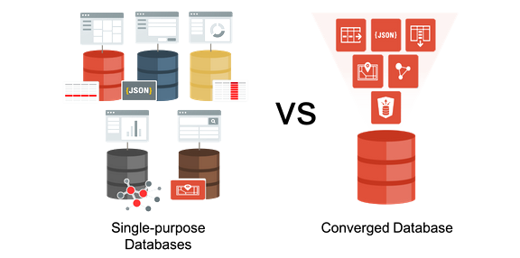

# Introduction

## About Oracle's Converged Database
The Oracle Database converges support for multiple data models and workloads into a single database, while supporting popular development tools and techniques like events and REST interfaces. As opposed to using multiple single purpose databases for each data type, using a converged database results in a **unified data tier**, enabling real-time analytics and machine learning on production data.

You don't need to manage and maintain multiple systems or worry about having to provide unified security across them. To learn more, see this [blog](https://blogs.oracle.com/database/many-single-purpose-databases-versus-a-converged-database).

### Objectives
In this workshop, you will gain first-hand experience of using data types beyond relational data - JSON, XML, Spatial and Graph.

Once you complete your setup, the next four labs in this workshop cover these individual data types, and the final lab consists of multi-model examples:

- Lab 4: NODE.JS
- Lab 5: JSON
- Lab 6: XML
- Lab 7: Spatial
- Lab 8: Graph
- Lab 9: Cross Data Types

You will also download Oracle SQL Developer to help execute the programs associated with the lab. We will use Docker containers and demonstrate multiple use cases with a Node.js application.

### Prerequisites

- Oracle SQL Developer client
- An Oracle Cloud account, Free Trial, LiveLabs or a Paid account

*Estimated Workshop Time:*  2.5 hours

*Please proceed to the first lab.*

## More Information
Feel free to share with your colleagues.

1. Blogs
      - [What is a converged database?](https://blogs.oracle.com/database/what-is-a-converged-database)
      - [Many single purpose database vs a converged database](https://blogs.oracle.com/database/many-single-purpose-databases-versus-a-converged-database)

## Acknowledgements
- **Owners** - Balasubramanian Ramamoorthy, Arvind Bhope
- **Contributors** - Laxmi Amarappanavar, Kanika Sharma, Venkata Bandaru, Ashish Kumar, Priya Dhuriya, Maniselvan K., Robbie Ruppel, David Start
- **Team** - North America Database Specialists
- **Last Updated By** - Abhinav Srivastava, Principal Product Marketing Director, Oracle Database, July 2020

## See an issue?
Please submit feedback using this [form](https://apexapps.oracle.com/pls/apex/f?p=133:1:::::P1_FEEDBACK:1). Please include the *workshop name*, *lab* and *step* in your request.  If you don't see the workshop name listed, please enter it manually. If you would like for us to follow up with you, enter your email in the *Feedback Comments* section.
