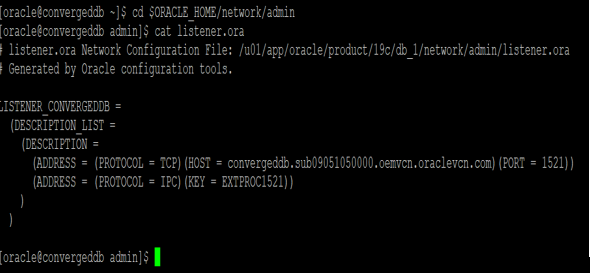
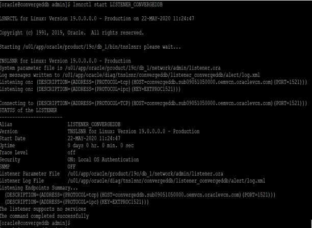
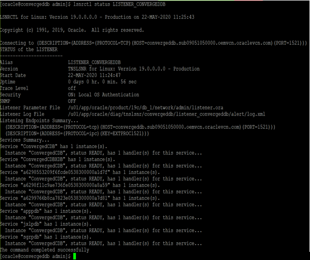

# Environment Setup 

## Introduction

Need introduction content  

## Step 1: Start the Database
1.  Open up putty and create a new connection. Enter the IP address assigned to your instance.

2.  Enter a name for the session and click **Save**.
 
     

3.	Click Session in the left navigation pane, then click Save in the Load, save or delete a stored session Step.

4.	Click Open to begin your session with the instance.

5.	Enter the details when prompted

    Username:  oracle
    Password:  H0la@1234

     

6.	Check for the oratab file and get the SID  and the oracle home details for the DB to start.

    ````
    <copy>
    cat /etc/oratab
    </copy>
    ````

     

7.	Start the database

    ````
    <copy>
    .oraenv
    </copy>
    ````
    ````
    <copy>
    startup
    </copy>
    ````
     

8.	Check for the pdbs status and open it.

    ````
    <copy>
    show pdbs
    alter pluggable datababse all open;
    show pdbs
    </copy>
    ````
     

## Step 2: Start the Listener

1.	Check for the listener file and get the listener name.

    ````
    <copy>
    cd $ORACLE_HOME
    cat listener.ora
    </copy>
    ````
    

2.	Start the listener

    ````
    <copy>
    lsnrctl start LISTENER_CONVERGEDDB
    </copy>
    ````
    

3.	Check the listener status

    ````
    <copy>
    lsnrctl status LISTENER_CONVERGEDDB
    </copy>
    ````
    

4.	Check if the database and listener is up and running

    ````
    <copy>
    ps -ef|grep pmon
    ps -ef|grep tns
    </copy>
    ````
    

## Step 3:  Setup VNC

1.	Run the command below and start vncserver as oracle user. It will prompt us to set the password for the first time, please provide the password and it will again ask to confirm the same.

    ````
    <copy>
    vncserver
    </copy>
    ````

2.	Check if the  vncserver process is running.

    ````
    <copy>
    ps -ef|grep vnc
    </copy>
    ````

3.	Lets do the tunnelling  for the  port mentioned in the vnc process 

4.	Go to putty settings -> SSH -> Tunnels and provide the source port and destination details. 

    

5.	Then click on Add, Once we click on add we can see an entry in the forwarded ports, then click on Apply.

    

6.	Start the VNC viewer (download from here incase it is not available locally on your machine).Provide the VNC server details, click on connect and provide the password which was set earlier.

    

7.	 For sqldeveloper to start, open the vnc viewer. Open a terminal and start the sql developer.

    ````
    <copy>
    cd /u01/graph/jdk-11.0.5/
    export
    JAVA_HOME=/u01/graph/jdk-11.0.5/
    sqldeveloper
    </copy>
    ````

You may now proceed to the next lab.

## Acknowledgements

- **Authors/Contributors** - Brian Hengen, Balasubramanian Ramamoorthy, Arvind Bhope
- **Last Updated By/Date** - Kay Malcolm, Director, Database Product Management, May 2020

### Issues?
Please submit an issue on our [issues](https://github.com/oracle/learning-library/issues) page. We review it regularly.


