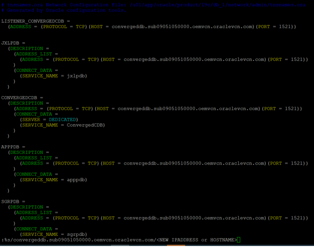
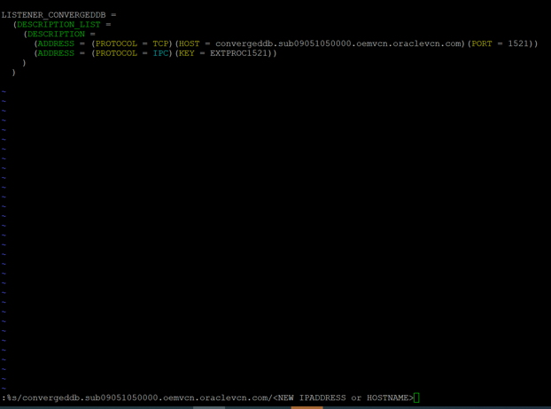
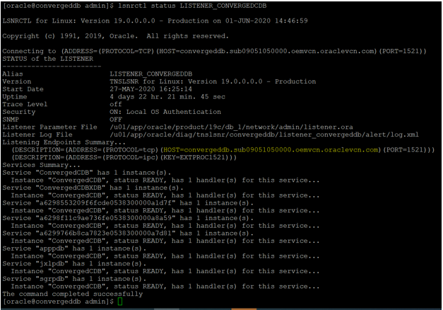
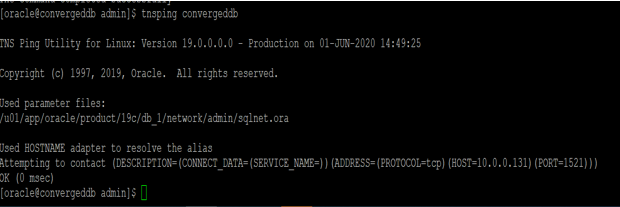
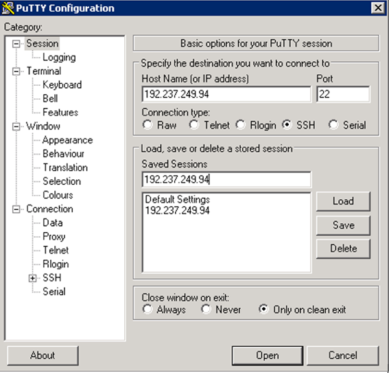
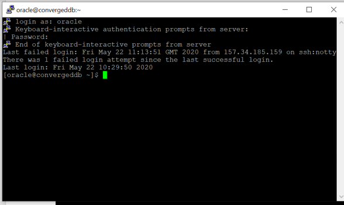

# Environment Setup 

## Introduction

This lab will show you that how to launch a compute instance from OCI Marketplace which is pre-configured with Oracle Database 19c and explained about how to start database instance and listener from putty window,also this covers how to setup vncserver and sqldeveloper etc. 

## Step 1: Start the Database

1.  Get the IP Address and host name of the server.

````
   <copy> 
 [oracle@convergeddb]$ curl ifconfig.co

 150.136.xx.xxx

 [oracle@convergeddb admin]$ hostname
   
 convergeddb
  </copy>
 ````


2. Open tnsnames.ora in vi-editor and replace the old hostname by new hostname/IP address
   
   ````
    <copy>

   :%s/convergeddb.suXXXX.oeXX.oraclevcn.com/NEW IPADDRESS or HOSTNAME
    
    </copy>
   ````

    

3. Similarly do the same changes for listener.ora through vi-editor
  
    

4. Then Bring up the listener and make sure the new hostname/IP address are reflected.
   
   **Note** – If have any trouble with starting the listener then the new hostname/IP address would not be updated properly.

   **Secondly**, Make sure all the PDB services should be listed in the status service column if not then, do the below steps 

    

5. Similarly, do tnsping validation and check the response from DB 
    
     

6.  Open up putty and create a new connection. Enter the IP address assigned to your instance.

7.  Enter a name for the session and click **Save**.
 
     

8.	Click Session in the left navigation pane, then click Save in the Load, save or delete a stored session Step.

9.	Click Open to begin your session with the instance.

10.	Enter the details when prompted

    Username:  opc
    
     

11.	Check for the oratab file and get the SID  and the oracle home details for the DB to start.

    ````
    <copy>
    cat /etc/oratab
    </copy>
    ````

     

12.	Start the database

    ````
    <copy>
    . oraenv
    startup
    </copy>
    ````
     

13.	Check for the pdbs status and open it.

    ````
    <copy>
    show pdbs
    alter pluggable database all open;
    show pdbs
    </copy>
    ````
     

14. Register database service with listener.
    
   ````
   <copy>
   show parameter local_listener
   </copy>
   ````
   ````
   <copy>set
   alter system set local_listener='(ADDRESS = (PROTOCOL=TCP)(HOST=NEW HOSTNAME/IPADDRESS)(PORT=1521))';
   </copy>
   ````
   ````
   <copy>
   alter system register;
   </copy>
   ````
15. Check the status of listerner and make sure all the database services should be registered.
    
    ````
    <copy>
    lsnrctl status LISTENER_CONVERGEDCDB
    </copy>
    ````
     

## Step 2:  Setup VNC

1.	Run the command below and start vncserver as oracle user. It will prompt us to set the password for the first time, please provide the password and it will again ask to confirm the same.

    ````
    <copy>
    vncserver
    </copy>
    ````

2.	Check if the  vncserver process is running.

    ````
    <copy>
    ps -ef|grep vnc
    </copy>
    ````

3.	Lets do the tunnelling  for the  port mentioned in the vnc process 

4.	Go to putty settings -> SSH -> Tunnels and provide the source port and destination details. 

    

5.	Then click on Add, Once we click on add we can see an entry in the forwarded ports, then click on Apply.

    

6.	Start the VNC viewer (download from here incase it is not available locally on your machine).Provide the VNC server details, click on connect and provide the password which was set earlier.

    

7.	 For sqldeveloper to start, open the vnc viewer. Open a terminal and start the sql developer.

    ````
    <copy>
    cd /u01/graph/jdk-11.0.5/
    export
    JAVA_HOME=/u01/graph/jdk-11.0.5/
    sqldeveloper
    </copy>
    ````

You may now proceed to the next lab.


## Acknowledgements

- **Authors** - Balasubramanian Ramamoorthy, Arvind Bhope
- **Contributors** - Laxmi Amarappanavar, Kanika Sharma, Venkata Bandaru, Ashish Kumar, Priya Dhuriya, Maniselvan K.
- **Team** - North America Database Specialists.
- **Last Updated By** - Kay Malcolm, Director, Database Product Management, June 2020
- **Expiration Date** - June 2021   

**Issues-**
Please submit an issue on our [issues](https://github.com/oracle/learning-library/issues) page. We review it regularly.
  


