# Oracle Machine Learning 

## Introduction

This lab is setup into multiple steps. In the first step, you will setup the environment for Converged DB and data science lab. In this lab, you will use Jupyter notebook to run the python code to connect to the database and run the machine learning codes. 

The first step is already been completed and has been included for reference. The second step creates the database schema and adds the JSON and XML data to the database tables. This step has also been completed. The third step is to connect to the database and read the data, which resides in multiple formats, and merge and convert them into a single common format. 

In the fourth step, we inspect the data for useful information using EDA and data visualization.  In fifth step (Market Basket Analysis), we try to find the best association rules and understand which set of products are being bought together. In the last step, we use clustering and RFM analysis for customer segmentation and find customer groups with similar behaviors for further analysis and business strategy planning.

Estimated Lab Time: 50 Minutes


## Prerequisites 

This lab assumes you have completed the following labs:

•	Lab2: Generate SSH Key

•	Lab:3 Setup Compute Instance

•	Start Database and Application 


## What is Data Science?

Data science is an inter-disciplinary field that uses scientific methods, processes, algorithms and systems to extract knowledge and insights from many structural and unstructured data. Data science is a "concept to unify statistics, data analysis, machine learning, domain knowledge and their related methods" in order to "understand and analyze actual phenomena" with data. 

It uses techniques and theories drawn from many fields within the context of mathematics, statistics, computer science, domain knowledge and information science.
The impact of data science is being felt across a range of industries, and this fact emerges clearer than ever when we consider the technology advancements in the last few years. When we look at the retail industry, most business owners who have been quick at incorporating the emerging technologies agree that it helped them jump to the helm of the marketplace.


As the retail sector strives to stay technologically relevant while meeting customer demands, data science has emerged as a lifesaver that can be leveraged to predict trends and make informed decisions. The ability of data science to visualize customer behavior has enabled the retail industry to foresee customer likes and dislikes and has taken the capabilities of retailers beyond mere data collection and analysis. By incorporating the right tools and processes, businesses can now efficiently utilize the insights to influence the decisions of consumers through robust communication.

## About Oracle Converged Database

A converged database is a database that has native support for all modern data types and the latest development paradigms built into one product.

Converged databases support Spatial data for location awareness, JSON and XML for document stores, IoT for device integration, in-memory technologies for real-time analytics, and of course, traditional relational data. By providing support for all of these data types, a Converged Database can run all sorts of workloads from IoT to Blockchain to Analytics and Machine Learning.

By integrating new data types, workloads, and paradigms as features within a converged database, you can support mixed workloads and data types in a much simpler way. You do not need to manage and maintain multiple systems or worry about having to provide unified security across them.

You also get synergy across these capabilities. For example, by having support for Machine Learning algorithms and spatial data in the same database, you can easily do predictive analytics on spatial data. Making it dramatically easier and faster to develop data-driven apps.

[](youtube:wjh8VsSwxvM)


## Step 1: Connect to Database

1. Connecting to Oracle DataBase to read data from table and storing as CSV File

````
<copy>
%%time
# importing the libraries
import csv
import cx_Oracle
# Creating connection to online database (<schema>/<password>@<IP>/<pluggable database>)
con = cx_Oracle.connect('appml/Oracle_4U@150.136.48.126/apppdb')
cursor = con.cursor()
# Opening a csv file to write the data
csv_file = open("retail_data_relational.csv", "w")
# Creating writer object to write data to csv file
writer = csv.writer(csv_file, delimiter=',', lineterminator="\n", quoting=csv.QUOTE_NONNUMERIC)
# Add the query to extract data from table
r = cursor.execute("SELECT * FROM Data_rel")
col_names = [row[0] for row in cursor.description]
# writing the data rows to csv file
writer.writerow(col_names)
for row in cursor:
    writer.writerow(row)
# closing the cursor and connection to the database    
cursor.close()
con.close()
# closing the file object
csv_file.close()
</copy>
````

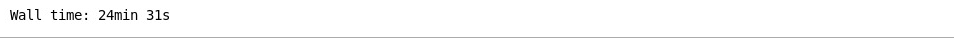


2. Query to read data from a XML table in Oracle Database. XMLTABLE which allows you to project columns on to XML data in an XMLTYPE, making it possible to query the data directly from SQL as if it were relational data.

````
<copy>
# Query to extract data from XML table
query_XML = "SELECT xt.* FROM   XML_PURCHASEORDER x, XMLTABLE('PURCHASEORDER' PASSING x.XML_DOCUMENT COLUMNS INVOICENO, STOCKCODE, DESCRIPTION, QUANTITY,  INVOICEDATE, UNITPRICE, CUSTOMERID, STATE ) xt"
</copy>
````

3. Connecting to Oracle DataBase to read data from XML table and storing as CSV File

````
<copy>
%%time
# importing the libraries
import csv
import cx_Oracle
# Creating connection to online database (<schema>/<password>@<IP>/<pluggable database>)
con = cx_Oracle.connect('appml/Oracle_4U@150.136.48.126/apppdb')
cursor = con.cursor()
# Opening a csv file to write the data
csv_file = open("retail_data_relational_XML.csv", "w")
# Creating writer object to write data to csv file
writer = csv.writer(csv_file, delimiter=',', lineterminator="\n", quoting=csv.QUOTE_NONNUMERIC)
# Add the query to extract data from XML table
r = cursor.execute(query_XML)
col_names = [row[0] for row in cursor.description]
# writing the data rows to csv file
writer.writerow(col_names)
for row in cursor:
    writer.writerow(row)
# closing the cursor and connection to the database
cursor.close()
con.close()
# closing the file object
csv_file.close()
</copy>
````

Wall time: 1min 5s


4. Query to read data from a JSON table in Oracle Database. JSON table enables the creation of an inline relational view of JSON content

````
<copy>
# Query to extract data from JSON table
query_JSON = "SELECT jt.* FROM JSON_PURCHASEORDER, JSON_TABLE(JSON_DOCUMENT, '$[*]'  COLUMNS (INVOICENO     PATH '$.INVOICENO', STOCKCODE PATH '$.STOCKCODE', DESCRIPTION PATH DESCRIPTION, QUANTITY PATH QUANTITY, INVOICEDATE PATH INVOICEDATE, UNITPRICE  PATH UNITPRICE, CUSTOMERID PATH CUSTOMERID, STATE  PATH STATE)) jt"
</copy>
````

5. Connecting to Oracle DataBase to read data from JSON table and storing as CSV File

````
<copy>
%%time
# importing the libraries
import csv
import cx_Oracle
# Creating connection to online database (<schema>/<password>@<IP>/<pluggable database>)
con = cx_Oracle.connect('appml/Oracle_4U@150.136.48.126/apppdb')
cursor = con.cursor()
# Opening a csv file to write the data
csv_file = open("retail_data_relational_JSON.csv", "w")
writer = csv.writer(csv_file, delimiter=',', lineterminator="\n", quoting=csv.QUOTE_NONNUMERIC)
# Add the query to extract data from JSON table
r = cursor.execute(query_JSON)
col_names = [row[0] for row in cursor.description]
# writing the data rows to csv file
writer.writerow(col_names)
for row in cursor:
    writer.writerow(row)
# closing the cursor and connection to the database
cursor.close()
con.close()
# closing the file object
csv_file.close()
</copy>
````

Wall time: 1min 17s

6. Concatenating the CSV files output from all the 3 tables into a data frame.

````
<copy>
# importing the libraries
import pandas as pd
import glob
# defining the path where all the csv files are stored
path = r'C:\JupyterNotebooks\RetailDataAnalysis\7-DBConnect' # use your path
# adding all csv files in the path
all_files = glob.glob(path + "/*.csv")

li = []
# Reading and appending data from the csv files and storing it in dataframe
for filename in all_files:
    df = pd.read_csv(filename, index_col=None, header=0)
    li.append(df)

frame = pd.concat(li, axis=0, ignore_index=True)
frame.head()
</copy>
````

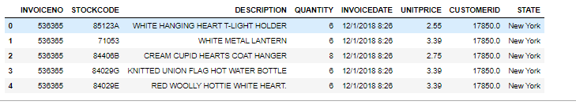


7. Check the rows and columns (dimensions) of the data frame.

````
<copy>
frame.shape
</copy>
````

(541909, 8)

8. Renaming columns of the data frame

````
<copy>
frame = frame.rename(columns = {"INVOICENO": "InvoiceNo", 
                                  "STOCKCODE":"StockCode", 
                                  "DESCRIPTION": "Description",
                                   "QUANTITY": "Quantity", 
                                  "INVOICEDATE":"InvoiceDate", 
                                  "UNITPRICE": "UnitPrice",
                                   "CUSTOMERID": "CustomerID", 
                                  "STATE":"State"})
</copy>
````

9. Saving the data in the data frame as a CSV file

````
<copy>
%%time
frame.to_csv(r'../8-CombinedData/combined_rdbms_json_xml.csv',index=False)
</copy>
````

Wall time: 2.24 s

10. Listing the top rows of the combined data (CSV)

````
<copy>
combinedDF = pd.read_csv(r'../8-CombinedData/combined_rdbms_json_xml.csv')
print(combinedDF.shape)
combinedDF.head()
</copy>
````

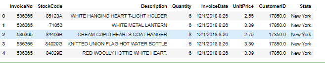


 
## Step 2: EDA

1. Import the required packages

````
<copy>
import pandas as pd
import numpy as np

import warnings
warnings.filterwarnings("ignore")

import seaborn as sns
import matplotlib.pyplot as plt
%matplotlib inline
</copy>
````

2. We start with EDA (Exploratory Data Analysis). EDA is an approach to analyzing data sets to summarize their main characteristics, often with visual methods.

````
<copy>
CleanDataset = r'../3-Cleaned-Dataset/OnlineRetail_Cleaned_New.csv'
</copy>
````

3. Load the dataset into python data frame.

````
<copy>
#load the dataset
df_retail = pd.read_csv(CleanDataset)
</copy>
````

4. Check the size of data (Number of Rows, Number of Columns)

````
<copy>
#shape of our dataset
print("The shape of our dataset is: ", df_retail.shape)
</copy>
````

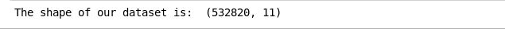 


5. List the Top 10 rows of dataset

````
<copy>
#check the head of the dataset
cleanedDataHead = df_retail.head(10)
cleanedDataHead.to_csv("cleanedDataHead.csv")
cleanedDataHead
</copy>
````

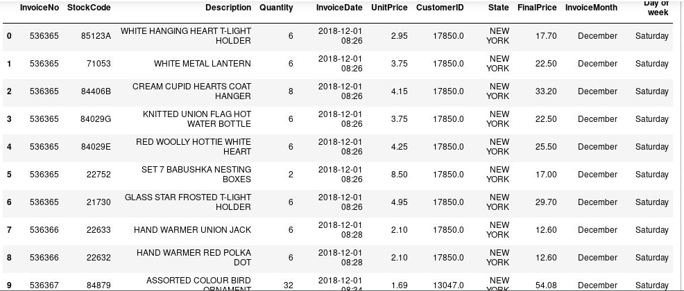 

6. List last 10 rows of dataset

````
<copy>
cleanedDataTail = df_retail.tail(10)
cleanedDataTail.to_csv("cleanedDataTail.csv")
cleanedDataTail
</copy>
````
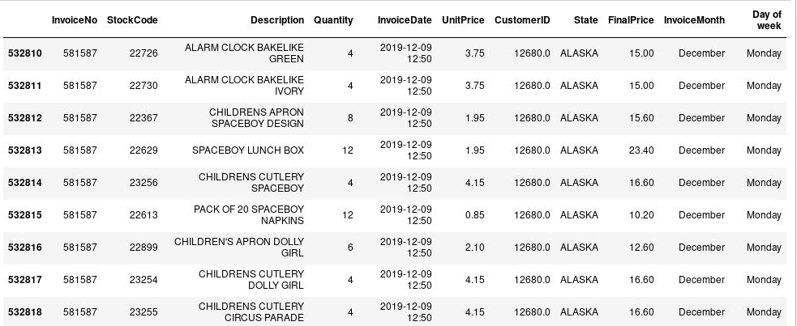 

7. Let's explore our dataset first by getting more information about rows and columns.

````
<copy>
df_retail.info()
</copy>
````

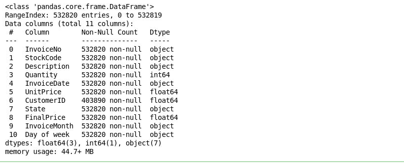 

Our dataset is composed of 541909 rows and 8 columns. When going through the columns, we notice that we have some missing values in the CustomerID column, as it only has 406829 values. Also the column Description has missing values. So, that should be considered when applying exploration to our dataset.

8. Exploring Unique Values of each Attribute

````
<copy>
print("Number of transactions: ", df_retail['InvoiceNo'].nunique())
print("Number of products bought: ",df_retail['StockCode'].nunique())
print("Number of customers:", df_retail['CustomerID'].nunique() )
print("Percentage of customers NA: ", round(df_retail['CustomerID'].isnull().sum() * 100 / len(df_retail),2),"%" )
print('Number of states: ',df_retail['State'].nunique())
</copy>
````
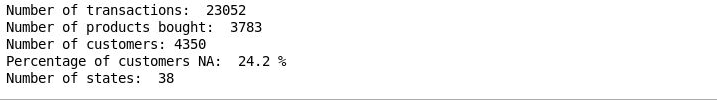 

**Note:** The number of NA customers is quite large and that would impact the results.

This dataframe contains 8 variables that correspond to:

**InvoiceNo:** Invoice number. Nominal, a 6-digit integral number uniquely assigned to each transaction. If this code starts with letter 'c', it indicates a cancellation.

**StockCode:** Product (item) code. Nominal, a 5-digit integral number uniquely assigned to each distinct product.

**Description:** Product (item) name. Nominal.

**Quantity:** The quantities of each product (item) per transaction. Numeric.

**InvoiceDate:** Invoice Date and time. Numeric, the day and time when each transaction was generated.

**UnitPrice:** Unit price. Numeric, Product price per unit in dollars.

**CustomerID:** Customer number. Nominal, a 5-digit integral number uniquely assigned to each customer.

**USStates:** State name. Nominal, the name of the state where each customer resides.

Now, let's have an idea about the quantitative data (Quantity & UnitPrice)

9. Compute a summary of statistics pertaining to the Data columns

````
<copy>
dataDescribe = df_retail.describe()
dataDescribe.to_csv("dataDescribe.csv")
dataDescribe
</copy>
````

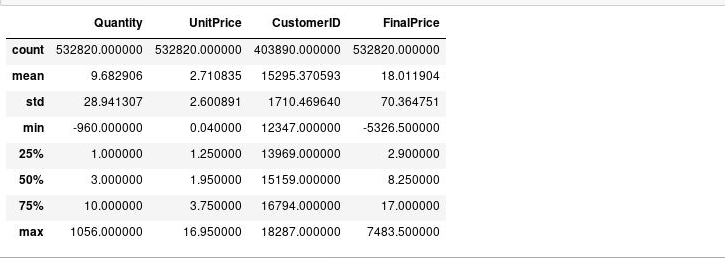

The first thing to notice is that we have some negative values in our dataset. Maybe, this could mean that these quantity was returned or cancelled. (Same for UnitPrice negative values).

**Cancelled Invoices**

As mentioned in the description of the dataset, some InvoiceNo start with the letter "c" = cancelled. Let's see if our hypothesis is correct about the negative quantity: -80995. We will look for the list of cancelled invoices and check if there is an invoice with that quantity.


1. Get the cancelled transactions

````
<copy>
cancelled_orders = df_retail[df_retail['InvoiceNo'].astype(str).str.contains('C')]
cancelledHead = cancelled_orders.head()
cancelledHead.to_csv("cancelledHead.csv")
cancelledHead
</copy>
````

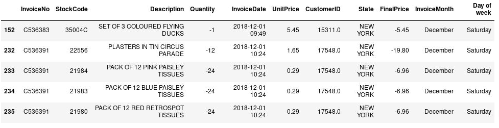

2. Search for one cancelled transaction

````
<copy>
cancelled_orders[cancelled_orders['Quantity']==-960]
</copy>
````
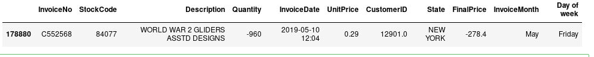

````
<copy>
cancelled_orders[cancelled_orders['Quantity']>0]
</copy>
````

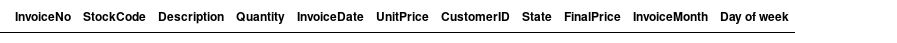

As expected, negative values in the Quantity column, mean that it is a cancelled quantity.

**Question:** How much cancelled orders do we have?

````
<copy>
#check how many rows our dataframe of cancelled orders contain
print("We have ",len(cancelled_orders), " cancelled orders.")
#percentage of cancelled orders in total orders
total_orders = df_retail['InvoiceNo'].nunique()
cancelled_number = len(cancelled_orders)
print('Percentage of orders canceled: {}/{} ({:.2f}%) '.format(cancelled_number, total_orders, cancelled_number/total_orders*100))
</copy>
````
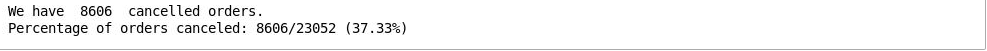

**Answer:** We have a large percentage of cancelled orders of 37%. Studying these cancelled orders may help in preventing future cancellation.

**Explore by products per invoice**

**Question:** In the description of our dataframe, we found that 75% of customers buy a quantity of 10. Are they from the same product? Let's examine how many products are purchased.

````
<copy>
temp_df = df_retail.groupby(['InvoiceNo','CustomerID'],as_index=False)['InvoiceDate'].count()
transaction_df = temp_df.rename(columns= {'InvoiceDate':'Number of Products'})
transactionHead = transaction_df.head()
transactionHead.to_csv("transactionHead.csv")
transactionHead
</copy>
````
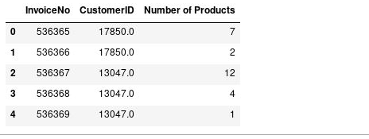

````
<copy>
transaction_df.size
</copy>
````
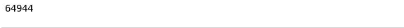

````
<copy>
transactionDesc = transaction_df.describe()
transactionDesc.to_csv("transactionDesc.csv")
transactionDesc
</copy>
````
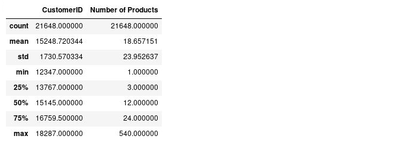

**Check the product distribution in dataset**

````
<copy>
fig, ax = plt.subplots()
fig.set_size_inches(11.7, 10)
sns.distplot(transaction_df['Number of Products'],ax=ax)
plt.show()
</copy>
````
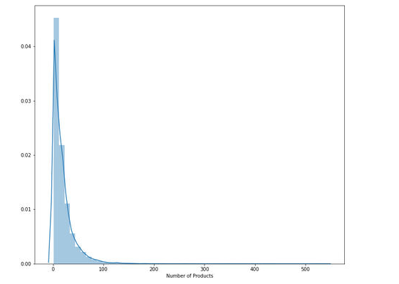

We have a skewed distribution of products. Most people buy less than 25 items.

**Customers by state**

**Add a new column 'total_cost' to the retail data. It is computed by multiplying quantity with unit price**

````
<copy>
df_retail['total_cost'] = df_retail['Quantity'] * df_retail['UnitPrice']
</copy>
````

````
<copy>
otalCostAddHead = df_retail.head()
TotalCostAddHead.to_csv("TotalCostAddHead.csv")
TotalCostAddHead
</copy>
````
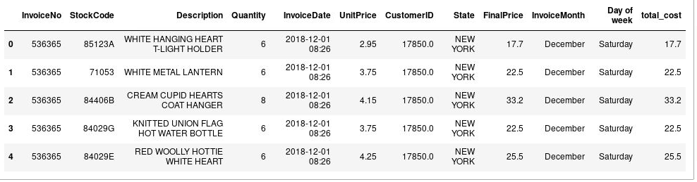

**What is the total revenue per State?**
````
<copy>
import seaborn as sns
import matplotlib.pyplot as plt
%matplotlib inline
fig, ax = plt.subplots()
fig.set_size_inches(13, 11.5)
ax=sns.barplot(x='State', y='total_cost',data=df_retail,estimator=max,ax=ax)
ax.set_xticklabels(ax.get_xticklabels(), rotation=47, ha="right")
plt.show()
</copy>
````

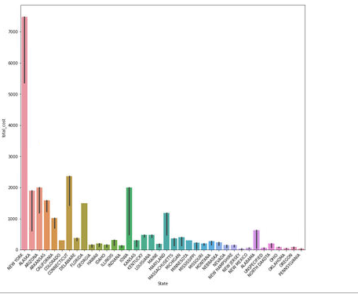

**After grouping by State, sort the data by total_cost column**

````
<copy>
sortedbyTC = df_retail.groupby('State').sum().sort_values(by='total_cost', ascending=False)
sortedbyTC.to_csv("sortedbyTC.csv")
sortedbyTC
</copy>
````

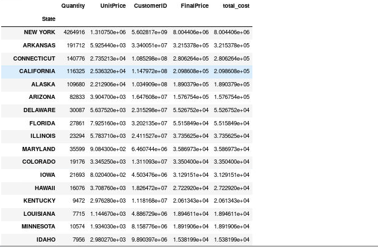

**Now we see that the largest market is located in New York.**

````
<copy>
df_retail[df_retail['State']=='NEW YORK']['CustomerID'].nunique()
</copy>
````

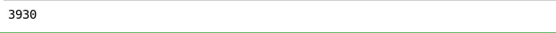

Therefore, we can conclude that most the sales revenues are realized in NEW YORK, but most the customers are located there too. This can be explored to find more about what products the customers buy together and what possible future opportunities in the NEW YORK Market.

````
<copy>
NEWYORK_retail = df_retail[df_retail['State']=='NEW YORK']
nyRetailDesc = NEWYORK_retail.describe()
nyRetailDesc.to_csv("nyRetailDesc.csv")
nyRetailDesc
</copy>
````
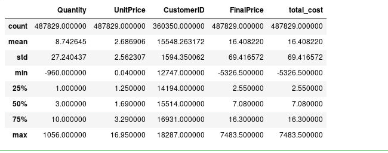

````
<copy>
print("Number of transactions: ", NEWYORK_retail['InvoiceNo'].nunique())
print("Number of products bought: ",NEWYORK_retail['StockCode'].nunique())
print("Number of customers:", NEWYORK_retail['CustomerID'].nunique() )
print("Percentage of customers NA: ", round(NEWYORK_retail['CustomerID'].isnull().sum() * 100 / len(NEWYORK_retail),2),"%" )
print('Number of states: ',NEWYORK_retail['State'].nunique())
</copy>
````

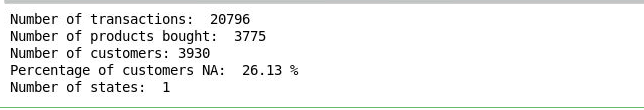

**Explore quantity**

**What are the products that are most bought in NEW YORK?**

````
<copy>
groupedProduct = NEWYORK_retail.groupby('StockCode',as_index= False)['Quantity'].sum().sort_values(by='Quantity', ascending=False)
groupedProductSorted = groupedProduct.head(10)
groupedProductSorted.to_csv("groupedProductSorted.csv")
groupedProductSorted
</copy>
````

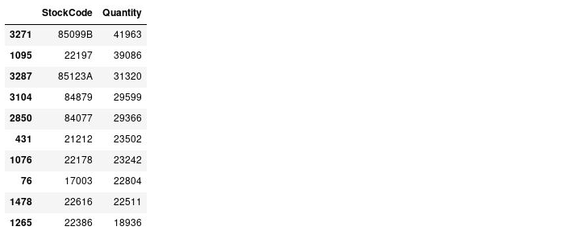

````
<copy>
invoice_quantity= NEWYORK_retail.groupby('InvoiceNo', as_index=False)['Quantity'].sum().sort_values(by='Quantity', ascending=False)
invoice_quantityHead = invoice_quantity.head()
invoice_quantityHead.to_csv("invoice_quantityHead.csv")
invoice_quantityHead
</copy>
````


## Step 3:  Market Basket Analysis

1. Import python packages

````
<copy>
import pandas as pd
import numpy as np

import seaborn as sns
%matplotlib inline

from mlxtend.frequent_patterns import apriori
from mlxtend.frequent_patterns import association_rules
</copy>
````


2. Load the datasets

````
<copy>
#load the dataset
CleanDataset = r'../3-Cleaned-Dataset/OnlineRetail_Cleaned_New.csv'
retail_df = pd.read_csv(CleanDataset)
retail_df.head()
</copy>
````

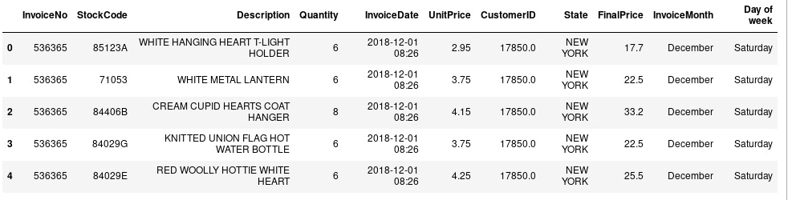


3. Cleanup of the data

````
<copy>
#remove additional spaces
retail_df['Description'] = retail_df['Description'].str.strip()
#remove NA values
retail_df.dropna(axis=0, subset=['InvoiceNo'], inplace=True)
#remove cancelled orders
retail_df['InvoiceNo'] = retail_df['InvoiceNo'].astype('str')
retail_df = retail_df[~retail_df['InvoiceNo'].str.contains('C')]

</copy>
````


4. Custom function to create statewise marketing baskets


````
<copy>
def encode_units(x):
    if x <= 0:
        return 0
    if x >= 1:
        return 1

def create_basket(state_filter):
    basket = (retail_df[retail_df['State'] == state_filter]
          .groupby(['InvoiceNo', 'Description'])['Quantity']
          .sum().unstack().reset_index().fillna(0)
          .set_index('InvoiceNo'))
    return basket
</copy>
````

5. Creating baskets for Alaska

````
<copy>
state_filter = "ALASKA"
basket_alaska = create_basket("ALASKA")
basket_sets = basket_alaska.applymap(encode_units)
</copy>
````

6. Creating association rules

````
<copy>
rules = association_rules(frequent_itemsets, metric="lift", min_threshold=1.2)
association_rules_alaska = rules.head()
association_rules_alaska.to_csv("association_rules_alaska.csv")
association_rules_alaska
</copy>
````

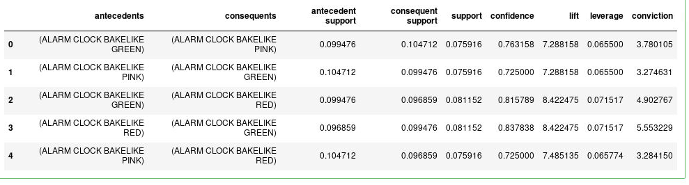

According to the results a customer is 7 times more likely to buy a pink alarm clock bakelike than an average customer (lift) if he/she buys ALARM CLOCK BAKELIKE GREEN. This rule is "true" in 72% of the cases (confidence). This can be used as insight to recommend ALARM CLOCK BAKELIKE PINK for tthose who bought the Green one.


7. Creating baskets for California

````
<copy>
basket_ca = create_basket("CALIFORNIA")
basket2_sets = basket_ca.applymap(encode_units)
</copy>
````

````
<copy>
frequent_itemsets_ca = apriori(basket2_sets, min_support=0.05, use_colnames=True)
</copy>
````

8. Association rules for Alaska

````
<copy>
rules = association_rules(frequent_itemsets_ca, metric="lift", min_threshold=1.2)
association_rules_california = rules.head()
association_rules_california.to_csv("association_rules_california.csv")
association_rules_california
</copy>
````

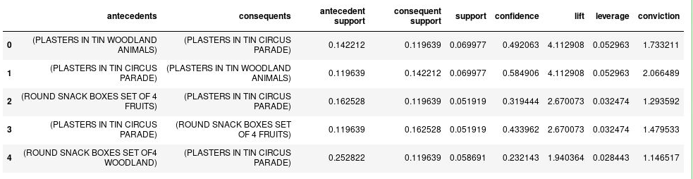

According to the results a customer is 4 times more likely to buy PLASTERS IN TIN WOODLAND ANIMALS than an average customer (lift) if he/she buys PLASTERS IN TIN CIRCUS PARADE. This rule is "true" in 49% of the cases (confidence). This can be used as insight to recommend PLASTERS IN TIN WOODLAND ANIMALS for tthose who bought the Green one.

At this point, you may want to look at how much opportunity there is to use the popularity of one product to drive sales of another.


9. Creating baskets for New York

````
<copy>
basket_ny = create_basket("NEW YORK")
basket3_sets = basket_ny.applymap(encode_units)
</copy>
````
10. Association rules for New York

````
<copy>
frequent_itemsets_ny = apriori(basket3_sets, min_support=0.05, use_colnames=True)
rules = association_rules(frequent_itemsets_ny, metric="lift", min_threshold=0.8)
rules.head()
</copy>
````

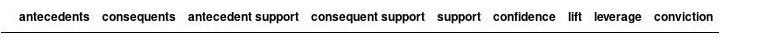

As we didn't find any rules for New York customers. We will try other filters.

````
<copy>
retail_filtered = retail_df[retail_df['State']=="NEW YORK"]
</copy>
````

We add a filter to include invoices which have less than 10 items

````
<copy>
basket = (retail_filtered[retail_filtered['Quantity']<10]
          .groupby(['InvoiceNo', 'Description'])['Quantity']
          .sum().unstack().reset_index().fillna(0)
          .set_index('InvoiceNo'))
</copy>
````

````
<copy>
basket4_sets = basket.applymap(encode_units)
</copy>
````

11. Creating rules for New York with the filtered Data

````
<copy>
frequent_itemsets_ny = apriori(basket3_sets, min_support=0.03, use_colnames=True)
rules = association_rules(frequent_itemsets_ny, metric="lift", min_threshold=0.5)
rules.head()
</copy>
````

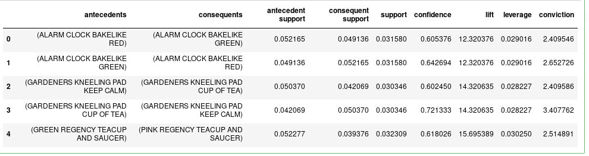

**Conclusion**

We arrived to distinguich some rules related to Alaska and Clifornia Market which can be used to make recommendations for our customers, and to better understand their preferences. 

## Step 4:  Segmentation

1. Import modules

````
<copy>
import pandas as pd
import numpy as np

import time, warnings
import datetime as dt

#modules for predictive models
import sklearn.cluster as cluster
from sklearn.cluster import KMeans
from sklearn.decomposition import PCA
from sklearn.mixture import GaussianMixture


from sklearn.metrics import silhouette_samples, silhouette_score

#visualizations
import matplotlib.pyplot as plt
from pandas.plotting import scatter_matrix
%matplotlib inline
import seaborn as sns

warnings.filterwarnings("ignore")
</copy>
````

2. Import Data

````
<copy>
#load the dataset
CleanDataset = r'../3-Cleaned-Dataset/OnlineRetail_Cleaned_New.csv'
retail_df = pd.read_csv(CleanDataset)
retail_df.head()
</copy>
````
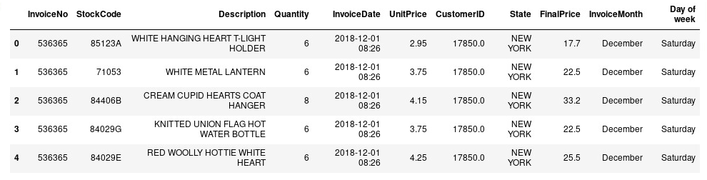

````
<copy>
retail_df.dtypes
</copy>
````
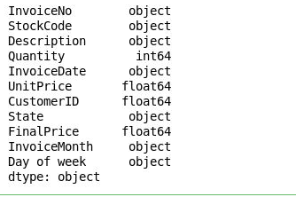

3. Formatting the Date/Time
````
<copy>
retail_df['InvoiceDate'] = pd.to_datetime(retail_df['InvoiceDate'], format = '%Y/%m/%d %H:%M')
</copy>
````

4. Checking data types of the attributes
````
<copy>
retail_df.dtypes
</copy>
````

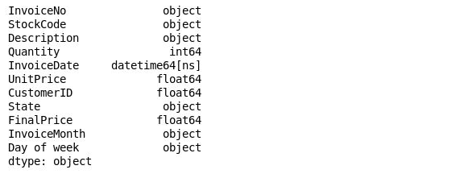

5. Checking the date range with min and max functions

````
<copy>
print (retail_df['InvoiceDate'].min())
print (retail_df['InvoiceDate'].max())
</copy>
````

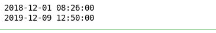

**Prepare the Data**

As customer clusters may vary by geography, I\u2019ll restrict the data to only New York customers, which contains most of our customers historical data.

````
<copy>
retail_ny = retail_df[retail_df['State']=='NEW YORK']
#dimension
retail_ny.shape
</copy>
````

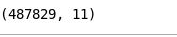

1. Delete Canceled orders

````
<copy>
retail_ny = retail_ny[retail_ny['Quantity']>0]
retail_ny.shape
</copy>
````

2. Delete rows with missing Customer ID
````
<copy>
retail_ny.dropna(subset=['CustomerID'],how='all',inplace=True)
retail_ny.shape
</copy>
````

3.  Restrict the data to excatly one year
````
<copy>
retail_ny = retail_ny[retail_ny['InvoiceDate']>= "2018-12-09"]
retail_ny.shape
</copy>
````

4. Print Summary

````
<copy>
print("Summary..")
#exploring the unique values of each attribute
print("Number of transactions: ", retail_ny['InvoiceNo'].nunique())
print("Number of products bought: ",retail_ny['StockCode'].nunique())
print("Number of customers:", retail_ny['CustomerID'].nunique() )
print("Percentage of customers NA: ", round(retail_ny['CustomerID'].isnull().sum() * 100 / len(retail_df),2),"%" )
</copy>
````
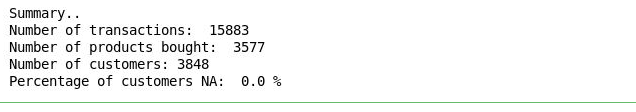


**RFM Analysis**

RFM Analysis

RFM stands for Recency, Frequency, and Monetary value, each corresponding to some key customer trait. These RFM metrics are important indicators of a customer's behavior because frequency and monetary value affects a customer's lifetime value, and recency affects retention, a measure of engagement.

**Recency**

To calculate recency, we need to choose a date point from which we evaluate how many days ago was the customer's last purchase.

1. Last date available in our dataset

````
<copy>
retail_ny['InvoiceDate'].max()
</copy>
````

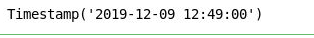

The last date we have is 2020-12-09 so we will use it as reference.

````
<copy>
now = dt.date(2019,12,9)
print(now)
</copy>
````

2. Create a new column called date which contains the date of invoice only

````
<copy>
retail_ny['date'] = retail_ny['InvoiceDate'].dt.date
</copy>
````

````
<copy>
retailNYHead = retail_ny.head()
retailNYHead.to_csv("retailNYHead.csv")
retailNYHead
</copy>
````

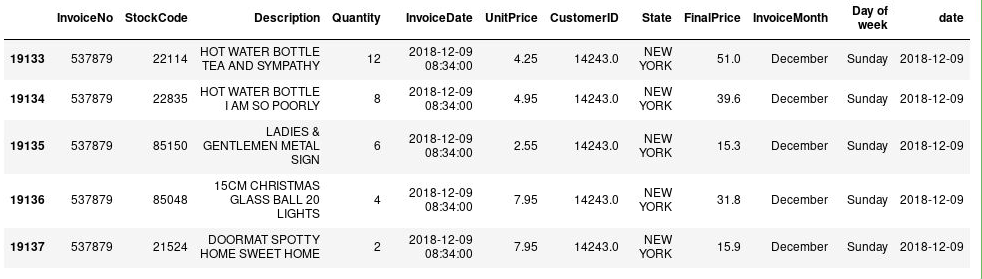

3. Group by customers and check last date of purchase

````
<copy>
recency_df = retail_ny.groupby(by='CustomerID', as_index=False)['date'].max()
recency_df.columns = ['CustomerID','LastPurshaceDate']
recency_df.head()
</copy>
````

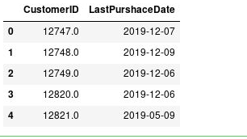

4. Calculate Recency

````
<copy>
recency_df['Recency'] = recency_df['LastPurshaceDate'].apply(lambda x: (now - x).days)
</copy>
````

````
<copy>
recency_df.head()
</copy>
````

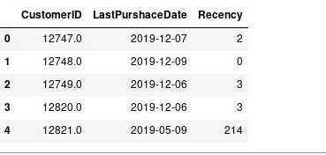

5. Drop LastPurchaseDate as we don't need it anymore

````
<copy>
recency_df.drop('LastPurshaceDate',axis=1,inplace=True)
</copy>
````

So here is the recency attribute created. e.g: Customer with ID = 12821 did his/her last purshace 214 days ago.

**Frequency**

Frequency tells us how many times a customer purchased from us. We find how many invoices are registered by the same customer.

1. Remove duplicate data and calculate frequecy of each customer

````
<copy>
# drop duplicates
retail_ny_copy = retail_ny
retail_ny_copy.drop_duplicates(subset=['InvoiceNo', 'CustomerID'], keep="first", inplace=True)
#calculate frequency of purchases
frequency_df = retail_ny_copy.groupby(by=['CustomerID'], as_index=False)['InvoiceNo'].count()
frequency_df.columns = ['CustomerID','Frequency']
frequency_df.head()
</copy>
````

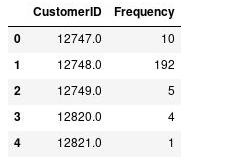

**Monetary**

It answers the question: How much money did a customer spent over time?

So, we create a new column total cost to have the total price per invoice.

1. Create a new column TotalCost (Quantity*UnitPrice)

````
<copy>
retail_ny['TotalCost'] = retail_ny['Quantity'] * retail_ny['UnitPrice']
</copy>
````

````
<copy>
retail_ny.head()
</copy>
````

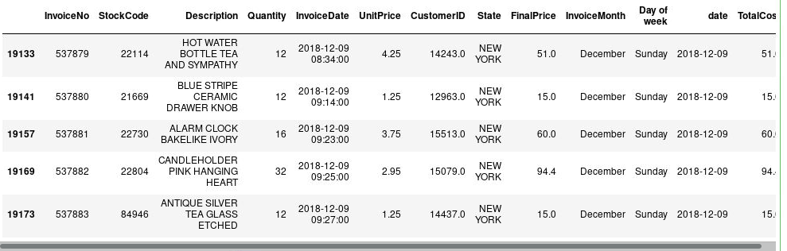

2. Calculate the total cost of each customer

````
<copy>
monetary_df = retail_ny.groupby('CustomerID',as_index=False).agg({'TotalCost': ['sum']})
</copy>
````

````
<copy>
onetary_df.columns = ['CustomerID','Monetary']
monetary_df.head()
</copy>
````
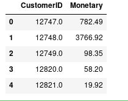

**Create RFM Table**

1. Merging the recency and frequency values by Customer ID

````
<copy>
#merge recency dataframe with frequency dataframe
temp_df = recency_df.merge(frequency_df,on='CustomerID')
temp_df.head()
</copy>
````
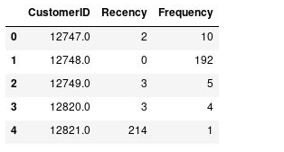

2. Merging the monetary value along with the recency and frequency data

````
<copy>
#merge with monetary dataframe to get a table with the 3 columns
rfm_df = temp_df.merge(monetary_df,on='CustomerID')
#use CustomerID as index
rfm_df.set_index('CustomerID',inplace=True)
#check the head
rfmHead = rfm_df.head(10)
rfmHead.to_csv("rfmHead.csv")
rfmHead
</copy>
````
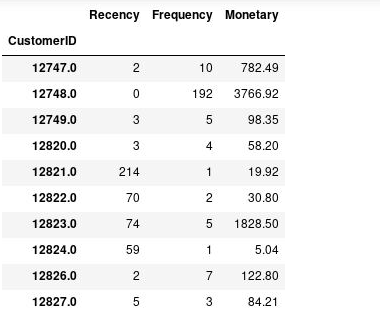

Customer with ID = 12748 has frequency: 192, recency:0, and monetary: 3766.92.

**RFM Table Correctness verification**

````
<copy>
retail_ny[retail_ny['CustomerID']==12748.0].sort_values(by="InvoiceDate",ascending=False)
</copy>
````

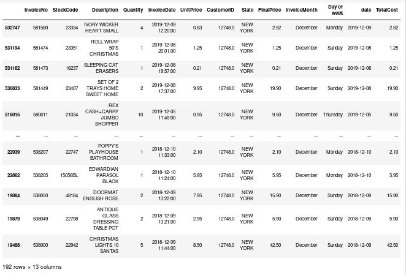

````
<copy>
(now - dt.date(2019,12,9)).days == 0
</copy>
````

True

As we can see our RFM table is correct. The first customer bought 192 times, multiple items of small amounts. 

**Segmenting customers with RFM Model**

Pareto's rule says 80% of the results come from 20% of the causes. Similarly, 20% customers contribute to 80% of your total revenue.

**Applying 80-20 rule**

1. Get the 80% of the revenue

````
<copy>
pareto_cutoff = rfm_df['Monetary'].sum() * 0.8
print("The 80% of total revenue is: ",round(pareto_cutoff,2))
</copy>
````

The 80% of total revenue is:  698060.73

2. Create a new column that is the rank of the value of coverage in ascending order

````
<copy>
customers_rank = rfm_df
# Create a new column that is the rank of the value of coverage in ascending order
customers_rank['Rank'] = customers_rank['Monetary'].rank(ascending=0)
#customers_rank.drop('RevenueRank',axis=1,inplace=True)
customersRankHead = customers_rank.head(10)
customersRankHead.to_csv("customersRankHead.csv")
customersRankHead
</copy>
````
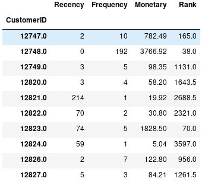

**Top Customers**

````
<copy>
customersRankHeadSort = customers_rank.sort_values('Rank',ascending=True).head(10)
customersRankHeadSort.to_csv("customersRankHeadSort.csv")
customersRankHeadSort
</copy>
````

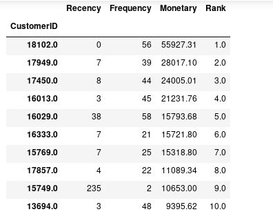

````
<copy>
customers_rank.sort_values('Rank',ascending=True)
</copy>
````


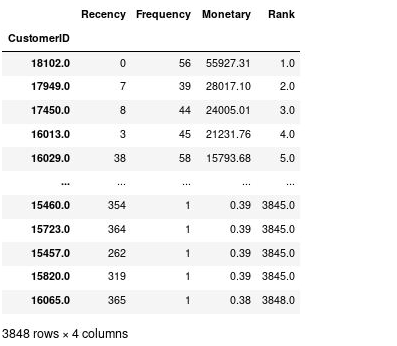

1. Get top 20% of the customers

````
<copy>
top_20_cutoff = 3848  *20 /100
top_20_cutoff
</copy>
````
769.6

2. Sum the monetary values over the customer with rank <=770

````
<copy>
revenueByTop20 = customers_rank[customers_rank['Rank'] <= 769]['Monetary'].sum()
revenueByTop20
</copy>
````
737401.72

3. Sum the monetary values over the customer with rank <=770

````
<copy>
revenueByTop20Count = customers_rank[customers_rank['Rank'] <= 769].nunique()
revenueByTop20Count
</copy>
````

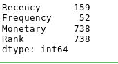

````
<copy>
dfNew  = customers_rank[customers_rank['Rank'] <= 769]
dfNew.head()
</copy>
````
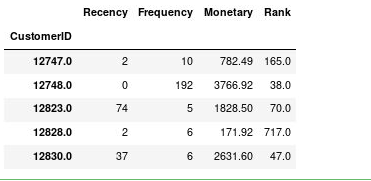

````
<copy>
dfNew.shape
</copy>
````

(769, 4)

Here also we can see that more than 80% 0f our total revenue ($ 698060.73) is achieved by 20% of our top customers.Revenue by top 20% ranking customer ($ 737401.72). We should then concentrate on these top customers who get us 80%of our revenue.

**RFM score formula**

The simplest way to create customers segments from RFM Model is to use Quartiles. We assign a score from 1 to 4 to Recency, Frequency and Monetary. Four is the best/highest value, and one is the lowest/worst value. A final RFM score is calculated simply by combining individual RFM score numbers.

1. RFM Quartiles¶

````
<copy>
quantiles = rfm_df.quantile(q=[0.25,0.5,0.75])
quantiles
</copy>
````


````
<copy>
quantiles.to_dict()
</copy>
````


**Creation of RFM segmentation table**

1. We will create two segmentation classes since, high recency is bad, while high frequency and monetary value is good.

````
<copy>
# Arguments (x = value, p = recency, monetary_value, frequency, d = quartiles dict)
def RScore(x,p,d):
    if x <= d[p][0.25]:
        return 4
    elif x <= d[p][0.50]:
        return 3
    elif x <= d[p][0.75]: 
        return 2
    else:
        return 1
# Arguments (x = value, p = recency, monetary_value, frequency, k = quartiles dict)
def FMScore(x,p,d):
    if x <= d[p][0.25]:
        return 1
    elif x <= d[p][0.50]:
        return 2
    elif x <= d[p][0.75]: 
        return 3
    else:
        return 4
</copy>
````

````
<copy>
#create rfm segmentation table
rfm_segmentation = rfm_df
rfm_segmentation['R_Quartile'] = rfm_segmentation['Recency'].apply(RScore, args=('Recency',quantiles,))
rfm_segmentation['F_Quartile'] = rfm_segmentation['Frequency'].apply(FMScore, args=('Frequency',quantiles,))
rfm_segmentation['M_Quartile'] = rfm_segmentation['Monetary'].apply(FMScore, args=('Monetary',quantiles,))
</copy>
````
````
<copy>
rfmSegHead = rfm_segmentation.head()
rfmSegHead.to_csv("rfmSegHead.csv")
rfmSegHead
</copy>
````


Now that we have the score of each customer, we can represent our customer segmentation.
First, we need to combine the scores (R_Quartile, F_Quartile,M_Quartile) together.

````
<copy>
rfm_segmentation['RFMScore'] = rfm_segmentation.R_Quartile.map(str) \
                            + rfm_segmentation.F_Quartile.map(str) \
                            + rfm_segmentation.M_Quartile.map(str)
rfm_segmentationHead = rfm_segmentation.head(10)
rfm_segmentationHead.to_csv("rfm_segmentationHead.csv")
rfm_segmentationHead
</copy>
````


Best Recency score = 4: most recently purchase. Best Frequency score = 4: most quantity purchase. Best Monetary score = 4: spent the most.

Let's see who are our Champions (best customers).

````
<copy>
orderedSeg = rfm_segmentation[rfm_segmentation['RFMScore']=='444'].sort_values('Monetary', ascending=False).head(10)
orderedSeg.to_csv("orderedSeg.csv")
orderedSeg
</copy>
````


**How many customers do we have in each segment?**

````
<copy>
print("Best Customers: ",len(rfm_segmentation[rfm_segmentation['RFMScore']=='444']))
print('Loyal Customers: ',len(rfm_segmentation[rfm_segmentation['F_Quartile']==4]))
print("Big Spenders: ",len(rfm_segmentation[rfm_segmentation['M_Quartile']==4]))
print('Almost Lost: ', len(rfm_segmentation[rfm_segmentation['RFMScore']=='244']))
print('Lost Customers: ',len(rfm_segmentation[rfm_segmentation['RFMScore']=='144']))
print('Lost Cheap Customers: ',len(rfm_segmentation[rfm_segmentation['RFMScore']=='111']))
print('Lost Valuable Customers: ',len(rfm_segmentation[rfm_segmentation['RFMScore']=='144']))
</copy>
````


Now that we knew our customers segments we can choose how to target or deal with each segment.

For example:

Best Customers - Champions: Reward them. They can be early adopters to new products. Suggest them "Refer a friend".

At Risk: Send them personalized emails to encourage them to shop.
Conclusion - perspective from this level of customer segmentation

To gain even further insight into customer behavior, we can dig deeper in the relationship between RFM variables.

RFM model can be used along with predictive models like k-means clustering, Logistic Regression and Recommendation to produce better informative results on customer behavior.

**Applying K-means clustering on RFM variables**

1. Preprocess Data

````
<copy>
rfm_data = rfm_df.drop(['R_Quartile','F_Quartile','M_Quartile','RFMScore'],axis=1)
rfm_data.head()
</copy>
````


2. Feature correlations

````
<copy>
rfm_data.corr()
</copy>
````


````
<copy>
sns.heatmap(rfm_data.corr())
</copy>
````


We have a negative correlation between:

    Recency and Frequency
    Recency and Monetary

There is a positive correlation between Monetary and Frequency but it is not that strong.

**Visualize feature distributions**

To get a better understanding of the dataset, we can construct a scatter matrix of each of the three features present in the RFM data. 

1. Produce a scatter matrix for each pair of features in the data

````
<copy>
scatter_matrix(rfm_data, alpha = 0.3, figsize = (11,5), diagonal = 'kde');
</copy>
````


We can notice that we have a skewed distribution of the 3 variables and there exist outliers.

This indicates how normalization is required to make the data features normally distributed as clustering algorithms require them to be normally distributed.

**Data Normalization**

1. Log transformation

````
<copy>
rfm_r_log = np.log(rfm_data['Recency']+0.1) #can't take log(0) and so add a small number
rfm_f_log = np.log(rfm_data['Frequency'])
rfm_m_log = np.log(rfm_data['Monetary']+0.1)
</copy>
````
````
<copy>
log_data = pd.DataFrame({'Monetary': rfm_m_log,'Recency': rfm_r_log,'Frequency': rfm_f_log})
</copy>
````
````
<copy>
log_data.head()
</copy>
````


2. Produce a scatter matrix for each pair of features in the data

````
<copy>
scatter_matrix(log_data, alpha = 0.2, figsize = (11,5), diagonal = 'kde');
</copy>
````


The distributions of Frequency and Monetary are better, more normalized, but it's not the case with Recency Distribution, which is improved but not as much.

3. Creating heat maps to check the correlation

````
<copy>
sns.heatmap(rfm_data.corr())
</copy>
````


````
<copy>
sns.heatmap(log_data.corr())
</copy>
````


````
<copy>
log_data.corr()
</copy>
````


Now, Monetary and Frequency are more strongly correlated.

**K-means Implementation**

A common challenge with k-means is that you must tell it how many clusters you expect. Figuring out how many clusters we need is not obvious from data, thus we will try different clusters numbers and check their silhouette coefficient. The silhouette coefficient for a data point measures how similar it is to its assigned cluster from -1 (dissimilar) to 1 (similar).

Note: K-means is sensitive to initializations because those initializations are critical to quality of optima found. Thus, we will use smart initialization called k-means++.

````
<copy>
matrix = log_data.to_numpy()
for n_clusters in range(2,10):
    kmeans = KMeans(init='k-means++', n_clusters = n_clusters, n_init=100)
    kmeans.fit(matrix)
    clusters = kmeans.predict(matrix)
    silhouette_avg = silhouette_score(matrix, clusters)
    print("For n_clusters =", n_clusters, "The average silhouette_score is :", silhouette_avg)
</copy>
````


The best silhouette score obtained is when the number of clusters is 2.

````
<copy>
n_clusters = 2
kmeans = KMeans(init='k-means++', n_clusters = n_clusters, n_init=30)
kmeans.fit(matrix)
clusters_customers = kmeans.predict(matrix)
silhouette_avg = silhouette_score(matrix, clusters_customers)
print('score de silhouette: {:<.3f}'.format(silhouette_avg))
</copy>
````
score de silhouette: 0.391

````
<copy>
kmeans.inertia_
</copy>
````
11572.155886131934

````
<copy>
print(kmeans.cluster_centers_)
</copy>
````

[1 1 1 ... 1 1 1]

````
<copy>
import matplotlib.pyplot as plt    
%matplotlib inline
plt.scatter(matrix[:,0],matrix[:,1], c=kmeans.labels_, cmap='rainbow')  
plt.show()
</copy>
````


````
<copy>
# fitting multiple k-means algorithms and storing the values in an empty list
SSE = []
for cluster in range(1,20):
    kmeansNew = KMeans(n_init=30, n_clusters = cluster, init='k-means++')
    kmeansNew.fit(matrix)
    SSE.append(kmeansNew.inertia_)

# converting the results into a dataframe and plotting them
frame = pd.DataFrame({'Cluster':range(1,20), 'SSE':SSE})
plt.figure(figsize=(12,6))
plt.plot(frame['Cluster'], frame['SSE'], marker='o')
plt.xlabel('Number of clusters')
plt.ylabel('Inertia')
</copy>
````


````
<copy>
# k means using 5 clusters and k-means++ initialization
kmeans5 = KMeans(n_init=30, n_clusters = 5, init='k-means++')
kmeans5.fit(matrix)
pred = kmeans5.predict(matrix)
</copy>
````

**Visualize Clusters**

````
<copy>
#create a scatter plot
plt.scatter(matrix[:, 0], matrix[:, 1], c=clusters_customers, s=50, cmap='viridis')
#select cluster centers
centers = kmeans.cluster_centers_
plt.scatter(centers[:, 0], centers[:, 1], c='red', s=200, alpha=0.5);
</copy>
````


````
<copy>
#create a scatter plot
plt.scatter(matrix[:, 0], matrix[:, 1], c=pred, s=50, cmap='viridis')
#select cluster centers
centers = kmeans5.cluster_centers_
plt.scatter(centers[:, 0], centers[:, 1], c='black', s=200, alpha=0.5);
</copy>
````


````
<copy>
import matplotlib.pyplot as plt    
%matplotlib inline
plt.scatter(matrix[:,0],matrix[:,1], c=kmeans5.labels_, cmap='rainbow')  
plt.show()
</copy>
````


````
<copy>
#What's the number of customers in each cluster?
pd.DataFrame(pd.Series(clusters_customers).value_counts(), columns = ['NumberCustomers']).T
</copy>
````


Conclusion - Deduction after applying k-means clustering:

Unfortunately, we didn't obtain a clearly separated clusters. Clusters assignments are muddled.

**Gaussian Mixture Model Implementation**

````
<copy>
gmm = GaussianMixture(n_components=2).fit(matrix)
labels = gmm.predict(matrix)
plt.scatter(matrix[:, 0], matrix[:, 1], c=labels, s=40, cmap='viridis');
</copy>
````


````
<copy>
gmm5 = GaussianMixture(n_components=5).fit(matrix)
labels5 = gmm5.predict(matrix)
plt.scatter(matrix[:, 0], matrix[:, 1], c=labels5, s=40, cmap='viridis');
</copy>
````


The GMM didn't provide a better result at this level than k-means.

**Customer Segmentation** 

1. Importing necessary libraries and the dataset 

````
<copy>
import pandas as pd, numpy as np, matplotlib.pyplot as plt, seaborn as sns  
from sklearn.preprocessing import StandardScaler  
from kmodes.kprototypes import KPrototypes  
from sklearn.metrics import silhouette\_score  
from mpl_toolkits.mplot3d import Axes3D  
import matplotlib.patches as mpatches  
%matplotlib inline
</copy>
````

````
<copy>
Data\_Cleaned.head()
</copy>
````


````
<copy>

CleanDataset = r'../3-Cleaned-Dataset/OnlineRetail\_Cleaned\_New.csv'    
Data\_Cleaned = pd.read_csv(CleanDataset, index\_col = 'InvoiceDate')      
Data\_Cleaned.index = pd.to\_datetime(Data\_Cleaned.index, format = '%Y-%m-%d %H:%M')
</copy>
````    

2. Grouping the data by customers and preparing for segmentation 

````
<copy>
Data = Data\_Cleaned.copy()  
Data['State'] = Data['State'].map(lambda x: 'NY' if x=='NEW YORK' else 'non-NY')  
CustomerData = Data.groupby(['CustomerID','State'], sort=False).agg({'Quantity':'mean','UnitPrice':'mean','InvoiceNo':'nunique','Description':'nunique'})  
CustomerData.reset_index(inplace=True)  
CustomerData.columns = ['CustomerID', 'NY?', 'Average Quantity', 'Average Price', 'Repeats', 'Product Variety']  
CustomerData.head()  
</copy>
````


We will scale the numerical features in order to avoid the negative effects of feature magnitudes and also speed up the process.

We have a categorical variable which is the customer's state. K-prototypes algorithm take into account the categorical variables.

2. Scaling the numerical features for clustering 

````
<copy>
Scaler = StandardScaler()  
CustomerData.iloc[:,2:] = Scaler.fit_transform(CustomerData.iloc[:,2:])  
syms = CustomerData.iloc[:,0].values.astype(str)  
X = CustomerData.iloc[:,1:].values.astype(object)  
</copy>
````
3. Finding the optimal cluster
````
<copy>
\_number k  
for n in range(2,8):  
    kproto = KPrototypes(n\_clusters = n, init = 'Cao')  
    clusters = kproto.fit\_predict(X, categorical = [0])  
    silhouette = silhouette\_score(X[:,1:],clusters)   
    print('number of clusters:', n)    
    print('  cost: ',kproto.cost\_)
    print('  average silhouette score: ',silhouette)   
</copy>
````


It seems that three clusters could properly represent our data, so we implement the algorithm with k = 3.

4. Clustering with kprototypes with k = 3 
````
<copy>
kproto = KPrototypes(n\_clusters = 3, init = 'Cao')  
clusters = kproto.fit\_predict(X, categorical = [0])  
print('Cluster Centers:\n', kproto.cluster\_centroids\_)  
</copy>
````


Since we scaled the data for clustering, we need to scale them back to their actual values and then we put all the original data and their cluster labels in a dataframe.

5. Scaling back to original values and retrieving all attributes 

````
<copy>
Clustered = pd.DataFrame(data=Scaler.inverse_transform(CustomerData.iloc[:,2:]),columns=['Average Quantity', 'Average Price', 'Repeats', 'Product Variety'])  
Clustered['NY?'] = X[:,0]  
Clustered['CustomerID'] = syms  
Clustered['Cluster'] = clusters  
print(Clustered.groupby(['Cluster','NY?']).count()['Repeats'],'\n\n\n')  
print(Clustered.groupby(['Cluster','NY?']).mean())  
Clustered.groupby(['Cluster','NY?']).mean().to\_csv("clusters.csv")  
</copy>
````


The first cluster represents our regular customers who visit quite often buying various products in small quantities.In the second cluster there are customers (mostly from NY) who bought very specific products with low prices in large volumes but not very often, one-time customers are more likely to be in this segment. The third cluster consists of customers who bought different products with higher price and they occasionally make a purchase, the majority of our customers (both from NY and non-NY countries) are within this cluster.


6. Comparison plots 

````
<copy>
sns.pairplot(Clustered.drop(columns=['NY?','CustomerID']), hue='Cluster')  
plt.suptitle('Scatter Matrix Within Clusters', fontsize = 15, y = 1.05)  
plt.show()
</copy>
````


Now we can visualize all the datapoints and the cluster which they belong to in one plot so we can see how they are located in the data space and how well they are seperated and have a good vision of the clusters(customer segments). Each axis shows the corresponding feature, the colors show the cluster which the datapoint belongs to, the size of each point indicates the purchase regularity (repeats) and the markers represent the customer's country (circles for NY and squares for non-NY customers).

7. Plotting all datapoints with respect to their cluster 
````
<copy>
fig = plt.figure(figsize=(15, 15))  
ax = fig.add_subplot(111, projection='3d')  
</copy>
````

**Datapoints**
````
<copy>  
xd = list(Clustered['Average Quantity'])  
yd = list(Clustered['Average Price'])  
zd = list(Clustered['Product Variety'])    
data_points = [(x,y,z) for x,y,z in zip(xd,yd,zd)]  
#specifying point sizes for the number of repeats  
sizes = list(Clustered['Repeats'])  
</copy>
````

**Colors for clusters**
````
<copy>  
colorlist = ['blue','red','green']  
colors = list(map(lambda x: colorlist[x], Clustered['Cluster']))  
</copy>
````

**Markers for country names**
````
<copy>  
markers = ['o' if con == 'NY' else ',' for con in list(Clustered['NY?'])]  
</copy>
````
**Creating the scatterplot**
````
<copy>  
for data, size, color, mark in zip(data\_points, sizes, colors, markers):  
    x,y,z = data  
    ax.scatter(x,y,z, alpha=0.5, c=color, s=size, marker=mark)  
ax.set(xlabel='Average Quantity', ylabel='Average Price', zlabel='Product Variety')  
</copy>
````

**Plot legend for cluster colors**
````
<copy>  
legend\_items = {'0':'blue', '1':'red', '2':'green'}   
itemlist = []  
for itemkey in legend\_items:  
    patch = mpatches.Patch(color=legend_items[itemkey], label=itemkey)  
    itemlist.append(patch)  
plt.legend(handles=itemlist, title='Cluster', fancybox=True, loc=6)  
plt.suptitle('Datapoints and Clusters', fontsize = 15, y = 0.90)  
plt.show()  
</copy>
````


## Acknowledgements

- **Authors** - Balasubramanian Ramamoorthy, Arvind Bhope
- **Contributors** - Laxmi Amarappanavar, Kanika Sharma, Venkata Bandaru, Ashish Kumar, Priya Dhuriya,     Maniselvan K. , Amit Gosh
- **Team** - North America Database Specialists.
- **Last Updated By** - Kay Malcolm, Director, Database Product Management
- **Expiration Date** - June 2021

## See an issue?
Please submit feedback using this [form](https://apexapps.oracle.com/pls/apex/f?p=133:1:::::P1_FEEDBACK:1). Please include the *workshop name*, *lab* and *step* in your request.  If you don't see the workshop name listed, please enter it manually. If you would like for us to follow up with you, enter your email in the *Feedback Comments* section.


