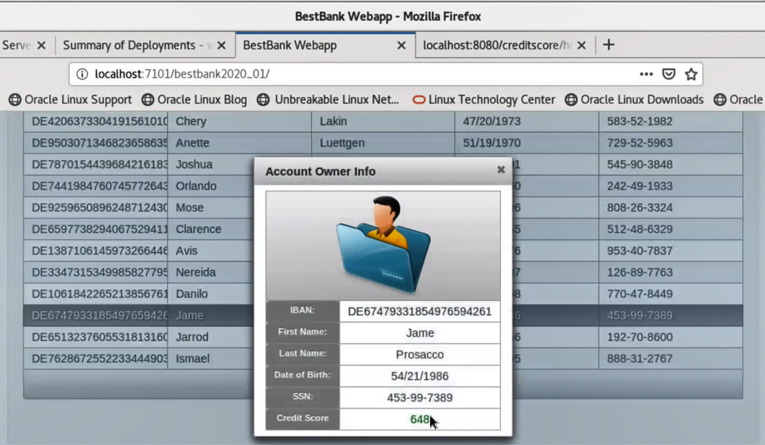

# Modernize with Weblogic and Helidon

## Introduction

This lab walks you through the steps for deploying and testing the interoperability between Weblogic Bank Application and Helidon Microservice for Credit Verification.

*Estimated Lab Time:* 90 minutes

### Objectives
* Writing Helidon Microservice
* Deploying WebLogic Application
* Interoperability between Weblogic and Helidon

### Prerequisites
This lab assumes you have:
* A Free Tier, Paid or LiveLabs Oracle Cloud account
* SSH Private Key to access the host via SSH
* You have completed:
    * Lab: Generate SSH Keys
    * Lab: Prepare Setup
    * Lab: Environment Setup


### Lab Description

The very purpose of writing microservices is to do a small piece of job efficiently and re-use it multiple times in different applications. Helidon SE enables us to write one such microservice in this lab.
BestBank, a hypothetical bank has an application. As part of that application, the bank’s credit division wants to build a simple UI which showcases the details of top 15 customers with their SSN number and IBAN number.  The team wants to have a microservice which provides credit score of the customer as output taking the user details like IBAN/SSN numbers as input.
The IT developers create a CreditScore Microservice in Helidon and consume it in the current UI application listing the top 15 customers.

### Implementation Details and Assumptions
* The sample application UI is built to showcase JSF and CDI using XHTML
* The user data is not coming from database
* The Helidon Microservice written in the lab can be deployed on Docker/Kubernetes, but in this lab, we only run it from the JVM locally

### Lab Flow
This lab is designed for people with no prior experience with Kubernetes, Docker, WebLogic, Helidon and want to learn the core concepts and basics of how to run WebLogic JEE and Helidon microservices application.
* Setup Lab Environment
* Verify Basic Bank Application Code and working application
* Develop new Credit Score function as microservice using Helidon SE and deploy on local JVM
* Modify Bank Web Application to use Credit Score microservice and deploy on WebLogic
 
## **STEP 0:** Running your Lab
### Login to Host using SSH Key based authentication
Refer to *Lab Environment Setup* for detailed instructions relevant to your SSH client type (e.g. Putty on Windows or Native such as terminal on Mac OS):
  - Authentication OS User - “*opc*”
  - Authentication method - *SSH RSA Key*
  - OS User – “*oracle*”.

1. First login as “*opc*” using your SSH Private Key

2. Then sudo to “*oracle*”. E.g.

    ```
    <copy>sudo su - oracle</copy>
    ```

## **STEP 1**: Setup Lab Environment
1.	Logon to VNC console of the ConvergedDB image as an Oracle user to the instance provisioned to you
2.	Open a terminal (Shell window) by clicking the “Terminal” icon on the desktop
3.	Change directory to /u01/middleware_demo/scripts
4.	Source the setWLS14Profile.sh and setBankAppEnv.sh to set the environment variables required to start the weblogic 14c Admin server and run commands to build Helidon and Bank applications:

	```
	<copy>  cd /u01/middleware_demo/scripts/
	. ./setWLS14Profile.sh
	. ./setBankAppEnv.sh</copy>
	```


## **STEP 2**: Verify Basic Bank Application Code and working application
1.	In the same terminal window, change the working directory to WebLogic 14c domain and start AdminServer in the wl_server domain:

	```
	<copy>cd $DOMAIN_HOME/bin
	nohup sh startWeblogic.sh &
	tail -f nohup.out</copy>
	Press CTRL + C to end the tail command
	```
2.	The terminal shows stdout logs for starting the AdminServer.

3.	Open the Weblogic Admin Console and login with credentials provided below:

    

  ```
  Console URL: http://<Your instance public IP address>:7101/console
  username: weblogic
  password: Oracle123!
  ```

4.	On the left hand side Menu under “Domain Structure” click on “Deployments”. Observe that the bestbank2020 application has been already deployed and available to access.

	  

5.	Open a new browser tab or session and access the bank application UI with URL `http://<Your instance public IP address>:7101/bestbank2020`
6.	The existence of base version of the sample bestbank application is confirmed.
7.	Change directory to `/u01/middleware_demo/wls-helidon`

	```
	<copy>cd /u01/middleware_demo/wls-helidon/</copy>
	```

9.	Verify if pom.xml and `src/` folder is available under `/u01/middleware_demo/wls-helidon`

	```
	<copy>ls -alrt</copy>
	```

## **STEP 3**: Develop new Credit Score function as microservice using Helidon SE and deploy on local JVM
1.	Create a directory called “microservice” under `/u01/middleware_demo/wls-helidon` and navigate to `/u01/middleware_demo/wls-helidon/microservice`

	```
	<copy>mkdir microservice</copy>
	<copy> cd /u01/middleware_demo/wls-helidon/microservice</copy>
	```

2.	Generate the project sources using Helidon SE Maven archetypes. The result is a simple project that shows the basics of configuring the WebServer and implementing basic routing rule

	```
	<copy>mvn archetype:generate -DinteractiveMode=false \
  	-DarchetypeGroupId=io.helidon.archetypes \
  	-DarchetypeArtifactId=helidon-quickstart-se \
  	-DarchetypeVersion=1.2.0 \
  	-DgroupId=io.helidon.bestbank \
  	-DartifactId=helidon-creditscore-se \
  	-Dpackage=io.helidon.bestbank.creditscore</copy>
	```

3.	When the project generation is ready open the Main.java for edit:

  ```
  <copy>vi helidon-creditscore-se/src/main/java/io/helidon/bestbank/creditscore/Main.java</copy>
  ```

4.	Register the creditscore route after line 108 by adding `".register("/creditscore", new CreditscoreService())"` as indicated below. This basically the context path for the service endpoint.

    

5.	Now create a new class called CreditscoreService in the same package where the Main.java is located:

  ```
  <copy>vi helidon-creditscore-se/src/main/java/io/helidon/bestbank/creditscore/CreditscoreService.java</copy>
  ```

6.	Add the following code block the newly created CreditscoreService.java:

	```
	<copy>
  package io.helidon.bestbank.creditscore;

  import java.util.logging.Level;
  import java.util.logging.Logger;

  import javax.json.Json;
  import javax.json.JsonObject;

  import io.helidon.webserver.Routing;
  import io.helidon.webserver.ServerRequest;
  import io.helidon.webserver.ServerResponse;
  import io.helidon.webserver.Service;

  /**
   *
   */

  public class CreditscoreService implements Service {
      private final Logger logger = Logger.getLogger(this.getClass().getName());

      private static final int SCORE_MAX = 800;
      private static final int SCORE_MIN = 550;

      /**
       * A service registers itself by updating the routine rules.
       *
       * @param rules the routing rules.
       */
      @Override
      public final void update(final Routing.Rules rules) {
          rules
              .get("/healthcheck", this::getTestMessage)
              .post("/", this::postMethodCreditscore);
      }

      /**
       * Return a test greeting message.
       * @param request the server request
       * @param response the server response
       */
      private void getTestMessage(final ServerRequest request,
          final ServerResponse response) {

          JsonObject returnObject = Json.createObjectBuilder()
              .add("message", "The creditscore provider is running.")
              .build();
          response.send(returnObject);
      }

      /**
       * POST method to return a customer data including creditscore value, using the data that was provided.
       * @param request the server request
       * @param response the server response
       */
      private void postMethodCreditscore(final ServerRequest request,
          final ServerResponse response) {

          request.content()
              .as(JsonObject.class)
              .thenAccept(json - & gt; {
                  logger.log(Level.INFO, "Request: {0}", json);
                  response.send(
                      Json.createObjectBuilder(json)
                      .add("score", calculateCreditscore(json.getString("firstname"), json.getString("lastname"),
                          json.getString("dateofbirth"), json.getString("ssn")))
                      .build()
                  );
              });
      }

      /**
       * calculate creditscore based on customer's properties
       * @param firstname
       * @param lastname
       * @param dateofbirth
       * @param ssn
       * @return
       */
      private int calculateCreditscore(String firstname, String lastname, String dateofbirth, String ssn) {

          int score = Math.abs(firstname.hashCode() + lastname.hashCode() +
              dateofbirth.hashCode() + ssn.hashCode());

          score = score % SCORE_MAX;

          while (score & lt; SCORE_MIN) {
              score = score + 100;
          }
          return score;
      }
  }	</copy>
	```

Please note the code above accepts a GET for healthcheck and POST method to calculate the credit score value based on the account owner's details which passed using JSON.

  - Build the project:

	```
	<copy>cd /u01/middleware_demo/wls-helidon/microservice/helidon-creditscore-se/
	mvn package</copy>
	```

  - This will create the executable jar file of the Helidon Microservice under the folder “target”

	```
	<copy>cd /u01/middleware_demo/wls-helidon/microservice/helidon-creditscore-se/target
	ls -alrt helidon-creditscore-se.jar</copy>
	```
## **STEP 4:** Modify Bank Web Application To Use Credit Score Microservice & Deploy On WebLogic
Before the deployment of the Bank Web Application to consume Microservice, the following changes will be made:

  -	Modify the User Interface. Create View button which opens Account Owner details window. This detail window will show the credit score value of the Account Owner.
  -	Modify the server side bean to invoke Credit Score Microservices Application.
  -	Configure the endpoint for the Bank Web Application.
  -	Deploy new web application

### Modify user Interface
1. Open for edit the `/u01/middleware_demo/wls-helidon/src/main/webapp/index.xhtml` HTML file.

    ```
    <copy>vi /u01/middleware_demo/wls-helidon/src/main/webapp/index.xhtml</copy>
   	```

2. Find and delete all the lines which contain REMOVE THIS LINE comment.
Only that one(!), but that full line of comment which contains. (4 lines needs to be removed.) Save the file.
If you are familiar with JSF to check what has changed in the code.

### Modify Server Side Bean
1. Open for edit `/u01/middleware_demo/wls-helidon/src/main/java/com/oracle/oow19/wls/bestbank/AccountOwnerBean.java` class file.

  ```
  <copy>vi /u01/middleware_demo/wls-helidon/src/main/java/com/oracle/oow19/wls/bestbank/AccountOwnerBean.java</copy>
  ```

2. Find and delete the 4 lines which contain the *REMOVE THIS LINE* comment. Save the file and Check what has changed in the code.

  - The postConstruct method modified to read the end point URL from the property file.
  - New getCreditScore method created to calculate the credit score value of the Account Owner.
  - Finally include the new method invocation in getSelectedAccountOwner method which is triggered by the View button on the User Interface.

### Configure End-Point
1. The last file to modify is the `/u01/middleware_demo/wls-helidon/src/main/resources/app.properties` file.

	The Bank Web Application reads this properties file to know the endpoint's URL. Obviously this solution is just for demo purposes, because in real microservices architecture the best practice is to use additional tools for better service/API management.

  ```
  <copy>vi /u01/middleware_demo/wls-helidon/src/main/resources/app.properties</copy>
 	```

2. Replace the URL to your given value and save: `creditscore.url=http://<Your instance public IP address>:8080/creditscore`

### Deploy Modified Web Application
1. Make sure you are in the terminal where the environment variables are set.
2. Change to the Bank Web Application's directory:
3. Source the `setWLS14Profile.sh` and `setBankAppEnv.sh` to set the environment variables required to start the WebLogic 14c Admin server and run commands to build Helidon and Bank applications

	```
	<copy>cd /u01/middleware_demo/scripts/
  . ./setWLS14Profile.sh
  . ./setBankAppEnv.sh</copy>
	```

4. Change the directory to wls-helidon where the Bank Application code reside

	```
	<copy>cd /u01/middleware_demo/wls-helidon/</copy>
	```

5. Run the following Maven command:

	```
	<copy>mvn clean package</copy>
	```

When the build is complete and successful, open the browser and access the new bank application using the URL `http://<Your instance public IP address>:7101/bestbank2020_01`

6. Select an Account Owner and click the new View button. A pop-up window with no information about the credit score of the user is seen. This is because the microservice is not yet started !!!

### Start The Helidon Microservice
1. Open a new terminal.
2. Navigate to `/u01/middleware_demo/wls-helidon/microservice/helidon-creditscore-se/target/`

	```
	<copy>cd /u01/middleware_demo/wls-helidon/microservice/helidon-creditscore-se/target/</copy>
	```

3. Start the Microservice application as a standalone Java Program using the command:
	```
	<copy>java -jar helidon-creditscore-se.jar &</copy>
	```

	  

4. In the browser, check if the CreditScore Microservice application is running by checking the health check url `http://<Your instance public IP address>:8080/creditscore/healthcheck`
5. Open the browser and access the new bank application using the URL `http://<Your instance public IP address>:7101/bestbank2020_01` or refresh the existing browser window with the above URL
6. Select an Account Owner and click the new View button.	A pop-up window with CreditScore information of the user is seen.  

	  


*Congratulations! You have successfully completed the workshop*

## Acknowledgements
* **Author** - Srinivas Pothukuchi, Pradeep Chandramouli, Chethan BR, AppDev & Integration Team, Oracle, October 2020
* **Contributors** - Meghana Banka, Rene Fontcha
* **Last Updated By/Date** - Rene Fontcha, Master Principal Solutions Architect, NA Technology, October 2020

## Need Help?
Please submit feedback or ask for help using our [LiveLabs Support Forum](https://community.oracle.com/tech/developers/categories/livelabsdiscussions). Please click the **Log In** button and login using your Oracle Account. Click the **Ask A Question** button to the left to start a *New Discussion* or *Ask a Question*.  Please include your workshop name and lab name.  You can also include screenshots and attach files.  Engage directly with the author of the workshop.

If you do not have an Oracle Account, click [here](https://profile.oracle.com/myprofile/account/create-account.jspx) to create one.
