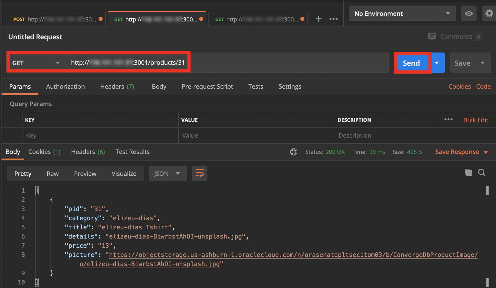
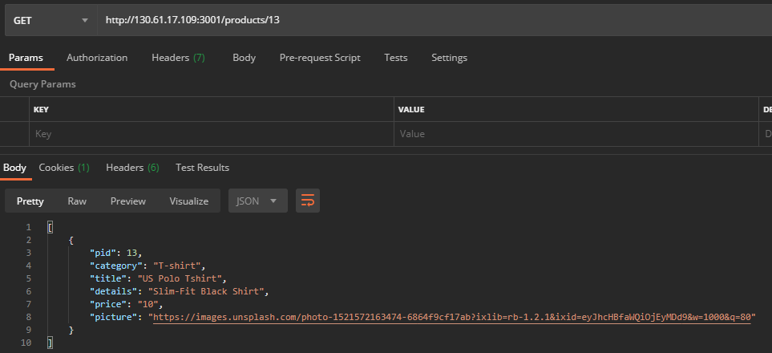
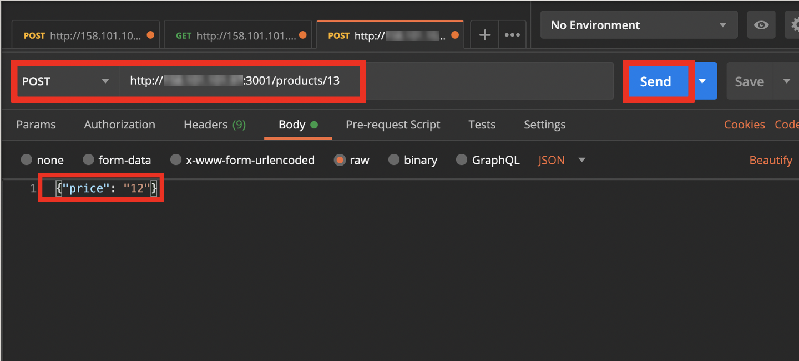

# Oracle Node.js

## Introduction

This lab walks you through the steps to start the Docker and Node.js Retail application. You will connect to a Node.js running in a Docker container on an Oracle Cloud Compute instance. While you can connect the Oracle Database instance using any client of your choice, in this lab you will connect using Oracle SQL Developer.

*Estimated Lab Time:* 20 Minutes

### Prerequisites
- A Free Tier, Paid or LiveLabs Oracle Cloud account
- SSH Private Key to access the host via SSH
- You have completed:
    - Lab: **Verify Compute Instance Setup**
    - Lab: **Setup SSH Tunnel** - using port(s) from this Lab as shown in *Step 0* below
    - Lab: **Start Database and Application**

### About Oracle Node.js

Node.js is an open-source and cross-platform JavaScript runtime environment. It runs the V8 JavaScript engine, outside of the browser. This allows Node.js to be very performant.

A Node.js app is run in a single process, without creating a new thread for every request. Node.js provides a set of asynchronous I/O primitives in its standard library that prevent JavaScript code from blocking and generally, libraries in Node.js are written using non-blocking paradigms, making blocking behavior the exception rather than the norm.

When Node.js needs to perform an I/O operation, like reading from the network, accessing a database or the filesystem, instead of blocking the thread and wasting CPU cycles waiting, Node.js will resume the operations when the response comes back.

 [](youtube:zQtRwTOwisI)

**Why Node.js?**

  Node.js uses asynchronous programming!
-	A common task for a web server can be to open a file on the server and return the content to the client.
-	How Node.js handles a file request:
	     Sends the task to the computer's file system.
         Ready to handle the next request.
         When the file system has opened and read the file, the server returns the content to the client.

-	Node.js eliminates the waiting, and simply continues with the next request.
-	Node.js runs single-threaded, non-blocking, asynchronously programming, which is very memory efficient.

**What can Node.js do?**
-	Node.js can generate dynamic page content
-	Node.js can create, open, read, write, delete, and close files on the server
-	Node.js can collect form data
-	Node.js can add, delete, modify data in your database

**Download Node.js**

   The official Node.js website has installation instructions for [Node.js](https://yum.oracle.com/oracle-linux-nodejs.html).

## **Step 0:** Running the Workshop
### Setup SSH Tunnels
As per security policies all external connections to this workshop instance are to be done over SSH. As a result, prior to executing this workshop, establish SSH tunnels over the instance public IP for port(s) 3000 and 3001 as detailed in the table below. Please refer to *Lab 2 - Setup SSH Tunnel* for detailed instructions.

| Description              | Client                 | Local port       | Remote Port     |
| :----------------------- | :--------------------- | :--------------- | :-------------- |
| eShop Store              | Browser                | 3000             | 3000            |
| eShop RestApi            | Postman                | 3001             | 3001            |.

***Note:*** Once this step is completed, all occurrences of the public IP of the instance when combined with above ports throughout this workshop should be substituted with *localhost*

## **Step 1:**  Verify Application

1.  The script (env\_setup\_script.sh) which you ran started the application. Also at the end of the script. you will be presented with two URLs.

    

2. Open up a web browser and visit the Application URL indicated in your terminal. Make sure to substitute the ip address of your server for the localhost:   
http://localhost:3000/

3. Open up a web browser and visit the Application API indicated in your terminal. Make sure to substitute the ip address of your server for the localhost:   
http://localhost:3001/

    

## **Step 2:** Download Postman

 1. Download Postman.
    -  [Click here to download Postman](https://www.postman.com/downloads/)

    

    

 2. Launch Postman.
    

 3. Open a new tab by clicking File then New Tab or by clicking the plus button in the center of the screen next to launch pad.
    

 4. In the center of the screen from the drop down select **POST** Method and enter the information below. See the screenshot for additional details.

    - For the URL Enter: localhost:3001/addproduct Make sure to substitute your ip address for the localhost.
    - Click on Body and select raw and then in the drop down choose JSON
    - In the data portion of the Body insert the JSON data below
      ````
      <copy>{
        "pid": "488",
        "category": "Puma Shoe ",
        "title": "Puma-shoe Demo3",
        "details": "Puma-shoe-Original",
        "price": "9",
        "picture": "https://objectstorage.us-ashburn-1.oraclecloud.com/n/orasenatdpltsecitom03/b/ConvergedbAppImage3/o/Puma-shoe-dietmar-hannebohn-_G94gB2cms0-unsplash.jpg"
      }</copy>
      ````
    


5. Click on the **Send** button, Postman should return the HTTP 200 after successfully adding the product in oracle database.


## **Step 3:** Using HTTP GET method.

1. Open a new tab

2. To get product details you can use the get method. Fill out the form using the following information.  
    - From the Method drop down in the center select - GET  
    - To get list of all the product details enter the URL: - http://localhost:3001/products  
    - To get the specific product details by using PID enter URL: - http://localhost:3001/products/31  
    - Click on the **Send** button, Postman return the HTTP 200 Ok which is a successful GET.

    

3. Open the browser and verify the above using link- http://localhost:3001/products/31

    

## **Step 4:** Using HTTP POST Method


1. Open a new tab. Before applying the POST method, please check the product table format by using GET Method and the URL http://localhost:3001/products/13.

    

2. We are going to update the price from $10 to $12 for the product PID=13. We do this by issuing a POST and giving it the new {"Key": "Value"} pair in our case our Key is price and the new Value is 12.

3. In the center of the screen from the drop down select **POST** Method and enter the information below.

    - Method: - POST  
    - URL: - http://localhost:3001/updateProduct/13  
    - Click on Body and select raw and then in the drop down choose JSON
    - In the data portion of the Body insert the JSON data below
    - Click on the Send button, Postman return the HTTP 200 OK after successfully updating the product price.
    ````
    <copy>{"price": "12"}</copy>
    ````

    

4. Verify product details by using HTTP GET method. Select the GET method, enter the URL http://localhost:3001/products/13 and click on Send. Notice the data in the body section and price is updated.  

    

## Want to learn more

 - [Node-js](https://nodejs.org/en/)
 - [Node-js for Oracle Linux](https://yum.oracle.com/oracle-linux-nodejs.html)  
 - [Node-js Driver](https://oracle.github.io/node-oracledb/)
 - [Oracle Instant Client](https://www.oracle.com/in/database/technologies/instant-client/downloads.html)
 - [Docker](https://www.docker.com/)
 - [Postman](https://www.postman.com/)


## Acknowledgements
* **Authors** - Balasubramanian Ramamoorthy, Arvind Bhope
* **Contributors** - Laxmi Amarappanavar, Kanika Sharma, Venkata Bandaru, Ashish Kumar, Priya Dhuriya, Maniselvan K, Robert Ruppel, David Start, Rene Fontcha
* **Last Updated By/Date** - Rene Fontcha, Master Principal Solutions Architect, NA Technology, September 2020

## See an issue?
Please submit feedback using this [form](https://apexapps.oracle.com/pls/apex/f?p=133:1:::::P1_FEEDBACK:1). Please include the *workshop name*, *lab* and *step* in your request.  If you don't see the workshop name listed, please enter it manually. If you would like for us to follow up with you, enter your email in the *Feedback Comments* section.
