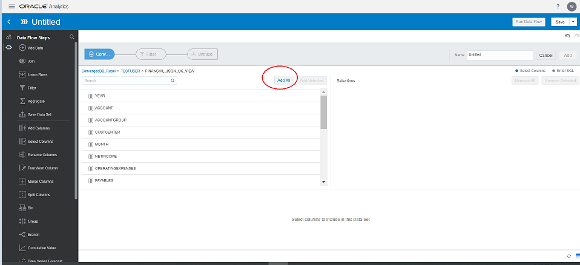

# OAS Data Visualization #

## Introduction ##

With Oracle Analytics Server, we can create visualizations and projects that reveal trends in your company’s data and help you answer questions and discover important insights about your business.
Creating visualizations and projects is easy, and your data analysis work is flexible and exploratory. Oracle Analytics helps you to understand your data from different perspectives and fully explore your data to find correlations, discover patterns, and see trends.

You can quickly upload data from a variety of sources (for example, spreadsheets, CSV files, Fusion Applications, and many databases) to your system and model it in a few easy steps. You can easily blend data sets together, too, so that you can analyze a larger set of data to reveal different patterns and information.

It provides several interactive visuals to sow the story in your data for example, trend lines, bar, Sankey graph, maps, etc.

Estimated Lab Time: 40 Mintues.

### Objectives ###

In this lab we will be using Oracle Analytics Server self-service capabilities on JSON , XML and Relational data of Converged Database ,  we will be creating compelling project with different types of visuals to show the important insights out of Sample data of a financial company.

Here, we have sample financial data, where data from ‘UK’ region is in JSON format, data from “Germany and France”  regions are in XML format and Data from “Italy and Spain” regions are in Relational Format. And this data is stored in Oracle Converged Database.

Using OAS “Data Flow” capability we will be generating a complete financial data after merging the data from  different geography. 

Then with OAS Data Preparation we will be making data set ready for visualization.

After that we will be building compelling visualizations in OAS.

This lab assumes you have completed the following labs:  
- Lab 1: Login to Oracle Cloud  
- Lab 2: Generate SSH Key  
- Lab 3: Create Compute Instance  
- Lab 4: Environment Setup   

The end result should look like below:

### Prerequisites  ###
Below data objects with data present in Converged Database. And since OAS recognizes data in relational format , views have been created on the base tables of JSON and XML type.  
 

| ObjectName  | ObjectType  | DataType  | Description  |
| ------------- | ------------- | ------------- |
| FINANCIALS\_UK\_JSON | Table | JSON  | data from ‘UK’ Region in JSON format  |
| FINANCIALS\_XML\_GERMANY | Table | XML | data from ‘Germany’ Region in XML format  |
| FINANCIALS\_XML\_FRANCE | Table | XML | data from ‘France’ Region ‘in XML format  |
| FINANCIALS\_REL\_SPAIN | Table | Relational | data from ‘Spain’ Region in Relational Format  |
| FINANCIALS\_REL\_ITALY | Table | Relational | data from ‘Italy’ Region in Relational Format  |
| FINANCIAL\_JSON\_UK\_VIEW | View | Relational | this view has been created on FINANCIALS\_UK\_JSON table to view data in relational format  |
| FINANCIALS\_XML\_FRANCE\_VIEW | View | Relational | this view has been created on FINANCIALS\_XML\_FRANCE table to view data in relational format  |
| FINANCIALS\_XML\_GERMANY\_VIEW | View | Relational | this view has been created on FINANCIALS\_XML\_GERMANY table to view data in relational format  |

  
    
## Step 1: Create data set using Data Flow ##
  **Data Flow :** Data flows enable you to organize and integrate your data to produce a curated data set that your users can analyze.  
  To build a data flow, you add steps. Each step performs a specific function, for example, add data, join tables, merge columns, transform data, save your data. Use the data flow editor to add and configure your steps. Each step is validated when you add or change it. When you've configured your data flow, you execute it to produce a data set.
  
  In this step, we will merge the data from different data sources (json, xml and relational) utilizing **Data Flow** functionlaity of OAS.

1. Add **FINANCIALS\_JSON\_UK\_VIEW**  data set   
   On the home screen, select "Create" and click on "data flow".
       

   Click on "create dataset".
       

   Select  the database connection.
       

   Select the schema **OASLABS**.
       

   Now select the view **FINANCIALS\_JSON\_UK\_VIEW**, where we have JSON data from UK.
       

   Click on "Add Columns".
       

   Click on "Add".  Verify dataset name.
       

2. Add **FINANCIALS\_XML\_GERMANY_VIEW**  data set 

   Click on “+” symbol and then “Add Data".
    

   Click on "Create data set" and then "Add".
    

   Now add data **FINANCIALS\_XML\_GERMANY_VIEW** similarly as we did for **FINANCIALS\_JSON\_UK\_VIEW**.

   After adding **FINANCIALS\_XML\_GERMANY_VIEW**, Remove the “Join” step(click on ‘X’ mark).
    

   Now add “Union Rows” step. 
    

   Click on to “circle” as shown below to complete compete merging of **FINANCIALS\_JSON\_UK\_VIEW**  and **FINANCIALS\_XML\_GERMANY\_VIEW**.
    

   Notice below:
    

3. Add and merge **FINANCIALS\_XML\_FRANCE\_VIEW**  data set 
   Repeat the similar process like we did for adding **FINANCIALS\_XML\_GERMANY\_VIEW**   
   Final result will be:  
        

4. Add and merge **FINANCIALS\_REL\_ITALY** and **FINANCIALS\_REL\_SPAIN**   
   Repeat the similar process like we did for adding "FINANCIALS\_XML\_GERMANY_VIEW"  
   Final Result will be.
        

5. Save and run data flow 
   Save the complete data set: Click on “Save Data” step
    

    Now we have completed merging.  
    Name the data set **Financials Complete Data set**.
    

   Save the data Flow.
    

6.  Run the data flow to build complete data set
    
    

## Step 2: Data Preparation ##
In this step we will perform some data prepartion steps to make data set ready for visualizatuion.

1. Complete data set is created in previous step. Now on the left hand side, and click on "data".
    

2. Select the dataset **Financials Complete Data set** created in previous step.
    

3. Click on “Prepare” to perform some “Data Preparation” steps.
    

4. Change Datatype to **Date**

    Convert “year” to data datatype:
    Select the “Year” column and  click on "Convert to Date".
    

    Click on “Add Step” and verify data format.
    

    Follow the same process of date conversion  for MONTH, QUARTER. 

5. Change Dataype to **number**. And change attribute to **measure**.

    Convert NETINCOME to number.
    

    Change NETINCOME to “Measure” as shown below.
    

    Similarly we will convert below fields to “NUMBER” and change them to “Measure”  .
    - OPERATINGEXPENSES
    - PAYABLES
    - PREVIOUSYEARNETINCOME
    - PREVIOUSYEAROPERATINGEXPENSES
    - PREVIOUSYEARPAYABLES
    - PREVIOUSYEARRECEIVABLES
    - PREVIOUSYEARREVENUE
    - RECEIVABLES
    - REVENUE   

6. Rename columns  
   Right-Click on OPERATINGEXPENSES and click on "Rename".
    

    Click on Add step.
    

    Similarly rename below fields. 
    - PREVIOUSYEARNETINCOME to PREVIOUS YEAR NETINCOME  
    - PREVIOUSYEAROPERATINGEXPENSES to PREVIOUS YEAR OPERATING EXPENSES  
    - PREVIOUSYEARPAYABLES to PREVIOUS YEAR PAYABLES  
    - PREVIOUSYEARRECEIVABLES to PREVIOUS YEAR RECEIVABLES  
    - PREVIOUSYEARREVENUE to PREVIOUS YEAR REVENUE  

7. Now click on “Apply Script” to complete data preparation steps. And now dataset is ready for visualization.
    

## Step 3: Build Visualizations ##
Now let’s analyze the data to get some insights.  

1. **Tile** Visualization   
To summarize some of the key numeric metrics, for example revenue we can use “Tile” visualization.    
   Select the “Revenue”and Pick “Performance Tiles” for visualization as below.
    

   Now do some required changes using Left Bottom "properties" section.  
    For example :  background color, abbreviation, etc  
    Abbreviation:
    

    Background color:
    

   Build Tile Visualization for below KPIs  as we did for "revenue":  
    - Net Income
    - Operating Expenses
    - Payables
    - Receivables  
  
    Dashboard should be like below:
    

2. Custom Calculation  
    In OAS, we can also do some calculations of KPI as per business requirement.     
    We will calculate “Profit” as below:  
    Right click on My calculation, then click on “Add Calculation” 
    

    Put this calculation to claculate profit:  **Profit = Revenue- Operating Expenses**
    

3. **Map** visualization   
   Select Revenue and Region and pick “Map” as visualization.
    

   Verify Below:
    

   We can also select desired and relevant map layers via properties(Left Bottom).
    

4. Combo Graph (combination of line, bar, area, etc)    
   Comparing Revenue, Operating Expenses and Net Income quarterly.    
    Select Revenue, Operation Expenses, Net Income and Quarter. Pick Combo as Visualization.  
    

   Let’s change graph type of Revenue Line.
    

   We can change properties of graph as below, for example color assignments, graph type for each   KPI, title etc
    

   We can change the color as below.
    

   Rename the map visualization to  "Revenue by Graph".
    

   Similarly rename the combo graph.

5. Rename Canvas    
   Rename individual Canvas: Financials Overview.
    

6. Analyzing Expenses    
    Select (+) symbol on the bottom to add another canvas, in this canvas we will add visulizations analysing expenses.  
    

    We will repeat “Tile” Visualization for **Operating Expenses** and **Previous Year Operating Expenses**.
    

    Result should look like below
    

7. **Sankey** graph Visualization    
   We will see quartery expenses by account groups.    
   Select  Operating Expenses, Quartr and Account Group. Pick Sanky graph: 
    

8. **Stacked Bar** visualization     
   We will analyze region wise expenses quarterly .  
   Select Operating Expenses, Previous Year Expenses and Quarter. Pick Stacked Bar.  
    

9. **Treemap** visualization      
   We will analze Expenses by Cost Centre.    
   Select Operating Expenses, Cost Center.  Pick Tree map  
    

10. Rename canvas "Expenses" as in point 5.  
    Rename individual visualizations and canvases.

11. More KPIs Analysis   
    Select (+) symbol on the bottom to add another canvas, in this canvas we will add some more visulizations.  
    

    Please refer to previous steps for selecting the required fields and visualization type.   
    
   Combo graph for comparing Payables and Receivables by month.
   

   Simple Bar Graph:  
   Analyze current and previous year payables quarterly.
    

   Analyze current and previous year receivables quarterly.
    

   Rename canvas "More Visuals" as in point 5. 

12. Let’s see **Pivot table** visual    
    Analyzing KPIs by Cost Centre.  
    Select Revenue, Operating Expenses, Net Income and Cost Center. Pick Pivot table. Change properties as shown below.
    

## Step 4: Data Action for drill down to detail report 

1.   Select (+) symbol on the bottom to add another canvas(refer to point 11), in this canvas we will build the tabular rport.  
    select all the required columns (as shown below) and pick table as visualization.
    

2. Now click on Data Actions (Right up).
    

3. Fill the details as:  
    - **Name**:Detail Report  
    - **Type**: Analytics Link(because we are drilling down in OAS-DV canvas only)  
    - **Target**: This Project(because wi will be drilling down to the tabular report)  
    - **Canvas Link**: Detail Report  
    - **Data Values**: All  

    Click OK.
    

4. Now go to any report, right click and select Detail Report (we have created this in previous step).  
    

5. This will drill down to the filtered version of detail report. Filters will be attributes of selected main report.
    

## Step 5: Adding Filters ##

1. On to top screen and select the fields, here we have selected Year, Month. Account Group etc
    

2. The result canvas will look like below, and we can select filter values as required
    

With this lab, you have learned OAS self-service analytics with capabilities including data loading, data preparation, data mashups, designing canvas, different types of visualization graphs in simple easy to use interface.

## Acknowledgements

- **Authors** - Sudip Bandyopadhyay, Vishwanath Venkatachalaiah
- **Contributors** - Jyotsana Rawat, Satya Pranavi Manthena, Kowshik Nittala
- **Team** - North America Analytics Specialists
- **Last Updated By** - Vishwanath Venkatachalaiah

## See an issue?
Please submit feedback using this [form](https://apexapps.oracle.com/pls/apex/f?p=133:1:::::P1_FEEDBACK:1). Please include the *workshop name*, *lab* and *step* in your request.  If you don't see the workshop name listed, please enter it manually. If you would like for us to follow up with you, enter your email in the *Feedback Comments* section.