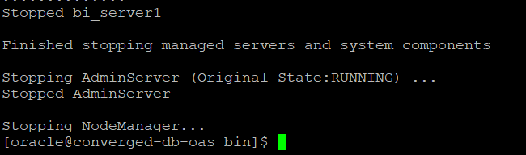

# Start Database and OAS #

## Introduction ##
In this lab you will start both Database and OAS environments by running the script files. 

Estimated Lab Time: 10 Mintues.

### Objectives ###

- Start the Oracle Database and Listener
- Start OAS services
  
### Prerequisites ###

This lab assumes you have completed the following labs:  
- Lab: Generate SSH Key - Cloud Shell
- Lab: Setup Compute Instance  

## STEP 1: Starting Database And OAS Services

1. Login to putty using the public ip obtained earlier and switch user to oracle.
      
      `````
      <copy>
      sudo su - oracle
      </copy>
      ````` 

2. Go to folder /u01/script

      ````
      <copy>
      cd /u01/script
      </copy>
      ````
3. Run the script file to start the services.
   
      
      ````
      <copy>
      ./env_setup_script.sh
      </copy>
      ````
  
      This script will ensure to start Database, Admin Server and all the services of OAS in 5-6 minutes. 

      

      Check for the "Finished starting servers" status before proceeding next.

4. Run "status.sh" file to get the status of all the services required for OAS. 

      
      ````
      <copy>
      /u01/oas/Oracle/Middleware/Oracle_Home/user_projects/domains/bi/bitools/bin/status.sh
      </copy>
      ````
 
      The command shows all the service names and their status.

      

      Check for the success status as shown above, before login to OAS screen.

## STEP 2: Login To Oracle Analytics Server

1. Open web browser (preferabily Chrome) and access the OAS Data Visualization service by the below URL structure.  

      Lab 2 - will provide your instance public IP. 
      ````
      <copy>
      http://Your-Machine-IP:9502/dv/ui
      </copy>
      ````
      

2. Login with the below credentials;

      Username	: Weblogic

      Password 	: Oracle_4U

## STEP 3: Create A Connection To Database

1. From Home screen, click on **Create** button and select **Connection**.

      

2. Select **Oracle Database** for connecting to database and provide required connection details.  

      
      

      **Connection Details:**	

      | Argument  | Description   |
      | ------------- | ------------- |
      | Connection Name | ConvergedDB_Retail |
      | Connection Type | Basic  |
      | Host | localhost  |
      | Port | 1521  |
      | Service Name | apppdb  |
      | Username | oaslabs  |
      | Password | Oracle_4U  |

3. Once connection details are provided click **Save** to save the connection.

Now, you are ready to move to further labs.

## Acknowledgements

- **Authors** - Balasubramanian Ramamoorthy, Sudip Bandyopadhyay, Vishwanath Venkatachalaiah
- **Contributors** - Jyotsana Rawat, Satya Pranavi Manthena, Kowshik Nittala
- **Last Updated By/Date** - Vishwanath Venkatachalaiah, Principal Solution Engineer, Oracle Analytics, Oct 2020

## See an issue?
Please submit feedback using this [form](https://apexapps.oracle.com/pls/apex/f?p=133:1:::::P1_FEEDBACK:1). Please include the *workshop name*, *lab* and *step* in your request.  If you don't see the workshop name listed, please enter it manually. If you would like for us to follow up with you, enter your email in the *Feedback Comments* section.