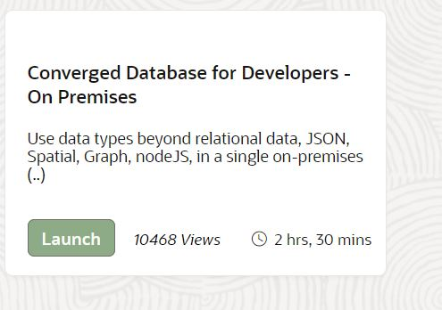
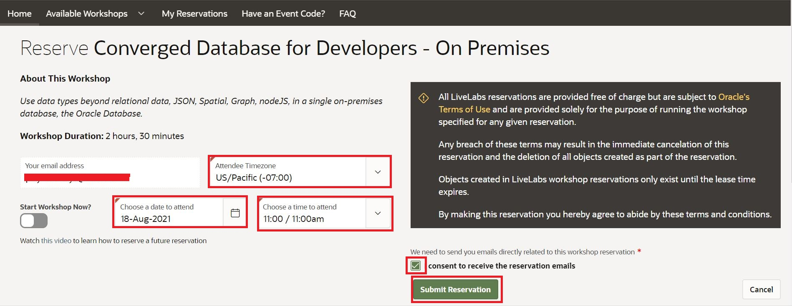

# Getting Started

You will need to request a LiveLabs reservation in order to get a fully setup environment for this workshop. Please follow the instructions below prior the scheduled date of this workshop (August 18 2021).

## Introduction   
To get started, you need to have an active Oracle  account and a LiveLabs reservation. An Oracle account is free and needed to gain access to your LiveLabs reservation, Oracle Support, and other Oracle publicly-accessible content.

If you already have an Oracle account, you can skip to Step 2.

If you already have a reservation, skip to the next lab to start your workshop!

*Estimated Lab Time*: 10 Minutes

## Task 1: Create an Oracle Account

Creating an Oracle account can be summarized in the following two simple steps. (Note. If you already have an Oracle account you can skip this step and go to step 2)

1. Navigate to [oracle.com](https://www.oracle.com/index.html), Click on **View Account**, and Select **Create an Account**

2. Fill out the form and click **Create Account**.

## Task 2: Request Workshop Reservation

1. Using your **Oracle Account Login** go to [LiveLabs 2.0] (https://apexapps.oracle.com/pls/apex/f?p=133:1) and search for Converged Database for Developers - On Premises on the top search bar.

Then click on the Launch button under inside the Find-fix-Validate workshop box.

Click on Reserve Workshop on LiveLabs

Enter the workshop date and time based on your time zone. Keep in mind that this workshop is scheduled for 18-Aug-2021 at 11:00 am US/Pacific (-07:00).

2. After creating a reservation for a LiveLab Workshop, you will receive an e-mail indicating that your reservation is being processed, followed by an e-mail indicating that your environment has been created.

**Note:** You will receive the second created e-mail just before your selected reservation time.

3. Log into LiveLabs and click **My Reservations**, then click the **Launch Workshop** link for the Workshop environment you'd like to use. Note that you may have several Workshops listed.
   

4. Follow the instructions provided to log in to your Oracle Cloud account, change your password, and complete your login to Oracle Cloud.

You may now [proceed to the next steps](#next).