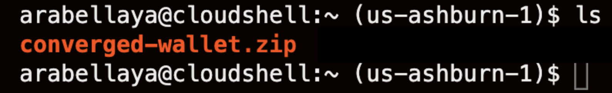
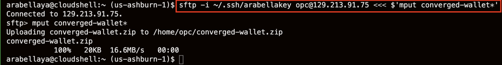
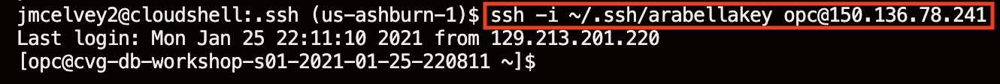
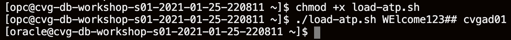

# Load ADB and Start Application

## Introduction
In the previous lab you created a compute instance (running the eShop application on docker), and an ATP instance to run your application on.  In this lab you will run a script to import data from Object Store into your Autonomous Database using Oracle Data Pump.  Your data was previously in various other types of databases.  In this lab we will show you how to centralize your data onto one database that your application can read from.

*Estimated time:* 20 Minutes

### Objectives
- Create auth token and Oracle Wallet 
- Login to SQL Developer
- Load AJD Instance with eShop data
- Connect application to ADB

### Prerequisites
- Lab: Generate SSH Keys
- Lab: Setup Compute and ADB

## **STEP 1:** Create Oracle Wallet
There are multiple ways to create an Oracle Wallet for ADB.  We will be using Oracle Cloud Shell as this is not the focus of this workshop.  To learn more about Oracle Wallets and use the interface to create one, please refer to the lab in this workshop: [Analyzing Your Data with ADB - Lab 6](https://apexapps.oracle.com/pls/apex/dbpm/r/livelabs/view-workshop?p180_id=553)

1.  Before starting this section make sure you have exited out of your compute instance and are back in your cloudshell home.  
2.  With the autonomous\_database\_ocid that is listed in Resource Manager -> Stacks -> Stack Details -> Outputs, create the Oracle Wallet. You will be setting the wallet password to the same value as the ADB admin password for ease of use.  This is not a recommended practice and just used for the purposes of this lab.  *WElcome123##*.  
   
      ````
      <copy>
      cd ~
      oci db autonomous-database generate-wallet --password WElcome123## --file converged-wallet.zip --autonomous-database-id </copy> ocid1.autonomousdatabase.oc1.iad.xxxxxxxxxxxxxxxxxxxxxx
      ````
      
3.  The wallet file will be downloaded to your cloud shell file system in /home/yourtenancyname
4.  Click the list command below to verify the *converged-wallet.zip* was created
   
      ````
      ls
      ````
      

5.  Transfer this wallet file to your application compute instance.  Replace the instance below with your instance 

    ````
    <copy>
    sftp -i ~/.ssh/</copy><sshkeyname> opc@<Your Compute Instance Public IP Address> <<< $'mput converged-wallet*' 
    ````
      

## **STEP 2:** Create Auth Token
There are multiple ways to create an Oracle Wallet for ADB.  We will be using Oracle Cloud Shell as this is not the focus of this workshop.  To learn more about Oracle Wallets and use the interface to create one, please refer to the lab in this workshop: [Analyzing Your Data with ADB - Lab 6](https://apexapps.oracle.com/pls/apex/dbpm/r/livelabs/view-workshop?p180_id=553)

1.  Click on the person icon in the upper right corner.
2.  Select **User Settings**
      

3.  Under the **User Information** tab, click the **Copy** button to copy your User OCID.
      

4.  Create your auth token using the command below substituting your actual *user id* for the userid below.
   
      ````
      <copy>
       oci iam auth-token create --description ConvergedDB --user-id </copy> ocid1.user.oc1..axxxxxxxxxxxxxxxxxxxxxx
      ````
      

5.  Identify the line in the output that starts with "token".
6.  Copy the value for the token somewhere safe, you will need it for the next step.


## **STEP 3:** Connect to SQL Developer and Create Credentials
1.  Go back to your ATP screen by clicking on the Hamburger Menu -> **Autonomous Transaction Processing**
      

2.  Click on the **Display Name** to go to your ADB main page.
      

3.  Click on the **Tools** tab, select **SQL Developer Web**, a new browser will open up
      

4.  Login with the *admin* user and the password *WElcome123##* 
5.  In the worksheet, enter the following command to create your credentials.  Replace the password below with your token. Make sure you do *not* copy the quotes.
   
    ````
    <copy>
    begin
      DBMS_CLOUD.create_credential(
        credential_name => 'DEF_CRED_NAME',
        username => 'admin',
        password => '************REPLACE THIS WITH TOKEN VALUE*****************'
      );
    end;
    /
    </copy>
    ````
    

## **STEP 4:**  Load ATP Instance with Application Schemas
1. Go back to your cloud shell and start the cloud shell if it isn't already running
2. Enter the command below to login to your compute instance.    

    ````
    ssh -i ~/.ssh/<sshkeyname> opc@<Your Compute Instance Public IP Address>
    ````
      

3. Execute the following commands on your compute instance to move and extract your wallet file in the /home/oracle/wallet directory. This should run as the *opc* user. 

      ````
      <copy>
      sudo cp converged-wallet.zip /home/oracle
      sudo su - oracle
      mkdir wallet
      cd wallet
      unzip ../converged-wallet*
      </copy>
      ````

4. Make sure you are the *oracle* user, run the next command to set your oracle environment.  If you are not, run the sudo su - oracle command to become oracle

      ````
      . oraenv
      ````

5.  When prompted enter *convergedcdb*
   
6. Substitute your instance name with *your adb instance name* (e.g convgdb_high) and the password you used

      ````
      <copy>
      cd $HOME
      pwd
      wget https://objectstorage.us-ashburn-1.oraclecloud.com/p/X312bI3U-DsOUoKgeFt8bt5U7nLOEpEbKg4cBQjljGDTChLIr__YJD6ab6SlChHP/n/idcd8c1uxhbm/b/temp-converged-atp-bucket/o/load-atp.sh
      </copy>
      ````

7.   Run the load script passing in two arguments, your admin password and the name of your ATP instance.  This script will import all the data into your ATP instance for your application and set up SQL Developer Web for each schema.  This script runs as the opc user.  Your ATP name should be the name of your ATP instance *cvgad01*.
   
      ``` 
      <copy> 
      chmod +x load-atp.sh
      ./load-atp.sh WElcome123##  cvgad01</copy>
     
      ```
      

8.  As the script is running, you will note several failures on the DBA role. The DBA role is not available in Autonomous Database, the DWROLE is used instead.
   
9.  Test to ensure that your data has loaded by logging into SQL Developer Web and issuing the command below. *Note* The Username and Password for SQL Developer Web are admin/WElcome123##. You should get 1 row.  

      ````
      <copy>
      impdp admin/WElcome123##@cvgad01_high directory=data_pump_dir credential=def_cred_name dumpfile=https://objectstorage.us-ashburn-1.oraclecloud.com/p/euRmNrZVFn06KSHoNE1RFlL6bgAGzHHEfo5WXlph1GzhlF5fORvnvC5631dVf7zR/n/idcd8c1uxhbm/b/converged-db/o/export_xml22Sep2020.dmp exclude=index, cluster, indextype, materialized_view, materialized_view_log, materialized_zonemap, db_link table_exists_action=APPEND

      impdp admin/WElcome123##@cvgad01_high directory=data_pump_dir credential=def_cred_name dumpfile=https://objectstorage.us-ashburn-1.oraclecloud.com/p/A2sRTp9FvVkOZSOLKCtrwrpb65E9zSkSuwE4qKQLwAsYGiXlJPex6maQ-y2RV8Wp/n/idcd8c1uxhbm/b/converged-db/o/export_appnodejs22Sep2020.dmp exclude=index, cluster, indextype, materialized_view, materialized_view_log, materialized_zonemap, db_link tables=APPNODEJS.ORDERS table_exists_action=APPEND

      sqlplus admin/WElcome123##@cvgad01_high
      select count(*) from appnodejs.orders;
      exit;
      </copy>
      ````
10. Copy the URL for SQL Developer Web onto a notepad.

## **STEP 5:**  Connect Docker Instance to ATP

1.  Run the script env\_setup\_script\_adb.sh, this will download the docker application from OKE (Oracle Kubernetes engine) start the eshop application. This script will take 2-5 minutes to run.

      ````
      <copy>cd /u01/script
      wget https://objectstorage.us-ashburn-1.oraclecloud.com/p/AhR11qr6u9pFy3Ct7o5IaQorX7-xbz1WW64QN09jkCV-z2mPmn6vozwcRslSAYwg/n/idcd8c1uxhbm/b/temp-converged-atp-bucket/o/env_script_setup_atp.sh
      chmod +x env_script_setup_atp.sh
      ./env_script_setup_atp.sh</copy>
      ````
   

2.  Verify that your two applications in your docker container are now in ONLINE status.

You now have a docker container running the eShop application and all the data in multiple schemas in an autonomous database across multiple modalities, JSON, Analytical data, XML, Spatial and Graph in an autonomous database.  A true converged database.

You may now [proceed to the next lab](#next).

## Acknowledgements
* **Authors** - Kay Malcolm, Ashish Kumar
* **Contributors** - Ashish Kumar, Madhu Rao, Yaisah Granillo, Kay Malcolm
* **Last Updated By/Date** - Kamryn Vinson, January 2021

## Need Help?
Please submit feedback or ask for help using our [LiveLabs Support Forum](https://community.oracle.com/tech/developers/categories/converged-database). Please click the **Log In** button and login using your Oracle Account. Click the **Ask A Question** button to the left to start a *New Discussion* or *Ask a Question*.  Please include your workshop name and lab name.  You can also include screenshots and attach files.  Engage directly with the author of the workshop.

If you do not have an Oracle Account, click [here](https://profile.oracle.com/myprofile/account/create-account.jspx) to create one.
