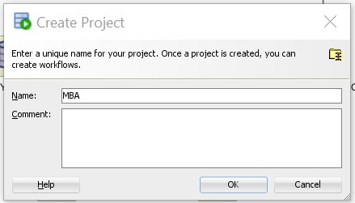
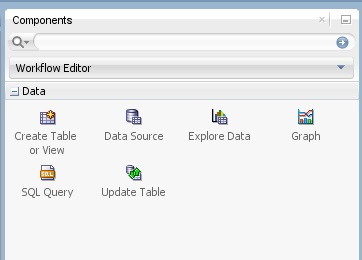
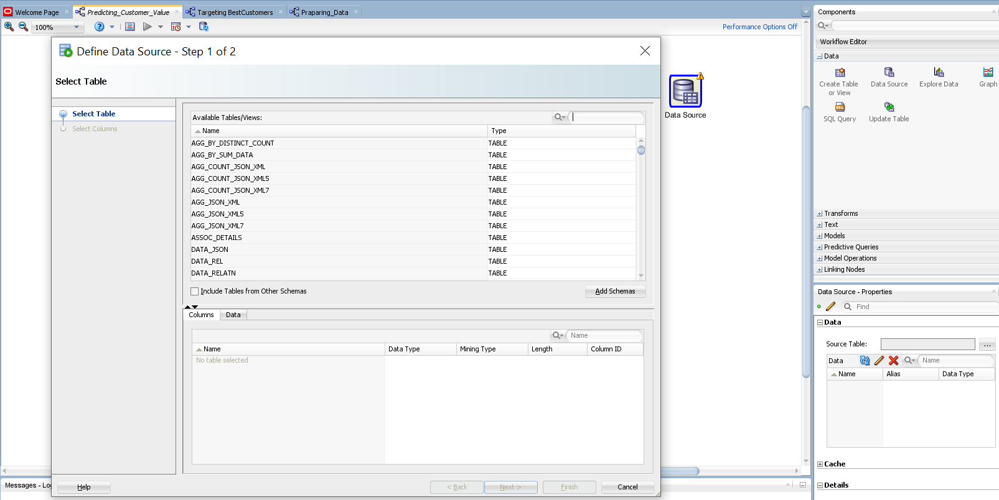
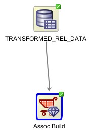

# OML Market Basket Analysis 

## Introduction
In this Lab, you examined and solved a "Association" data mining business problem by using the Oracle Data Miner graphical user interface, which is included as an extension to SQL Developer.

*Estimated Lab Time*: 20 Minutes

<!-- ### About Oracle Machine Learning "Regression" -->

<!--  -->

### Objectives
In this lab, you will:
* Identify Data Miner interface components
* Create a Data Miner project
* Build a Workflow document that uses Market Basket Analysis models to uncover association between items purchased together and identify patterns of co-occurrence.

### Prerequisites
This lab assumes you have:
- A Free Tier, Paid or LiveLabs Oracle Cloud account
- SSH Private Key to access the host via SSH
- You have completed:
    - Lab: Generate SSH Keys (*Free-tier* and *Paid Tenants* only)
    - Lab: Prepare Setup (*Free-tier* and *Paid Tenants* only)
    - Lab: Environment Setup
    - Lab: Initialize Environment

## **STEP 1:** Start creating a Data Miner Project
Before you begin working on a Data Miner Workflow, you must create a Data Miner Project, which serves as a container for one or more Workflows.
Create a SQL Developer connection for a data mining user named dmuser. This user has access to the sample data that you will be mining.

`Note:` If you have not yet set up Oracle Data Miner, or have not created the data mining user, you must first complete the tasks presented in the tutorial Setting Up Oracle Data Miner 19c Release 2,
To create a Data Miner Project, perform the following steps.

1. In the Data Miner tab, right-click the data mining user connection that you previously created, and select **New Project**, as shown here.
    

2. In the Create Project window, enter a project name (in this example MBA) and then click **OK**.

    

    `Note:` You may optionally enter a comment that describes the intentions for this project. This description can be modified at any time.

    **Result**: The new project appears below the data mining user connection node.

    

## **STEP 2:** Data Miner Workflow (Optional)

A Data Miner Workflow is a collection of connected nodes that describe a data mining processes.

A workflow.
 - Provides directions for the Data Mining server. For example, the workflow says, "Build a model with these characteristics." The data-mining server builds the model with the results returned to the workflow.
 - Enables you to interactively build, analyze, and test a data mining process within a graphical environment.
 - Might be used to test and analyze only one cycle within a particular phase of a larger process, or it may encapsulate all phases of a process designed to solve a particular business problem.

    **Sample Data Mining Scenario**

    In this topic, you will use the Market Basket Analysis technique for better understanding customer purchasing patterns

    To accomplish this goal, you build a workflow that enables you to.
    - Use Market Basket Analysis technique to understand customer-purchasing patterns. 
    - Select and run the models that produce the most actionable results

To create the workflow for this process, perform the below steps.

## **STEP 3:** Create a Workflow and Add data for the workflow

1. Right-click your project (Retail\_Data\_Analysis) and select New Workflow from the menu. 
 
    
 
    **Result**: The Create Workflow window appears.

2. In the Create Workflow window, enter Association_Rules as the name and click OK.

    

    **Result**:
    - In the middle of the SQL Developer window, an empty workflow canvas opens with the name that you specified.
    - On the right-hand side of the interface, the Component Palette tab of the Workflow Editor appears (shown below with a red border).
    - In addition, three other Oracle Data Miner interface elements are opened.
        * The Thumbnail tab
        * The Workflow Jobs tab
        * The Property Inspector tab

    

3. The first element of any workflow is the source data. We will extract data from JSON and XML table.
    In the Component Palette, click the **Data** category. A list of data nodes appear, as shown here.

    

4. We will add a  RDBMS regular table data, using a data source. This is the JSON and XML combined table ()
    Drag and drop the **Data Source** node onto the Workflow pane.

    **Result**: A Data Source node appears in the Workflow pane and the Define Data Source wizard opens.

    

5. In Step 1 of the wizard
    Select JSON_XML_REL_COMBINED from the Available Tables/Views list, as shown here.

    

    `Note:` You may use the two tabs in the bottom pane in the wizard to view and examine the selected table. The Columns tab displays information about the table structure, and the Data tab shows a subset of data from the selected table or view.

6. Click Next to continue.
    In Step 2 of the wizard, you may remove individual columns that you do not need in your data source. In our case, we will keep all of the attributes that are defined in the table.

    At the bottom of the wizard window, click Finish.

    

    **Result**: As shown below, the data source node name is updated with the selected table name, and the properties associated with the node are displayed in the Property Inspector, located below the Component Palette pane.

    

7. Similarly add another source table TRANSFORMED\_REL\_DATA into the workflow.

    

    

## **STEP 4:** Build the Models

In this topic, you build the selected models against the source data. This operation is also called “training” a model, and the model is said to “learn” from the training data.

A common data mining practice is to build (or train) your model against part of the source data, and then to test the model against the remaining portion of your data. By default, Oracle Data Miner this approach.

1. In the Workflow Editor, expand Models, and click Association. Drag and drop the node from the Components pane to the Workflow pane.

    

2. Connect the association model with the data source **(TRANSFORMED\_REL\_DATA)**, which will open the following window. There, you need to specify a transaction as instructed below.  Click on the Edit icon as marked below. 

    

      - Select **CUSTOMERID** and **INVOICENO** as the transaction Id.
      - Select **DESCRIPTION** as the Item Id.
      - Apriori is selected as the default association algorithm. Keep it as it is.

      

3. Click on OK button.

    

4. Now right-click on the association and select Run. You will see the following analysis model. After successful execution, a green tick is visible on the association node.

      

5. Right-click on the “Assoc Build” and then click on View Models

    

6. It will display the results as shown in the following screenshot.

    

7. Drag another association node to the canvas and connect it to the **JSON\_XML\_REL\_COMBINED** data. We can repeat the exact same steps for this association node and then we the model result.

    

8. Below is the association rules for the JSON_XML data.

    

## **STEP 5:** Interpreting the results of the market basket analysis

Referring to the association rules of the relational data table, there are almost 1386 association rules generated from the analysis we did. That’s a lot. So, we can basically interpret the results shown in Data Miner with rationale such as:

“If a customer buys REGENCY TEA PLATE GREEN  AND REGENCY TEA PLATE ROSES (refer to the first line of the result set), that person is likely to buy REGENCY TEA PLATE PINK. This can be stated with a 80.12% confidence level.”

And, its all about the level of confidence. This is where decisions can be made with the belief that structuring an association on grouping the two or more items together is more likely to be successful.

You can sort the rule result set by confidence level. Each of these rules discovered through the database analytics we just did will help the organization improve how it does business.

The Association Rules model measures the raw and conditional probabilities for the co-occurrence of attribute values.

The Support is the probability that all items in the rule (in both the “If” clause and the “Then” clause) will be found together in a checkout basket, and the Confidence is the conditional probability that the item(s) in the “then” clause are found, given that the item(s) in the “If” clause are present.

You can automate this data mining execution to create a result set and export it to CSV files(s) or store it in a database for immediate retrieval in an ETL process or directly in Oracle BI. This makes the ability to have some near real time data mining activity take place within the organization and potentially even compare business or data mining logic with some level of dynamic variation and control.

**This concludes this lab. You may now [proceed to the next lab](#next).**

## Rate this Workshop
When you are finished don't forget to rate this workshop!  We rely on this feedback to help us improve and refine our LiveLabs catalog.  Follow the steps to submit your rating.

1.  Go back to your **workshop homepage** in LiveLabs by searching for your workshop and clicking the Launch button.
2.  Click on the **Brown Button** to re-access the workshop  

   

3.  Click **Rate this workshop**

   

<!-- If you selected the **Green Button** for this workshop and still have an active reservation, you can also rate by going to My Reservations -> Launch Workshop. -->

## Acknowledgements
* **Authors** - Balasubramanian Ramamoorthy, Amith Ghosh
* **Contributors** - Laxmi Amarappanavar, Ashish Kumar, Priya Dhuriya, Maniselvan K, Pragati Mourya.
* **Last Updated By/Date** - Ashish Kumar, LiveLabs Platform, NA Technology, April 2021

 
