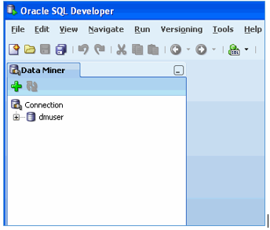

# OML Data Miner

## Introduction
In this Lab, you will examine some of the Data Miner interface components within SQL Developer. You can structure your working environment to provide simplified access to the necessary Data Miner features.

*Estimated Lab Time*: 20 Minutes

<!-- ### About Oracle Machine Learning "Regression" -->

<!--  -->

### Objectives
In this lab, you will:
* Identify Data Miner interface components.
* Create a Data Miner project.

### Prerequisites
This lab assumes you have:
- A Free Tier, Paid or LiveLabs Oracle Cloud account
- SSH Private Key to access the host via SSH
- You have completed:
    - Lab: Generate SSH Keys (*Free-tier* and *Paid Tenants* only)
    - Lab: Prepare Setup (*Free-tier* and *Paid Tenants* only)
    - Lab: Environment Setup
    - Lab: Initialize Environment

## **STEP 1:** Connect to SQL Developer

1. Make a connection to SQL Developer. Use the details as below and click on connect.
  - **Name**: dmuser
  - **Username**: mluser
  - **Password**: `Oracle_4U`
  - **Hostname**: PUBLIC-IP
  - **Port**: 1521
  - **Service name**: apppdb

    

## **STEP 2:** Identifying SQL Developer and Data Miner Interface Components

Before you create a Data Miner Project and build a Data Miner workflow, it is helpful to examine some of the Data Miner interface components within SQL Developer. You can then structure your working environment to provide simplified access to the necessary Data Miner features.

After setting up Oracle Data Miner for use within SQL Developer, different interface elements may be displayed, including both SQL Developer and Data Miner components.

1. In the following example, several display elements are open, including the:
    - The SQL Developer Connections tabs
    - The SQL Developer Reports tabs
    - The Data Miner tab
    

    `Notes`:
    - The layout and contents of your SQL Developer window may be different than the example shown above.
    - SQL Developer and Data Miner interface elements open automatically when needed.
    - Additional Data Miner interface elements include the Workflow Jobs, Property Inspector, Component   Palette, and Thumbnail tabs. You can open any one them manually from the main menu by using **View > Data Miner >** as shown here:

    

2. In order to simplify the interface for Data Mining development, you can dismiss the SQL Developer specific interface elements by clicking on the respective Close **[x]** icons for each tab or window.For example, close both of the SQL Developer tabs mentioned above:

3. SQL Developer **Reports** tab

   

4. SQL Developer **Connections** tab
  
   

   Now, the SQL Developer interface should look like this:
   

    **DataMiner > Workflow Jobs.**

    `Note`: You can re-open the SQL Developer Connections tab (and other interface elements) at any time by using the View menu.

**This concludes this lab. You may now [proceed to the next lab](#next).**

## Rate this Workshop
When you are finished don't forget to rate this workshop!  We rely on this feedback to help us improve and refine our LiveLabs catalog.  Follow the steps to submit your rating.

1.  Go back to your **workshop homepage** in LiveLabs by searching for your workshop and clicking the Launch button.
2.  Click on the **Brown Button** to re-access the workshop  

   

3.  Click **Rate this workshop**

   

<!-- If you selected the **Green Button** for this workshop and still have an active reservation, you can also rate by going to My Reservations -> Launch Workshop. -->

## Acknowledgements
* **Authors** - Balasubramanian Ramamoorthy, Amith Ghosh
* **Contributors** - Laxmi Amarappanavar, Ashish Kumar, Priya Dhuriya, Maniselvan K, David Start, Pragati Mourya.
* **Last Updated By/Date** - Ashish Kumar, LiveLabs Platform, NA Technology, April 2021

 
