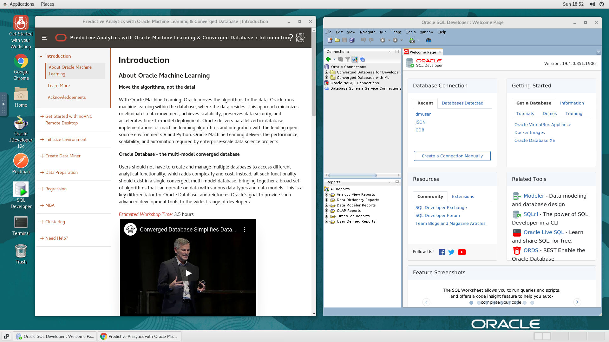
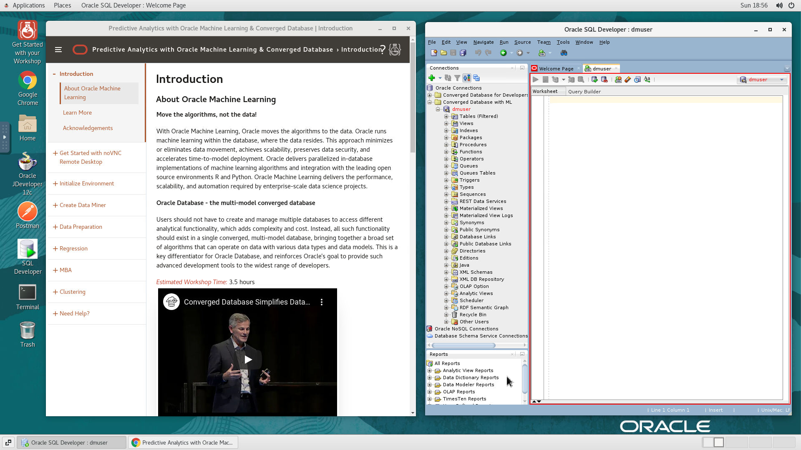

# Initialize Environment

## Introduction

In this lab we will review and startup all components required to successfully run this workshop.

*Estimated Lab Time:* 10 Minutes.

### Objectives
- Initialize the workshop environment.

### Prerequisites
This lab assumes you have:
- A Free Tier, Paid or LiveLabs Oracle Cloud account
- You have completed:
    - Lab: Prepare Setup (*Free-tier* and *Paid Tenants* only)
    - Lab: Environment Setup

## Task 1: Start And Validate The Required Processes are Up and Running.
1. Now with access to your remote desktop session, proceed as indicated below to Start your environment using Environment script before you start executing the subsequent labs and validate the following Processes should be up and running:
    
    - Database Listeners
    - Database Server Instances 

2. On the *SQL-Developer* window on the right preloaded with saved credential
    
    

3. The above command will start the oracle database service and Listeners. 

    - click on the saved connection on *SQL-Developer* .

    
    If successful, the page above is displayed and as a result your environment is now ready.  

    You may now [proceed to the next lab](#next).

4. If you are still unable to login or the login page is not functioning after reloading the application URL, open a terminal session and proceed as indicated below to validate the services.

    - Database and Listener
    ```
    <copy>
    sudo systemctl status oracle-database
    </copy>
    ```

5. If you see questionable output(s), failure or down component(s), restart the corresponding service(s) accordingly

    - Database and Listener

    ```
    <copy>
    sudo sudo systemctl restart oracle-database
    </copy>
    ```
## Appendix 1: Managing Startup Services

1. Database Service (Database and Listener).

    - Start

    ```
    <copy>sudo systemctl start oracle-database</copy>
    ```

    - Stop

    ```
    <copy>sudo systemctl stop oracle-database</copy>
    ```

    - Status

    ```
    <copy>sudo systemctl status oracle-database</copy>
    ```

    - Restart

    ```
    <copy>sudo systemctl restart oracle-database</copy>
    ```

**This concludes this lab. You may now [proceed to the next lab](#next).**

## Acknowledgements
* **Authors** - Balasubramanian Ramamoorthy, Amith Ghosh
* **Contributors** - Laxmi Amarappanavar, Ashish Kumar, Priya Dhuriya, Maniselvan K, Pragati Mourya.
* **Last Updated By/Date** - Ashish Kumar, LiveLabs Platform, NA Technology, AUG 2021
