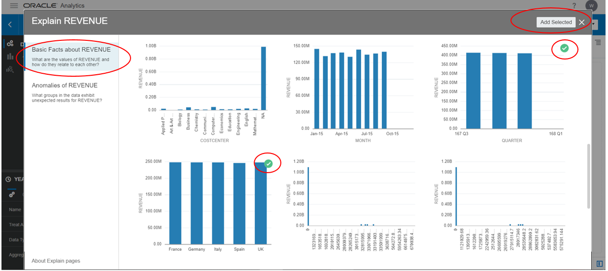
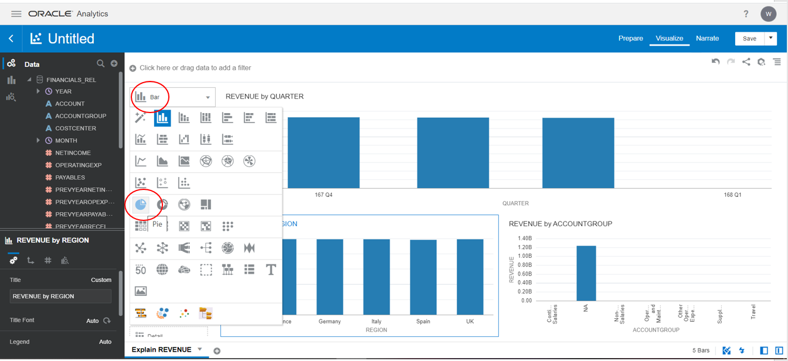
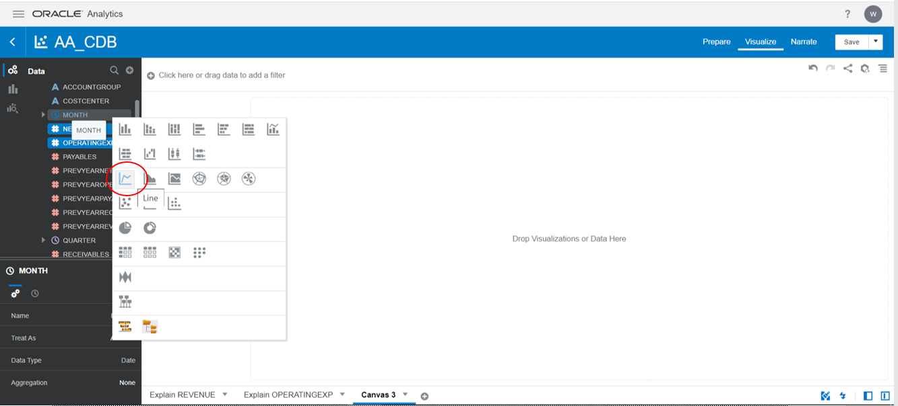
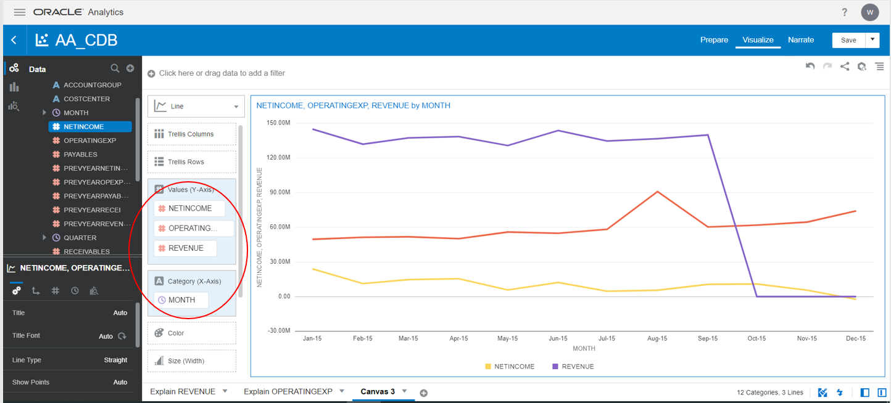
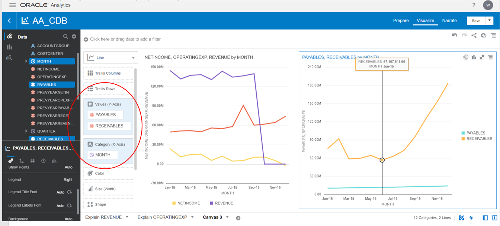
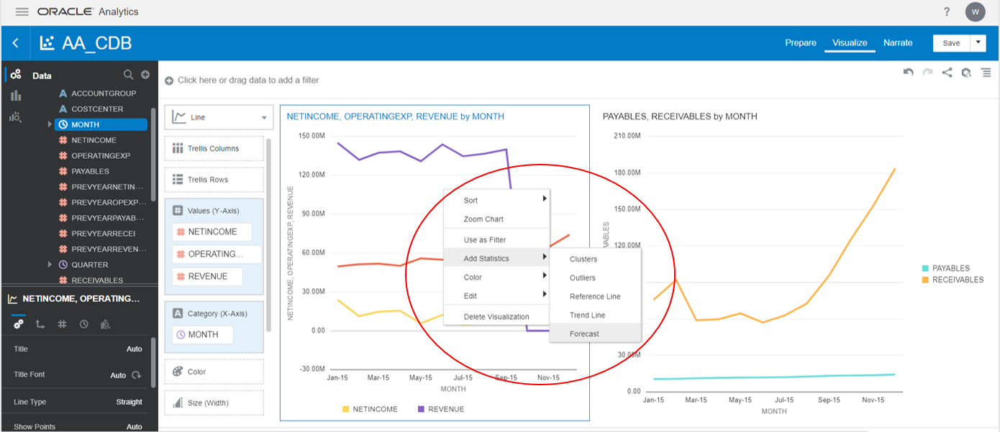
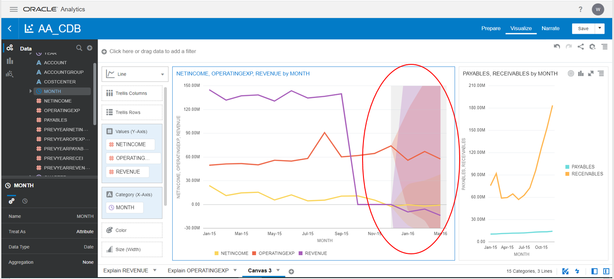
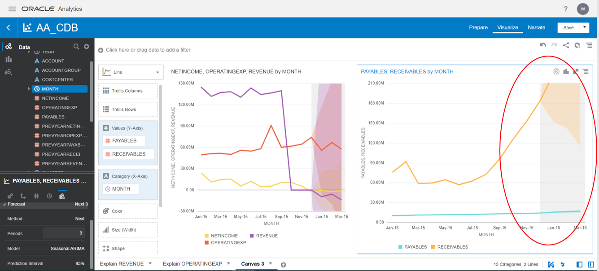

# Augmented Analytics #

## Introduction ##

Oracle powers deeper insights by embedding machine learning and AI into every aspect of the analytics process, making your job easier than ever. Oracle employ smart data preparation and discovery to enhance your overall experience. Natural language processing (NLP) powers modern, conversational-style analytics.

### Objectives 
In this lab you will learn on two key features in OAS Augmented Analytics; “Explain” and “Forecast”.

**Explain:** Explain analyzes the selected column within the context of its data set and generates text descriptions about the insights it finds. Explain creates corresponding visualizations that you can add to your project's canvas.

**Forecast:** Oracle Analytics Server offers a user-friendly method to leverage advanced analytics functions on a chart with a single mouse click. Having advanced analytical functions like forecast provides a strong capability to business users who want to have better insights into their data. 

**Total time to do Lab:** 20 Mintues.

## Step 1: Create a data set from database

1. Select the connections tab and click on the created connection to browse schema as shown below.

2. Select the required table and click “Add All” to select all the columns of the table and by providing a dataset name click “Add” button to create the dataset.

3. Now in Data tab, you can see the added table as data set.

## Step 2: Project creation from data set

1. Click on the added data set.  This will open for project creation.

## Step 3: Explain Feature

Let us now learn the Augmented Analytics of OAS using in built **Explain** feature.

1. Select the Revenue column and right-click to select “Explain Revenue”

    The result is a profile of the data element you have selected with both visualizations and narrative text to explain the insights for the element that is being analyze.
    

To choose the generated visualization, click "add selected" and easily one can begin to use Data Visualizations project editor to drill further. 

2. Now, select Revenue by Quarter graph, Revenue by Region Graph, and Revenue by Account Group graph. Click on Add Selected.

3. After Adding the selected Visulization, we will change the the graphs as we want as below.
    Change bar to pie:

4. Rearrange the columns to get the pie chart as shown below.

5. Similarly, try another column **Operation Expense** using **Explain** feature and the final canvas should look as shown below.

    
    

6. Click on **Save** to save the project by providing a name to the project file.

## Step 4: Forecast Feature

Using Forecast you can predict values for the next n future periods. Number of n next periods can be set as required. 

Let us use forecast feature on the sample financial data with attributes(time, account, costcentre, etc) and measures(Revenue, Expenses,payables, etc).

1. Select Reveue, Operating Expenses, Net Income and Month columns. Pick Line Graph by right click.

    Verify as below.

    

2. Similarly build on line graph for payables and receivables monthly trend.

3. Now select the first chart, right-click and select "Add Statistics" then "Forecast".

4. The highlighted area will show future predictions for next two month.

5. Similarly, use forecast for payables and receivables trend

Great! Now, you have completed augmented analytics lab and hope learnt about how to use Explain and Forecast feature of the tool to generate and present insights.

## Acknowledgements

- **Authors** - Sudip Bandyopadhyay, Vishwanath Venkatachalaiah
- **Contributors** - Jyotsana Rawat, Satya Pranavi Manthena, Kowshik Nittala
- **Team** - North America Analytics Specialists
- **Last Updated By** - Vishwanath Venkatachalaiah

## Need Help?
Please submit feedback or ask for help using our [LiveLabs Support Forum](https://community.oracle.com/tech/developers/categories/livelabsdiscussions). Please click the **Log In** button and login using your Oracle Account. Click the **Ask A Question** button to the left to start a *New Discussion* or *Ask a Question*.  Please include your workshop name and lab name.  You can also include screenshots and attach files.  Engage directly with the author of the workshop.

If you do not have an Oracle Account, click [here](https://profile.oracle.com/myprofile/account/create-account.jspx) to create one.
