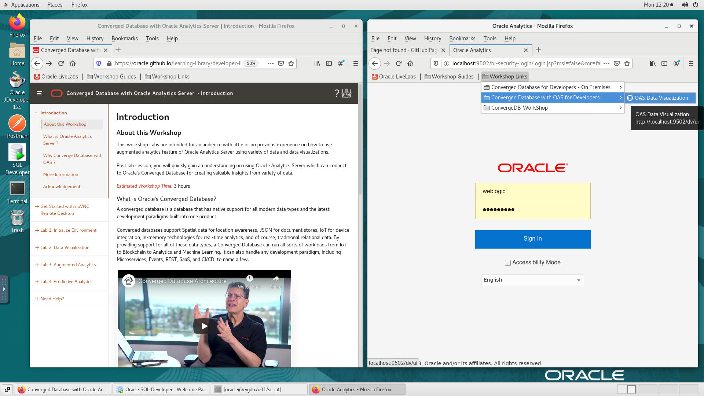
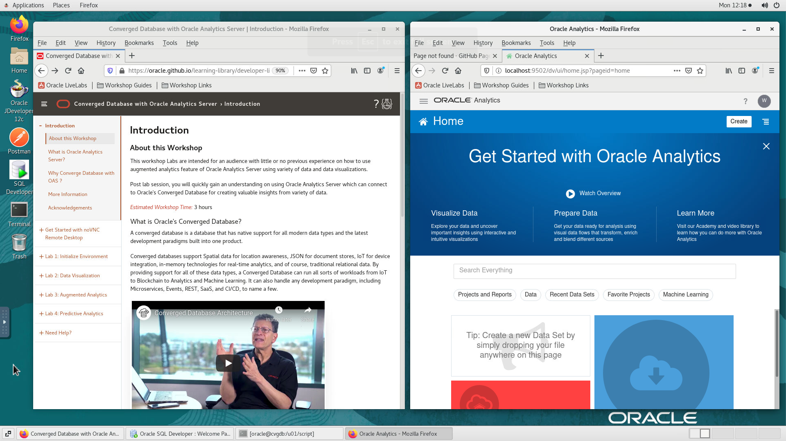

# Initialize Environment

## Introduction

In this lab we will review and startup all components required to successfully run this workshop.

*Estimated Lab Time:* 10 Minutes.

### Objectives
- Initialize the workshop environment.

### Prerequisites
This lab assumes you have:
- A Free Tier, Paid or LiveLabs Oracle Cloud account
- SSH Private Key to access the host via SSH
- You have completed:
    - Lab: Generate SSH Keys (*Free-tier* and *Paid Tenants* only)
    - Lab: Prepare Setup (*Free-tier* and *Paid Tenants* only)
    - Lab: Environment Setup

## Task 1: Start And Validate The Required Processes are Up and Running.
1. Now with access to your remote desktop session, proceed as indicated below to Start your environment using Environment script before you start executing the subsequent labs and validate the following Processes should be up and running:
    
    - Database Listeners
    - Database Server Instances
    - OAS Services
    

2. Open the *Workshop Guides* folder from the *Firefox* toolbar area above and select the correct guide for your workshop.
    - On the *SQL-Developer* window on the right preloaded with saved credential
    

3. Click on *Terminal* icon on the desktop to start a terminal and execute the below command.
    
    - Go to folder /u01/script

        ```
        <copy>
        cd /u01/script
        </copy>
        ```
    - Run the script file to start the components.

        ```
        <copy>
        ./env_setup_oas-workshop.sh
        </copy>
        ```
        

        Check for the "Finished starting servers" status before proceeding next.
        

4. Run "status.sh" file to get the status of all the services required for OAS. The command shows all the service names and their status.

    
    ```
    <copy>
    /u01/oas/Oracle/middleware/Oracle_Home/user_projects/domains/bi/bitools/bin/status.sh
    </copy>
    ```
    

    Check for the success status as shown above, before login to OAS screen.

5. The above command will start the database, listener and OAS server. This script could take 2-5 minutes to run. Check for the "Finished starting servers" status before proceeding next.

    - Open the *Workshop Links* folder from the *Firefox* toolbar area above and select the correct Links for your workshop. 
    
    If successful, the page above is displayed and as a result your environment is now ready.  

## Task 2: Login To Oracle Analytics Server

1. Open the *Workshop Links* folder from the *Firefox* toolbar area above and select the correct Links for your workshop.   

    ```
    <copy>
    http://localhost:9502/dv/ui
    </copy>
    ```
    ```
    Username	: <copy>Weblogic</copy>
    ```
    ```
    Password	: <copy>Oracle_4U</copy>
    ```

    
    click on *Sign In*
    


## Task 3: Create A Connection To Database

1. From Home screen, click on **Create** button and select **Connection**.

    

2. Select **Oracle Database** for connecting to database and provide required connection details.  

    
    

    **Connection Details:**

    | Argument  | Description   |
    | ------------- | ------------- |
    | Connection Name | ConvergedDB_Retail |
    | Connection Type | Basic  |
    | Host | localhost  |
    | Port | 1521  |
    | Service Name | apppdb  |
    | Username | oaslabs  |
    | Password | Oracle_4U  |

3. Once connection details are provided click **Save** to save the connection.

You may now [proceed to the next lab](#next).

## Appendix 1: External Terminal Access (using SSH Key Based Authentication)

While you will only need the browser to perform all tasks included in this workshop, you can optionally use your preferred SSH client to connect to the instance should you prefer to run SSH Terminal tasks from a local client (e.g. Putty, MobaXterm, MacOS Terminal, etc.) or need to perform any troubleshooting task such as restarting processes, rebooting the instance, or just look around.

1. Refer to *Lab Environment Setup* for detailed instructions relevant to your SSH client type (e.g. Putty on Windows or Native such as terminal on Mac OS):

    - From the web session where you completed your provisioning request, do:
        - For **Reserve Workshop on LiveLabs** - Navigate to "*My Reservations* >> *Launch Workshop* >> *Workshop Instructions* >> *Lab: Environment Setup*"
        - For **Launch Free Trial Workshop** and **Run on Your Tenancy** - Click on the corresponding provisioning option and open *Lab: Environment Setup*
    - Authentication OS User - “*opc*”
    - Authentication method - *SSH RSA Key*
    - OS User – “*oracle*”.

2. First login as “*opc*” using your SSH Private Key

3. Then sudo to “*oracle*”. E.g.

    ```
    <copy>sudo su - oracle</copy>
    ```

## Acknowledgements

- **Authors** - Balasubramanian Ramamoorthy, Sudip Bandyopadhyay, Vishwanath Venkatachalaiah
- **Contributors** - Jyotsana Rawat, Satya Pranavi Manthena, Kowshik Nittala, Rene Fontcha
- **Last Updated By/Date** - Rene Fontcha, LiveLabs Platform Lead, NA Technology, December 2020
