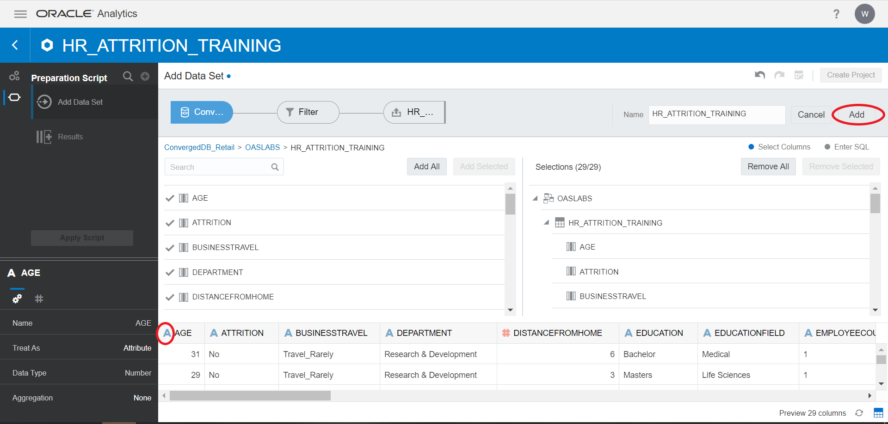

# OAS Predictive Analytics #

## Introduction ##

Oracle Analytics Server offers extended Machine Learning design capabilities. You need simple, one-click actions along with powerful machine learning (ML) models to predict results and better understand your data. To help you deploy sophisticated analytics to everyone in your organization, Oracle Analytics is focused on embedding, consuming, and training ML models to enrich your data preparation, discovery, and collaboration.  

It covers the full cycle of ML processes, allows direct uptake of any custom algorithm scripts, addressing the need of both traditional data scientists, citizen data scientists, and data analysts.  Oracle Analytics includes algorithms to help you train predictive models for various purposes. Examples of algorithms are classification and regression trees (CART), logistic regression, and k-means.

### Objectives ###

In this Lab, we are going to focus on how to predict attrition using binary classification algorithms and show how to use those inbuilt algorithms for addressing a real-life, common question for any organization.  

In this case: how can we identify the employees that are likely to quit the organisation? 
Knowing who might be at risk of leaving may even alert HR to retain the best talent.  

In this lab we are going to use “binary classification”. Binary classification is a technique of classifying records/elements of a given dataset into two groups on the basis of classification rules. For example: Employee Attrition Prediction whether the employee is going to quit or not. “Yes” and “No” are two different groups for employee'

We will also use visualizations on the predicted data for a better decision process.

### Pre-requisites ###

This lab assumes you have completed the following labs:  
- Lab 1: Login to Oracle Cloud  
- Lab 2: Generate SSH Key  
- Lab 3: Create Compute Instance  
- Lab 4: Environment Setup   

Also , this lab assumes you have a connection created to the Converged DB from OAS. 
Refer to  Step 1 of [OAS Lab5 : Data Visualization](?lab=oas-lab-5-data-visualization)

Below data objects are available in Converged Database.  

| ObjectName  | ObjectType  | DataType  | Description  |
| ------------- | ------------- | ------------- |
| HR\_ATTRITION\_TRAINING | Table | Relational  | Data used to train the Machine Learning model |
| HR\_ATTRITION\_PREDICT | Table | Relational | Data used to test the model we create |

## Step 1 :Create Dataset

In this step, we will use the database connection created in **OAS Lab 5 : Data Visualization** and create a dataset to work on.

1. In the Home page ,click on create button and select Dataset.

2. Select the connection "ConvergedDB_Retail".

3. Select the OASLABS schema.

4. Select the HR\_ATTRITION\_TRAINING table.

5. Add all the columns to the data set.

6. Perform required measure to attribute changes and add data set.  
  For Example,  
  (select “Age” and change  to Attribute in bottom left corner)  
  (select “EmployeeID” and change  to Attribute in bottom left corner)
7. Finally click on “Add” to add the data set.

## Step 2 :Create Dataflow - ML Model

In this step , we will build a Machine learning model using OAS Dataflow capabilities to train our data on.

1. Click on Create and then select Data Flow.

2. Select the Data set created in the Step 1 of this lab **Create Dataset** and click on Add.

3. Uncheck the columns(Employee ID) which will not affect the Attrition as part of data cleaning process.
 
4. Click on “+” and select “Train Binary Classifier”.  
  We are using “Train Binary Classifier” because the predict values will only be “yes or no”.

5. Select Naïve Bayes for Classification.

6. Fill out the input parameters:  
  **Target**: “Attrition”  
  **Positive Class in Target**: “yes”

7. Give Appropriate Name and Save the model.

8. Save the Data flow

9. Now run the data flow to build the ML model on training dataset.

We now have an ML model to test our data.

## Step 3: Check ML Model Quality

In this step , we will check the parameters which determines the credibility of a model.

1. Go to “Home”, select “Machine Learning” 

2. Select the model created in previous step, right click on it and select "Inspect".

3. Go to the Quality parameters tab. We can check model accuracy, Confusion matrix and other parameters here.

## Step 4: Apply Training Model to Predict

In this step, we will apply our already created ML model to the test data.

1. Create the test dataset , from the already created Database connection **ConvergedDB_Retail**

2. Select the OASLABS schema.

3. Select the HR\_ATTRITION\_PREDICT table , which has our test data.

4. Add all the rows to the data set and perform required Measure to attribute changes and click on “Add".  
 For Example,  
       Check the datatype of Employee count to be Measure.

5. Click on "Create Project" to create visualizations.

6. Click on “+” symbol  and click on Create Scenario , to imply the ML model on the test data.

7. Select the ML model created previously in Step 2 of the lab **Create Dataflow - ML model**, click on Add.

8. We can see that the model has successfully been added to the project.

9.  Right Click on Model name and verify the column mapping, do the changes if required.

Now our Training model is successfully mapped to the ML model.
  

## Step 5: Create Visualizations

In this step we will enrich our insights with predictive analytics by creating some visuals on the prediction data.

1. Select "Employee Count" column from HR\_ATTRITION\_PREDICT table.  
Right click on the column and select Pick visualization.

2. Select the "Performance Tile" visualization.

3. Now we will analyze on employees based on job staisfaction and work life-balance.  

Select Employee count, JobSatisfaction and Worklife balance from the prediction table and pick "Horizontal Stacked" visualization.

4. Similar to the above steps ,create Horizontal stacked graph with Employee count, JobInvolvement and Performance Rating columns.

5. Now we will analyze further on “duration of employees with current company”.  Select Employee Count and Years at company from the prediction table and pick Line graph.

6. We will now see Employees via Department and Job Role.  Select EmployeeCount, Job Role and Department. Pick Pivot as visualization.

7. We can also hide the Employee count label that is being shown on the Pivot. Right click on the graph and select "Hide Value labels".

8. We can rearrange the visualizations by simple drag and drop , to make the canvas more appealing.

9. Now , we will enrich the visualization by adding “Attrition Predict” from the Model as below.  Select Employee Count, Department, Jobrole and Attrition Predict. Pick table as visualization

This way we can see how many employees are likeliy to leave by Department and Job Role.
10. Lets add, “Attrition Predict” as a global filter for it to reflect across the whole canvas.  Drag the column to the top.

11. When we set "Attrition Predict" to YES , the tool only considers data of employees predicted to quit the company and applies to the analysis we conducted previously as seen below.

It is vital for a HR Department to identify the factors that keep employees and those which prompt them to leave, this way we can provide related insights as to how many employees are likely to quit and the probable reason behind it , so that Organizations could do more to prevent the loss of valuable people.
        

## Acknowledgements

- **Authors** - Sudip Bandyopadhyay, Vishwanath Venkatachalaiah
- **Contributors** - Jyotsana Rawat, Satya Pranavi Manthena, Kowshik Nittala
- **Team** - North America Analytics Specialists
- **Last Updated By** - Vishwanath Venkatachalaiah

## Need Help?
Please submit feedback or ask for help using our [LiveLabs Support Forum](https://community.oracle.com/tech/developers/categories/livelabsdiscussions). Please click the **Log In** button and login using your Oracle Account. Click the **Ask A Question** button to the left to start a *New Discussion* or *Ask a Question*.  Please include your workshop name and lab name.  You can also include screenshots and attach files.  Engage directly with the author of the workshop.

If you do not have an Oracle Account, click [here](https://profile.oracle.com/myprofile/account/create-account.jspx) to create one.
