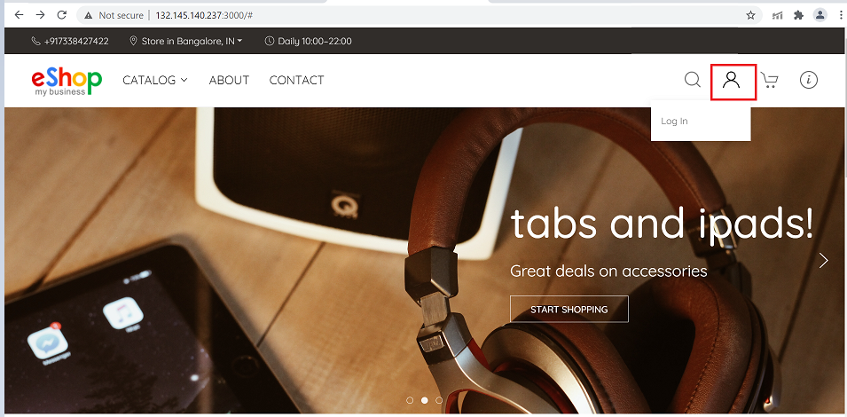
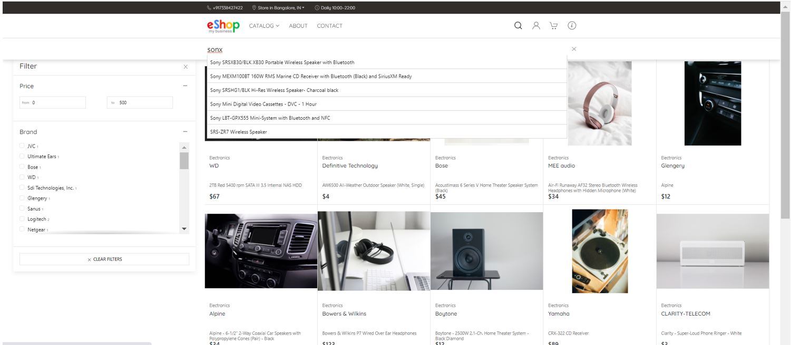
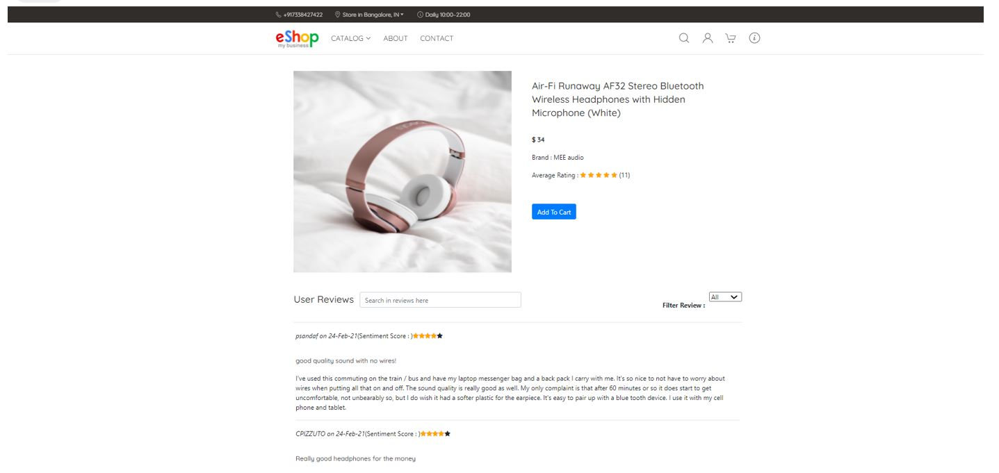
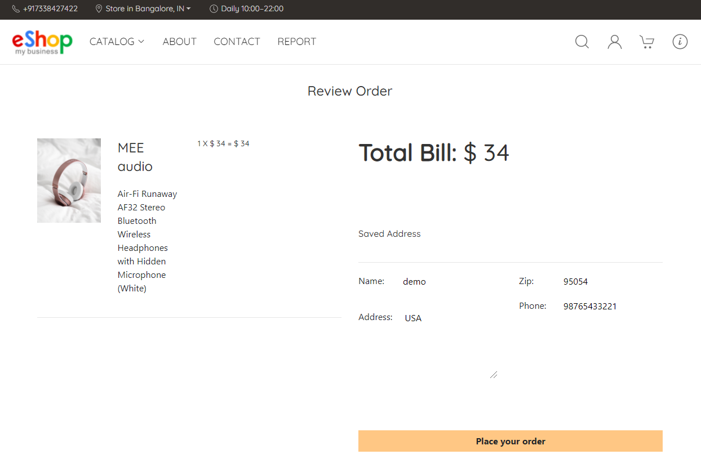
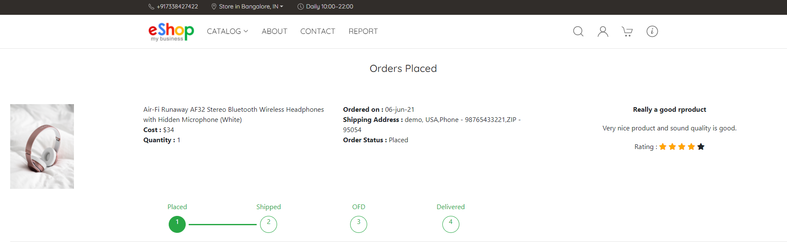
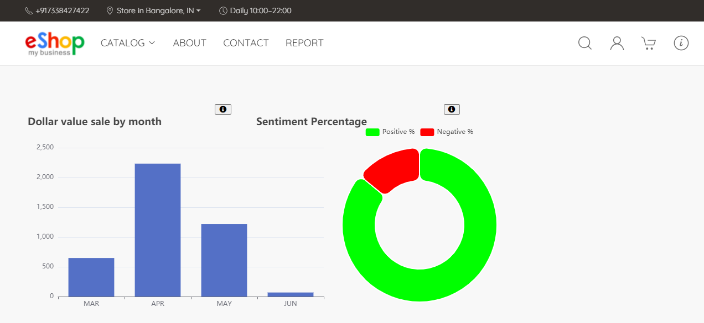
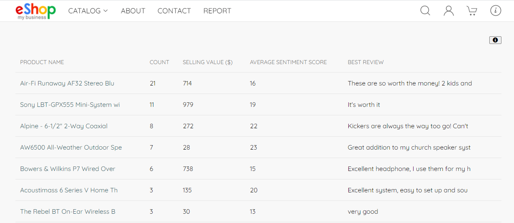
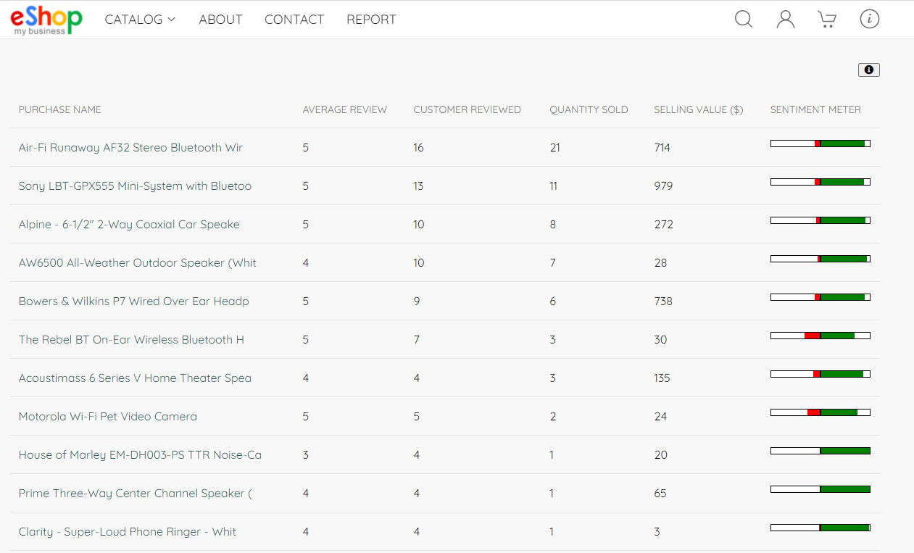

# About Eshop

## Introduction   
EShop is an example web-based ecommerce retail application, built for an online electronics retailer.
We developed this application to demonstrate Oracle Sharding (Hyperscale Globally Distributed Converged Database) with OLTP and Analytics (Massively Parallel Processing architecture). Oracle Cloud infrastructure (OCI) is used to host the application.

- The application can support billions of users and products.

- We used Oracle Database Sharding (3 Shards) with different types of data stored in a single database platform, which includes structured and unstructured data, Relational, JSON and Text.
  
- Multiple capabilities like the Simple Oracle Document Access (SODA) API + Text Search for JSON. Joins, Transactions, and ACID properties for Relational Queries. Fuzzy Match, Type Ahead, Free Form Text Search, Sentiment Analysis for Text.

*Estimated Lab Time*: 20 Minutes

Typically, multiple technologies and products are required to develop such an application. For example, a  JSON Database, a Text Index application, a Relational Database, an  Analytics Engine, which makes it difficult to query data across multiple data stores near. 

Further, using the traditional methods, the customer would have spent several years and millions of dollars in licensing and development. 
But this Eshop application has been built using the single data platform (oracle sharding) within just two weeks.

### Objectives
In this lab, you will:
* Setup the environment for Sharding lab.
* Connect the putty.
* Learn about the Sharding capabilities.

### Prerequisites
This lab assumes you have:
- A Free Tier, Paid or LiveLabs Oracle Cloud account
- SSH Private Key to access the host via SSH
- You have completed:
    - Lab: Generate SSH Keys (*Free-tier* and *Paid Tenants* only)
    - Lab: Prepare Setup (*Free-tier* and *Paid Tenants* only)
    - Lab: Environment Setup
    - Lab: Initialize Environment

***Note:***  All the scripts for this lab are stored in the **`/u01/workshop/json`** folder and run as the **oracle** user.

## **STEP 1**: Eshop Demonstration

1. A user accesses the application through the URL (**`http://<Public IP>:3000/`**), they are directed to the application's home page. To log in, go to the top right of the nav bar and press the login button. The login button brings the user to the login screen, where they can log in or build a new account by signup if they don't have one. 

  

2. The application has login and new user signup features, but it also allows access to a non-logged in application user to some extent. It allows users to search for a product in the catalogue that meets their needs and make a purchase based on the product's reviews, sentiment score, and rating.

  

  The user will be guided back to the home screen after a successful login.

3. Click the CATALOG link in the navigation bar to browse the product list. Tthis module lists all the products in the store by bringing all the rows from Product JSON tables where it exists from all the shard databases, along with a picture and price. 

  

  Any of the product tiles on this screen can be clicked to take the user to the product information tab or take the help of Filter option by price/Brand to get the list of specific products. You can click on selected product or you can choose to add directly to the cart by click on cart symbol. 
  In addition, we can do the text search by directly typing the product information in search bar.

  

4. The product search functionality is flexible enough to autocorrect the misspelled search text and provide users with suggestion list they might be looking for. For better performance and faster loading of product list, we have proper indexing on SODA collections as well as pagination logic using limit and skip functions.
  
  By navigating the specific product to take the user to the product information tab, where they can read the review and rating for the product, they have chosen. 

  

  It will on the product information screen, the reviews are sorted by sentiment ratings. They may also look for reviews based on the content or keyword they are searching for.

5. On the product information tab, click the add to cart button to add the product to the user's cart. If the user wants to add more items to the cart, they can repeat the procedure.
  To place the order of the items click the **‘Go To Cart’**. 

  

6. You can specify the number count for specified product and click for Proceed to Checkout.

  

7. Review the order and click for place an order.

  

8. Finally, you can submit the review and rating for the purchased item.

  

9. Now the the reviews and ratings are successfully submitted.

  

## **STEP 2**: Report Generation

1. We can make reports by emulating two large data sets from relational tables (customers, orders, line items ) and Non-Relational tables (products & Reviews - JSON, Text , sentiment analysis). And these Analytics reports are a A single query spanning multiple data types from multiple shard databases.

   **Dollar value sale by month:** A single query spanning from LINE_ITEM by accessing multiple shard databases.

   **Sentiment Percentage:** A single query spanning from Reviews by accessing multiple shard databases.

  

2. Best Selling Product In last two months: A single query spanning from multiple tables both relational and non-relational by accessing multiple shard databases.

  

3. Analytics report made by Java table with Multiple sql Queries ( These queries spanning from multiple tables both relational & non-relational across all the shard databases).

  

  

## **STEP 3**: XXXXXXXXXXXX

## Learn More

- Oracle JSON Documentation ([JSON](https://docs.oracle.com/en/database/oracle/oracle-database/19/adjsn/index.html))

## Rate this Workshop
When you are finished don't forget to rate this workshop!  We rely on this feedback to help us improve and refine our LiveLabs catalog.  Follow the steps to submit your rating.

1.  Go back to your **workshop homepage** in LiveLabs by searching for your workshop and clicking the Launch button.
2.  Click on the **Brown Button** to re-access the workshop  

    

3.  Click **Rate this workshop**

    

If you selected the **Green Button** for this workshop and still have an active reservation, you can also rate by going to My Reservations -> Launch Workshop.

## Acknowledgements
* **Authors** - Balasubramanian Ramamoorthy, Arvind Bhope
* **Contributors** - Laxmi Amarappanavar, Kanika Sharma, Venkata Bandaru, Ashish Kumar, Priya Dhuriya, Maniselvan K, Robert Ruppel, David Start, Rene Fontcha
* **Last Updated By/Date** - Rene Fontcha, LiveLabs Platform Lead, NA Technology, December 2020
