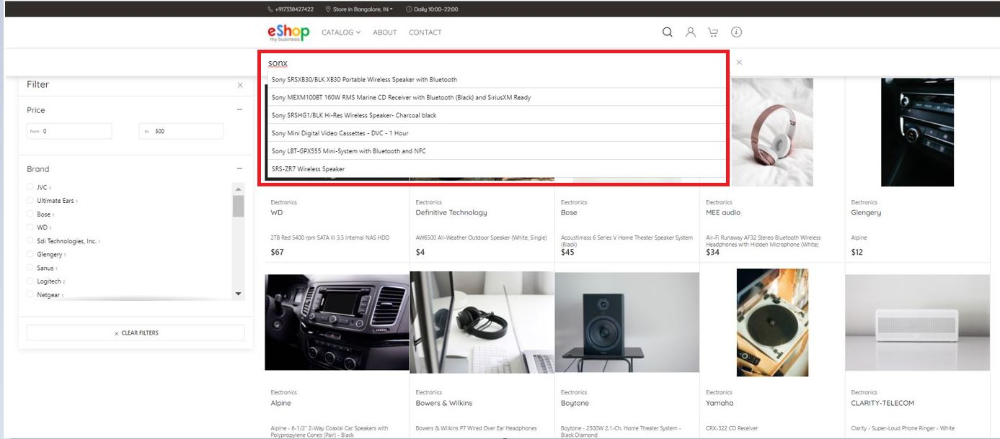
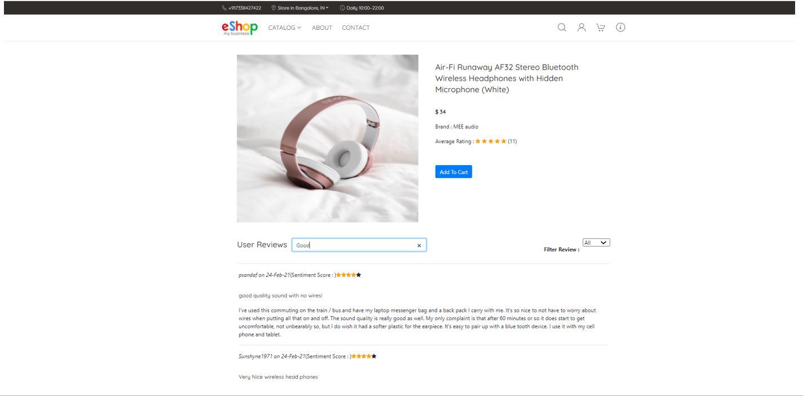

# About Eshop

## Introduction   
EShop is an example web-based ecommerce retail application, built for an online electronics retailer.
We developed this application to demonstrate hyperscale converged database with OLTP and Analytics (Massively Parallel Processing architecture). Oracle Cloud infrastructure (OCI) is used to host the application.
 The application can support billions of users and products. The application has been built using the single data platform within just two weeks. 

*Estimated Lab Time*: 20 Minutes

Typically, multiple technologies and products are required to develop such an application. For example, a JSON Database, a Text Index application, a Relational Database, an Analytics Engine, which makes it difficult to query data across multiple data stores near. Further, using the traditional methods, the customer would have spent several years and millions of dollars in licensing and development.

In this application, we used **Oracle Database Sharding** with different types of data stored in a single database platform, which includes **structured and unstructured data, Relational, JSON and Text**. In this demo, we are showing typical relational OLTP capabilities for large data volume, Google like text search, also single query, which can span all these different data types.

We are showing multiple capabilities like the Simple Oracle Document Access (SODA) API + Text Search for JSON. Joins, Transactions, and ACID properties for Relational Queries. Fuzzy Match, Type Ahead, Free Form Text Search, Sentiment Analysis for Text and Search based on zip codes for Spatial Data Analysis.

### Objectives
In this lab, you will:
* Setup the environment for Sharding lab.
* Connect the putty.
* Learn about the Sharding capabilities.

### Prerequisites
This lab assumes you have:
- A Free Tier, Paid or LiveLabs Oracle Cloud account
- SSH Private Key to access the host via SSH
- You have completed:
    - Lab: Generate SSH Keys (*Free-tier* and *Paid Tenants* only)
    - Lab: Prepare Setup (*Free-tier* and *Paid Tenants* only)
    - Lab: Environment Setup
    - Lab: Initialize Environment

***Note:***  All the scripts for this lab are stored in the **`/u01/workshop/json`** folder and run as the **oracle** user.

## **STEP 1**: Eshop Demonstration

1. The application has login and new user signup features, but it allows access to a non-logged in application user to some extent. It allows users to search for a product in the catalogue that meets their needs and make a purchase based on the product's reviews, sentiment score, and rating.

  When a user accesses the application through the URL (http://<Public IP>:3000/), they are directed to the application's home page. To log in, go to the top right of the nav bar and press the login button. 

  

  The login button brings the user to the login screen, where they can log in or build a new account if they don't have one. 

  

  The user will be guided back to the home screen after a successful login, but instead of the login button, the user's profile image will be shown, indicating that the login is complete.

2. Click the CATALOG link in the navigation bar to browse the product list. This module lists all the products in the store, along with a picture and price. Any of the product tiles on this screen can be clicked to take the user to the product information tab, where they can read the review and rating for the product, they have chosen. They may also look for reviews based on the content or keyword they are searching for.

  

3. On the product information screen, the reviews are sorted by sentiment ratings. 

  

4. On the product information tab, click the add to cart button to add the product to the user's cart. If the user wants to add more items to the cart, they can repeat the procedure.

## **STEP 2**: XXXXXXXXXX

## **STEP 3**: XXXXXXXXXXXX

## Learn More

- Oracle JSON Documentation ([JSON](https://docs.oracle.com/en/database/oracle/oracle-database/19/adjsn/index.html))

## Rate this Workshop
When you are finished don't forget to rate this workshop!  We rely on this feedback to help us improve and refine our LiveLabs catalog.  Follow the steps to submit your rating.

1.  Go back to your **workshop homepage** in LiveLabs by searching for your workshop and clicking the Launch button.
2.  Click on the **Brown Button** to re-access the workshop  

    

3.  Click **Rate this workshop**

    

If you selected the **Green Button** for this workshop and still have an active reservation, you can also rate by going to My Reservations -> Launch Workshop.

## Acknowledgements
* **Authors** - Balasubramanian Ramamoorthy, Arvind Bhope
* **Contributors** - Laxmi Amarappanavar, Kanika Sharma, Venkata Bandaru, Ashish Kumar, Priya Dhuriya, Maniselvan K, Robert Ruppel, David Start, Rene Fontcha
* **Last Updated By/Date** - Rene Fontcha, LiveLabs Platform Lead, NA Technology, December 2020
