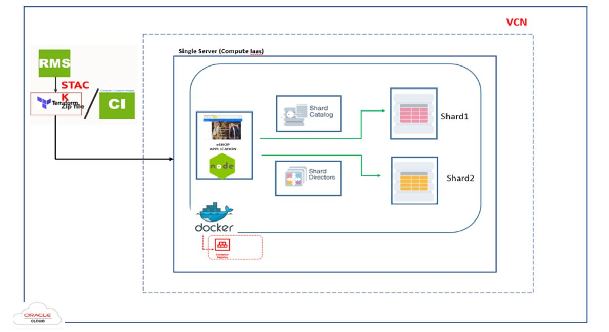

# Exploring Sharding Topology

## Introduction   
The **sharded database topology** is described by the sharding metadata in the shard catalog database. GDSCTL is used to configure the sharded database topology

Like SQL*Plus, **GDSCTL** is a command-line utility with which you can configure, deploy, monitor, and manage an Oracle Sharding sharded database.
You can run GDSCTL remotely from a different server or laptop to configure and deploy a sharded database topology, and then monitor and manage your sharded database. 
Run the commands from a shard director host because the GDSCTL command line interface is installed there as part of the shard director (global service manager) installation.


*Estimated Lab Time*: 20 Minutes

   

As shown in the diagram above, the sharded database is deployed as multiple containers all running within the same Compute VM. 


### Objectives
In this lab, you will:
* Setup the environment for JSON lab.
* Connect the Oracle SQL developer to Insert and Update the JSON Data into Oracle Database by using JSON Function.
* Learn about the JSON functions.

### Prerequisites
This lab assumes you have:
- A Free Tier, Paid or LiveLabs Oracle Cloud account
- SSH Private Key to access the host via SSH
- You have completed:
    - Lab: Generate SSH Keys (*Free-tier* and *Paid Tenants* only)
    - Lab: Prepare Setup (*Free-tier* and *Paid Tenants* only)
    - Lab: Environment Setup
    - Lab: Initialize Environment

***Note:***  All the scripts for this lab are stored in the **`/u01/workshop/json`** folder and run as the **oracle** user.

## **STEP 1**: Check for containers in your VM.

1. Open a terminal window and sudo to the user **root**

    ```
    <copy>
    docker ps -a
    </copy>
    ```

## **STEP 2**: Connect to Shard director

1. Run in the terminal as **root** user.
    ```
    <copy>
    docker exec -i -t gsm1 /bin/bash
    </copy>
    ```
    ```
    <copy>
    gdsctl
    </copy>
    ```
    
2. Verify sharding topology using the  **CONFIG** command.

    ```
    <copy>
    config
    </copy>
    ```

3. Check list of CDBs in the catalog.

    ```
    <copy>
    config cdb
    </copy>
    ```

4. Check  the detailed status of each shard.

    ```
    <copy>
    config shard -shard orcl1cdb_orcl1pdb
    </copy>
    ```

5. Verify the current shard configuration.

    ```
    <copy>
    config shard
    </copy>
    ```

6.  Use **STATUS** to view locations for shard director (GSM) trace and log files.

    ```
    <copy>
    databases
    </copy>
    ```
    
    ```
    <copy>
    status service
    </copy>
    ```

    ```
    <copy>
    config service
    </copy>
    ```

    ```
    <copy>
    config table family
    </copy>
    ```
    ```
    <copy>
    show ddl
    </copy>
    ```

## **STEP 3**: Connect to Catalog

1. Run in the terminal as **root** user.

    ```
    <copy>
    docker exec -i -t catalog /bin/bash
    </copy>
    ```
    ```
    <copy>
    gdsctl
    </copy>
    ```

2. Connect to the database as test user.
   
    ```
    <copy>
    sqlplus shardusertest/oracle@CAT1PDB
    </copy>
    ```

## **STEP 4**: Connect to Shard 1 Database
1.  Run in the terminal as **root** user.
    ```
    <copy>
    docker exec -i -t shard1 /bin/bash
    </copy>
    ```

2. Check the status of the agent.
   
    ```
    <copy>
    schagent -status
    </copy>
    ```

## **STEP 5**: Connect to Shard 2 Database
1.  Run in the terminal as **root** user.

    ```
    <copy>
    docker exec -i -t shard2 /bin/bash
    </copy>
    ```

2. Check the status of the agent.
   
    ```
    <copy>
    schagent -status
    </copy>
    ```


## Learn More

- Oracle JSON Documentation ([JSON](https://docs.oracle.com/en/database/oracle/oracle-database/19/adjsn/index.html))

## Rate this Workshop
When you are finished don't forget to rate this workshop!  We rely on this feedback to help us improve and refine our LiveLabs catalog.  Follow the steps to submit your rating.

1.  Go back to your **workshop homepage** in LiveLabs by searching for your workshop and clicking the Launch button.
2.  Click on the **Brown Button** to re-access the workshop  

    

3.  Click **Rate this workshop**

    

If you selected the **Green Button** for this workshop and still have an active reservation, you can also rate by going to My Reservations -> Launch Workshop.

## Acknowledgements
* **Authors** - 
* **Contributors** - 
* **Last Updated By/Date** - Rene Fontcha, LiveLabs Platform Lead, NA Technology, December 2020
