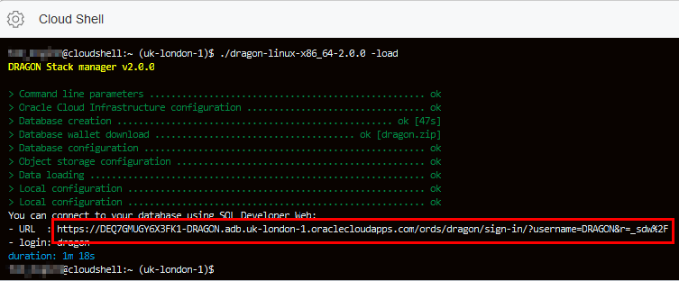
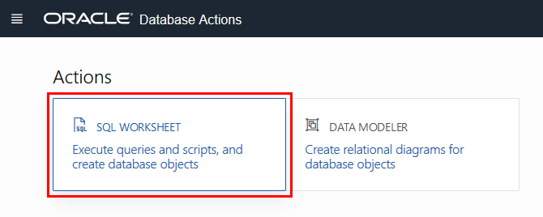

# Download and run DRAGON

## Introduction

This lab walks you through the steps to download, install and run the DRAGON stack. <more>

Estimated Lab Time:  10 minutes

### About DRAGON
The DRAGON stack is designed to speed up you development of applications that leverage the power of Oracle Autonomous Database. In this short workshop, you'll download the stack and deploy the stack to Oracle Cloud.


### Prerequisites
* An Oracle Free Tier, Always Free, Paid or LiveLabs Cloud Account


## **STEP 1**: Download the DRAGON Stack

1. In Cloud Shell, change directories to your home directory:

    ```
    <copy>cd</copy>
    ```

2. Download the DRAGON stack and make it executable:

    ```
    <copy>wget https://github.com/loiclefevre/dragon/releases/download/v2.0.0/dragon-linux-x86_64-2.0.0</copy>
    ```

    ```
    <copy>chmod +x dragon-linux-*</copy>
    ```

3. Create a `dragon.config` file using vi, nano or your favorite editor:

    ```
    <copy>nano dragon.config</copy>
    ```

4. Copy the following and paste it into the file, and add the values you collected earlier:

    ```
    <copy>
    [DEFAULT]
    user=<user ocid>
    fingerprint=<api key fingerprint>
    key_file=~/.oci/oci_api_key.pem
    tenancy=<tenancy ocid>
    compartment_id=<compartment ocid>
    region=<region code>
    auth_token=<authentication token>
    database_password=5uPeR_5tRoNg_PaSsWoRd
    database_collections=employees></copy>
    ```

    *Recommend we provide a sample JSON file for the collection*

## **STEP 3:** Deploy the DRAGON stack

1. Use the `-help` to see the parameters that DRAGON accepts:

    ```
    $ <copy>./dragon-linux-x86_64-2.0.0 -help</copy>
    DRAGON Stack manager v2.0.0

    > Command line parameters ................................................... ok
    Usage:
      -config-template              display a configuration file template
      -profile <profile name>       choose the given profile name from dragon.config (instead of DEFAULT)
      -db <database name>           denotes the database name to create
      -load                         load corresponding data into collections
      -create-react-app [name]      create a React frontend (default project name is "frontend")
      -destroy                      ask to destroy the database
    $
    ```
2. Use the `-config-template` to see the required and optional fields in the config file:

    ```
    $ <copy>./dragon-linux-x86_64-2.0.0 -config-template</copy>
    DRAGON Stack manager v2.0.0

    > Command line parameters ................................................... ok
    Configuration template (save the content in a file named "dragon.config"):

     # DEFAULT profile (case sensitive), you can define others: ASHBURN_REGION or TEST_ENVIRONMENT
     # You can choose a profile using the -profile command line argument
    [DEFAULT]

    ...

     # Uncomment to ask for Bring Your Own Licenses model (doesn't work for Always Free and AJD)
    # database_license_type=byol

     # A list of coma separated JSON collection name(s) that you wish to get right after database creation
    # database_collections=

     # Path to a folder where data to load into collections can be found (default to current directory)
    data_path=.

    $
    ```

3. Create a sample JSON file to load. Open the following file and paste the contents into it, and save the file:

    ```
    $ <copy>nano employees.json</copy>
    ```

    ```
    <copy>{"Employees":[{"userId":"rirani","jobTitleName":"Developer","firstName":"Romin","lastName":"Irani","preferredFullName":"Romin Irani","employeeCode":"E1","region":"CA","phoneNumber":"408-1234567","emailAddress":"romin.k.irani@gmail.com"},{"userId":"nirani","jobTitleName":"Developer","firstName":"Neil","lastName":"Irani","preferredFullName":"Neil Irani","employeeCode":"E2","region":"CA","phoneNumber":"408-1111111","emailAddress":"neilrirani@gmail.com"},{"userId":"thanks","jobTitleName":"Program Directory","firstName":"Tom","lastName":"Hanks","preferredFullName":"Tom Hanks","employeeCode":"E3","region":"CA","phoneNumber":"408-2222222","emailAddress":"tomhanks@gmail.com"}]}</copy>
    ```

    *Note: JSON files must be minified(no line breaks).*

4. Create the DRAGON stack with the employees collection:

    ```
    $ <copy>./dragon-linux-x86_64-2.0.0 -load</copy>
    DRAGON Stack manager v2.0.0

    > Command line parameters ................................................... ok
    > Oracle Cloud Infrastructure configuration ................................. ok
    > Database creation ................................................. ok [1m 8s]
    > Database wallet download ..................................... ok [dragon.zip]
    > Database configuration .................................................... ok
    > Object storage configuration .............................................. ok
    > Data loading .............................................................. ok
    > Local configuration ....................................................... ok
    > Local configuration ....................................................... ok
    You can connect to your database using SQL Developer Web:
    - URL  : https://DEQ7GMUGY6X3FK1-DRAGON.adb.uk-london-1.oraclecloudapps.com/ords/dragon/sign-in/?username=DRAGON&r=_sdw%2F
    - login: dragon
    duration: 1m 48s
    ```

## **STEP 4:** Using DRAGON

1. Click the link to connect to SQL Developer Web:

  

2. Login, using the login name and password you created in the config file:

  

3. Click SQL Worksheet:

  

4. Expand the two collections:

  

5. In the worksheet, enter the following command to look at the contents of the employees collection (JSON), and click **Run Statement**:

  ```
  <copy>select json_query(json_document, '$' returning CLOB) from employees;</copy>
  ```

  

6. Click in the query result to see the contents of the JSON document:

  

## **STEP 5:** Create the front end React application

1. In Cloud Shell, build the front-end:

    ```
    $ <copy>./dragon-linux-x86_64-2.0.0 -create-react-app</copy>
    DRAGON Stack manager v2.0.0

    > Command line parameters ................................................... ok
    > Oracle Cloud Infrastructure configuration ................................. ok
    > Local configuration ....................................................... ok
    > Stack creation .......................................... ok [React: frontend]
    Success! Created frontend at /home/tom_mcginn/frontend
    Inside that directory, you can run several commands:

      npm install
        Installs all the dependencies.

      npm start
        Starts the development server.

      npm run build
        Bundles the app into static files for production.

      npm test
        Starts the test runner.

      npm run eject
        Removes this tool and copies build dependencies, configuration files
        and scripts into the app directory. If you do this, you can’t go back!

    We suggest that you begin by typing:

      cd frontend
      npm install
      npm start

    Happy hacking!
    duration: 0.012s
    $
    ```

2. Build the front end using npm:

    ```
    <copy>cd frontend; npm install; npm start</copy>
    ```

    

3. When the build completes, install NGROK to access the local website (deployed on Cloud Shell):

    ```
    <copy>wget https://bin.equinox.io/c/4VmDzA7iaHb/ngrok-stable-linux-amd64.zip; unzip ngrok-stable-linux-amd64.zip</copy>
    ```

4. Start ngrok and then access the website:

    ```
    <copy>npm start &</copy>
    ```

    ```
    <copy>./ngrok http 3000</copy>
    ```

    

5. Click in the interface to learn more about the DRAGON project, Reactjs, ORDS, or sign into the database on your ATP instance.

    

    *maybe add more here?*

## **STEP 6:** Cleanup your environment

1. Quit ngrok by pressing `Ctrl-C`.

2. Change directories to home.

    ```
    $ <copy>cd</copy>
    ```

3. Destroy you DRAGON stack

    ```
    $ <copy>./dragon-linux-x86_64-2.0.0 -destroy</copy>
    ```

Congratulations! You have complete the workshop!

## Learn More

* [DRAGON Project (GitHub)](https://github.com/loiclefevre/dragon)
* [Oracle REST Data Services](https://www.oracle.com/database/technologies/appdev/rest.html)

## Acknowledgements
* **Author** - Loic Lefevre, Principal Product Manager
* **Last Updated By/Date** - Tom McGinn, Database Product Management, October 2020

## Need Help?
Please submit feedback or ask for help using our [LiveLabs Support Forum](https://community.oracle.com/tech/developers/categories/livelabsdiscussions). Please click the **Log In** button and login using your Oracle Account. Click the **Ask A Question** button to the left to start a *New Discussion* or *Ask a Question*.  Please include your workshop name and lab name.  You can also include screenshots and attach files.  Engage directly with the author of the workshop.

If you do not have an Oracle Account, click [here](https://profile.oracle.com/myprofile/account/create-account.jspx) to create one.
