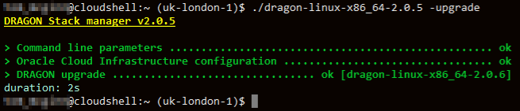
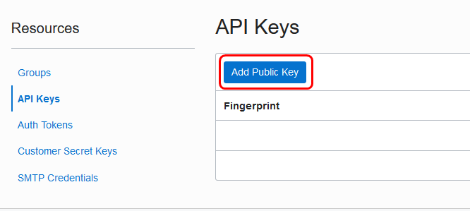
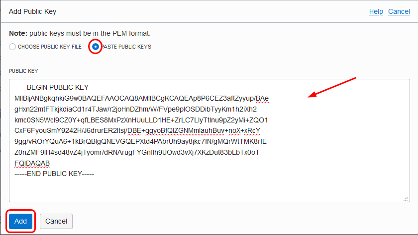

# Create your first React Web Application using the DRAGON Stack

## Introduction

This lab walks you through the steps to download, configure, and run the DRAGON Stack manager in order to create your very first React Web Application connected to an Autonomous Transaction Processing database (Always Free or not). 

Estimated Lab Time:  10 minutes

### About DRAGON
The DRAGON Stack manager is designed to speed up as much as possible the development of applications that leverage the power of Oracle Autonomous Databases.

### Prerequisites
* An Oracle Free Tier, Always Free, Paid or LiveLabs Cloud Account

## **STEP 1**: Download the DRAGON Stack manager

1. In Cloud Shell, change directories to your home directory:

    ```
    $ <copy>cd</copy>
    ```

2. If you have an existing DRAGON Stack manager you can simply *upgrade* it to the latest version:

    ```
    $ <copy>dragon-linux-x86_64-<your version> -upgrade</copy>
    ```

    For example:

    
    
    

    *[Click here to skip to STEP 4](#STEP4:DeploytheDRAGONStackbackend)*

2. Download the DRAGON Stack manager and make it executable:
   *See [the GitHub repo](https://github.com/loiclefevre/dragon) for the latest version.*

    ```
    $ <copy>wget https://github.com/loiclefevre/dragon/releases/download/v2.0.7/dragon-linux-x86_64-2.0.7</copy>
    ```

    ```
    $ <copy>chmod +x dragon-linux-*</copy>
    ```

3. Run the dragon command to generate SSH keys and display the config file:

    ```
    $ <copy>./dragon-linux-x86_64-2.0.7 -config-template -create-keys</copy>
    DRAGON Stack manager v2.0.7

    > Command line parameters ................................................... ok
    Entering keys generation process...
    These keys (public and private) will be used for future connection to Oracle Cloud Infrastructure API endpoints.
    Please enter a passphrase: banana
    > Keys creation ..................................... ok [Upload the Public Key]
    Please upload this public key to your Oracle Cloud Infrastructure user's API Keys:

    -----BEGIN RSA PUBLIC KEY-----
    MIIBIjANBgkqhkiG9w0BAQEFAAOCAQ8AMIIBCgKCAQEAsJthzZ9NzhJiFL/iC7nK
    bJlBQbTrsyDkc0zF0impJ5h9U/hCPopsKl53aBlaTTYjHnY73zaR/cJXbvsfbIJk
    v4USZpC/uhczo16BOtE3W+iQjoLgn8gsiFrcXvsb3G9h2avSa6eI1KifjJ7gqvEv
    SEb8t0ztMOkV3e3S5hrX57itipZZ0tPn//eBk8HpuHWV2wDoLtmzX2ZnIlu/niAO
    Fr7qTSvkVm28YEDAXEtQZ43C2wzImpacqiH37mK6fiK0Vunbx3D1bB+1a+dM6wVz
    09oXAIeD7lVROHpHHmqfb+AGbhEpsif005SE6mGgLxxSoRegWdVPKaLvZudpwlc8
    swIDAQAB
    -----END RSA PUBLIC KEY-----

    (instructions: https://docs.cloud.oracle.com/en-us/iaas/Content/API/Concepts/apisigningkey.htm#three)
    - public key saved in file: /home/tom_mcginn/dragon_ssh_key.pub
    - private key saved in file: /home/tom_mcginn/dragon_ssh_key

    Configuration template (save the content in a file named "dragon.config"):
    ...

     # Uncomment to ask for Bring Your Own Licenses model (doesn't work for Always Free and AJD)
    # database_license_type=byol

     # A list of coma separated JSON collection name(s) that you wish to get right after database creation
    # database_collections=

     # Path to a folder where data to load into collections can be found (default to current directory)
    data_path=.

    ```

4. Copy the public key (from the BEGIN RSA PUBLIC KEY to the end of END RSA PUBLIC KEY, including the dashes).

## **STEP 2:** Gather Data you need

1. From the OCI console, click the user icon (top right of your browser) and click **User Settings**. Click **API Keys** and **Add Public Key**.
   
   

2. Paste the content of public key you created and click **Add**. A new finger print will be generated.
   

  Make a note of the fingerprint for later.

  To see more information about generating the keys and finding your OCIDs, refer to [API Signing Key](https://docs.cloud.oracle.com/en-us/iaas/Content/API/Concepts/apisigningkey.htm).

3. On the User Details page, copy the user OCID and save it for later:

  

4. Click on the user icon again and click **Tenancy: <tenancy-name>**, then copy and save the tenancy OCID for later:

  

5. From your compartment details page, copy the compartment OCID and save it for later.

  

6. Look in the upper right of the Oracle Cloud Console to determine your region, then use [this reference](https://docs.cloud.oracle.com/en-us/iaas/Content/General/Concepts/regions.htm#top) to determine your region code. Save it for later.

## **STEP 3:** Create the dragon.config file

1. Create a `dragon.config` file using vi, nano or your favorite editor:

    ```
    $ <copy>nano dragon.config</copy>
    ```

2. Copy the following and paste it into the file, and add the values you collected earlier:

    ```
    <copy>
    [DEFAULT]
    user=<user ocid>
    fingerprint=<api key fingerprint>
    key_file=~/dragon_ssh_key
    tenancy=<tenancy ocid>
    compartment_id=<compartment ocid>
    region=<region code>
    auth_token=<authentication token>
    database_password=5uPeR_5tRoNg_PaSsWoRd
    database_collections=employees
    </copy>
    ```

    *Remark: we provide a sample JSON file for initializing a JSON collection during the deployment of the stack.*

3. In the case of Always Free Database limit reached for a paid tenant or a LiveLabs provided account, you can change the type of the database to provision using the `database_type` parameter:

    ```
    <copy>
    [DEFAULT]
    user=<user ocid>
    fingerprint=<api key fingerprint>
    key_file=~/dragon_ssh_key
    tenancy=<tenancy ocid>
    compartment_id=<compartment ocid>
    region=<region code>
    auth_token=<authentication token>
    database_password=5uPeR_5tRoNg_PaSsWoRd
    database_collections=employees
    database_type=ajd
    </copy>
    ```
 
## **STEP 4:** Deploy the DRAGON Stack backend

1. Use the `-help` to see the parameters that DRAGON accepts:

    ```
    $ <copy>./dragon-linux-x86_64-2.0.7 -help</copy>
    ```
    

2. Create a sample JSON file to load named `employees.json`. Open the following file and paste the content into it, and save the file:

    ```
    $ <copy>nano employees.json</copy>
    ```

    ```
    <copy>{"Employees":[{"userId":"rirani","jobTitleName":"Developer","firstName":"Romin","lastName":"Irani","preferredFullName":"Romin Irani","employeeCode":"E1","region":"CA","phoneNumber":"408-1234567","emailAddress":"romin.k.irani@gmail.com"},{"userId":"nirani","jobTitleName":"Developer","firstName":"Neil","lastName":"Irani","preferredFullName":"Neil Irani","employeeCode":"E2","region":"CA","phoneNumber":"408-1111111","emailAddress":"neilrirani@gmail.com"},{"userId":"thanks","jobTitleName":"Program Directory","firstName":"Tom","lastName":"Hanks","preferredFullName":"Tom Hanks","employeeCode":"E3","region":"CA","phoneNumber":"408-2222222","emailAddress":"tomhanks@gmail.com"}]}</copy>
    ```

3. Create the DRAGON Stack backend with the employees collection:

    The following commad will use the configuration information from the `dragon.config`file in order to deploy an

    ```
    $ <copy>./dragon-linux-x86_64-2.0.7 -loadjson</copy>
    ```
   
    

## **STEP 5:** Using DRAGON

1. Copy and paste the link into a browser and connect to SQL Developer Web:

  

2. Login, using the login name and password you created in the `dragon.config` file:

  

3. Click SQL Worksheet:

  

4. Expand the two collections:

  

5. In the worksheet, enter the following command to look at the contents of the employees collection (JSON), and click **Run Statement**:

  ```
  <copy>select json_query(json_document, '$' returning CLOB) from employees;</copy>
  ```

  

6. Click in the query result to see the contents of the JSON document:

  

## **STEP 6:** Create the front end React application

1. In Cloud Shell, generate the front-end project:

    ```
    $ <copy>./dragon-linux-x86_64-2.0.6 -create-react-app</copy>
    ```
    

2. Configure Cloud Shell `Node.js` version using the command provided (optional if you are in the good version already):

    ```
    $ <copy>nvm install 14.15.1 --latest-npm</copy>
    ```

3. Build the front end using npm:

    ```
    $ <copy>cd frontend; npm install</copy>
    ```

    

4. Once the Web Application deployed, install NGROK to access the local website (deployed on Cloud Shell):

    ```
    $ <copy>wget https://bin.equinox.io/c/4VmDzA7iaHb/ngrok-stable-linux-amd64.zip; unzip ngrok-stable-linux-amd64.zip</copy>
    ```

5. Start ngrok and then access the website (Note: if you get an error, make sure you are not on your company's VPN.)

    ```
    $ <copy>npm start &</copy>
    ```

    

    ```
    $ <copy>./ngrok http 3000</copy>
    ```

    

6. Click in the interface to learn more about the DRAGON project, Reactjs, ORDS, or sign into the database on your ATP instance.

    


## **STEP 7:** Cleanup your environment

1. Quit ngrok by pressing `Ctrl-C`.

2. Change directories to home.

    ```
    $ <copy>cd</copy>
    ```

3. Destroy you DRAGON Stack backend

    ```
    $ <copy>./dragon-linux-x86_64-2.0.7 -destroy</copy>
    ```
   

Congratulations! You have completed the very first DRAGON Stack workshop!

## Learn More

* [Oracle REST Data Services](https://www.oracle.com/database/technologies/appdev/rest.html)
* [DRAGON Project (GitHub)](https://bit.ly/DRAGONStack) and add a star :)

## Acknowledgements
* **Author** - Loic Lefevre, Principal Product Manager
* **Last Updated By/Date** - Tom McGinn, Database Product Management, November 2020


## Need Help?
Please submit feedback or ask for help using our [LiveLabs Support Forum](https://community.oracle.com/tech/developers/categories/livelabsdiscussions). Please click the **Log In** button and login using your Oracle Account. Click the **Ask A Question** button to the left to start a *New Discussion* or *Ask a Question*.  Please include your workshop name and lab name.  You can also include screenshots and attach files.  Engage directly with the author of the workshop.

If you do not have an Oracle Account, click [here](https://profile.oracle.com/myprofile/account/create-account.jspx) to create one.
