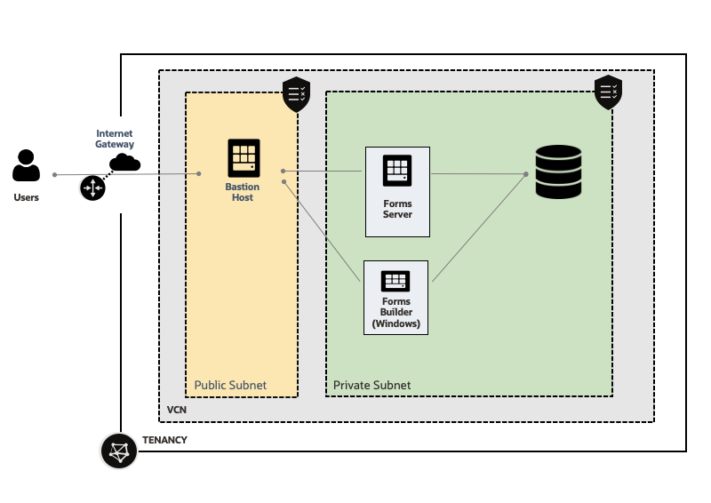

# Introduction

Estimated Lab Time: 90 minutes

## About this Workshop

In this workshop, you install Oracle Forms on Oracle Cloud Infrastruture. And compile and run Oracle Forms samples. 

  

### Objectives

In this workshop, you will learn how to:
- Setup Oracle Forms Server and a Database in the cloud
- Import tables in the database
- Install and compile an existing Oracle Forms program
- Deploy and run it 
- Optional: Install an Oracle Forms Forms Builder on Windows

### Prerequisites (Optional)

This lab assumes you have:
*  An Oracle Cloud Tenant 

And if not:
*  A valid email address
*  Ability to receive SMS text verification (only if your email isn't recognized)
*  Credit card (you will not be charged unless you elect to upgrade the account later.)

## Acknowledgements
* Marc Gueury - Application Development EMEA
