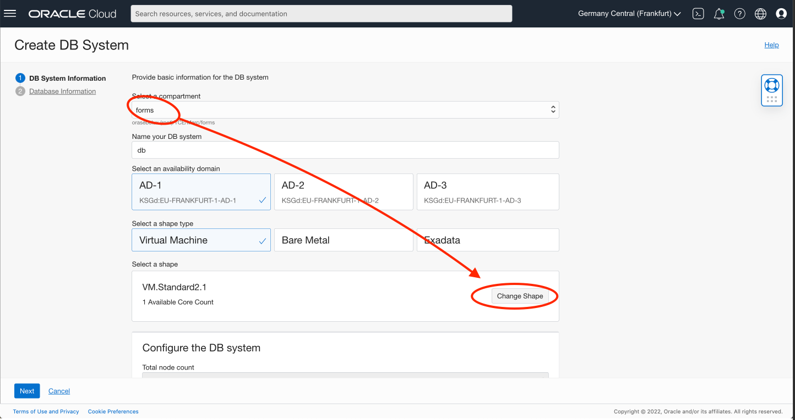

# Install Oracle Forms 

## Introduction

Estimated Time: 20 minutes

### Objectives

In this lab, you will:
* Install an Oracle Forms Server 
* Connect to it via SSH

### Prerequisites 

This lab assumes you have:
* Followed the previous lab

The lab will explain 2 ways to install the Forms Image:
- Forms with Dtatabase Cloud Service
- Forms with a local DB (In this case, skip Task1)

## Task 1: Install a Database

## Task 1: Option 1: Install with a Local DB

Nothing to do, the Database will be installed in the same machine than Forms

## Task 1: Option 2: Install with Database Cloud Service

For production database, it is better easier to use Database Cloud Service.
This is what we will install here. 

1. Go to the Oracle Cloud home page. In the Hamburger menu, look for **Oracle Database**. Then **Bare Metal, VM and Exadata**

   

2. Click **Create DB System**

   

3. Then in
- Name your DB system: **db** (for ex)
- Change Shape and choose the one that you need (Ex: VM.Standard2.1 )

   

4.. Further in the wizard

- Oracle Database software edition: Choose the version that you need (Ex: Enterprise High Perfomance)
- Choose storage management software: **Logical Volume Manager**
- SSH key: add the public ssh key that you got from the bastion (##1##)

   

- Choose your licence (Ex: Bring Your Own Licence)
- Virtual cloud network **forms-vcn**
- Client subnet: **Private Subnet-forms-vcn**
- Click **Next**

   

5.. On the second tab,

- Database name: **DB**
- Password: **LiveLab__123** (for ex)
- Confirm Password: **LiveLab__123** (for ex)
- Click **Create DB System**

   

You can execute the Task 2 before that the database is created. You will need it for step 3 only.

6.. Get the connection details of the database.
    Go to the database node. Then DB

   

- Click **DB Connection**
- And the easy connection string (##DB\_EASY##)
- Then copy the long connection string (##DB\_LONG##)

   

## Task 2: Install the Forms Server

Go to the Marketplace. 

1. Go to the Oracle Cloud home page. In the Hamburger menu, look for **Marketplace**
2. In the search, look for **Forms**

   

3. Check "I have reviewed and accept the conditions". Then click **Launch Instance**

   

4. Enter the machine name, ex: **forms**

   

5. Then check that:
- VCN: **forms-vcn**
- Subnet: **Private subnet for forms-vcn**
- Check the button **Upload the public key** and upload the public key that you got from the Bastion in Lab1 (##1##)
- Click Create

, 

5.. Get the Private IP

   

Write it down. (##3##)

## Task 3: Start the Provisioning 

The Forms and Database should be started. Let's provision the installation.

1. SSH to the Forms Server

Ideally, you should SSH to you Forms Server from your laptop.

There are several way to do this. For this tutorial, we will use a Bastion.
But note that it is a lot easier on a day to day like to use a VPN or Fastconnect. 

```
# Add the key to ssh-agent
ssh-add &lt;ssh-private-key&gt;
# Connect via the bastion
ssh -J opc@&lt;bastion-ip&gt; opc@&lt;Forms Private IP&gt;

Ex:
ssh-add ssh-key-2022-03-21.key
ssh -J opc@130.131.132.133 opc@10.0.1.130
```

2. The provisioning will start. 

## Task 3: Option 1: Install with a Local DB

1. Choose Local Database: **1** 

   

2. Enter the passwords. By example:
- Vnc Password: **LiveLab1**
- FMW Repository Schema password: **LiveLab__123**
- WLS Admin password: **LiveLab1**
- Database System Password: **LiveLab__123**

   

3.. Run the installation

   

## Task 3: Option 2: Install with Database Cloud Service

1. Choose Dabase Cloud Service **2**

   

2. Enter the followin:
- Enter the DBCS Sys Password: **LiveLab__123**
- Enter the DBCS PDB Name: **db\_pdb1**
  = the name of the db + "_pdb1"
- Enter the DBCS long connect string:  see ##DB\_LONG##. Take care to replace with the service name by db_pdb1

```
(DESCRIPTION=(CONNECT_TIMEOUT=5)(TRANSPORT_CONNECT_TIMEOUT=3)(RETRY_COUNT=3)(ADDRESS_LIST=(LOAD_BALANCE=on)(ADDRESS=(PROTOCOL=TCP)(HOST=10.0.0.197)(PORT=1521)))(CONNECT_DATA=(SERVICE_NAME=DB_fra125.subnet03211405.vcn03211405.oraclevcn.com)))

to 

(DESCRIPTION=(CONNECT_TIMEOUT=5)(TRANSPORT_CONNECT_TIMEOUT=3)(RETRY_COUNT=3)(ADDRESS_LIST=(LOAD_BALANCE=on)(ADDRESS=(PROTOCOL=TCP)(HOST=10.0.0.197)(PORT=1521)))(CONNECT_DATA=(SERVICE_NAME=db_pdb1.subnet03211405.vcn03211405.oraclevcn.com)))
```

- Enter the DBCS easy connect string: see ##DB\_EASY##

```
Ex: db.subnet03211405.vcn03211405.oraclevcn.com:1521/DB_fra125.subnet03211405.vcn03211405.oraclevcn.com
```

   

2. Enter the passwords. By example:
- Vnc Password: **LiveLab1**
- FMW Repository Schema password: **LiveLab__123**
- WLS Admin password: **LiveLab1**

   

3.. Run the installation

## Task 4: Port Forwarding

Then wait that the installation is finished. It takes about 10 mins.

Since we use a Bastion, we do not have direct access to the Forms machine. We will use port forwarding to access
the different ports of the installation.

```
With port forwarding:
ssh -J opc@&lt;bastion-ip&gt; opc@&lt;Forms Private IP&gt; -L5901:localhost:5901 -L9001:0.0.0.0:9001 -L7001:0.0.0.0:7001

Ex:
ssh -J opc@130.131.132.133 opc@10.0.1.130 -L5901:localhost:5901 -L9001:0.0.0.0:9001 -L7001:0.0.0.0:7001
```

Run the above command and let the ssh connection opened. We will need it in the next lab.

## Learn More

* [Forms on OCI](https://docs.oracle.com/en/middleware/developer-tools/forms/12.2.1.4/forms-oci/index.html)

## Acknowledgements
* Marc Gueury - Application Development EMEA
* Last Updated - March 2022
