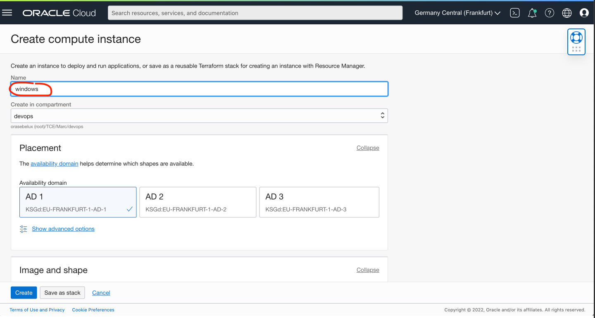

# Install Forms Builder on Windows

## Introduction

Install a Forms Builder to develop the Forms.

Estimated Time: 20 minutes

### About Forms Builder
Forms Builder allows to modify the Forms and to compile them. To get the same look and feel during development and runtime. The Forms Builder running on Windows works better. We will install it.

### Objectives

In this lab, you will:
* Install a Windows machine 
* Install Forms Builder on it
* Connect to your database.
* Build a simple form
* Copy it to your Linux machine for runtime execution

### Prerequisites 

This lab assumes you have:
* All previous labs successfully completed
* Runned the optional Lab 2 - Step 2,  you have to add a security list rule to open the port 3309.

## Task 1: Install a Windows Machine

Let's create a Windows Machine

1. Again, go to Hamburger/ Compute / Instance
2. Click **Create Instance **
3. For the name, **windows**

 

4. Choose the image, as Windows


5. Then:
- VCN: **forms-vcn**
- Subnet: **Private subnet for forms-vcn**
- Click Create

, 

6. Get the Private IP address (##4##) And the original password (##5##)


## Task 2: Connect to the Windows Machine

You can connect to the Windows machine via Remote Desktop. It is available on all operating systems. 
Remote Desktop run on the port 3389. 

1. Download and run it. 
2. SSH to the bastion by forwarding the port of the Windows machine.

Since we are using a Bastion, we need to forward the port 3389 to your laptop. 
It is not needed if you use a VPN or Fastconnect.

```
ssh -i &lt;ssh-private-key&gt; opc@&lt;Bastion Public IP&gt -L3389:&lt;Windows Private IP&gt;:3389

ex:
ssh -i ssh-key-2022-03-21.key opc@130.131.232.133 -L3389:10.0.1.42:3389
```

3. Connect with Remote Desktop to the machine: localhost

4. Enter the password (##5##). Take care:
- About the keyboard settings on Windows (see screenshot)
- Verify with the eye if the password is correct.


5. You will then need to reset the password. Same take care:
- About the keyboard settings on Windows
- Verify with the eye if the password is correct.


6. When logged in Windows. Maybe install another browser than Internet Explorer... Internet Explorer is quite touchy and ask to add all internet URLs in 
- Start Internet Explorer
- Settings 
- Tab Security
- Trusted Sites
- Add Sites. For example, add https://www.mozilla.org, https://download-installer.cdn.mozilla.net
- Then https://www.mozilla.org and download Firefox for example.

   

## Task 3: Install Forms Builder on Windows

1. Download the software.

Go to https://www.oracle.com/middleware/technologies/forms/downloads.html
Then download the Forms Builder software. It is a zip file of about 2GB.

, 

You will need to login to download from Edelivery


Then Start the Download Manager


When the download is completed, uncompressed the zip file.

2. Right click on the installer executable. And **Run as administrator**


Follow the wizard
- Welcome: Next
- Auto-update: Next
- Oracle Home (keep default C:\Oracle\Middleware\Oracle_Home): Next
- Installation Type (Forms Builder): Next
- JDK home: C:\Oracle\Middleware\Oracle\_Home\oracle_common\jdk 
- Then Next
- There will be a warning. Skip. Install.

Note: If you want to avoid the Warning during the pretest. You need to install first Visual Studio 2012 (VC++ 11.0) Update 4 : [https://docs.microsoft.com/en-us/cpp/windows/latest-supported-vc-redist?view=msvc-170](https://docs.microsoft.com/en-us/cpp/windows/latest-supported-vc-redist?view=msvc-170)  

- Installation Progress: Next
- Installation Complete:
- DO NOT CLICK FINISH. Else you will need to rerun the Forms Builder Config manually.
- But check **Automatically Launch Forms Builder Configuration Wizard**
- In the Forms Builder instance: choose a directory like: C:\Oracle\Middleware\forms1


- Then Next / Finish.

3. Copy the tnsnames.ora from your Linux environment to C:\Oracle\Middleware\Oracle_Home\network\ADMIN

3. Start Forms Builder


## Learn More

* [Forms Documentation](https://docs.oracle.com/en/middleware/developer-tools/forms/12.2.1.4/index.html)

## Acknowledgements
* Marc Gueury - Application Development EMEA
* Last Updated - March 2022


