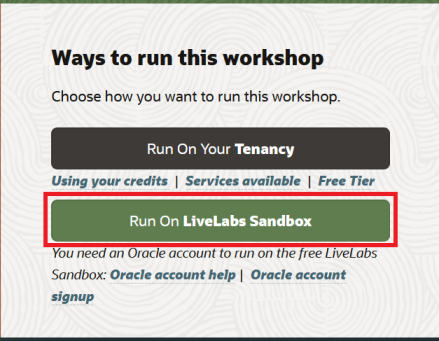
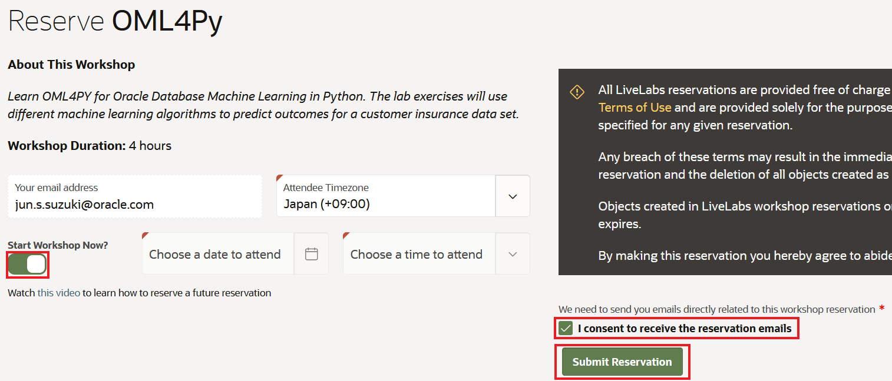
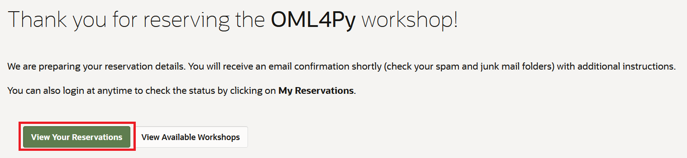
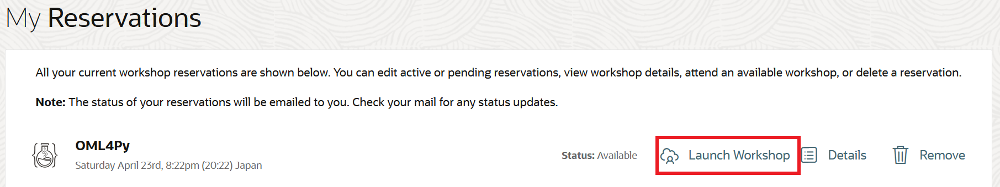

# 事前準備

このハンズオンを実施するためには有効なOracleアカウント（OCIアカウントではない）とリソースの予約が必要です。Oracleアカウントを使用して演習環境のリソースの予約を行う、またその他OracleサポートやOracle一般公開コンテンツにアクセスすることができます。

既にOracleアカウントをお持ちの場合、下記Task2へ移動してください。

既に事前にリソース予約済みの場合、この章をスキップし、次の章「ハンズオン概要」へ移動してください。
##   
   

## Task 1: Oracleアカウントの作成

Oracleアカウントは以下二つのステップで作成できます。

1. ブラウザより[oracle.com](http://www.oracle.com)へナビゲートします。  *View Account*をクリックして *Create an Account*を選択します。

  

2. フォーム内容を入力し、 *Create Account*をクリックします。

  

## Task 2: ハンズオンワークショップリソースの予約

1. [LiveLabs 2.0](http://bit.ly/golivelabs) へナビゲートし、「次世代Java高速実行基盤GraalVMハンズオン」のトップページにある「Run On Livelabs Sandbox」をクリックします。
　

2. Oracleアカウントログイン画面より事前に作成したユーザ名、パスワードを入力してログインします。
　

 > **Note:** Oracleアカウント未作成の場合、画面下部の「Create Account」をクリックし、Task1の手順に従ってOracleアカウントを作成してください。

3. ハンズオンの予約画面にて、「Start Workshop Now?」がオンになっていることを確認し、「I consent to recieve reservation emails」をチェックし、「Submit Reservation」をクリックします。
　
   
   これによりクラウド上のハンズオン用環境のプロビジョニングが開始されます。次の画面より「View your reservation」をクリックして、プロビジョニング状況を確認します。
　
> **Note:** プロビジョニング中、計3通のステータス確認メールが登録のメールアドレス宛に届きます。

4. プロビジョニング完了のステータスに変わりましたら、「Launch workshop」をクリックします。
　

5. ハンズオン内容の表示方法を選択します。

  

*以上でハンズオンの事前準備が完了しましたので、次の章「ハンズオン概要」に進めてください。*

## Acknowledgements

- **Created By/Date** - Jun Suzuki, Java Global Business Unit, April 2022
- **Contributors** - 
- **Last Updated By/Date** - Jun Suzuki, April 2022
