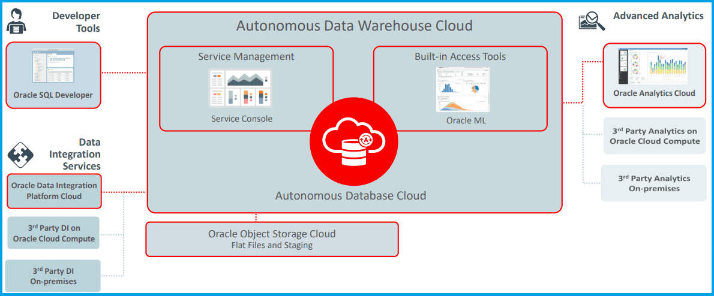

# Oracle Autonomous Data Warehouse

## Overview

Oracle Autonomous Data Warehouse offers a high-performance market-leading Oracle Database in a fully-managed environment that is tuned and optimized for data warehouse workloads.

Oracle Autonomous Data Warehouse uses applied
machine learning to self-tune and automatically
optimizes performance while the database is running.
It is built on the next generation Oracle Autonomous
Database technology using artificial intelligence
to deliver unprecedented reliability, performance
and highly elastic data management to enable data
warehouse deployment in seconds.

Autonomous Data Warehouse supports all standard SQL and business intelligence (BI) tools and delivers scalable analytic query performance.

This template creates a shared Oracle Autonomous Data Warehouse database.

## Before You Begin

Before you begin creating resources in Oracle Cloud Infrastructure, ensure that you have the following:

* Credentials for an Oracle Cloud tenancy

* OCI Compartment, with permission to create and manage resources in it

* Access to a computer that has the following software and access to the internet :

    * A [supported](https://docs.oracle.com/en/cloud/get-started/subscriptions-cloud/csgsg/web-browser-requirements.html) web browser for Oracle Cloud Infrastructure

### Prerequisites

* [Download](./scripts/terraform/resmgr/adb-adw-s.zip) the prebuilt Terraform script for this solution.

### Required Parameters

| Resource       | Value |
|----------------|-------|
|Tenancy OCID    |Locate your [Tenancy OCID](https://docs.cloud.oracle.com/en-us/iaas/Content/General/Concepts/identifiers.htm)|
|Compartment OCID|Locate your [Compartment OCID](https://docs.cloud.oracle.com/en-us/iaas/Content/General/Concepts/identifiers.htm)|
|Cloud Region Identifier | Retrieve the [Cloud Region Identifier](https://docs.cloud.oracle.com/en-us/iaas/Content/General/Concepts/regions.htm) of the Cloud region|
|ADB Admin Password | Password for the ADMIN account (refer to [password rules](https://docs.oracle.com/en/cloud/paas/autonomous-data-warehouse-cloud/user/manage-users-admin.html#GUID-B227C664-EBA0-4B5E-B11C-A56B16567C1B))|
|ADB DB Name | Database Name. Use letters and numbers only, starting with a letter, maximum length is 14 characters.|
|ADB Display Name | Enter a name for the database for display purposes|
|ADB License Model | LICENSE_INCLUDED or BYOL|
|Terraform Version | 0.11.x|

## Architecture

## Steps

- [Provision Resources](?lab=provision-resources)
- [Validate Provisioning](?lab=validate-provisioning)
