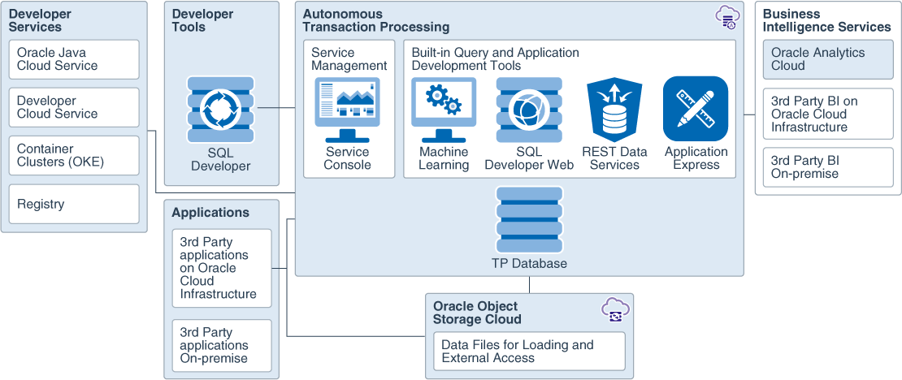

# Oracle Autonomous Transaction Processing

## Overview

Oracle Autonomous Transaction Processing delivers a self-driving, self-securing, self-repairing database service that can instantly scale to meet the demands of mission critical applications.

Autonomous Transaction Processing provides all of the performance of the market-leading Oracle Database in an environment that is tuned and optimized to meet the demands of a variety of applications, including: mission-critical transaction processing, mixed transactions and analytics, IoT, and JSON document store.

As a service Autonomous Transaction Processing does not require database administration. With Autonomous Transaction Processing you do not need to configure or manage any hardware, or install any software. Autonomous Transaction Processing handles creating the database, backing up the database, patching and upgrading the database, and growing or shrinking the database.

This template creates a shared Oracle Autonomous Transaction Processing database.

## Before You Begin

Before you begin creating resources in Oracle Cloud Infrastructure, ensure that you have the following:

* Credentials for an Oracle Cloud tenancy

* OCI Compartment, with permission to create and manage resources in it

* Access to a computer that has the following software and access to the internet :

    * A [supported](https://docs.oracle.com/en/cloud/get-started/subscriptions-cloud/csgsg/web-browser-requirements.html) web browser for Oracle Cloud Infrastructure

### Prerequisites

* [Download](./scripts/terraform/resmgr/adb-atp-s.zip) the prebuilt Terraform script for this solution.

### Required Parameters

| Resource       | Value |
|----------------|-------|
|Tenancy OCID    |Locate your [Tenancy OCID](https://docs.cloud.oracle.com/en-us/iaas/Content/General/Concepts/identifiers.htm)|
|Compartment OCID|Locate your [Compartment OCID](https://docs.cloud.oracle.com/en-us/iaas/Content/General/Concepts/identifiers.htm)|
|Cloud Region Identifier | Retrieve the [Cloud Region Identifier](https://docs.cloud.oracle.com/en-us/iaas/Content/General/Concepts/regions.htm) of the Cloud region|
|ADB Admin Password | Password for the ADMIN account (refer to [password rules](https://docs.oracle.com/en/cloud/paas/autonomous-data-warehouse-cloud/user/manage-users-admin.html#GUID-B227C664-EBA0-4B5E-B11C-A56B16567C1B))|
|ADB DB Name | Database Name. Use letters and numbers only, starting with a letter, maximum length is 14 characters.|
|ADB Display Name | Enter a name for the database for display purposes|
|ADB License Model | LICENSE_INCLUDED or BYOL|
|Terraform Version | 0.11.x|

## Architecture

## Steps

- [Provision Resources](?lab=provision-resources)
- [Validate Provisioning](?lab=validate-provisioning)
