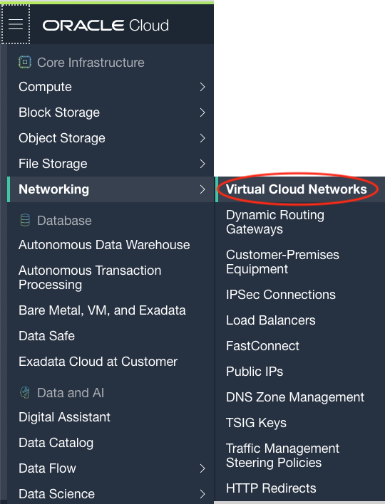

# Validate Provisioning

This solution creates the following Oracle Cloud resources :

* Virtual cloud network
* Public subnet
* Route table
* Internet gateway
* Default security list

Complete the following steps to validate the resources created.

1. Open the **Navigation Menu** on the top-left. Under **Networking**, click **Virtual Cloud Networks**.

2. Ensure you are in the same **Region** and **Compartment** as the resources were created.

3. Click on the VCN that was just created (name starting with **VCN**).

4. From the **Resources** menu on the left, click on **Subnets**.

5. Click on the **Subnet** name (starts with **SN**) to browse the details. This is a regional public subnet spanning separate availability domains for redundancy.

6. Go back to the VCN details page by clicking on the breadcrumbs menu on top.

7. Next, from the **Resources** menu on the left, click on **Route Tables**. You will the default route table.

	The subnet uses the default route table, which starts out with no rules when the VCN is created. In this scenario, the table has only a single rule for the internet gateway.

8. Go back to the VCN details page and click on **Security Lists** from the resources menu.

	The subnet uses the default security list, which has default rules that are designed to make it easy to get started with Oracle Cloud Infrastructure. The rules enable typical required access (for example, inbound SSH connections and any type of outbound connections). Remember that security list rules only allow traffic. Any traffic not explicitly covered by a security list rule is implicitly denied.

9. Lastly, check out the **Internet Gateway** from the VCN details page.

	The VCN is directly connected to the internet by way of an internet gateway. The gateway is also used for connectivity to on-premises network.

10. You have successfully completed the validation steps.
