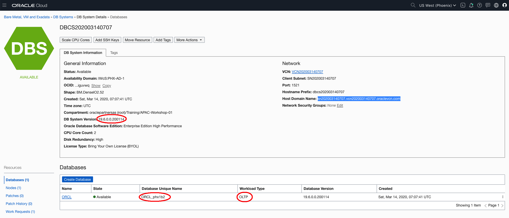
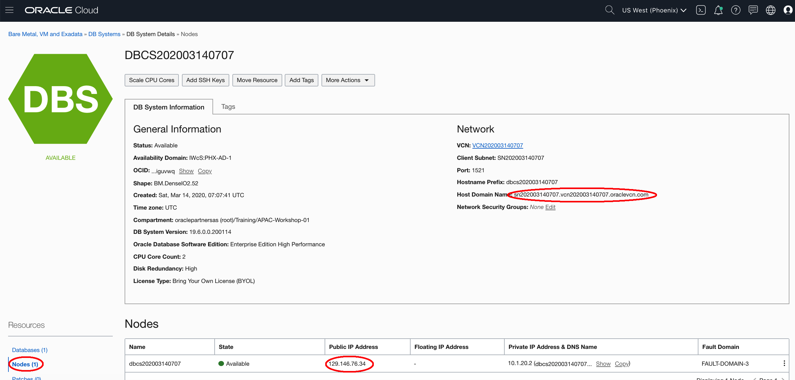
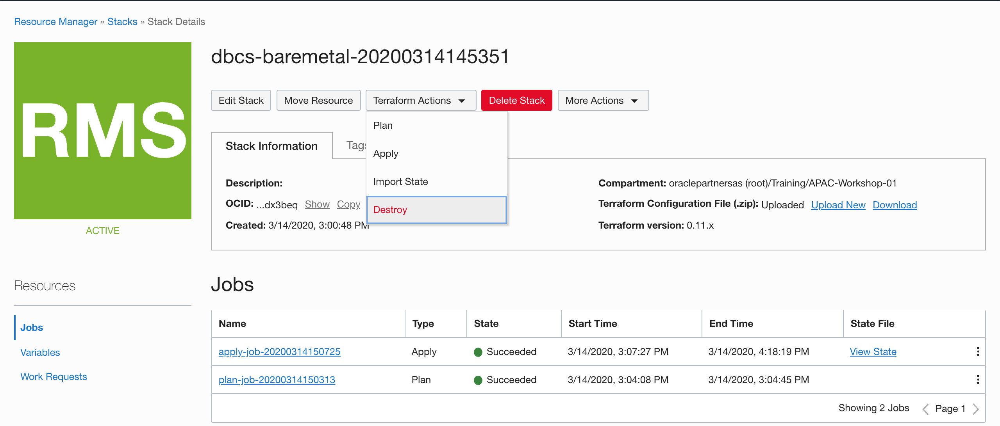
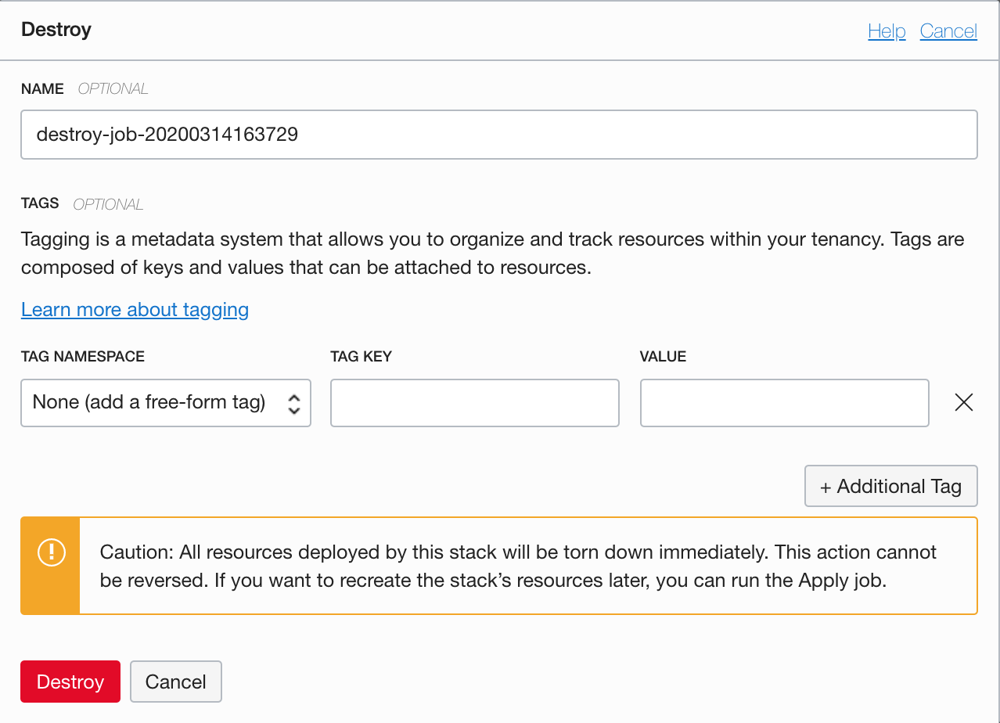
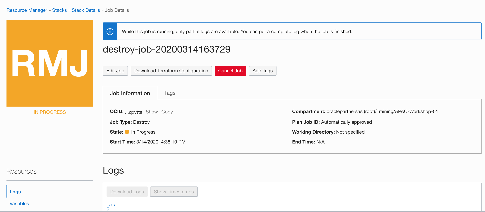
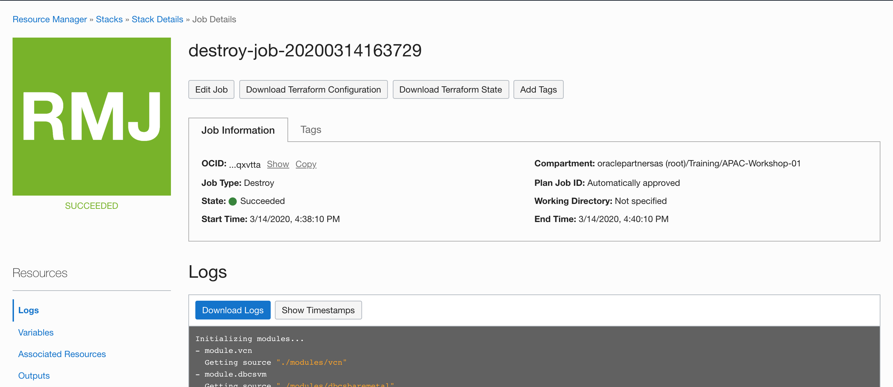

#Validate Provisioning

##Validate the DBCS Bare Metal

1. Open the navigation menu. Under **Database** section,  click **Bare Metal, VM, and Exadata**.
3. In the DB system Details page, You can review the general information like **Shape**, **Database software edition**, **License Type**, **Host Domain Name**, etc. In the **Databases** section there is a database named **ORCL**. You can find the **DB Unique Name**, **Workload Type**, **Database Version**, etc. Click the **Nodes** under the **Resources**.
4. In the **Notes** section, you can find information like **Node Name**, **Public IP Address**, **Private IP Address**, etc. 
5. Now you can test to connect the database using database client tools. The connect string like:

```
sqlplus username/password@<public ip>:1521/<db unique name>.<domain>
```

For example:

```
$  sqlplus system/WElcome_123#@129.146.76.34:1521/ORCL_phx1b2.sn202003140707.vcn202003140707.oraclevcn.com

SQL*Plus: Release 18.0.0.0.0 Production on Sat Mar 14 16:32:52 2020
Version 18.1.0.0.0

Copyright (c) 1982, 2018, Oracle.  All rights reserved.


Connected to:
Oracle Database 19c EE High Perf Release 19.0.0.0.0 - Production
Version 19.6.0.0.0

SQL> 
```


##Release the stack's resources

After you complete all the labs, you can running a destroy job to release associated resources of the stack. 

1. Back to the **Stack Details** page. Go to **Terraform Actions** and select **Destroy**.
2. In the Destroy dialog, accept the default values and click **Destroy**.
3. You can monitor the status and review the results of a destroy job by viewing the state or the logs.
4. Wait until the state change to succeeded, all the resources create by this stack are released. You can then delete the stack.
