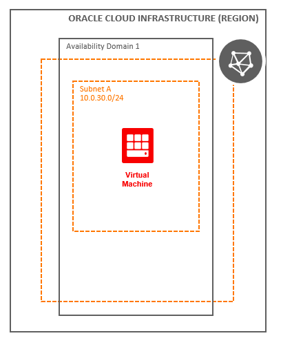

# A Linux Compute Instance in Oracle Cloud

## Overview

Oracle Cloud Infrastructure Compute offers significant price-performance and control improvements compared to on-premise data centers, while providing the elasticity and cost savings of the public cloud. Oracle has a longstanding reputation for providing technologies that empower enterprises to solve demanding business problems—and Oracle Cloud Infrastructure is the first cloud that's purpose-built to enable enterprises to run business-critical production workloads.

This solution template allows you to deploy an Oracle Linux virtual machine in Oracle Cloud.

## Before You Begin

Before you begin creating resources in Oracle Cloud Infrastructure, ensure that you have the following:

* Credentials for an Oracle Cloud tenancy

* OCI Compartment, with permission to create and manage resources in it

* Access to a computer that has the following software and access to the internet :

    * Utility to generate SSH key pairs. Most UNIX-like systems have **ssh-keygen**. On Windows, you can use **PuTTY**.

    * A [supported](https://docs.oracle.com/en/cloud/get-started/subscriptions-cloud/csgsg/web-browser-requirements.html) web browser for Oracle Cloud Infrastructure

* Basic knowledge of Oracle Cloud Infrastructure

### Prerequisites

* [Download](../scripts/terraform/resmgr/vcn-compute.zip) the prebuilt Terraform script for this solution.

### Required Parameters

| Resource       | Value |
|----------------|-------|
|Tenancy OCID    |Locate your [Tenancy OCID](https://docs.cloud.oracle.com/en-us/iaas/Content/General/Concepts/identifiers.htm)|
|Compartment OCID|Locate your [Compartment OCID](https://docs.cloud.oracle.com/en-us/iaas/Content/General/Concepts/identifiers.htm)|
|Cloud Region Identifier | Retrieve the [Cloud Region Identifier](https://docs.cloud.oracle.com/en-us/iaas/Content/General/Concepts/regions.htm) of the Cloud region|
|SSH Key Pairs   |Refer to the tutorial on [Generating an SSH Key Pair for Oracle Compute Cloud Service Instances](https://www.oracle.com/webfolder/technetwork/tutorials/obe/cloud/compute-iaas/generating_ssh_key/generate_ssh_key.html)|
|Terraform Version | 0.11.x|

## Architecture

## Steps

- [Provision Resources](?lab=provision-resources)
- [Validate Provisioning](?lab=validate-provisioning)
