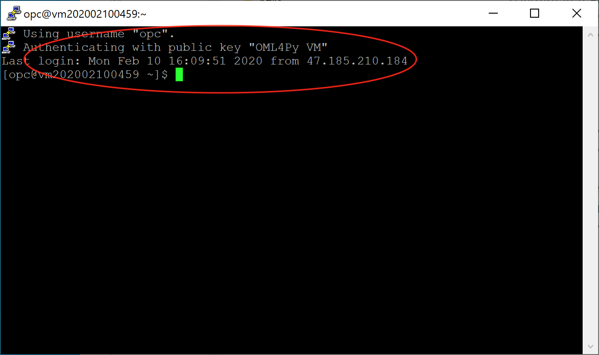

This solution creates the following Oracle Cloud resources :

* Linux VM
* Virtual Cloud Network

Complete the following steps to validate the resources created.

## Validation Steps

## STEP 1 : Validate Connectivity to the Linux VM

You connect to a running instance by using a Secure Shell (SSH) connection. Most Linux distributions include an SSH client by default. For Windows, you can download a free SSH client called PuTTY from [http://www.putty.org](http://www.putty.org).

**Get the Public IP Address of the Linux VM**

1. Navigate to the Linux VM that was created in your compartment from the Navigation Menu on the left and select **Compute** -> **Instances**.


2. Click on the instance that was just created (instance name starts with **VM**).


3. On the **Instance Details** page, locate the Public IP Address of the VM as follows :


**Connecting From a Unix\-style System**

1. Locate the SSH private key of the pair used for the VM (The public key of the pair was specified at Stack creation time).

2. Use the following command to set the file permissions so that only you can read the file :

```
$ chmod 400 <private_key>
```
>Where **private_key** is the full path and name of the file that contains the private key associated with the instance.

3. Use the following SSH command to access the instance.

```
$ ssh –i <private_key> opc@<public-ip-address>
```

>Where **public-ip-address** is your instance IP address that you retrieved from the Console.
>
>Also, If this is your first time connecting to the instance, you might see a message that the server's host key is not cached in the registry. Click Yes to continue the connection.

4. The following is a screenshot of a successful connection.


**Connecting From a Windows System**

1. Open putty.exe.

2. In the **Category** pane, expand **Window**, and then select **Translation**.

3. In the **Remote Character Set** drop-down list, select UTF-8. The default locale setting on Linux-based instances is UTF-8, and this configures PuTTY to use the same locale.

4. In the **Category** pane, select **Session** and enter the following:

	* Host Name (or IP address): **opc@public-ip-address**
	* Port: **22**
	* Connection type: **SSH**

	Where **public-ip-address** is your instance public IP address that you retrieved from the Console.

5. In the **Category** pane, expand **Connection**, expand **SSH**, and then click **Auth**.

6. Click **Browse**, and then select your private key in **PPK** format (Use **PuttyGen** to convert the private key to PPK format).

7. Click **Open** to start the session.

> If this is your first time connecting to the instance, you might see a message that the server's host key is not cached in the registry. Click Yes to continue the connection.

8. The following is a screenshot of a successful connection.


